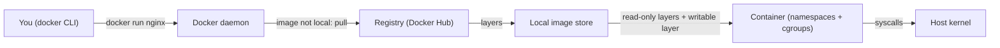

# Docker: Zero to Architect

*Enterprise Stack · Containers*

Everything I use to run containers in production - what they actually are, how images are built and
shipped, how data and networking really work, and the cost, security and operational decisions that
decide whether the thing survives contact with real traffic.

> **NOTE - Everything is Markdown**
>
> No downloads, no build step, no browser needed. Diagrams are Mermaid, which GitHub renders inline.
> Start at [module 01](lessons/01-why-containers.md) or jump anywhere from the list below.

## How this course is put together

Each module is one Markdown lesson. Every lesson follows the same shape so you can skim it later like a
reference card, not re-read it like a blog post.

| Block | What it gives you |
| --- | --- |
| **Mental model** | The one diagram that makes the rest obvious, with the failure path beside the happy path. |
| **Mechanics** | Exact commands, flags and file formats - what each one really does. |
| **Build it** | Runnable commands you can paste into a terminal today. |
| **What breaks** | The failure path: exited containers, lost data, cache misses, permission traps. |
| **Cost & performance** | Image size, start-up time, layer reuse, resource limits. |
| **Interview drill** | Questions a staff-level interviewer would ask, with the answer that scores. |

## The shape of a Docker system

Before any module, get this picture straight. Almost every Docker setup is this, with more or fewer boxes.

**How a container actually comes into existence**

> **Why it matters:** The CLI never creates anything. It sends a request to the daemon over an API, and the daemon asks the host kernel for isolated processes. Every permission and security question follows from that.

## Modules

### [Why containers exist](lessons/01-why-containers.md)

`MODULE 01`

Physical machines, hardware virtualisation, and the problem containers were invented to solve.

- one machine, one OS - the pre-2000 constraint
- hypervisors and hardware virtualisation
- "works on my machine" as an architecture problem
- the 2013 shift and what actually changed

### [OS-level virtualisation](lessons/02-os-virtualization.md)

`MODULE 02`

Why a container is lightweight - the kernel story, told properly.

- kernel vs shell vs user space
- namespaces: what isolation really is
- cgroups: what limits really are
- union filesystems and copy-on-write

### [VM vs container](lessons/03-vm-vs-container.md)

`MODULE 03`

The honest comparison, including the cases where a VM is still the right answer.

- boot time, size, density, blast radius
- host OS and guest OS rules
- Linux containers on Windows, and what is impossible
- five real benefits, stated so you can defend them

### [Docker architecture](lessons/04-docker-architecture.md)

`MODULE 04`

Host, daemon, API, CLI, registry - and the image/container distinction people get wrong.

- Docker host and Docker daemon
- REST API and why the CLI is just a client
- registries: public, private, cloud
- containerd, runc and the OCI standard

### [Installing Docker](lessons/05-installation.md)

`MODULE 05`

Requirements, both installation methods, and the post-install step that is a security decision.

- CPU, RAM, virtualisation flags, disk
- distro repository vs Docker official repository
- service enable, version check
- the `docker` group is root - handle accordingly

### [The Docker CLI](lessons/06-docker-cli.md)

`MODULE 06`

Command grammar you can reason about instead of memorising.

- `docker OBJECT COMMAND [options] [arguments]`
- short flags vs long flags
- `--format`, `--filter`, tab completion
- `--help` as the real documentation

### [Images](lessons/07-images.md)

`MODULE 07`

Pull, inspect, tag, delete - and the layer model underneath all of it.

- tags are mutable, digests are not
- layers, caching and copy-on-write
- why your image is 1.2 GB
- `prune` and disk reclamation

### [Your first containers](lessons/08-first-container.md)

`MODULE 08`

From `docker run` to a container you can actually work with.

- why a bare `docker run nginx` looks broken
- `-it`, `-d`, `--rm`, `--name`, `-p`
- the container lifecycle and exit codes
- `logs`, `exec`, `inspect`

### [Dockerfiles](lessons/09-dockerfile.md)

`MODULE 09`

Declarative image builds - repeatable, reviewable, version controlled.

- every instruction and what it costs
- layer caching and instruction order
- multi-stage builds
- non-root users, pinned bases, `.dockerignore`

### [Registries](lessons/10-registries.md)

`MODULE 10`

Getting images off your laptop and into somewhere your pipeline can reach.

- Docker Hub, rate limits, official images
- `docker push`, naming and authentication
- ECR, ACR, GCR and self-hosted registries
- tagging strategy and vulnerability scanning

### [Storage and networking](lessons/11-storage-networking.md)

`MODULE 11`

The two things people get wrong first, and the ones that lose data.

- volumes vs bind mounts vs tmpfs
- the writable layer and why it disappears
- bridge, user-defined bridge, host, none, overlay, macvlan
- container DNS, port publishing, multi-host traffic

### [Docker Compose](lessons/12-compose.md)

`MODULE 12`

Multi-container stacks defined in one file.

- services, networks, volumes
- `depends_on` and why it is not health
- environment files and overrides
- the dev-to-prod boundary

### [Production and interviews](lessons/13-production.md)

`MODULE 13`

The module that decides whether any of it ships - plus the question bank.

- security checklist and least privilege
- resource limits, health checks, restart policy
- logging, image slimming, CI/CD
- when Docker alone stops being enough

---

> **WARNING - On versions and commands**
>
> Docker versions, package names and cloud registry consoles change. This course teaches the model and the trade-offs, which stay stable. Always confirm current commands in the official Docker documentation before you ship.

---

Part of [Enterprise Stack: Zero to Architect](../README.md) · written by Himanshu Kumar.
