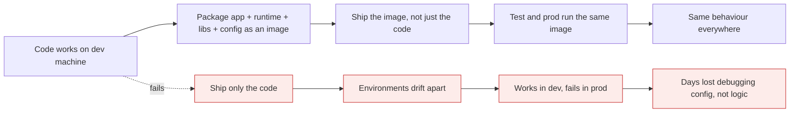

# Why containers exist

*Module 01 · Foundations*

Before you can say what a container is, you have to say what problem it solves. That problem is thirty
years old and it is not "developers like Docker" - it is that a machine could run one operating system,
and later many, and both answers were expensive in different ways.

[Course home](../index.md) / Module 01

## 1. Before 2000 - one machine, one OS

To run any application you needed compute. Compute meant a physical server, and a physical server meant
four things: **CPU, RAM, storage, networking**. On top of that you installed an operating system, then a
runtime, then your app.

```text
        ┌──────────────────────┐
        │        App           │   your Java application
        ├──────────────────────┤
        │   Runtime (JRE)      │   framework the app needs
        ├──────────────────────┤
        │   Operating System   │   Linux or Windows - ONE of them
        ├──────────────────────┤
        │      Hardware        │   CPU · RAM · storage · network
        └──────────────────────┘
```

The constraint that defined the era: **one piece of hardware ran one operating system at a time.**

> **NOTE - "But dual boot existed"**
>
> It did, and it proves the point. With dual boot both operating systems are installed, but only one is powered on. You choose at boot. You could not run Linux and Windows *simultaneously* on the same box, so you could not consolidate workloads onto one machine.

What that cost you:

| Problem | Consequence |
| --- | --- |
| One workload per server | Buy a server per application, even a small one |
| Utilisation around 5-15% | You paid for CPU that idled all day |
| Provisioning took weeks | Purchase order, rack, cable, install, configure |
| Blast radius | One OS patch could take down everything on that box |
| No isolation between apps | Two apps needing different library versions could not coexist |

That last row is the ancestor of every container argument you will ever make.

## 2. After 2000 - hardware virtualisation

VMware brought x86 virtualisation to the mainstream (IBM had done it on mainframes since the 1960s). A
**hypervisor** sits directly on the hardware, takes full control of it, and hands out virtual slices to
multiple guest operating systems.

```text
   ┌────────┐ ┌────────┐ ┌────────┐
   │  App   │ │  App   │ │  App   │
   ├────────┤ ├────────┤ ├────────┤
   │  JRE   │ │  .NET  │ │ Python │
   ├────────┤ ├────────┤ ├────────┤
   │ Linux  │ │Windows │ │ Linux  │   <- full guest OS each (kernel + user space)
   └────────┘ └────────┘ └────────┘
        VM1        VM2        VM3
   ┌──────────────────────────────┐
   │         Hypervisor           │   <- bare metal, controls the hardware
   ├──────────────────────────────┤
   │          Hardware            │
   └──────────────────────────────┘
```

Now one machine runs several operating systems at once, and they can be **different** operating systems.
This is **hardware virtualisation**: what is being shared and sliced is the hardware.

| Hypervisor type | Runs on | Examples |
| --- | --- | --- |
| **Type 1 (bare metal)** | Directly on hardware | ESXi, Hyper-V, KVM, Xen |
| **Type 2 (hosted)** | On top of a host OS | VirtualBox, VMware Workstation |

> **TIP - You already use this every day**
>
> An EC2 instance, an Azure VM, a Compute Engine instance - all of them are virtual machines on someone else's hypervisor. Cloud computing is hardware virtualisation with a billing system and an API in front of it.

Virtualisation fixed utilisation and provisioning time. It did **not** fix the fact that every workload
still carries a complete operating system.

## 3. What virtualisation did not fix

A VM is a full operating system: kernel, drivers, services, package manager, the lot. So:

| Still true with VMs | Number |
| --- | --- |
| Disk footprint before your app exists | Gigabytes - a Windows Server guest wants ~20 GB minimum |
| Boot time | Tens of seconds to minutes |
| RAM reserved just to be an OS | Hundreds of MB to GB |
| Patching burden | Every guest OS is another thing to patch |
| Density on one host | Tens of VMs, not thousands |

And the problem that actually hurt teams:

**"It works on my machine."** Development, testing and production each had their own servers, configured
by different people at different times. The code was identical; the environment was not, so the app
behaved differently in each. Debugging that is miserable, because nothing is wrong with the code.

## 4. 2013 - ship the environment, not just the code

Docker's insight was not to invent a new isolation technology - Linux already had the kernel features.
It was to **package** them: a standard image format, a registry to share images, and a CLI that made the
whole thing a one-line operation.



> **Why it matters:** The unit of delivery changes. You stop handing over a `.jar` and a wiki page of setup steps, and start handing over an image that already contains the runtime, the libraries and the configuration.

A container is that image, running:

```text
   ┌────────┐ ┌────────┐ ┌────────┐
   │  App   │ │  App   │ │  App   │
   ├────────┤ ├────────┤ ├────────┤
   │ Runtime│ │ Runtime│ │ Runtime│
   ├────────┤ ├────────┤ ├────────┤
   │  libs  │ │  libs  │ │  libs  │   <- NO kernel here
   └────────┘ └────────┘ └────────┘
        C1        C2        C3
   ┌──────────────────────────────┐
   │        Docker engine         │
   ├──────────────────────────────┤
   │   Host operating system      │   <- ONE kernel, shared by all containers
   ├──────────────────────────────┤
   │    Hardware (or a VM)        │
   └──────────────────────────────┘
```

The whole box - host OS plus Docker engine plus the containers on it - is called the **Docker host**.

## 5. The timeline in one table

| Era | Unit of deployment | Shares | Isolation boundary | Start-up |
| --- | --- | --- | --- | --- |
| Pre-2000 | Physical server | Nothing | The machine | Minutes (plus weeks to procure) |
| 2000s | Virtual machine | Hardware | Hypervisor + guest kernel | Tens of seconds |
| 2013+ | Container | Hardware **and the host kernel** | Kernel namespaces | Milliseconds to seconds |

Notice the pattern: each generation shares one more layer, so each one is lighter - and each one has a
thinner isolation boundary. That trade is the whole subject of module 03.

> **WARNING - Containers did not replace VMs**
>
> In practice containers run *inside* VMs almost everywhere. Your EKS/AKS/GKE nodes are VMs. You get the hypervisor's hard isolation between tenants and the container's speed and density within a tenant. Anyone who tells you it is either/or has not run this in an enterprise.

## 6. Extra points worth knowing

- **The technology is older than Docker.** chroot (1979), FreeBSD jails (2000), Solaris Zones (2004),
  LXC (2008), and Google running everything in containers internally long before 2013. Docker's
  contribution was the image format, the registry and the developer experience.
- **Immutable infrastructure.** The container is not patched in place; you build a new image and replace
  it. That single habit removes an entire class of "the server drifted" incidents.
- **Density is the business case.** Going from tens of VMs to hundreds of containers on the same hardware
  is a real infrastructure bill reduction, and it is the number a CFO will ask about.
- **Containers made microservices practical.** Running 40 services was absurd at one-VM-per-service. At
  one-container-per-service it is routine.

> **PRACTICE - Practice now**
>
> 1. Look at any server you own. Write down its CPU, RAM and the number of applications on it. Estimate utilisation.
> 2. List two applications in your organisation that cannot share a server today, and why.
> 3. Find one incident in your team's history caused by an environment difference rather than a code defect.
> 4. Write the one-sentence business case for containers using your own numbers, not generic ones.

> **ASSIGNMENT - Assignment**
>
> Draw the current deployment topology for one real application - hardware, OS, runtime, app, and where configuration comes from. Then draw the containerised version beside it. Mark what disappears, what stays, and one thing that becomes harder. That "becomes harder" item is what separates an engineer from a slide deck.

## 7. Interview drill

<details>
<summary><b>What problem do containers solve that virtual machines do not?</b></summary>

Environment parity and density. A VM isolates workloads but still carries a full guest operating system,
so it is measured in gigabytes and seconds. A container packages the application with its runtime,
libraries and configuration and shares the host kernel, so the same artefact runs identically in dev,
test and production, starts in under a second, and lets you fit far more workloads on the same hardware.

</details>

<details>
<summary><b>Why could a pre-2000 server not run two operating systems at once?</b></summary>

There was no virtualisation layer to arbitrate hardware access. The OS assumed exclusive control of CPU,
memory and devices. Dual boot installed two operating systems but powered on only one. x86 hardware
virtualisation - hypervisors plus later CPU support such as Intel VT-x and AMD-V - is what made
simultaneous execution possible.

</details>

<details>
<summary><b>Did containers replace virtual machines?</b></summary>

No. They compose. Containers usually run inside VMs, which is exactly what managed Kubernetes gives you:
hypervisor isolation between tenants, container speed and density inside one. VMs remain the answer when
you need a different kernel, kernel-level control, or hard multi-tenant isolation.

</details>

<details>
<summary><b>Your team says "containers will fix our deployment problems". How do you respond?</b></summary>

Ask which problem. Containers fix environment drift and packaging. They do not fix a broken release
process, missing tests, unclear ownership or bad architecture - and they add new concerns: image supply
chain, registry operations, orchestration, and persistent data. Adopt them for parity and density, and be
explicit about what you are taking on.

</details>

---

[Course home](../index.md) &nbsp;&nbsp;|&nbsp;&nbsp; [Module 02: OS-level virtualisation →](02-os-virtualization.md)

---

Docker: Zero to Architect · Himanshu Kumar.
