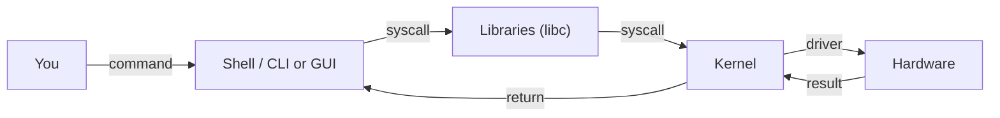
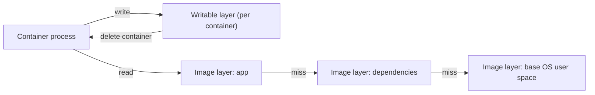

# OS-level virtualisation

*Module 02 · Foundations*

"A container is a lightweight virtual machine" is a useful lie. This module replaces it with the truth,
which is more useful still: a container is **an ordinary process on the host**, wearing a blindfold and a
budget.

[Course home](../index.md) / Module 02

## 1. Every operating system has two halves

| Half | What it is | Job |
| --- | --- | --- |
| **Kernel** | The core. Hardest part of an OS to build. | Talks directly to hardware: CPU scheduling, memory, devices, filesystems, network stack. |
| **User space (shell + libraries + tools)** | Everything you actually see and type. | Lets you and your programs ask the kernel to do things. |

You never talk to hardware. You type into a shell, the shell asks the kernel, the kernel drives the
hardware.



> **Why it matters:** If two systems can share one kernel and differ only in user space, you do not need two operating systems - and that is exactly what a container is.

The Linux distributions prove it. Ubuntu, Debian, Red Hat, Alpine - broadly the same kernel. What differs
is the user space: package manager, shell, libraries, file layout, default tooling.

## 2. The difference in one picture

**Virtual machine** - full OS per instance:

```text
   VM
   ┌──────────────────────┐
   │  App + libraries     │
   │  Shell / user space  │
   │  KERNEL              │  <- its own kernel
   └──────────────────────┘
```

**Container** - user space only:

```text
   Container
   ┌──────────────────────┐
   │  App + libraries     │
   │  Shell / user space  │
   │  (no kernel)         │  <- uses the HOST kernel
   └──────────────────────┘
```

That missing kernel is the entire "lightweight" story:

| Consequence | Detail |
| --- | --- |
| Size | An Ubuntu container image is tens of MB; an Ubuntu VM is gigabytes. Alpine is around 5 MB. |
| Start-up | There is no boot. Starting a container is starting a process - milliseconds. |
| Memory | No second kernel, no duplicate system services. |
| Density | Hundreds of containers per host instead of tens of VMs. |
| Disposability | If it misbehaves, delete it and start another. Troubleshooting a broken container is often the wrong instinct. |

Because the kernel is shared, this is called **operating-system-level virtualisation** - what is being
sliced is the OS, not the hardware.

## 3. So what actually isolates them?

Three Linux kernel features. This is what an interviewer is really asking when they say "how do
containers work".

### Namespaces - what a process can *see*

A namespace gives a process its own private view of one kind of system resource.

| Namespace | Isolates | Effect inside the container |
| --- | --- | --- |
| `pid` | Process IDs | Your app is PID 1 and cannot see host processes |
| `net` | Network stack | Own interfaces, IP, ports, routing table |
| `mnt` | Mount points | Own filesystem tree - a private `/` |
| `uts` | Hostname | Own hostname |
| `ipc` | Shared memory, queues | Cannot reach another container's IPC |
| `user` | UID/GID mapping | Can be root inside, unprivileged outside |
| `cgroup` | cgroup root | Cannot see the host's control group tree |

### cgroups - what a process can *use*

Control groups cap and account for resources: CPU shares and quota, memory limit, block I/O, PIDs count.
This is what `--memory` and `--cpus` set when you run a container.

### Union filesystem - what a process can *change*

Image layers are stacked read-only, with one thin writable layer on top. Reads fall through the stack;
the first write to a file copies it up into the writable layer (**copy-on-write**). That is why many
containers from one image cost almost no extra disk.



> **Why it matters:** The writable layer is destroyed with the container. Anything written there and not placed in a volume is gone - this is the single most common data-loss incident for people new to Docker (module 11).

## 4. Kernel sharing decides what can run where

This rule catches everyone once. A container reuses the host kernel, so the container's user space must
be compatible with **that kernel**.

| Docker host | Linux containers | Windows containers |
| --- | --- | --- |
| Linux | Native - shares the host kernel directly | **Not possible** |
| Windows | Yes - Docker runs a lightweight Linux VM (WSL 2 or Hyper-V) and containers share *its* kernel | Yes, when Windows container mode is selected |
| macOS | Yes - through a lightweight Linux VM | No |

Two consequences worth stating plainly:

- **Windows host + Linux containers works** - but there is a hidden Linux VM doing the kernel sharing.
  That is why Docker Desktop wants virtualisation enabled in your BIOS (module 05).
- **Linux host + Windows containers is impossible.** A Linux kernel cannot serve Windows syscalls. No
  flag fixes this.

> **TIP - "Same kernel" also means same kernel *version***
>
> A container built expecting a newer kernel feature can misbehave on an older host kernel. It is rare with mainstream images and very real with low-level tooling, GPU workloads and anything touching seccomp or eBPF.

## 5. The security consequence, stated honestly

One shared kernel means one shared attack surface. A kernel vulnerability that lets a process escape its
namespaces is a container escape - the attacker is now on the host, next to every other container.

| Control | What it buys |
| --- | --- |
| Do not run as root inside the container | Most escapes need root to be useful |
| Drop capabilities, never use `--privileged` | `--privileged` effectively removes the fence |
| Keep seccomp and AppArmor/SELinux profiles on | Restricts which syscalls can even be attempted |
| User namespaces | Root inside maps to an unprivileged UID outside |
| Patch the **host** kernel | It is the shared component - your container's base image update does not fix it |
| VM boundary between tenants | Hypervisor isolation is stronger; this is why cloud providers use it |

> **WARNING - "Containers are secure by default" is marketing**
>
> They are isolated by default, which is not the same thing. A container running as root with `--privileged` and the Docker socket mounted has, for practical purposes, root on the host. Isolation is a set of controls you keep switched on, not a property you inherit.

## 6. Extra points

- **`docker exec` is not SSH.** It starts a new process inside the existing namespaces. There is no
  daemon, no login, no session - which is why an "empty" container has no `ps`, no `curl`, and often no
  shell at all.
- **PID 1 matters.** Your app is PID 1, so it inherits init duties: reaping zombies and handling
  `SIGTERM`. An app that ignores `SIGTERM` will be `SIGKILL`ed after the grace period, mid-transaction.
- **Distroless and scratch images** contain no shell and no package manager. Smaller and far less to
  attack - and you cannot `exec` into them to poke around, which is the point.
- **"Lightweight VM" fails in interviews.** Say: a container is an isolated process using namespaces,
  cgroups and a union filesystem, sharing the host kernel.

> **PRACTICE - Practice now**
>
> 1. Run `docker run --rm -it ubuntu:22.04 bash`, then inside it run `ps aux`. Note that you only see your own processes.
> 2. Run `hostname` inside and outside. Different - that is the `uts` namespace.
> 3. On the host, run `ps aux | grep bash` and find the container's shell listed as a normal host process. That is the whole lesson.
> 4. Run `docker run --rm -m 64m ubuntu:22.04 bash -c "echo limited"` and check `docker stats` on a longer-running one - that is cgroups.
> 5. Inside a container create `/tmp/proof.txt`, exit, start a new container from the same image, and look for the file. Gone - that is the writable layer.

> **ASSIGNMENT - Assignment**
>
> Write a one-page explainer for your team titled "A container is not a VM". It must include: the kernel/user-space split, the three kernel features, the host/guest compatibility table, and the security implication of a shared kernel. Then have someone who only knows VMs read it and tell you which part they did not follow - that part needs rewriting.

## 7. Interview drill

<details>
<summary><b>Why is a container lightweight?</b></summary>

It has no kernel. The image contains only user space - application, libraries, shell - and the process
uses the host's kernel through namespaces and cgroups. So there is no boot sequence, no duplicated system
services and no gigabyte-scale OS image; starting a container is starting a process.

</details>

<details>
<summary><b>Name the kernel features that make containers possible.</b></summary>

Namespaces for isolation of what a process can see (pid, net, mnt, uts, ipc, user, cgroup), cgroups for
limiting and accounting what it can use (CPU, memory, I/O, PIDs), and a union filesystem for layered
images with copy-on-write writable layers.

</details>

<details>
<summary><b>Can you run Windows containers on a Linux host?</b></summary>

No. Containers share the host kernel and a Linux kernel cannot serve Windows syscalls. The reverse works:
a Windows host can run Linux containers because Docker runs a lightweight Linux VM (WSL 2 or Hyper-V) for
them to share.

</details>

<details>
<summary><b>What is the main security trade-off versus VMs?</b></summary>

A shared kernel is a shared attack surface. A kernel exploit that breaks namespace isolation puts the
attacker on the host beside every other container, whereas a hypervisor gives a much harder boundary.
Mitigate with non-root users, dropped capabilities, seccomp/AppArmor, no `--privileged`, user namespaces,
host patching - and a VM boundary between untrusted tenants.

</details>

<details>
<summary><b>You deleted a container and lost data. What happened?</b></summary>

The data was in the container's writable layer, which exists only for that container's lifetime. Anything
that must survive belongs in a volume or bind mount. This is a design property of copy-on-write layering,
not a bug.

</details>

---

[← Module 01](01-why-containers.md) &nbsp;&nbsp;|&nbsp;&nbsp; [Module 03: VM vs container →](03-vm-vs-container.md)

---

Docker: Zero to Architect · Himanshu Kumar.
