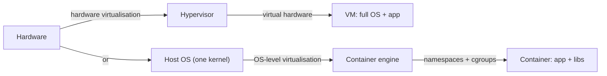
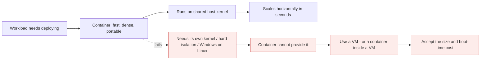

# VM vs container

*Module 03 · Foundations*

The comparison everyone asks for, done properly - including the five benefits you should be able to
recite in an interview without counting on your fingers, and the cases where a VM is still the right
answer.

[Course home](../index.md) / Module 03

## 1. The table

| | Virtual machine | Container |
| --- | --- | --- |
| Virtualises | Hardware | Operating system |
| Needs | A hypervisor | A container engine on a host OS |
| Contains | Full guest OS: kernel + user space | User space only |
| Kernel | Its own | Shares the host's |
| Size | Gigabytes | Megabytes |
| Start-up | Tens of seconds to minutes | Milliseconds to seconds |
| Density per host | Tens | Hundreds to thousands |
| Isolation strength | **Strong** - hypervisor boundary | Moderate - kernel namespace boundary |
| Different OS families on one host | Yes (Linux and Windows guests together) | No - must match the host kernel |
| Built from | ISO image, normal OS installation | Docker image, `docker run` |
| Patching | Patch every guest OS | Rebuild the image, replace the container |
| Typical lifetime | Months to years | Minutes to weeks |

## 2. What is being shared

> **Why it matters:** VMs share hardware and duplicate the OS. Containers share hardware **and** the OS kernel, and duplicate only what is above it. Every difference in the table above follows from that one line.

## 3. The five benefits, phrased so you can defend them

Memorise the shape, not the words. An interviewer can tell the difference.

### 1. Isolation and consistency across environments

Dev, test and production are configured by different people at different times, so they drift. Ship the
image instead of just the code and every environment runs the identical filesystem, runtime and
dependency set - while each container stays isolated from its neighbours.

### 2. Rapid deployment and scaling

No boot sequence, so start-up is measured in milliseconds. That makes horizontal scaling practical: ten
more replicas is a command, not a provisioning ticket. It also makes rollback trivial - run the previous
image tag.

### 3. Efficiency and light weight

No duplicated kernel or system services. Images are megabytes. If a container misbehaves, replacing it is
often faster than debugging it, which changes how you operate systems.

### 4. DevOps and CI/CD

The image is the artefact that moves through the pipeline: built once, tested, promoted, deployed - the
same bytes each time. Dockerfiles are text, so environments become version controlled and reviewable like
code.

### 5. Resource efficiency

Higher density on the same hardware, and per-container CPU and memory limits mean one noisy workload
cannot starve the rest. This is the line that appears on the infrastructure bill.

> **TIP - The sixth benefit nobody lists**
>
> **Onboarding.** A new joiner runs one command instead of following a two-page setup wiki that is already out of date. It is not glamorous, but it is the benefit teams feel first.

## 4. When a VM is still the right answer

An architect is judged on knowing this list.

| Situation | Why a VM |
| --- | --- |
| Untrusted or hostile multi-tenant workloads | Hypervisor isolation is far stronger than namespaces |
| You need a different kernel or kernel modules | Containers cannot bring their own kernel |
| Windows workloads on Linux infrastructure | Impossible in a container; trivial in a VM |
| Legacy software with an OS-level installer and long uptime | Containerising it costs more than it returns |
| Strict compliance requiring machine-level separation | Auditors understand VM boundaries |
| Stateful databases where the team has no container storage expertise | Possible in containers, but the failure modes are unforgiving |

And the answer that is usually right in practice: **both**. Containers inside VMs. That is what every
managed Kubernetes service gives you.

## 5. Where each one breaks

> **Why it matters:** The decision is not ideological. Ask what isolation strength you need and whether the workload requires its own kernel. Everything else - speed, size, density - favours containers.

## 6. Myths worth killing

| Myth | Reality |
| --- | --- |
| "Containers are more secure than VMs" | Weaker isolation boundary. They can be *operated* more securely because images are small, immutable and rebuilt often. |
| "Containers replace VMs" | They compose. Containers usually run inside VMs. |
| "Containers are stateless" | Containers are *ephemeral*. State lives in volumes and external stores. |
| "A container is a lightweight VM" | Useful analogy, wrong mechanism. Say "isolated process sharing the host kernel". |
| "If it runs in a container it is portable" | Portable across hosts with a compatible kernel and CPU architecture. An image built for `amd64` will not run on `arm64` without a multi-arch build. |
| "Containers are always cheaper" | Density saves money; the orchestration platform, registry and expertise cost money. Net saving is real but not automatic. |

> **WARNING - Architecture mismatch is the modern portability trap**
>
> An image built on an Apple Silicon laptop is `arm64`. Your cloud CI runner is probably `amd64`. It will fail with an exec format error, or silently run under emulation and be very slow. Build multi-arch images or pin `--platform` deliberately.

## 7. Extra points

- **Boot time is the wrong metric alone.** A container starts in milliseconds, but if your JVM takes 40
  seconds to warm up, your service is not available in milliseconds. Measure time-to-ready, not
  time-to-running.
- **Density has a ceiling.** Namespaces are cheap; your application's memory is not. You will hit RAM
  limits long before you hit a namespace limit.
- **Immutability is the real cultural change.** No more SSH-and-fix. Build a new image, replace the old
  container. Teams that keep patching running containers get none of the benefit and all of the
  complexity.
- **microVMs are the middle ground.** Firecracker, Kata Containers - VM-grade isolation with
  container-grade start-up. This is what serverless platforms run on, and it is the sophisticated answer
  to "containers or VMs".

> **PRACTICE - Practice now**
>
> 1. Time it: `time docker run --rm ubuntu:22.04 echo hi`. Compare with the boot time of any VM you have.
> 2. Compare sizes: `docker images ubuntu` versus the download size of an Ubuntu Server ISO.
> 3. Start ten containers from one image and check disk usage with `docker system df`. Note how little grows - that is layer sharing.
> 4. Write down two workloads in your organisation that should **not** be containerised, and the reason for each.

> **ASSIGNMENT - Assignment**
>
> Take one real application and write a one-page recommendation: container, VM, or container-inside-VM. It must state the isolation requirement, the kernel requirement, the expected density gain, the operational cost you are taking on, and what would make you reverse the decision. That last sentence is what makes it an architecture document rather than an opinion.

## 8. Interview drill

<b>VM versus container in two sentences.</b>

A VM virtualises hardware: a hypervisor slices the machine and each VM runs its own complete operating
system including a kernel. A container virtualises the operating system: it packages only user space and
shares the host kernel through namespaces and cgroups, so it is far smaller and starts far faster, with a
correspondingly weaker isolation boundary.

<b>List the benefits of containers - without counting on your fingers.</b>

Environment parity, because you ship the image rather than the code. Fast deployment and horizontal
scaling, because there is no boot. Efficiency, because there is no duplicated kernel. A clean CI/CD
artefact, because the image is built once and promoted. And resource efficiency through density plus
per-container limits.

<b>When would you refuse to containerise something?</b>

When it needs its own kernel or kernel modules; when it is a Windows workload on Linux infrastructure;
when hostile multi-tenancy demands hypervisor isolation; when it is legacy software whose installer and
lifecycle assume a long-lived OS; or when the effort exceeds the return. In those cases use a VM, or run
containers inside VMs to get both boundaries.

<b>Are containers more secure than VMs?</b>

No - the isolation boundary is weaker because the kernel is shared. What containers give you is a better
security *posture*: minimal images, immutability, frequent rebuilds and scannable supply chains. For
untrusted tenants, put a VM boundary between them.

<b>Your image works locally and fails in CI with "exec format error". Why?</b>

CPU architecture mismatch - typically an `arm64` image built on an Apple Silicon machine being run on an
`amd64` runner. Fix it by building multi-architecture images with buildx or by specifying the target
platform explicitly in the build.

---

[← Module 02](02-os-virtualization.md) &nbsp;&nbsp;|&nbsp;&nbsp; [Module 04: Docker architecture →](04-docker-architecture.md)

---

Docker: Zero to Architect · Himanshu Kumar.
