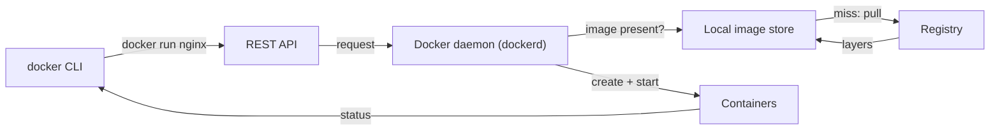
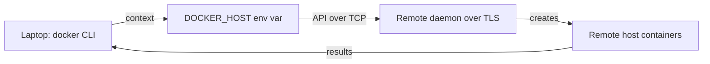

# Docker architecture

*Module 04 · Foundations*

Five nouns explain the whole product: **host, daemon, API, CLI, registry** - plus the image/container
distinction that people confuse for months if nobody states it plainly.

[Course home](../index.md) / Module 04

## 1. The pieces

| Piece | What it is |
| --- | --- |
| **Docker host** | The machine running Docker: hardware (or a VM) + host OS + Docker engine + your containers and images. |
| **Docker daemon** (`dockerd`) | A long-running background process. It does all the real work: builds images, creates containers, manages networks and volumes. |
| **REST API** | The daemon's interface. Everything that talks to Docker talks to this. |
| **Docker CLI** (`docker`) | The command-line client. It only sends API requests - it creates nothing itself. |
| **Registry** | Where images live. Docker Hub by default; private and cloud registries too. |



> **Why it matters:** The CLI is a thin client. That is why a remote CLI can drive a remote daemon, why anything with API access has full control of the host, and why "Docker is not running" almost always means the daemon, not the command.

> **WARNING - Anyone who can reach the daemon owns the host**
>
> The daemon runs as root. Access to its socket (`/var/run/docker.sock`) means you can start a privileged container that mounts the host filesystem - which is root access, laundered. Never expose the daemon over TCP without TLS and client certificates, and think hard before mounting the socket into a container.

## 2. Image vs container - the distinction that matters

| | Image | Container |
| --- | --- | --- |
| What it is | A read-only template: filesystem layers plus metadata (default command, env, ports) | A running (or stopped) instance created from an image |
| Analogy | A class, or an installer ISO | An object, or the installed machine |
| Mutability | Immutable | Has a writable layer on top |
| Count | One image | Many containers from that one image |
| Lives in | Local image store, or a registry | The Docker host |
| Created by | `docker build` or `docker pull` | `docker run` (create + start) |

```text
        IMAGE  (read-only, shared)              CONTAINERS (one writable layer each)
   ┌──────────────────────────┐             ┌───────────┐ ┌───────────┐ ┌───────────┐
   │ layer: app               │             │ writable  │ │ writable  │ │ writable  │
   │ layer: dependencies      │  ────────▶  ├───────────┤ ├───────────┤ ├───────────┤
   │ layer: base user space   │             │  same image layers, shared on disk    │
   └──────────────────────────┘             └───────────┴─┴───────────┴─┴───────────┘
```

That sharing is why running ten containers from one image costs roughly one image on disk.

> **TIP - "Container is a running image" is close enough to start**
>
> Just remember the writable layer. It is the reason two containers from the same image can diverge, and the reason data disappears when a container is removed.

## 3. Registries

A registry stores images. A **repository** inside it stores the versions (tags) of one image.

| Registry | Type | Notes |
| --- | --- | --- |
| **Docker Hub** (`hub.docker.com`) | Public, default | Official images, verified publishers, and everything anyone uploaded. Anonymous pulls are rate limited. |
| Docker Hub private repos | Private | Paid tiers; access controlled to your account or organisation |
| **Amazon ECR** | Cloud private | IAM-controlled, integrates with EKS/ECS |
| **Azure ACR** | Cloud private | Entra ID-controlled, integrates with AKS |
| **Google Artifact Registry** (formerly GCR) | Cloud private | IAM-controlled, integrates with GKE |
| Self-hosted (Harbor, Nexus, GitLab) | Private | Full control, air-gapped friendly, your problem to run |

> **WARNING - Not every image on Docker Hub is safe**
>
> Anyone can publish. Prefer **Official Images** and **Verified Publisher** images. A random `mysql-fast-v2` may be a fork with a cryptominer, or simply unpatched since 2021. Pin what you use, scan it, and vendor critical bases into your own registry.

## 4. Under the daemon: containerd, runc, OCI

Docker is not a monolith any more, and knowing the stack marks you out in an interview.

| Layer | Role |
| --- | --- |
| `dockerd` | User-facing daemon: API, build, networking, volumes |
| `containerd` | Container lifecycle: image pull, storage, supervising running containers |
| `runc` | The low-level runtime that actually creates namespaces and cgroups, then starts the process |
| **OCI** | Open Container Initiative - the specifications for image format and runtime that make all of this interchangeable |

Because the OCI standard exists, images built by Docker run under Podman, containerd or Kubernetes
without change. **Kubernetes removed the Docker shim, not Docker images** - a widely misunderstood
headline that is a favourite interview trap.

## 5. Client and daemon do not have to be on the same machine



> **Why it matters:** Docker Desktop on Windows and macOS already does this - the CLI runs on your OS, the daemon runs inside a lightweight Linux VM. Understanding that removes most Desktop confusion, including why paths behave oddly on bind mounts.

## 6. Extra points

- **Docker Desktop is licensed software.** Free for personal use, education and small businesses; a paid
  subscription for larger organisations. Engine on Linux remains free. This has bitten many teams at
  procurement time.
- **Rootless mode** runs the daemon as a non-root user, which materially reduces the blast radius. Some
  features are limited; worth it in shared environments.
- **Podman is daemonless** and can run rootless by default, which is why Red Hat environments often
  prefer it. Same images, largely the same CLI.
- **`docker` group membership is root-equivalent.** Covered again in module 05 because people keep
  granting it casually.
- **The daemon owns your disk.** Images, containers, volumes and build cache accumulate under
  `/var/lib/docker`. Check with `docker system df`; reclaim with `docker system prune`.

> **PRACTICE - Practice now**
>
> 1. Run `docker version` and note the separate Client and Server (Engine) sections - two different things.
> 2. Run `docker info` and find the storage driver, the number of containers and images, and the root directory.
> 3. Run `systemctl status docker` and confirm the daemon is what is actually running.
> 4. Run `docker system df` and see where your disk went.
> 5. Look up one Official Image and one random community image for the same software on Docker Hub. Compare pulls, last update and Dockerfile transparency.

> **ASSIGNMENT - Assignment**
>
> Draw your team's container supply chain end to end: where images come from, who may publish, which registry, who can reach the daemon on each environment, and where the trust boundaries are. Mark one place where an attacker with a compromised CI token could reach production. That diagram is worth more than any command you will learn this week.

## 7. Interview drill

<details>
<summary><b>What happens when you type `docker run nginx`?</b></summary>

The CLI sends an API request to the Docker daemon. The daemon checks the local image store for `nginx`;
if it is missing it pulls the layers from the configured registry. It then creates a container - a new set
of namespaces, cgroups and a writable layer on top of the image layers - and starts the image's default
command as PID 1 inside it.

</details>

<details>
<summary><b>Image versus container?</b></summary>

An image is an immutable, layered read-only template plus metadata. A container is a running or stopped
instance of an image with its own writable layer. One image, many containers - and the image layers are
shared on disk between them.

</details>

<details>
<summary><b>Why is access to the Docker socket dangerous?</b></summary>

The daemon runs as root, so anyone who can talk to its socket can start a privileged container that
mounts the host filesystem and therefore obtain root on the host. Mounting the socket into a container is
equivalent to granting that container root on the machine.

</details>

<details>
<summary><b>"Kubernetes deprecated Docker" - explain.</b></summary>

Kubernetes removed dockershim, the adapter it used to talk to the Docker daemon, and now talks to
CRI-compatible runtimes such as containerd or CRI-O directly. Docker-built images are OCI images and
continue to run unchanged. Only the node-level runtime plumbing changed.

</details>

<details>
<summary><b>What are containerd and runc?</b></summary>

containerd is the runtime that manages image transfer, storage and container lifecycle; runc is the
low-level OCI runtime that actually sets up namespaces and cgroups and executes the process. Docker sits
above both, providing the API, build tooling, networking and volumes.

</details>

---

[← Module 03](03-vm-vs-container.md) &nbsp;&nbsp;|&nbsp;&nbsp; [Module 05: Installing Docker →](05-installation.md)

---

Docker: Zero to Architect · Himanshu Kumar.
