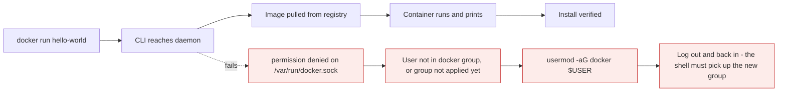

# Installing Docker

*Module 05 · Setup*

Requirements, the two installation routes on Ubuntu, and the post-install step that is a security
decision rather than a convenience.

[Course home](../index.md) / Module 05

## 1. Requirements

| Requirement | Detail |
| --- | --- |
| **CPU** | 64-bit processor. For Docker Desktop on Windows, SLAT (Second Level Address Translation) support. |
| **Virtualisation** | Intel **VT-x** or AMD **AMD-V** enabled in BIOS/UEFI. Needed whenever a Linux VM sits underneath - Docker Desktop on Windows and macOS. |
| **RAM** | 4 GB recommended. A 1 GB cloud VM is fine for learning. Real requirement depends entirely on what you run. |
| **Disk** | Start with 20+ GB. Images, layers, volumes and build cache accumulate quickly. |
| **Linux kernel** | Modern kernel required. Check with `uname -r`. |
| **Windows** | 64-bit Windows 10/11; WSL 2 recommended. |
| **macOS** | Recent macOS with Docker Desktop. |

> **WARNING - The most common install failure on a new laptop**
>
> Intel VT-x / AMD-V is **disabled by default** on many new machines. Docker Desktop then fails with a virtualisation error. Reboot into BIOS/UEFI (usually F2, F10 or Del at power-on), enable the virtualisation feature, save, reboot. Check this *before* you start debugging Docker itself.

> **TIP - Learn on a cloud VM**
>
> A free-tier Ubuntu 22.04 VM on AWS, Azure or GCP is the least painful learning environment: no BIOS flags, no Desktop licence question, and you can destroy and rebuild it freely. Ubuntu 22.04 LTS is available on all three.

## 2. Two routes on Ubuntu

| | Method 1: distro repository | Method 2: Docker official repository |
| --- | --- | --- |
| Package | `docker.io` | `docker-ce`, `docker-ce-cli`, `containerd.io` |
| Steps | Two | Six or seven |
| Version | Whatever the distro shipped - often behind | Current release |
| Features | Missing newer features | Everything, including Compose v2 plugin |
| Use for | A quick throwaway box | Anything you will keep, and anything resembling production |

Recommendation: **use method 2**. The extra four commands are worth having a supported, current engine.

## 3. Method 1 - distro repository

```bash
sudo apt update
sudo apt install -y docker.io

sudo systemctl status docker     # is it running?
sudo systemctl enable docker     # start automatically after reboot
docker --version
```

> **NOTE - `enable` is not optional**
>
> `start` runs the service now. `enable` makes it start on boot. Skip `enable` and Docker will be dead the next time the machine restarts - a classic "it worked yesterday" ticket.

## 4. Method 2 - Docker official repository

```bash
# 1. update and install the packages needed to use an HTTPS repository
sudo apt update
sudo apt install -y apt-transport-https ca-certificates curl software-properties-common

# 2. add Docker's GPG key - this is what proves the packages really came from Docker
sudo install -m 0755 -d /etc/apt/keyrings
curl -fsSL https://download.docker.com/linux/ubuntu/gpg \
  | sudo gpg --dearmor -o /etc/apt/keyrings/docker.gpg
sudo chmod a+r /etc/apt/keyrings/docker.gpg

# 3. add the Docker repository to apt sources
echo "deb [arch=$(dpkg --print-architecture) signed-by=/etc/apt/keyrings/docker.gpg] \
  https://download.docker.com/linux/ubuntu $(lsb_release -cs) stable" \
  | sudo tee /etc/apt/sources.list.d/docker.list > /dev/null

# 4. refresh and install the engine
sudo apt update
sudo apt install -y docker-ce docker-ce-cli containerd.io docker-buildx-plugin docker-compose-plugin

# 5. start on boot and verify
sudo systemctl enable --now docker
sudo systemctl status docker
docker --version
```

What each stage is for:

| Stage | Purpose |
| --- | --- |
| `apt-transport-https`, `ca-certificates` | Lets apt fetch packages over HTTPS |
| GPG key | Cryptographic proof the binaries came from Docker and were not tampered with in transit |
| Repository entry | Tells apt where to look for `docker-ce` |
| `docker-buildx-plugin` | Modern builder, multi-architecture images |
| `docker-compose-plugin` | Compose v2 as `docker compose` (module 12) |

> **TIP - Do not memorise these commands**
>
> Nobody types this from memory. Copy them from the official installation page for your distribution, which stays current. What you must understand is the *sequence* - prerequisites, trust the source, add the source, install - because that is what you will be asked to explain.

## 5. Post-install: the `docker` group

By default only root can talk to the daemon socket, so every command needs `sudo`. The usual fix:

```bash
sudo usermod -aG docker $USER
newgrp docker          # or log out and back in
docker run --rm hello-world
```

> **WARNING - This is a privilege escalation decision, not a convenience**
>
> Membership of the `docker` group is **equivalent to root on that host**. A member can run:
> `docker run -v /:/host -it alpine chroot /host sh` - and they are root on the machine, with no `sudo` and no password prompt.
>
> On a personal laptop, fine. On a shared or production server, treat `docker` group membership exactly like handing out `sudo`: approve it deliberately, audit it, and prefer rootless mode or a controlled CI runner instead.

## 6. Verify properly

```bash
docker --version                 # client version
docker version                   # client AND server - if Server is missing, the daemon is not reachable
docker info                      # storage driver, root dir, counts, warnings
docker run --rm hello-world      # end-to-end: pull from registry, create, run, exit
```



> **Why it matters:** Almost every "Docker is broken after install" report is one of three things: the daemon is not running, the user is not in the `docker` group, or the group change has not been applied to the current shell.

## 7. Troubleshooting table

| Symptom | Cause | Fix |
| --- | --- | --- |
| `permission denied ... docker.sock` | Not in `docker` group, or group not loaded | `usermod -aG docker $USER`, then re-login |
| `Cannot connect to the Docker daemon` | Daemon not running | `sudo systemctl start docker` and check `status` |
| Works today, gone after reboot | Service not enabled | `sudo systemctl enable docker` |
| Docker Desktop: virtualisation error | VT-x / AMD-V disabled | Enable in BIOS/UEFI |
| `no space left on device` | Images, volumes and build cache accumulated | `docker system df`, then `docker system prune -a --volumes` (destructive - read module 11 first) |
| Pull fails: `toomanyrequests` | Anonymous Docker Hub rate limit | Log in, or mirror images into your own registry |
| Very slow builds on a laptop | Emulating a different CPU architecture | Build natively or use buildx with the right platform |

## 8. Extra points

- **Docker Desktop licensing.** Free for personal use, education and small businesses; paid subscription
  for larger organisations. Docker Engine on Linux is free. Check before rolling it out to a company
  laptop fleet.
- **Rootless mode** runs the daemon as an unprivileged user - a meaningful reduction in blast radius on
  shared hosts, with some feature limitations.
- **Put `/var/lib/docker` on a disk you can grow.** On a cloud VM with a small root volume this is the
  first thing to fill up.
- **Never `curl | sudo bash` an install script you have not read.** The convenience script exists for
  quick evaluation; in a managed environment use the repository method so your patching pipeline can
  update it.
- **Log rotation is not on by default.** Container logs will fill the disk. Configure `log-opts` in
  `/etc/docker/daemon.json` (module 13).

> **PRACTICE - Practice now**
>
> 1. Create a fresh Ubuntu 22.04 VM.
> 2. Install with method 1. Record `docker --version`.
> 3. Create a second VM, install with method 2, and compare the version. Notice the gap - that is the whole argument.
> 4. Enable the service, reboot the VM, and confirm Docker is still running.
> 5. Add your user to the `docker` group, then prove the risk to yourself: `docker run --rm -v /etc:/host-etc alpine cat /host-etc/hostname`. You just read a host file as a non-sudo user.
> 6. Run `docker system df` on a fresh host and note the baseline.

> **ASSIGNMENT - Assignment**
>
> Write your team's Docker host build standard: installation method, version pinning, `daemon.json` settings (log rotation, storage driver, registry mirrors), disk layout for `/var/lib/docker`, who may join the `docker` group and how that is approved, and how the engine gets patched. One page. This is the document a security reviewer will actually ask for.

## 9. Interview drill

<details>
<summary><b>Distro package or Docker's own repository?</b></summary>

Docker's repository for anything real. The distro package is convenient but usually lags, so you miss
features and fixes. The official repository gives the current engine, buildx and the Compose plugin, and
the GPG-signed source means the packages are verifiably from Docker.

</details>

<details>
<summary><b>Why is adding a user to the `docker` group a security decision?</b></summary>

Because it grants root-equivalent access. The daemon runs as root, so a group member can start a
container that bind-mounts the host filesystem and chroot into it - full root, no `sudo`, no password. On
shared or production hosts, use rootless mode or a controlled runner instead.

</details>

<details>
<summary><b>`systemctl start` versus `systemctl enable`?</b></summary>

`start` runs the service now; `enable` configures it to start at boot. You need both, or Docker will be
missing after the next reboot.

</details>

<details>
<summary><b>Docker Desktop on Windows shows a virtualisation error. Diagnosis?</b></summary>

Hardware virtualisation is disabled. Docker Desktop needs a lightweight Linux VM (WSL 2 or Hyper-V) so
Linux containers have a Linux kernel to share, and that VM needs Intel VT-x or AMD-V enabled in
BIOS/UEFI.

</details>

<details>
<summary><b>Your Docker host runs out of disk. What do you check and what do you clean?</b></summary>

`docker system df` to see the split across images, containers, volumes and build cache. Remove stopped
containers and dangling images first, then unused build cache. Be extremely careful with
`prune --volumes` - that deletes data. Longer term: log rotation, image slimming, and a scheduled prune
policy.

</details>

---

[← Module 04](04-docker-architecture.md) &nbsp;&nbsp;|&nbsp;&nbsp; [Module 06: The Docker CLI →](06-docker-cli.md)

---

Docker: Zero to Architect · Himanshu Kumar.
