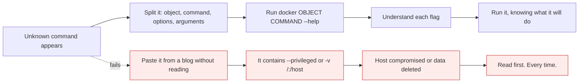

# The Docker CLI

*Module 06 · Setup*

Do not memorise commands. Learn the grammar - then every command you have never seen becomes readable,
and `--help` fills in the rest.

[Course home](../index.md) / Module 06

## 1. The grammar

```text
docker  <object>  <command>  [options]  [arguments]
  │         │          │          │          │
  │         │          │          │          └── what to act on: image name, container id, path
  │         │          │          └───────────── flags that modify behaviour
  │         │          └──────────────────────── the action: run, ls, rm, build, inspect
  │         └─────────────────────────────────── what kind of thing: container, image, network, volume
  └───────────────────────────────────────────── always starts with docker
```

| Part | Examples |
| --- | --- |
| **Object** | `container`, `image`, `network`, `volume`, `system`, `context` |
| **Command** | `run`, `ls`, `rm`, `build`, `pull`, `push`, `logs`, `inspect`, `exec`, `prune` |
| **Options** | `-d`, `-it`, `--name web`, `-p 8080:80`, `--rm` |
| **Arguments** | `nginx:1.25`, `a1b2c3d4`, `.` |

```bash
docker container run --name web -p 8080:80 -d nginx:1.25
#      └object┘ └cmd┘ └────── options ──────┘ └argument┘
```

> **TIP - The short forms you will actually see**
>
> Docker keeps older top-level shortcuts: `docker run` = `docker container run`, `docker ps` = `docker container ls`, `docker images` = `docker image ls`, `docker rmi` = `docker image rm`. Both work. Read the long form to understand what a command does; type the short form.

## 2. Flags: one hyphen or two?

This trips people up constantly, and the rule is universal across Unix tooling.

| Form | Use | Examples |
| --- | --- | --- |
| **`-x`** single hyphen | Single-letter short options | `-d`, `-a`, `-p 8080:80`, `-v data:/data` |
| **`--word`** double hyphen | Full-word, descriptive options | `--name`, `--rm`, `--detach`, `--publish`, `--help` |

Short flags combine: `-it` is `-i -t`. Most short flags have a long twin - `-d` is `--detach`, `-a` is
`--all` - so `docker ps -a` and `docker ps --all` are identical.

> **NOTE - Prefer long flags in scripts**
>
> `--detach --publish 8080:80` is self-documenting in a CI file six months later. `-d -p 8080:80` is fine when you are typing.

## 3. The commands you will use every day

```bash
# containers
docker ps                      # running containers
docker ps -a                   # ALL containers, including exited ones
docker run -d --name web -p 8080:80 nginx      # create + start, detached
docker stop web                # graceful: SIGTERM, then SIGKILL after the grace period
docker start web
docker rm web                  # remove a stopped container
docker rm -f web               # force: stop and remove
docker logs -f web             # follow the logs
docker exec -it web sh         # a shell inside a RUNNING container
docker inspect web             # full JSON detail

# images
docker images                  # local images
docker pull nginx:1.25
docker rmi nginx:1.25
docker build -t myapp:1.0 .

# housekeeping
docker system df               # where your disk went
docker system prune            # remove stopped containers, unused networks, dangling images
```

> **WARNING - `prune` deletes things**
>
> `docker system prune -a --volumes` removes all unused images **and volumes**. Volumes are your data. Read module 11 before you type that on any machine that matters.

## 4. Three time-savers

### Tab completion

Type part of a container name or ID and press Tab. Docker completes it - names, IDs, image names,
even subcommands.

```bash
docker rm qui<Tab>     ->  docker rm quirky_einstein
docker rm a1b<Tab>     ->  docker rm a1b2c3d4e5f6
```

You never need to copy a container ID by hand. Two or three characters of a container ID are usually
enough to be unique even without Tab - `docker stop a1b` works.

### `--help` is the real documentation

```bash
docker --help
docker container --help
docker container run --help     # every flag, with descriptions
```

### `--format` for output you can use

```bash
docker ps --format "table {{.Names}}\t{{.Status}}\t{{.Ports}}"
docker images --format "{{.Repository}}:{{.Tag}} {{.Size}}"
docker inspect --format '{{.State.Status}}' web
docker ps -q                   # IDs only - perfect for scripting
docker stop $(docker ps -q)    # stop everything running
```

> **TIP - `--filter` before you reach for grep**
>
> `docker ps -a --filter "status=exited"`, `docker images --filter "dangling=true"`. Filters are applied by the daemon, so they are exact - grep matches text and will eventually surprise you.

## 5. Reading a command you have never seen



> **Why it matters:** Copy-pasting Docker commands is normal and fine - as long as you can read them. The two flags that should always stop you are `--privileged` and any bind mount of a host path like `-v /:/host` or `-v /var/run/docker.sock:...`.

## 6. Extra points

- **Do not memorise, understand.** Object, command, options, arguments. With that plus `--help` you can
  work out anything, and an AI assistant will hand you syntax on demand. What it cannot hand you is
  knowing whether the command is safe to run.
- **Container names beat IDs.** Always pass `--name`. Otherwise Docker assigns a random pair like
  `quirky_einstein`, and your scripts become unreadable.
- **Exit codes work normally.** `docker run` returns the container's exit code, so `&&` and `||` behave
  as expected in scripts and CI.
- **`docker compose` (space) is v2**, a CLI plugin. `docker-compose` (hyphen) is the legacy Python v1.
  Use v2.
- **Contexts switch hosts.** `docker context use remote` points the same CLI at a different daemon
  without changing a single command.

> **PRACTICE - Practice now**
>
> 1. Run `docker container run --help` and read the flag list once, end to end. You will recognise half of it later.
> 2. Start two containers without `--name` and look at the random names. Then start one with `--name web`.
> 3. Practise Tab completion on a container ID and on a name.
> 4. Produce a clean status table with `docker ps --format "table {{.Names}}\t{{.Status}}"`.
> 5. Stop everything with `docker stop $(docker ps -q)`, then explain to yourself exactly what the inner command returned.
> 6. Find every exited container using `--filter` rather than grep.

> **ASSIGNMENT - Assignment**
>
> Write a one-page CLI cheat sheet for your team, organised **by task** ("inspect a misbehaving container", "reclaim disk", "debug networking") rather than alphabetically by command. Include a "commands that need a second pair of eyes" section listing `--privileged`, socket mounts and `prune --volumes`. Task-organised beats alphabetical every time, because that is how people actually search.

## 7. Interview drill

<details>
<summary><b>What is the general form of a Docker command?</b></summary>

`docker OBJECT COMMAND [options] [arguments]` - the object is the resource type (container, image,
network, volume), the command is the action, options modify behaviour, and arguments name the specific
thing. Legacy shortcuts like `docker ps` and `docker run` are aliases for the container forms.

</details>

<details>
<summary><b>`-p` versus `--publish`, and when do you use single or double hyphens?</b></summary>

They are the same flag. Single hyphen is for single-letter short options and they can be combined
(`-it` = `-i -t`); double hyphen is for full-word options. Prefer long forms in scripts for readability.

</details>

<details>
<summary><b>`docker ps` shows nothing but you just created a container. Why?</b></summary>

`docker ps` lists only running containers. The container exited - very common when its main process
finished immediately or you pressed Ctrl+C. Use `docker ps -a` to see it, and `docker logs` to find out
why it stopped.

</details>

<details>
<summary><b>How would you stop every running container in one command?</b></summary>

`docker stop $(docker ps -q)`. The inner command lists running container IDs only, and the outer command
stops each. In scripts, guard against the empty case, because `docker stop` with no argument errors.

</details>

---

[← Module 05](05-installation.md) &nbsp;&nbsp;|&nbsp;&nbsp; [Module 07: Images →](07-images.md)

---

Docker: Zero to Architect · Himanshu Kumar.
