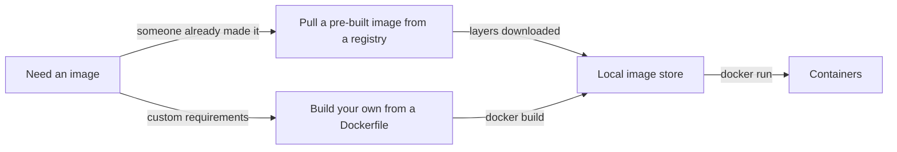
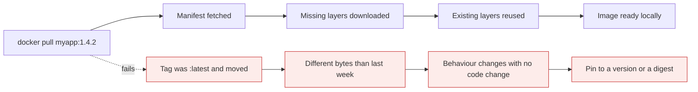

# Images

*Module 07 · Core*

An image is a read-only, layered template plus metadata. Understand the layers and you understand why
builds are fast, why images are huge, and why `docker pull` sometimes downloads almost nothing.

[Course home](../index.md) / Module 07

## 1. What is inside an image

| Contents | Example |
| --- | --- |
| Application code | your `app.jar`, `main.py` |
| Runtime | JRE, Python, Node |
| Libraries and OS user space | libc, shell, `apt` output |
| Environment variables | `PATH`, `NODE_ENV` |
| Metadata | default command, exposed ports, working directory, user |

No kernel (module 02). That is why an Ubuntu **image** is tens of MB while an Ubuntu **VM** is gigabytes.

## 2. Two ways to get one



> **Why it matters:** Almost every real image is both - you pull an official base and build your layers on top of it. Module 09 covers building; this module is everything else.

## 3. Pulling

```bash
docker pull ubuntu:22.04         # explicit version - do this
docker pull nginx                # implies :latest - avoid in anything real
docker pull ubuntu@sha256:abc123...   # by digest - completely immutable
```

**Naming:**

```text
registry / namespace / repository : tag
docker.io  library     ubuntu       22.04     <- the default, usually written just "ubuntu:22.04"
ghcr.io    myorg       api          1.4.2
```

If you do not name a registry, Docker uses Docker Hub. If you do not name a tag, Docker uses `latest`.

> **WARNING - `latest` is not a version, it is a label**
>
> It is just a tag that someone chose to move. Today's `latest` and next month's `latest` can be entirely different software. Pin versions in every Dockerfile and every deployment - otherwise "we changed nothing" becomes a real production incident.

| Reference | Mutable? | Use when |
| --- | --- | --- |
| `nginx:latest` | Yes, freely | Quick local experiments only |
| `nginx:1.25` | Yes, patches move | Normal application pinning |
| `nginx@sha256:...` | **No** | Regulated environments, reproducible builds, supply-chain control |

## 4. Layers - the model that explains everything

Each build instruction produces a layer. Layers stack read-only; the container adds one writable layer on
top.

```text
   ┌──────────────────────────────┐
   │ writable layer (container)   │  <- per container, deleted with it
   ├──────────────────────────────┤
   │ layer 4: COPY app.jar        │  <- 15 MB
   │ layer 3: RUN apt install jre │  <- 180 MB
   │ layer 2: RUN apt update      │  <- 40 MB
   │ layer 1: FROM ubuntu:22.04   │  <- 77 MB
   └──────────────────────────────┘
```

Three consequences you should be able to state cold:

| Consequence | Detail |
| --- | --- |
| **Layers are shared** | Ten images built on `ubuntu:22.04` store that base once. Ten containers from one image share all its layers. |
| **Pulls are incremental** | If you already have four of five layers, only the fifth downloads. That is why the second pull of a related image is nearly instant. |
| **Layers are immutable and additive** | Deleting a file in a later layer only *hides* it. The bytes are still in the earlier layer, still in the image, still shipped. |

> **WARNING - The classic secret leak**
>
> ```dockerfile
> COPY secrets.env /app/          # layer 3 - the file is now in the image forever
> RUN rm /app/secrets.env         # layer 4 - only hides it
> ```
> Anyone can extract layer 3 and read the secret. Never copy secrets into an image; use build secrets or inject at runtime.

## 5. Inspecting what you have

```bash
docker images                       # repository, tag, image ID, created, size
docker image ls --filter "dangling=true"

docker image inspect ubuntu:22.04                       # full JSON
docker image inspect --format '{{.Config.Cmd}}' nginx   # just the default command
docker image inspect --format '{{.Architecture}}' nginx # amd64 or arm64

docker history myapp:1.0            # every layer with its size - find the fat one
```

> **TIP - `docker history` is the image-size debugger**
>
> It shows each layer and what created it. When someone asks "why is our image 1.2 GB", this is the command that answers it - usually a build toolchain or an `apt` cache that was never cleaned.

## 6. Removing and reclaiming

```bash
docker rmi ubuntu:22.04             # by name:tag
docker image rm a1b2c3d4            # by ID
docker rmi -f a1b2c3d4              # force, even if a stopped container references it

docker image prune                  # dangling (untagged) images only - safe
docker image prune -a               # every image not used by a container - aggressive
docker system df                    # where the disk actually went
```

| Error | Meaning | Fix |
| --- | --- | --- |
| `image is being used by stopped container` | A container still references it | Remove the container first, or `rmi -f` |
| `image is referenced in multiple repositories` | Same image, several tags | Remove the tags, or use the image ID |
| `no such image` | Wrong tag or wrong registry | `docker images` and check the exact name |

## 7. Tagging

A tag is a pointer to an image ID. Tagging costs nothing and copies nothing.

```bash
docker tag myapp:1.0 myapp:latest
docker tag myapp:1.0 ghcr.io/myorg/myapp:1.0    # required before pushing (module 10)
```

A tagging strategy worth stealing:

| Tag | Meaning |
| --- | --- |
| `1.4.2` | Immutable release. Never re-pushed. |
| `1.4`, `1` | Moving pointers to the newest patch/minor |
| `sha-a1b2c3d` | Git commit - the one you actually deploy and can trace |
| `latest` | Convenience for humans only. Never referenced by a deployment. |

## 8. Multi-architecture

```bash
docker image inspect --format '{{.Architecture}}' nginx
docker pull --platform linux/amd64 nginx:1.25
```

An image is built for a CPU architecture. `amd64` will not run on `arm64` natively. A **manifest list**
lets one tag serve several architectures, which is how official images work transparently across an
Apple Silicon laptop and an x86 server. Your own images need `buildx` to do the same.

> **WARNING - The Apple Silicon trap**
>
> Build on an M-series Mac, push, deploy to an `amd64` node, and you get `exec format error` - or worse, silent emulation that is five times slower. Build multi-arch, or build on the target architecture in CI.

## 9. Why images get huge

| Cause | Fix |
| --- | --- |
| Full OS base for a static binary | Use `alpine`, `distroless`, or `scratch` |
| Build tools shipped to production | Multi-stage build (module 09) |
| `apt` cache left behind | `rm -rf /var/lib/apt/lists/*` in the **same** `RUN` |
| Copying the whole repo including `.git` and `node_modules` | `.dockerignore` |
| Secrets or test fixtures copied in | Do not copy them at all |

Rough sizes for the same trivial web app: Ubuntu base ~180 MB · Alpine base ~15 MB · distroless ~25 MB ·
scratch with a static binary ~8 MB.

> **Why size matters:** pull time on every node, cold-start latency when scaling, registry storage and
> egress cost, and attack surface. A 1 GB image pulled onto 50 nodes is 50 GB of transfer for one deploy.



## 10. Extra points

- **Official images are curated**, documented and patched. Prefer them as bases. Community images are
  anyone's work and may be unmaintained or hostile.
- **Read the Docker Hub page** for the tags and variants: `-alpine`, `-slim`, and version-specific tags
  usually already solve your size problem.
- **Layer ordering is a performance decision.** Put rarely changing instructions first, your source code
  last - otherwise every code change invalidates the whole cache (module 09).
- **Images are content-addressed.** The digest is a hash of the content, which is what makes
  `@sha256:...` genuinely immutable.
- **`docker save` / `docker load`** move images as tar files - the answer for air-gapped environments
  with no registry.
- **Scan your images.** `docker scout` or Trivy will list known CVEs. Base image age is the single
  biggest driver of that count.

> **PRACTICE - Practice now**
>
> 1. `docker pull ubuntu:22.04` and note the layer download lines. Pull it again - instant, because it is local.
> 2. `docker pull nginx:1.25` and watch some layers say "Already exists" - shared with a base you already had.
> 3. Compare `docker images` sizes for `ubuntu:22.04`, `alpine:3.19` and `nginx:1.25-alpine`.
> 4. Run `docker history nginx:1.25` and find the largest layer.
> 5. Tag an image twice, run `docker images`, and confirm both tags share one image ID.
> 6. Pull by digest, then try to "update" it - you cannot, which is the point.
> 7. Run `docker system df`, then `docker image prune`, and compare.

> **ASSIGNMENT - Assignment**
>
> Take a real image your team uses. Report: total size, the three largest layers and what created them, the base image and how old it is, the CVE count from a scanner, and whether your deployments reference a moving tag. Then propose a target size and tagging policy. That report is a genuinely useful artefact and an excellent interview story.

## 11. Interview drill

<details>
<summary><b>What is a Docker image made of?</b></summary>

Read-only filesystem layers plus metadata - default command, environment, exposed ports, working
directory, user. Each build instruction adds a layer, layers are content-addressed and shared between
images, and a container adds a writable layer on top.

</details>

<details>
<summary><b>Why is pulling a second image from the same base so fast?</b></summary>

Layers are shared and content-addressed. If the base layers are already in the local store, only the new
layers are downloaded. The output shows "Already exists" for the reused ones.

</details>

<details>
<summary><b>Why should you never use `latest` in production?</b></summary>

It is a mutable pointer, not a version. The bytes behind it can change at any time, so a redeploy with no
code change can ship different software - and rollback becomes ambiguous. Pin an immutable version tag or
a digest.

</details>

<details>
<summary><b>Someone copied a secret in and deleted it in the next instruction. Is it safe?</b></summary>

No. Layers are immutable and additive; the later deletion only hides the file in the final filesystem
view. The earlier layer still contains it and ships with the image, where anyone can extract it. Rotate
the secret and rebuild without it, using build secrets or runtime injection.

</details>

<details>
<summary><b>Your image is 1.2 GB. How do you reduce it?</b></summary>

Run `docker history` to find the big layers. Then: use a slim or Alpine base, adopt a multi-stage build so
compilers and dev dependencies never reach the final image, clean package caches inside the same `RUN`
layer, add a `.dockerignore`, and consider distroless or scratch for static binaries.

</details>

---

[← Module 06](06-docker-cli.md) &nbsp;&nbsp;|&nbsp;&nbsp; [Module 08: Your first containers →](08-first-container.md)

---

Docker: Zero to Architect · Himanshu Kumar.
