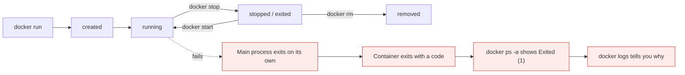
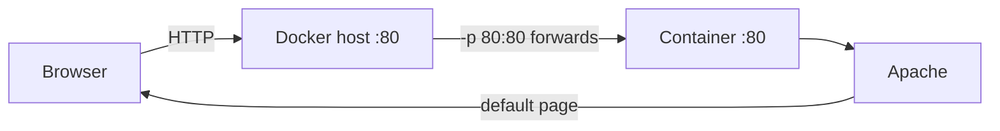

# Your first containers

*Module 08 · Core*

Two ways to create containers, and then the part everyone gets confused by: why `docker run nginx` looks
like it does nothing useful, and what `-it` actually fixes.

[Course home](../index.md) / Module 08

## 1. Two methods

| | Imperative | Declarative |
| --- | --- | --- |
| How | `docker run` with flags | A `Dockerfile` (module 09) or a Compose file (module 12) |
| Repeatable | No - depends on what you typed | Yes - the file is the definition |
| Version controlled | No | Yes, it is text |
| Speed | Instant | Build step first |
| Use for | Experiments, testing an image, one-off commands, debugging | Anything that ships, anything in CI/CD |

Both matter. You test imperatively, then encode what worked declaratively.

## 2. The most basic run - and why it looks broken

```bash
docker pull nginx:latest
docker run nginx:latest
```

The terminal fills with nginx startup output and then just sits there. You type - nothing happens.
Ctrl+C, and the container exits.

Nothing is broken. Three things are happening:

| Observation | Reason |
| --- | --- |
| You cannot type commands | You are attached to nginx's output stream, not to a shell. There is no shell running. |
| Ctrl+C ends it | You signalled the foreground process. Its main process stopped, so the container stopped. |
| `docker ps` shows nothing afterwards | `ps` lists only running containers. Use `docker ps -a`. |

```bash
docker ps          # empty
docker ps -a       # STATUS: Exited (0) 30 seconds ago
```

> **TIP - The rule that explains 90% of "my container keeps exiting"**
>
> **A container lives exactly as long as its main process (PID 1).** When that process ends, the container ends. There is no daemon keeping it alive. A container running only `echo hello` exits immediately, and that is correct behaviour, not a failure.

## 3. `-it` - getting a shell

```bash
docker run -it nginx:latest /bin/bash
```

Two flags and one argument, and all three matter:

| Part | Meaning |
| --- | --- |
| `-i` (`--interactive`) | Keep STDIN open, so your keyboard input reaches the container |
| `-t` (`--tty`) | Allocate a pseudo-terminal, so you get a prompt, line editing and formatting |
| `/bin/bash` | **Overrides the image's default command.** Instead of starting nginx, start a bash shell |

Together they give an interactive session that behaves like a normal Linux terminal.

```bash
root@a1b2c3d4:/# ls
root@a1b2c3d4:/# cat /etc/os-release
root@a1b2c3d4:/# exit          # main process ends -> container stops
```

> **WARNING - `exit` stops the container**
>
> The shell *is* PID 1. Exiting it ends the container. To leave an interactive container **running**, detach with `Ctrl+P` then `Ctrl+Q`. Better still, run it detached and use `docker exec` to visit it.

| Image | Shell to ask for |
| --- | --- |
| Ubuntu, Debian, nginx | `/bin/bash` |
| Alpine | `/bin/sh` - there is no bash |
| distroless, scratch | None. There is no shell at all - by design |

## 4. The flags that matter in practice

```bash
docker run -d --name web -p 8080:80 --restart unless-stopped nginx:1.25
```

| Flag | Does | Why you want it |
| --- | --- | --- |
| `-d` (`--detach`) | Runs in the background, prints the container ID | You get your terminal back |
| `--name web` | Names the container | Otherwise you get `quirky_einstein` and unreadable scripts |
| `-p 8080:80` | Publishes **host** port 8080 to **container** port 80 | Without it, nothing outside the host can reach the container |
| `--rm` | Deletes the container when it exits | Keeps experiments from piling up |
| `-e KEY=value` | Sets an environment variable | The standard way to configure containers |
| `-v data:/var/lib/mysql` | Mounts a volume | The only way data survives (module 11) |
| `--restart unless-stopped` | Restarts after a crash or host reboot | Basic resilience |
| `-m 512m --cpus 1.5` | Resource limits (cgroups) | Stops one container starving the host |

> **TIP - Read `-p` as host:container, left to right**
>
> `-p 8080:80` means "traffic arriving at **my** port 8080 goes to port **80 inside** the container". Getting this backwards is the single most common networking mistake.

## 5. The lifecycle



> **Why it matters:** A stopped container still exists - it keeps its writable layer, its config and its logs. That is why `docker ps -a` fills up, and why you can `start` it again and get your data back. `rm` is what actually destroys it.

Exit codes worth recognising:

| Code | Usually means |
| --- | --- |
| `0` | Clean exit - the process finished its work |
| `1` | Application error - check `docker logs` |
| `125` | Docker itself could not run the command (bad flag) |
| `126` | Command found but not executable |
| `127` | Command not found in the image - typically `/bin/bash` on Alpine |
| `137` | SIGKILL - out of memory, or `stop` grace period expired |
| `143` | SIGTERM - stopped normally |

## 6. Working with a running container

```bash
docker logs web              # stdout/stderr of PID 1
docker logs -f --tail 100 web

docker exec -it web bash     # new process inside the SAME container
docker exec web ls /usr/share/nginx/html   # one-off command, no shell

docker inspect web           # everything: IP, mounts, env, restart policy
docker stats                 # live CPU, memory, network per container
docker top web               # processes inside
docker cp web:/etc/nginx/nginx.conf ./     # copy a file out
```

> **WARNING - `docker exec` changes are not saved**
>
> Anything you install or edit inside a running container lives in its writable layer and dies with it. Use `exec` for diagnosis only. If a change should persist, it belongs in the Dockerfile.

## 7. Going the other way: container back to image

You can freeze a container's current state - writable layer and all - into a new image.

```bash
docker diff web                              # what changed vs the image: A added, C changed, D deleted
docker commit web myapp:snapshot             # container -> new image
docker commit -m "configured nginx" -a "me" web myapp:1.0-manual
docker save myapp:snapshot -o snapshot.tar   # ship it as a file (module 10)
```

This is the flow people describe as "send the whole environment, not just the code": configure a
container in development, commit it to an image, push or export it, and the next team recreates an
identical container from it.

| `docker commit` is right for | `docker commit` is wrong for |
| --- | --- |
| Capturing a broken container's state before you destroy it, so you can debug the exact filesystem | Building the images you ship |
| A quick snapshot mid-experiment | Anything that needs to be reproduced next month |
| Rescuing work from a container you should have built properly | CI/CD pipelines |

> **WARNING - Commit is a snapshot, not a build**
>
> A committed image has no Dockerfile, so nobody - including you - can say how it was made, reproduce it, review it, or patch it. Its history is a black box, and it usually carries shell history, caches and junk from your session. Use it as a debugging and rescue tool; use a Dockerfile (module 09) for everything you actually deploy.

## 8. Full lab: build a web server imperatively

This is the end-to-end version - a real container serving a real page, built entirely by hand. It is
worth doing once, because module 09 automates exactly these steps.

```bash
# clean slate
docker ps                                  # what is running
docker stop my-web                         # stop it
docker ps -a                               # everything, including exited
docker rm my-web static-site               # remove them
docker ps -a                               # empty

# create an interactive Ubuntu container with port 80 published
docker run -it --name web -p 80:80 ubuntu:latest /bin/bash
```

> **NOTE - You do not have to pull first**
>
> If the image is not local, `docker run` prints `Unable to find image 'ubuntu:latest' locally` and pulls it automatically before creating the container. Pulling first is only useful when you want the download to happen at a controlled moment.

Now you are inside the container, at a root prompt:

```bash
apt update                                 # refresh package lists - same as any Ubuntu box
apt install -y apache2                     # install the web server

systemctl start apache2                    # <-- FAILS inside a container
service apache2 start                      # <-- works
service apache2 status                     # verify it is running
```

> **WARNING - `systemctl` does not work inside a container**
>
> `systemctl` talks to **systemd**, the init system - and systemd is not running inside a normal container, because PID 1 is your process, not an init daemon. You get `System has not been booted with systemd as init system` or a D-Bus error.
>
> Use the older `service` script instead, or start the binary directly. And if you find yourself wanting systemd inside a container, that is a signal you are treating it as a small VM - run one process per container instead.

> **TIP - The ServerName warning is harmless**
>
> On first start Apache prints `Could not reliably determine the server's fully qualified domain name`. It is a warning, not an error; the service still starts. Silence it later by setting `ServerName` in the config.

Test it from outside - open `http://<host-ip>` in a browser and you get the default Apache page. Traffic
reaches host port 80, Docker forwards it to port 80 inside the container, and Apache answers.



> **Why it matters:** Nothing here is Docker magic - it is an ordinary Ubuntu install of Apache. The only Docker parts are the isolation and the port forwarding. That is the whole point of module 02.

**And now the problem with all of it.** Everything you just typed lives in one container's writable
layer. Exit the shell and the container stops. Remove it and Apache is gone. Do it again tomorrow and
you type all of it again, possibly differently. That is precisely what a Dockerfile fixes - module 09.

## 9. Cleaning up

```bash
docker stop web && docker rm web
docker rm -f web                     # stop and remove in one go
docker rm $(docker ps -aq --filter "status=exited")
docker container prune               # all stopped containers
```

Common errors:

| Error | Cause | Fix |
| --- | --- | --- |
| `container is already in use by container ...` | Name collision | `docker rm oldname`, or pick a new name |
| `port is already allocated` | Host port already bound | Use a different host port, or stop the other container |
| `You cannot remove a running container` | Still running | `docker stop` first, or `rm -f` |
| `executable file not found` | Wrong shell path (`bash` on Alpine) | Use `/bin/sh` |

## 10. Extra points

- **`docker run` = `create` + `start`.** They exist separately if you need to configure before starting.
- **`--rm` for every experiment.** Future you will not have to clean up 60 exited containers.
- **Detached is normal; attached is for debugging.** Real services run with `-d` and are inspected with
  `logs` and `exec`.
- **Never `-p 0.0.0.0:3306:3306` a database on a public host.** You have just exposed it to the internet.
  Bind to `127.0.0.1:3306:3306` or keep it on an internal network (module 11).
- **Handle SIGTERM in your app.** `docker stop` sends SIGTERM, waits ~10 seconds, then SIGKILL. An app
  that ignores it is killed mid-request - and that is where the 137 exit codes come from.
- **One process per container** is the convention. Not a law, but multi-process containers break the
  "container lives as long as PID 1" model and complicate logging and restarts.

> **PRACTICE - Practice now**
>
> 1. `docker run nginx:latest`, watch it hang, Ctrl+C, then find it with `docker ps -a`. Note the exit status.
> 2. `docker run -it ubuntu:22.04 /bin/bash`. Create `/tmp/test.txt`, `exit`, start a fresh container from the same image and look for the file. Gone.
> 3. `docker run -d --name web -p 8080:80 nginx:1.25`, then `curl localhost:8080`.
> 4. `docker exec -it web bash` and edit `/usr/share/nginx/html/index.html`. Refresh the page. Then `docker rm -f web`, run it again, and watch your edit disappear.
> 5. `docker run --rm alpine ls` - note there is no bash; use `/bin/sh` if you want a shell.
> 6. `docker run -d --name mem -m 64m ...` something memory hungry, and catch the 137.
> 7. Run two containers on `-p 8080:80` at once and read the port conflict error properly.

> **ASSIGNMENT - Assignment**
>
> Run a real two-container setup imperatively: a database with a named volume and a web app connected to it on a user-defined network, both with names, restart policies and memory limits. Write down every command. Then delete everything and rebuild from your notes in under two minutes. In module 12 you will replace those notes with one Compose file - and the contrast is the lesson.

## 11. Interview drill

<details>
<summary><b>Why does a container exit immediately after starting?</b></summary>

Because its main process finished. A container lives exactly as long as PID 1. An image whose default
command is a short-lived process - or a command you overrode with something like `echo` - exits as soon as
that command returns. Check with `docker ps -a` and `docker logs`.

</details>

<details>
<summary><b>What do `-i` and `-t` do?</b></summary>

`-i` keeps STDIN open so your input reaches the container; `-t` allocates a pseudo-TTY so you get a proper
terminal with a prompt and line editing. Together they give an interactive session. They are usually
combined with a shell argument such as `/bin/bash`, which overrides the image's default command.

</details>

<details>
<summary><b>What does `-p 8080:80` mean, and what happens without it?</b></summary>

Host port 8080 forwards to container port 80. Without it the container still listens on port 80 inside its
own network namespace, but nothing outside the host can reach it - the port is not published.

</details>

<details>
<summary><b>You installed a package inside a running container with `exec`. Is it permanent?</b></summary>

No. It lives in that container's writable layer and disappears when the container is removed or replaced.
Persistent changes belong in the Dockerfile so they are part of a rebuilt image.

</details>

<details>
<summary><b>A container exits with 137. What happened?</b></summary>

SIGKILL - almost always the OOM killer hitting a memory limit, or `docker stop` escalating after the
grace period because the process ignored SIGTERM. Check `docker inspect` for `OOMKilled`, raise the limit
or fix the leak, and make the application handle SIGTERM.

</details>

<details>
<summary><b>Imperative or declarative - when do you use each?</b></summary>

Imperative `docker run` for experiments, testing an image and one-off debugging. Declarative Dockerfiles
and Compose for anything repeatable, reviewable and shipped, because the definition is version controlled
and produces the same result every time.

</details>

<details>
<summary><b>When would you use `docker commit`?</b></summary>

Rarely, and never for images you ship. It snapshots a container's current state - including its writable
layer - into an image, which is genuinely useful for capturing a broken container before you destroy it,
or rescuing an experiment. But the result has no Dockerfile, so it cannot be reproduced, reviewed or
patched, and it carries whatever junk your session left behind. Production images come from a Dockerfile.

</details>

<details>
<summary><b>Why does `systemctl` fail inside a container?</b></summary>

Because systemd is not running. In a container PID 1 is your application process, not an init system, so
there is no service manager for `systemctl` to talk to. Use `service`, or start the binary directly - and
if you feel you need systemd inside a container, you are treating it as a small VM. One process per
container.

</details>

---

[← Module 07](07-images.md) &nbsp;&nbsp;|&nbsp;&nbsp; [Module 09: Dockerfiles →](09-dockerfile.md)

---

Docker: Zero to Architect · Himanshu Kumar.
