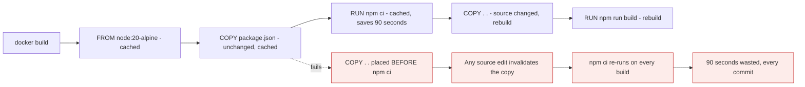

# Dockerfiles

*Module 09 · Core*

The declarative half. A Dockerfile is a text blueprint that Docker executes to build an image - so your
environment becomes reviewable, version controlled and identical every time.

[Course home](../index.md) / Module 09

## 1. Why build your own image at all

Docker Hub already has thousands of images. You build your own because:

| Reason | Detail |
| --- | --- |
| **Exact requirements** | A pre-built image has someone else's library versions and settings, not yours |
| **Smaller and safer** | Include only what your app needs. Less software is less attack surface |
| **Trust** | A random community image may be unmaintained or hostile. Yours is yours |
| **CI/CD** | The pipeline needs a repeatable build step, not a person running commands |
| **Offline** | Build locally without depending on a registry being reachable |
| **Control** | You know exactly what is inside, so you can patch and audit it |

> **NOTE - The file is called `Dockerfile`**
>
> Capital D, no extension, and it is case-sensitive on Linux. `dockerfile` or `DockerFile` will not be found by default.

## 2. A complete, sane example

```dockerfile
# syntax=docker/dockerfile:1

# ---- build stage: has compilers, never ships ----
FROM node:20-alpine AS build
WORKDIR /src
COPY package*.json ./
RUN npm ci                       # cached unless package files change
COPY . .
RUN npm run build

# ---- runtime stage: minimal, this is what ships ----
FROM node:20-alpine
ENV NODE_ENV=production
WORKDIR /app

RUN addgroup -S app && adduser -S -G app app     # never run as root

COPY --from=build /src/dist ./dist
COPY --from=build /src/node_modules ./node_modules

USER app
EXPOSE 3000
HEALTHCHECK --interval=30s --timeout=3s --retries=3 \
  CMD wget -qO- http://localhost:3000/health || exit 1
CMD ["node", "dist/server.js"]
```

## 3. The instructions

| Instruction | Does | Notes |
| --- | --- | --- |
| `FROM` | Base image | **Pin the version.** `FROM ubuntu` is a future outage |
| `WORKDIR` | Sets and creates the working directory | Use instead of `RUN cd`, which does not persist |
| `COPY` | Copies files from build context into the image | Prefer over `ADD` |
| `ADD` | Copy, plus auto-extract archives and fetch URLs | Avoid - the magic surprises people |
| `RUN` | Executes a command at **build** time, creates a layer | Chain related commands with `&&` |
| `ENV` | Environment variable, present at build and run time | Never put secrets here |
| `ARG` | Build-time only variable | Not in the final image's environment, but visible in build history |
| `EXPOSE` | Documents a port | **Publishes nothing** - you still need `-p` |
| `USER` | Switches user for later instructions and runtime | Set it. Root by default is the wrong default |
| `VOLUME` | Declares a mount point | Usually better specified at run time |
| `HEALTHCHECK` | How the platform tests liveness | Orchestrators use this to restart or drain |
| `ENTRYPOINT` | The executable that always runs | Makes the image behave like a binary |
| `CMD` | Default command, or default arguments to ENTRYPOINT | Overridden by anything you pass to `docker run` |

### ENTRYPOINT vs CMD

| Setup | `docker run img` | `docker run img foo` |
| --- | --- | --- |
| `CMD ["app"]` | runs `app` | runs `foo` - CMD fully replaced |
| `ENTRYPOINT ["app"]` | runs `app` | runs `app foo` - argument appended |
| `ENTRYPOINT ["app"]` + `CMD ["--port=80"]` | runs `app --port=80` | runs `app foo` |

Use `ENTRYPOINT` for the program and `CMD` for its default arguments.

> **WARNING - Always use exec form, not shell form**
>
> `CMD ["node", "server.js"]` (exec form) makes your app PID 1, so it receives SIGTERM and can shut down cleanly. `CMD node server.js` (shell form) wraps it in `/bin/sh -c`, which becomes PID 1, does not forward signals, and gets your app SIGKILLed on every deploy.

## 4. Build and the cache

```bash
docker build -t myapp:1.0 .
docker build -t myapp:1.0 -f docker/Dockerfile.prod .
docker build --no-cache -t myapp:1.0 .
docker build --build-arg VERSION=1.4 -t myapp:1.4 .
```

The trailing `.` is the **build context** - the directory sent to the daemon. Everything in it is
uploaded, which is why `.dockerignore` matters.

Each instruction is cached. On rebuild, Docker reuses layers until it finds one whose inputs changed -
and **everything after that point is rebuilt.** That single rule dictates instruction order.



> **Why it matters:** Copy dependency manifests and install dependencies **before** copying your source. Dependencies change rarely, source changes constantly. Get this one line order right and your CI builds go from minutes to seconds.

## 5. Multi-stage builds

The single biggest image-size win available.

```dockerfile
FROM golang:1.22 AS build          # ~800 MB with the toolchain
WORKDIR /src
COPY . .
RUN CGO_ENABLED=0 go build -o /app ./cmd/server

FROM scratch                        # 0 bytes
COPY --from=build /app /app
USER 65534:65534
ENTRYPOINT ["/app"]
```

Final image: about 8 MB. The compiler, the source code and the module cache never reach production - so
they cannot be exploited and do not cost pull time.

| Base | Typical final size | Trade-off |
| --- | --- | --- |
| `ubuntu:22.04` | ~180 MB + app | Familiar, full toolset, largest |
| `debian:12-slim` | ~80 MB + app | Good middle ground |
| `*-alpine` | ~15 MB + app | musl libc - occasional compatibility issues |
| `gcr.io/distroless/*` | ~25 MB + app | No shell, no package manager - very hard to attack, hard to debug |
| `scratch` | Your binary only | Static binaries only |

## 6. `.dockerignore`

```text
.git
node_modules
*.log
.env
.env.*
secrets/
dist/
Dockerfile
docker-compose.yml
**/__pycache__
.venv
```

Two reasons: builds are faster because less is uploaded, and secrets do not accidentally end up in a
layer. This file takes two minutes to write and prevents a whole category of incident.

## 7. Security checklist for every Dockerfile

| Rule | Why |
| --- | --- |
| Pin the base image tag, ideally a digest | Reproducible, and immune to a moving `latest` |
| `USER` a non-root account | Root in a container is one kernel bug from root on the host |
| No secrets in `ENV`, `ARG` or `COPY` | They persist in layers and in build history forever |
| Use build secrets: `RUN --mount=type=secret,...` | Never written into a layer |
| Clean caches in the same `RUN` | `apt-get ... && rm -rf /var/lib/apt/lists/*` |
| Minimal base | Fewer packages, fewer CVEs |
| Scan the result | `docker scout cves myapp:1.0` or Trivy, in CI |
| Add `HEALTHCHECK` | Lets the platform detect a hung process |

> **WARNING - Two `RUN`s do not clean anything**
>
> ```dockerfile
> RUN apt-get update && apt-get install -y curl
> RUN rm -rf /var/lib/apt/lists/*        # too late - the cache is already in the previous layer
> ```
> Combine them into one `RUN`, or the bytes ship anyway.

## 8. Extra points

- **BuildKit is the default modern builder** - parallel stages, build secrets, cache mounts
  (`RUN --mount=type=cache,target=/root/.npm npm ci`), and much faster builds.
- **`buildx` builds multi-architecture images** so one tag serves `amd64` and `arm64`.
- **Label your images.** `LABEL org.opencontainers.image.source=...` links the image back to its repo -
  invaluable when someone asks "where did this come from" during an incident.
- **Order instructions by change frequency**: base, system packages, dependency manifests, dependency
  install, source, build.
- **A Dockerfile is code.** Review it, lint it (hadolint), and keep it in the same repo as the app.
- **Do not install `curl`, `vim` and `netcat` "for debugging"** in a production image. Debug with a
  sidecar or an ephemeral debug container instead.

> **PRACTICE - Practice now**
>
> 1. Write a Dockerfile for any small app you have. Build it and record the size.
> 2. Deliberately put `COPY . .` before the dependency install. Time two builds with a one-character source change.
> 3. Fix the order and time it again. That difference is your CI bill.
> 4. Convert it to a multi-stage build. Compare sizes.
> 5. Switch the base to Alpine or slim. Compare again.
> 6. Add a non-root `USER` and confirm with `docker exec ... whoami`.
> 7. Add a `.dockerignore` and watch the "Sending build context" size drop.
> 8. Run `docker history` on your final image and justify every layer over 10 MB.

> **ASSIGNMENT - Assignment**
>
> Take a real service and produce a production-grade Dockerfile: multi-stage, pinned base, non-root user, `.dockerignore`, `HEALTHCHECK`, exec-form `ENTRYPOINT`, and no secrets anywhere. Record before/after image size, build time on a code-only change, and CVE count from a scanner. Those three numbers are the strongest evidence you can bring to a review.

## 9. Interview drill

<details>
<summary><b>How does the Docker build cache work, and how do you exploit it?</b></summary>

Each instruction produces a layer keyed on its inputs. On rebuild Docker reuses layers until one changes,
then rebuilds everything after it. So order instructions from least to most frequently changing: base,
system packages, dependency manifests, dependency install, then source. Copying source before installing
dependencies destroys the cache on every commit.

</details>

<details>
<summary><b>ENTRYPOINT versus CMD?</b></summary>

`ENTRYPOINT` defines the executable that always runs; `CMD` provides default arguments, or a default
command if there is no ENTRYPOINT. Anything passed to `docker run` replaces CMD but is appended to
ENTRYPOINT. Use ENTRYPOINT for the program, CMD for its defaults.

</details>

<details>
<summary><b>What is a multi-stage build and why does it matter?</b></summary>

Multiple `FROM` stages in one Dockerfile, where the final stage copies only the built artefacts from
earlier stages. Compilers, dev dependencies and source never reach the shipped image, which cuts size
dramatically and removes attack surface. A Go service can go from ~800 MB to ~8 MB.

</details>

<details>
<summary><b>Why should a container not run as root?</b></summary>

Because the kernel is shared. Root inside the container plus a kernel or misconfiguration flaw is a much
shorter path to root on the host, and any bind-mounted host path is writable as root. Create a user in the
Dockerfile and set `USER`.

</details>

<details>
<summary><b>Shell form versus exec form for CMD - does it matter?</b></summary>

Yes. Shell form runs your command under `/bin/sh -c`, so the shell is PID 1 and does not forward signals;
your app never sees SIGTERM and gets SIGKILLed after the stop grace period. Exec form makes your process
PID 1 so it can shut down cleanly.

</details>

---

[← Module 08](08-first-container.md) &nbsp;&nbsp;|&nbsp;&nbsp; [Module 10: Registries →](10-registries.md)

---

Docker: Zero to Architect · Himanshu Kumar.
