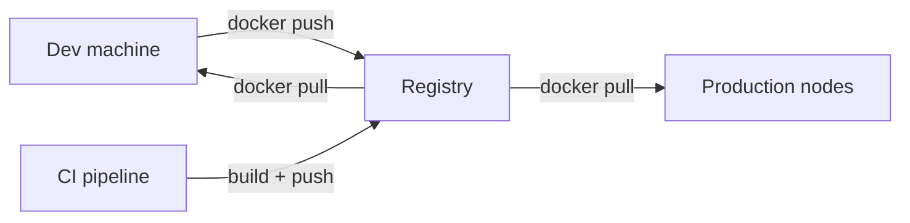
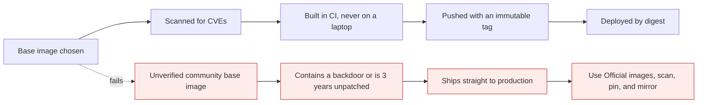

# Registries

*Module 10 · Core*

An image on your laptop helps nobody. A registry is how it reaches your teammates, your pipeline and
your production nodes - and it is the part of the supply chain attackers care about most.

[Course home](../index.md) / Module 10

## 1. Push and pull

| Direction | Command | Meaning |
| --- | --- | --- |
| **Pull** | `docker pull nginx:1.25` | Registry → your Docker host (download) |
| **Push** | `docker push myorg/myapp:1.4.2` | Your Docker host → registry (upload) |



> **Why it matters:** The registry is the single point every environment trusts. Whoever can push to it can change what production runs - which is why push permissions matter more than most people assume.

## 2. Why you push at all

| Reason | Detail |
| --- | --- |
| **Sharing** | One place everyone pulls from, instead of emailing tar files |
| **Distribution** | Fifty nodes pull the same image; you built it once |
| **Versioning** | Tags give you history and a rollback target |
| **Durability** | Your laptop dying should not lose the artefact |
| **CI/CD** | The pipeline builds and pushes; the deployment pulls. The registry is the handoff |

## 3. The registry landscape

| Registry | Type | Notes |
| --- | --- | --- |
| **Docker Hub** public | Public | Default. Official Images and Verified Publishers are curated; everything else is not. Anonymous pulls are rate limited |
| **Docker Hub** private repos | Private | Paid tiers, account or organisation scoped |
| **Amazon ECR** | Cloud private | IAM permissions, integrates with ECS/EKS |
| **Azure Container Registry** | Cloud private | Entra ID, integrates with AKS |
| **Google Artifact Registry** | Cloud private | IAM, integrates with GKE |
| **GitHub Container Registry** (`ghcr.io`) | Public or private | Tied to your repo permissions - excellent for open source |
| **Harbor / Nexus / GitLab** | Self-hosted | Full control, air-gap capable, and yours to operate |

> **WARNING - Docker Hub rate limits**
>
> Anonymous pulls are limited per IP. A CI fleet behind one NAT gateway hits the ceiling fast, and builds start failing with `toomanyrequests` for no apparent reason. Authenticate in CI, or mirror the images you depend on into your own registry.

## 4. Pushing, step by step

```bash
# 1. authenticate
docker login                                 # Docker Hub
docker login ghcr.io -u USERNAME             # other registries

# 2. tag with the destination - this is the step people miss
docker tag myapp:1.4.2 myusername/myapp:1.4.2
docker tag myapp:1.4.2 ghcr.io/myorg/myapp:1.4.2

# 3. push
docker push myusername/myapp:1.4.2
```

The image name **is** the destination. `myapp:1.4.2` has no registry or namespace, so it cannot be
pushed anywhere - you must retag it first.

```text
ghcr.io   /   myorg    /   myapp   :  1.4.2
registry      namespace     repo      tag
```

| Error | Meaning |
| --- | --- |
| `denied: requested access to the resource is denied` | Not logged in, or the namespace is not yours |
| `unauthorized: authentication required` | Token expired - `docker login` again |
| `name unknown` | Repository does not exist and auto-creation is off (common on ECR) |
| `manifest unknown` on pull | Wrong tag |

> **TIP - Cloud registries have their own login**
>
> ECR: `aws ecr get-login-password | docker login --username AWS --password-stdin <acct>.dkr.ecr.<region>.amazonaws.com`. ACR: `az acr login --name myregistry`. Artifact Registry: `gcloud auth configure-docker`. Same push afterwards.

## 5. A tagging strategy that survives an incident

| Tag | Mutable | Used by |
| --- | --- | --- |
| `1.4.2` | Never re-pushed | Release references |
| `1.4`, `1` | Moves to newest patch/minor | Convenience for humans |
| `sha-9f2c1ab` | Never | **What deployments actually reference** - traces straight to a commit |
| `latest` | Constantly | Local convenience only |

```bash
docker build -t myapp:sha-$(git rev-parse --short HEAD) .
docker tag myapp:sha-9f2c1ab myorg/myapp:1.4.2
docker tag myapp:sha-9f2c1ab myorg/myapp:latest
docker push --all-tags myorg/myapp
```

> **WARNING - Never re-push a released tag**
>
> If `1.4.2` can change, "which version is in production" has no answer and rollback is a guess. Treat release tags as immutable and enable tag immutability in the registry if it supports it.

## 6. Supply chain security



| Control | Practice |
| --- | --- |
| **Trusted bases** | Official Images or Verified Publishers only. Mirror them into your own registry |
| **Scanning** | `docker scout cves`, Trivy or Grype - in CI, failing the build above a severity threshold |
| **Immutable references** | Deploy by digest (`@sha256:...`) in regulated environments |
| **Signing** | Cosign / Notation, so nodes can verify an image really came from your pipeline |
| **SBOM** | Generate a bill of materials per image so you can answer "are we affected by CVE-X" in minutes |
| **Least privilege** | Humans get pull; only CI gets push to release namespaces |
| **Retention** | Registries grow forever. Expire untagged and old dev images automatically |

> **TIP - The question you will be asked during the next big CVE**
>
> "Which of our images contain this package?" With an SBOM per image and a scanner in CI, that is a query. Without it, it is a week of archaeology.

## 7. Air-gapped and offline

```bash
docker save myapp:1.4.2 -o myapp-1.4.2.tar     # export image + layers
docker load -i myapp-1.4.2.tar                 # import on the other side
```

Distinct from `docker export`/`import`, which handle a container's filesystem and lose layers, history and
metadata. For moving images, always use `save`/`load`.

## 8. Extra points

- **Private does not mean secure.** Access control, scanning, signing and retention still apply.
- **Layer sharing works across images in a registry too** - a push of a rebuilt app usually uploads only
  the changed layers.
- **Pull-through cache mirrors** cut both cost and rate-limit pain for a CI fleet.
- **Never bake registry credentials into an image.** Use the runtime's credential helper or the
  platform's identity (IAM role, workload identity).
- **`docker logout` on shared machines.** Credentials sit in `~/.docker/config.json`, frequently
  base64-encoded rather than encrypted.
- **Registry storage costs real money** at scale. Untagged layers from CI accumulate silently.

> **PRACTICE - Practice now**
>
> 1. Create a Docker Hub account and `docker login`.
> 2. Build a small image, tag it `yourname/demo:1.0.0`, and push it.
> 3. Delete it locally with `docker rmi`, then `docker pull` it back.
> 4. Push a second tag from the same image and confirm the registry does not re-upload the layers.
> 5. Do the same against `ghcr.io` and note the different authentication.
> 6. Run a vulnerability scan on your image and read the top five findings.
> 7. `docker save` an image, copy the tar somewhere else, `docker load` it, and run it.

> **ASSIGNMENT - Assignment**
>
> Write your team's image supply-chain policy in one page: approved base images and who approves them, the registry per environment, the tagging scheme, who may push where, the scanning gate and its failure threshold, retention rules, and the incident procedure for a compromised image. Then trace one real image through it and mark where it currently violates the policy. That gap list is the actual deliverable.

## 9. Interview drill

<details>
<summary><b>Walk me through pushing an image to a private registry.</b></summary>

Authenticate with `docker login` against the registry, tag the local image with the full destination name
(`registry/namespace/repo:tag`), then `docker push` that name. The tag *is* the destination, so an
untagged local name cannot be pushed. Cloud registries use their own credential helpers - ECR via
`get-login-password`, ACR via `az acr login`, Artifact Registry via `gcloud auth configure-docker`.

</details>

<details>
<summary><b>Your CI starts failing with `toomanyrequests`. Diagnosis?</b></summary>

Docker Hub anonymous pull rate limiting, applied per IP - so an entire CI fleet behind one NAT shares the
quota. Fix by authenticating in CI, and better still by mirroring the base images you depend on into your
own registry or a pull-through cache.

</details>

<details>
<summary><b>How do you make deployments reproducible?</b></summary>

Reference images by digest rather than tag. Tags are mutable pointers; digests are content hashes. Combine
with immutable release tags, signing so nodes can verify provenance, and an SBOM per image so you can
answer vulnerability questions later.

</details>

<details>
<summary><b>How do you get images into an air-gapped environment?</b></summary>

`docker save` produces a tar containing the image and its layers; transfer it through the approved
channel and `docker load` it on the other side. In practice you run an internal registry inside the
enclave and load images into that once, rather than onto every host.

</details>

<details>
<summary><b>What are the risks of using a community image from Docker Hub?</b></summary>

Anyone can publish. The image may be unmaintained, carry known CVEs, or contain deliberately malicious
code, and it can change under a moving tag. Mitigate by preferring Official and Verified Publisher
images, pinning digests, scanning in CI, and mirroring approved bases into your own registry.

</details>

---

[← Module 09](09-dockerfile.md) &nbsp;&nbsp;|&nbsp;&nbsp; [Module 11: Storage and networking →](11-storage-networking.md)

---

Docker: Zero to Architect · Himanshu Kumar.
