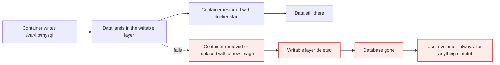
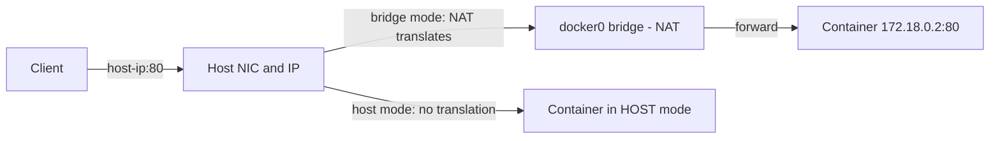
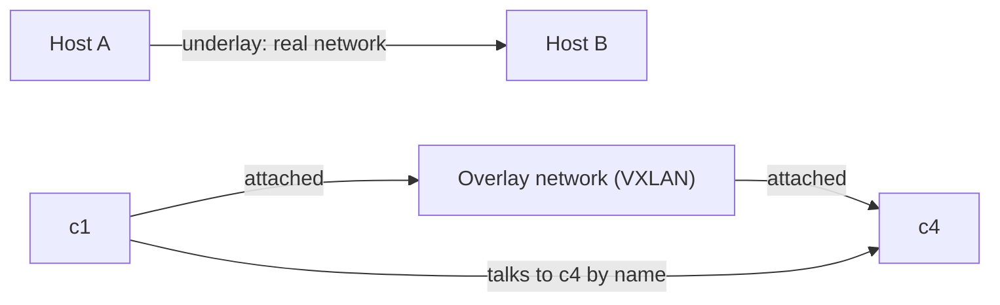

# Storage and networking

*Module 11 · Core*

The two subjects that cause the most production incidents: where data actually lives, and how containers
reach each other and the outside world.

[Course home](../index.md) / Module 11

## 1. The writable layer is not storage

Every container gets a thin writable layer on top of the image (module 02). It is fast, it is convenient,
and it is **destroyed with the container**.



> **Why it matters:** `docker stop` and `docker start` keep the writable layer. `docker rm` - and every deployment that replaces a container with a new image - destroys it. If your data is not in a volume, upgrading your app deletes your database.

## 2. Three ways to persist

| | Volume | Bind mount | tmpfs |
| --- | --- | --- | --- |
| Stored | Docker-managed area on the host | A path you choose on the host | Host RAM |
| Created by | `docker volume create` or automatically | You, by path | `--tmpfs` |
| Portable | Yes | No - depends on host layout | n/a |
| Permissions | Docker handles them | Host UID/GID must match | n/a |
| Backup | `docker volume` tooling, drivers | Ordinary filesystem tools | Not persisted |
| Use for | **Databases, uploads, anything stateful** | Source code in development, config files | Secrets and scratch space |

```bash
# volume (preferred)
docker volume create pgdata
docker run -d --name db -v pgdata:/var/lib/postgresql/data postgres:16

# bind mount (development)
docker run -d --name web -v "$(pwd)/src:/app/src" -p 3000:3000 myapp:dev

# tmpfs (never written to disk)
docker run --tmpfs /run/secrets:rw,size=1m myapp:1.0

docker volume ls
docker volume inspect pgdata
docker volume rm pgdata          # destroys the data
```

> **WARNING - `docker system prune --volumes` deletes data**
>
> It removes volumes not currently attached to a container. A stopped database whose container you removed has an unattached volume - and it will go. Back up before you prune, and never run it casually on a shared host.

Backing up a volume:

```bash
docker run --rm -v pgdata:/data -v "$(pwd)":/backup alpine \
  tar czf /backup/pgdata-$(date +%F).tar.gz -C /data .
```

> **TIP - Bind mounts and permissions on Linux**
>
> The container writes as its own UID. If that UID does not match the host directory's owner, you get permission errors - or files owned by a strange UID on your host. Match with `--user "$(id -u):$(id -g)"`, or set ownership deliberately in the Dockerfile.

## 3. Networking: the default and why you should not use it

| Network driver | What it does | Use for |
| --- | --- | --- |
| `bridge` (default) | Private network on the host, NAT to the outside | The default when you specify nothing |
| **user-defined bridge** | Same, plus **automatic DNS between containers** | **Everything multi-container** |
| `host` | No isolation - container uses the host's network stack directly | Rare: extreme performance needs, some monitoring agents |
| `none` | No networking at all | Batch jobs that must not reach the network |
| `overlay` | Spans multiple hosts | Swarm / multi-host clusters |
| `macvlan` | Container gets a real MAC and IP on your LAN | Legacy integrations expecting a physical host |
| **plugins** | Third-party drivers - Weave, Calico, Cisco ACI | Inheriting an existing enterprise network model |

```bash
docker network create appnet

docker run -d --name db  --network appnet -v pgdata:/var/lib/postgresql/data postgres:16
docker run -d --name api --network appnet -e DB_HOST=db -p 8080:8080 myapi:1.0
```

The API reaches the database at hostname **`db`** - Docker's embedded DNS resolves container names on a
user-defined network. No IP addresses, no `--link`, no configuration.

> **WARNING - The default bridge has no DNS**
>
> On the default `bridge` network, containers can reach each other by IP but **not by name**. IPs change on restart. Always create a user-defined network - it is one command and removes an entire class of "worked yesterday" failures.

## 4. Default bridge vs user-defined bridge, hands on

Every Docker host starts with one network per driver:

```bash
docker network ls                  # bridge, host, none
docker network inspect bridge      # subnet, gateway, and which containers are attached
```

The default bridge hands out addresses from a private range - typically `172.17.0.0/16`, so containers
get `172.17.0.2`, `172.17.0.3` and so on. Attach three containers and `docker network inspect bridge`
lists all three with their addresses.

### Create your own

```bash
docker network create -d bridge ud1                        # Docker picks the subnet
docker network create -d bridge --subnet 192.168.10.0/24 ud2   # you pick it

docker network ls
docker network inspect ud1        # e.g. 172.18.0.0/16, gateway 172.18.0.1
docker network inspect ud2        # 192.168.10.0/24, gateway 192.168.10.1
```

`-d bridge` (or `--driver bridge`) is the driver. Without `--subnet`, Docker allocates the next free
private range itself.

### Move a running container between networks

You do not have to recreate a container to change its networking.

```bash
docker network disconnect bridge c1     # detach from the default bridge
docker network connect ud1 c1           # attach to your own network
docker network inspect bridge           # c1 is gone; c2 and c3 remain
docker network inspect ud1              # c1 is here now
docker inspect -f '{{json .NetworkSettings.Networks}}' c1   # from the container's side
```

A container can be attached to **several** networks at once - which is exactly how you put an API on both
a `frontend` and a `backend` network while keeping the database on `backend` only.

### Why user-defined always wins

| Capability | Default bridge | User-defined bridge |
| --- | --- | --- |
| Containers reach each other by **name** (embedded DNS) | No - IP only | **Yes** |
| Isolation from unrelated containers | All share one flat network | Each network is separate |
| Attach/detach while running | Limited | **Yes**, on the fly |
| Choose your own subnet | No | **Yes**, `--subnet` |
| Configurable per network | No | Yes |
| Legacy `--link` / shared environment variables | That is its mechanism | Not needed - DNS replaces it |

> **TIP - Ubuntu images have no networking tools**
>
> `ping`, `ifconfig` and `ip` are not in the official `ubuntu` image, so your first network test fails with `command not found` rather than a real error. Rather than installing them by hand in every container, build one small debug image and reuse it:
>
> ```dockerfile
> FROM ubuntu:22.04
> RUN apt update && apt install -y iproute2 iputils-ping net-tools dnsutils curl
> CMD ["sleep", "infinity"]
> ```
> ```bash
> docker build -t nettools .
> docker run -dit --name c1 --network ud1 nettools
> docker exec -it c1 ping c2        # name resolution, on a user-defined network
> ```
> Keep that image around - it is the fastest way to diagnose any container networking question.

## 5. Publishing ports

```bash
docker run -p 8080:80 nginx              # host 8080 -> container 80, on ALL host interfaces
docker run -p 127.0.0.1:5432:5432 postgres   # localhost only - not reachable from outside
docker run -P nginx                      # publish EXPOSEd ports to random high ports
```

Read `-p` left to right: **host:container**.

| Situation | What to publish |
| --- | --- |
| Public web app | `-p 80:8080` on the host, behind a reverse proxy or load balancer |
| Database used only by other containers | **Nothing.** Put it on the shared network and do not publish |
| Database you need locally for tooling | `-p 127.0.0.1:5432:5432` |
| Admin interface | Never `0.0.0.0` on an internet-facing host |

> **WARNING - Published ports can bypass your firewall**
>
> On Linux, Docker writes its own iptables rules. A published port can therefore be reachable from the internet even though your host firewall appears to block it. Bind to `127.0.0.1` for anything that should not be public, and verify from outside the host rather than trusting the firewall config.

## 6. The other drivers: host, none, overlay, macvlan

### Host mode - no network namespace at all

```bash
docker run -it --name c1 --network host my-web-server /bin/bash
```

The container **shares the host's network namespace**. It does not get its own IP, its own interfaces or
its own routing table - it uses the host's. Inside the container, `ip addr` shows the host's addresses.



> **Why it matters:** In bridge mode a request to `host-ip:8080` is translated by Docker's NAT rules to `container-ip:80` and back again for the reply. In host mode that entire layer is removed - the container binds directly to the host's interface, so its "container IP" *is* the host IP.

| | Bridge | Host |
| --- | --- | --- |
| Container IP | Its own, e.g. `172.18.0.2` | **The host's IP** |
| NAT / port translation | Yes | **None** |
| `-p 8080:80` | Required to expose anything | **Ignored** - the app is already on the host's ports |
| Port conflicts | Only on the host side | Two containers cannot both bind port 80 |
| Isolation | Own network namespace | **No network isolation from the host** |
| Performance | NAT adds a small overhead | Slightly faster, no translation |
| Availability | Everywhere | **Linux only** - on Docker Desktop for Mac/Windows the "host" is the hidden Linux VM, not your machine |

Use it for: high-throughput or latency-sensitive network workloads, monitoring and network agents that
must see the host's real interfaces, and services that need a large or dynamic port range.

> **WARNING - Host mode gives up a security boundary**
>
> The container can bind any host port, see all host interfaces, and reach anything the host can reach - including services you thought were bound to localhost only. Treat `--network host` like `--privileged`: allowed when there is a specific technical reason, never as a shortcut to "make networking work".

### None mode - no networking at all

```bash
docker run --network none alpine ip addr        # loopback only, nothing else
```

The container gets a network namespace containing nothing but `lo`. It cannot reach the network and the
network cannot reach it.

| Real use case | Why `none` is the right answer |
| --- | --- |
| **Malware and untrusted binary analysis** | Detonate a sample with no route out. It cannot call home, scan your LAN, or infect other containers |
| **Extremely confidential data processing** | Mount the data, process it, write the result to a volume - with no network path for it to leave by |
| **Pure compute batch jobs** | Transcoding, rendering, calculations that only need mounted files |
| **Proving a dependency** | Run a service with `none` and watch what breaks - an excellent way to discover undocumented outbound calls |

> **NOTE - Not available for Swarm services**
>
> `none` works for standalone containers. Swarm services need to be reachable on the service network, so the driver is not offered there.

### Overlay - containers across multiple hosts

Bridge and host are **single-host** drivers. In production you run several Docker hosts, because one
host is a single point of failure. So how does `c1` on host A talk to `c4` on host B?



> **Why it matters:** The overlay network sits **on top of** the hosts' real network. Containers on different machines behave as though they share one flat LAN, and Docker transparently routes each packet to the right daemon host and the right destination container. Your application never learns that the two containers are on different machines.

| Concern | Detail |
| --- | --- |
| How it works | Packets are encapsulated (VXLAN) and carried over the hosts' existing network - the "underlay" |
| What it needs | A **control plane**: Docker Swarm mode, or an external key-value store on the classic setup. A plain standalone Docker host cannot create a usable overlay on its own |
| Setup | `docker swarm init` on the first host, `docker swarm join` on the others, then `docker network create -d overlay appnet` |
| Ports to open | The cluster's control and data ports between hosts - overlays fail silently when a firewall blocks them |
| Encryption | Off by default; `--opt encrypted` turns on encryption of the data plane, at a performance cost |
| Overhead | Encapsulation costs some throughput and adds MTU considerations |

```bash
docker swarm init                                  # host A becomes a manager
docker swarm join --token <token> <manager-ip>     # host B joins
docker network create -d overlay --attachable appnet
docker service create --name api --network appnet myapi:1.0
```

> **TIP - In 2026 most teams meet overlay through Kubernetes, not Swarm**
>
> Kubernetes solves the same problem with a CNI plugin - Calico, Cilium, Flannel - and the same underlying idea: an address space that spans nodes, with the platform routing packets to the right one. Understanding overlay here means Kubernetes networking is a vocabulary change rather than a new concept.

### macvlan - the container becomes a machine on your LAN

Macvlan gives each container its **own MAC address and an IP from your physical subnet**, attached
straight to the host's NIC. The host's networking layer is bypassed entirely - no bridge, no NAT, no port
publishing.

```text
                 ┌──────────────── physical switch ────────────────┐
                 │            │              │             │       │
        ┌────────┴───┐  ┌─────┴──────┐  ┌────┴─────┐  ┌────┴────────┐
        │ Docker     │  │ Docker     │  │ External │  │  Internet   │
        │ host 1     │  │ host 2     │  │   PC     │  │   router    │
        │ .1.10      │  │ .1.11      │  │  .1.50   │  │   .1.1      │
        │            │  │            │  └──────────┘  └─────────────┘
        │ c1  .1.2   │  │ c4  .1.5   │
        │ c2  .1.3   │  │ c5  .1.6   │   <- containers hold IPs from the SAME
        │ c3  .1.4   │  │ c6  .1.7   │      192.168.1.0/24 physical subnet
        └────────────┘  └────────────┘
```

From the external PC, `ping 192.168.1.2` reaches container `c1` directly. Not the host - the container.
The rest of your network genuinely cannot tell it apart from a physical machine.

| Consequence | Detail |
| --- | --- |
| Own MAC and IP | The container appears as an independent device; your DHCP server and switches see it as one |
| **No NAT** | Removing the translation layer can reduce latency versus bridge |
| **No `-p`, no `EXPOSE`** | Every port the container listens on is reachable from the LAN immediately |
| Cross-host is trivial | `c1` on host 1 talks to `c4` on host 2 over the ordinary network - no overlay needed |
| Host cannot reach its own containers | By design, the parent interface cannot talk to its macvlan children without an extra sub-interface |
| Platform support | Linux only - **not supported on Docker Desktop for Windows or macOS** |
| Network prerequisites | The NIC usually needs promiscuous mode, which many cloud providers and corporate switches forbid |

```bash
docker network create -d macvlan \
  --subnet 192.168.1.0/24 \
  --gateway 192.168.1.1 \
  -o parent=eth0 \
  pub_net

docker run -dit --name c1 --network pub_net --ip 192.168.1.2 nettools
```

> **WARNING - macvlan is a legacy answer, and a security decision**
>
> With bridge you publish *specific* ports, so the exposed surface is deliberate and small. With macvlan **every listening port is on the LAN the moment the container starts** - and if the subnet is publicly routable, on the internet. That is why real-world deployments overwhelmingly use bridge with published ports, and macvlan is reserved for legacy applications, appliances, or monitoring tools that must appear as physical hosts.

### Cleaning up networks

```bash
docker network rm ud1 ud2          # remove specific networks
docker network prune               # remove every network no container is using
```

Built-in networks (`bridge`, `host`, `none`) cannot be removed, and a network in use by a running
container will refuse to be deleted until you disconnect or stop it.

### Network plugins - extending the drivers

Docker's driver set is not the limit. **Network plugins** let you attach Docker to networking systems it
does not implement itself, from Docker Hub or from third-party vendors.

| Example | What it adds |
| --- | --- |
| Weave Net | Encrypted mesh networking across hosts, without Swarm |
| Calico | Policy-driven networking with real network policy enforcement |
| Cilium | eBPF-based networking and observability |
| **Cisco ACI** | Ties Docker hosts into Application Centric Infrastructure, so containers, VMs and physical devices are all managed from one network fabric and policy model |

> **TIP - Why an enterprise reaches for a plugin**
>
> A large organisation already has a network policy model - Cisco ACI, NSX, or similar. A plugin lets containers inherit that model rather than becoming an island the network team cannot see or govern. That is almost always the driver: not a missing feature, but a governance boundary. In Kubernetes the same role is played by CNI plugins.

### Choosing

| Requirement | Driver |
| --- | --- |
| Normal multi-container app on one host | **User-defined bridge** |
| Maximum network performance, or an agent that must see host interfaces | `host` |
| No network access at all - malware sandbox, confidential processing | `none` |
| Containers on different hosts must talk | `overlay` (Swarm) - or move to Kubernetes |
| Container must look like a physical machine on the LAN | `macvlan` (legacy) |
| Must inherit the enterprise network policy model | A vendor **plugin** |

## 7. Putting it together

```bash
docker network create appnet
docker volume create pgdata

docker run -d --name db --network appnet \
  -v pgdata:/var/lib/postgresql/data \
  -e POSTGRES_PASSWORD_FILE=/run/secrets/pw \
  --restart unless-stopped postgres:16

docker run -d --name api --network appnet \
  -e DB_HOST=db -e DB_PORT=5432 \
  -p 127.0.0.1:8080:8080 \
  -m 512m --cpus 1 \
  --restart unless-stopped myapi:1.4.2
```

Note what this gets right: named volume for state, user-defined network for DNS, database not published,
API bound to localhost, resource limits set, restart policy set. That is the shape of a correct
single-host deployment - and module 12 turns it into one file.

## 8. Diagnosing

```bash
docker network ls
docker network inspect appnet             # which containers, which IPs
docker inspect -f '{{json .NetworkSettings.Networks}}' api

docker exec -it api sh -c "getent hosts db"        # does DNS resolve?
docker exec -it api sh -c "nc -zv db 5432"         # is the port reachable?
docker port api                                    # what is actually published
docker exec -it api sh -c "df -h"                  # is the volume mounted where you think?
```

| Symptom | Usual cause |
| --- | --- |
| `connection refused` between containers | Not on the same user-defined network, or the service is not listening yet |
| Name does not resolve | Using the default bridge, or a typo in `--name` |
| Works from host, not from another container | You used `localhost` inside a container - that means *that container*, not the host |
| Data disappeared after deploy | It was in the writable layer, not a volume |
| `port is already allocated` | Another process or container holds the host port |
| Permission denied on a bind mount | UID mismatch between container user and host directory |

> **TIP - `localhost` inside a container means the container**
>
> Each container has its own network namespace. To reach the host from inside a container, use `host.docker.internal` on Docker Desktop, or the gateway IP / `--add-host` on Linux. To reach another container, use its name on a shared network.

## 9. Extra points

- **Volumes are the only supported way to run stateful workloads on a single host.** Anything
  multi-host needs a networked filesystem or a managed database.
- **Named volumes beat anonymous ones.** Anonymous volumes accumulate as untraceable IDs and are exactly
  what `prune` removes by surprise.
- **Read-only root filesystem** is a strong hardening step: `--read-only` plus a `tmpfs` for scratch.
  If an attacker cannot write, most exploits become far harder.
- **Do not put secrets in `-e`.** They are visible in `docker inspect`, in `ps` output and in shell
  history. Use file-based secrets, `tmpfs`, or the platform's secret manager.
- **Network segmentation works here too.** Frontend and backend networks with the database only on the
  backend is the same defence-in-depth you would apply anywhere.
- **In Kubernetes these concepts map directly** - volumes to PersistentVolumeClaims, user-defined
  networks to Services and DNS. Learning them properly here pays off twice.

> **PRACTICE - Practice now**
>
> 1. Run Postgres **without** a volume, create a table, `docker rm -f` it, run it again - the table is gone.
> 2. Repeat with `-v pgdata:/var/lib/postgresql/data` and confirm the table survives.
> 3. Run two containers on the default bridge and try to `ping` by name. It fails.
> 4. Create a user-defined network, attach both, and try again. It works.
> 5. Publish a database with `-p 5432:5432`, then check from another machine whether you can reach it. Then rebind to `127.0.0.1` and re-check.
> 6. Bind mount a source directory, edit a file on the host, and see the change inside the container.
> 7. Back up a volume with the tar one-liner and restore it into a fresh volume.

> **ASSIGNMENT - Assignment**
>
> Deploy a three-container stack imperatively - database, API, reverse proxy - with a named volume, two networks (frontend and backend), the database published to nothing, resource limits and restart policies. Then write the runbook: how to back up the volume, how to restore it, and exactly which command would destroy the data. Test the restore. An untested backup is not a backup.

## 10. Interview drill

<details>
<summary><b>Volume or bind mount?</b></summary>

Volumes for anything stateful in any environment you care about: Docker manages the location and
permissions, they are portable across hosts and backed by tooling. Bind mounts for development, where you
want live host files inside the container, or for injecting a specific host config file - at the cost of
depending on host paths and UID matching.

</details>

<details>
<summary><b>Where does a container's data live if you do not mount anything?</b></summary>

In the container's writable layer, which is part of the container and is deleted when the container is
removed or replaced. Stop and start preserve it; `rm` and any deployment that replaces the container do
not.

</details>

<details>
<summary><b>Two containers cannot talk to each other by name. Why?</b></summary>

They are on the default bridge network, which has no embedded DNS - only IPs work there, and IPs change.
Create a user-defined bridge network and attach both containers; Docker then resolves container names
automatically.

</details>

<details>
<summary><b>Should a database container publish its port?</b></summary>

Not if only other containers use it - put it on a shared user-defined network and publish nothing. If you
need local access for tooling, bind to `127.0.0.1` explicitly. Publishing `0.0.0.0:5432` on an
internet-facing host exposes the database to the internet, and Docker's iptables rules can bypass what
your host firewall appears to allow.

</details>

<details>
<summary><b>An app inside a container cannot reach a service on `localhost`. Why?</b></summary>

Each container has its own network namespace, so `localhost` is the container itself. Use the other
container's name on a shared network, or `host.docker.internal` (Desktop) / the gateway address on Linux
to reach the host.

</details>

<details>
<summary><b>How do you move a running container onto a different network?</b></summary>

`docker network disconnect <network> <container>` then `docker network connect <network> <container>` -
no recreation needed. A container can also be attached to several networks at once, which is how an API
sits on both a frontend and a backend network while the database stays on the backend only. Verify with
`docker network inspect` or `docker inspect` on the container.

</details>

<details>
<summary><b>Can you control the IP range Docker uses?</b></summary>

On a user-defined network, yes: `docker network create -d bridge --subnet 192.168.10.0/24 mynet`. The
default bridge does not let you choose - it allocates from its own range, typically `172.17.0.0/16`. That
is one more reason to create your own networks, especially when Docker's default range collides with your
corporate network.

</details>

<details>
<summary><b>What does `--network host` actually change, and when would you use it?</b></summary>

The container shares the host's network namespace instead of getting its own, so it uses the host's IP,
interfaces and routing table, and there is no NAT or port translation - `-p` is ignored because the app
binds host ports directly. Use it for latency-sensitive or high-throughput networking and for agents that
must observe the host's real interfaces. The cost is a lost isolation boundary and host-wide port
conflicts, and it is a Linux-only driver.

</details>

<details>
<summary><b>How do containers on two different hosts communicate?</b></summary>

With an overlay network. It encapsulates traffic (VXLAN) over the hosts' existing network, so containers
attached to it behave as if they share one flat LAN while Docker routes each packet to the correct daemon
host and container. It needs a control plane - Swarm mode or an external key-value store - the right ports
open between hosts, and optional data-plane encryption. Kubernetes solves the same problem with a CNI
plugin.

</details>

<details>
<summary><b>What is macvlan, and why is it rarely the right choice?</b></summary>

It gives the container its own MAC address and an IP from the physical subnet, attached directly to the
host NIC - so the LAN sees it as a separate machine, with no NAT and no port publishing. That last part is
the problem: every listening port is exposed to the network the moment the container starts, whereas
bridge exposes only the ports you publish. It also needs promiscuous mode, is Linux-only, and the host
cannot reach its own macvlan containers without extra configuration. Reserve it for legacy systems and
appliances that must appear as physical hosts.

</details>

<details>
<summary><b>Give a genuine use case for `--network none`.</b></summary>

Malware or untrusted binary analysis - the sample runs with no route out, so it cannot call home, scan the
LAN or reach other containers. Also processing highly confidential data with no network path for it to
leave by, and pure compute batch jobs. It is a real security control, and it is not available for Swarm
services.

</details>

<details>
<summary><b>Why would an enterprise install a Docker network plugin?</b></summary>

To make containers obey the network model the organisation already has. A plugin such as Cisco ACI, Weave
or Calico lets containers, VMs and physical devices be governed from one fabric and one policy model,
rather than containers becoming an island the network team cannot see or control. The equivalent in
Kubernetes is the CNI plugin.

</details>

---

[← Module 10](10-registries.md) &nbsp;&nbsp;|&nbsp;&nbsp; [Module 12: Docker Compose →](12-compose.md)

---

Docker: Zero to Architect · Himanshu Kumar.
