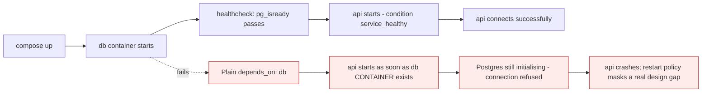

# Docker Compose

*Module 12 · Core*

Everything you typed by hand in module 11, in one file that lives in your repository. This is where
Docker becomes a team tool rather than a personal one.

[Course home](../index.md) / Module 12

## 1. The problem it solves

The stack from module 11 was three long commands with networks and volumes created separately. Nobody
remembers them, they are not reviewed, and they drift between machines. Compose turns the whole stack
into one declarative file.

```bash
docker compose up -d      # create networks, volumes, and every service
docker compose down       # remove containers and networks (volumes survive by default)
```

> **NOTE - `docker compose` with a space**
>
> Compose v2 is a CLI plugin, invoked as `docker compose`. The old `docker-compose` with a hyphen is the legacy Python v1 - end of life. Use v2.

## 2. A real file

```yaml
services:
  db:
    image: postgres:16
    restart: unless-stopped
    environment:
      POSTGRES_DB: app
      POSTGRES_USER: app
      POSTGRES_PASSWORD_FILE: /run/secrets/db_password
    secrets:
      - db_password
    volumes:
      - pgdata:/var/lib/postgresql/data
    networks:
      - backend
    healthcheck:
      test: ["CMD-SHELL", "pg_isready -U app"]
      interval: 10s
      timeout: 5s
      retries: 5
    deploy:
      resources:
        limits:
          memory: 512M

  api:
    build:
      context: .
      dockerfile: Dockerfile
    image: myorg/api:${TAG:-dev}
    restart: unless-stopped
    depends_on:
      db:
        condition: service_healthy
    environment:
      DB_HOST: db
      DB_PORT: "5432"
    networks:
      - backend
      - frontend
    ports:
      - "127.0.0.1:8080:8080"

  proxy:
    image: nginx:1.25-alpine
    restart: unless-stopped
    depends_on:
      - api
    ports:
      - "80:80"
    volumes:
      - ./nginx.conf:/etc/nginx/nginx.conf:ro
    networks:
      - frontend

volumes:
  pgdata:

networks:
  frontend:
  backend:

secrets:
  db_password:
    file: ./secrets/db_password.txt
```

Everything from module 11 is here: named volume, two networks, database published to nothing, API bound
to localhost, limits, restart policies - plus health checks and dependency ordering that were awkward to
express by hand.

## 3. The sections

| Key | Purpose |
| --- | --- |
| `services` | One entry per container |
| `image` | Image to run; with `build`, also the tag to give the built image |
| `build` | Build from a Dockerfile instead of pulling |
| `environment` / `env_file` | Configuration |
| `volumes` | Named volumes and bind mounts |
| `networks` | Which networks the service joins |
| `ports` | Published ports, `host:container` |
| `depends_on` | Start order, and with `condition`, health-gated start |
| `healthcheck` | How to test the service is actually ready |
| `restart` | `no`, `always`, `on-failure`, `unless-stopped` |
| `deploy.resources` | CPU and memory limits |
| `secrets` | File-based secrets mounted at `/run/secrets/...` |

## 4. `depends_on` is start order, not readiness



> **Why it matters:** Plain `depends_on` waits for the container to be *created*, not for the service inside it to be *ready*. Either add a healthcheck with `condition: service_healthy`, or - better for production - make your application retry its connections. Startup order dependencies are fragile in any distributed system.

## 5. Daily commands

```bash
docker compose up -d               # start everything, detached
docker compose up -d --build       # rebuild images first
docker compose ps                  # status of the stack
docker compose logs -f api         # follow one service
docker compose exec api sh         # shell into a running service
docker compose restart api
docker compose stop                # stop, keep containers
docker compose down                # remove containers + networks (volumes kept)
docker compose down -v             # ALSO remove volumes - destroys data
docker compose config              # render the final resolved file - excellent for debugging
```

> **WARNING - `down -v` deletes your data**
>
> `docker compose down` is safe: it leaves named volumes. Adding `-v` removes them. Two characters between "restart the stack" and "delete the database".

## 6. Environments without duplicating the file

```bash
# .env  - picked up automatically
TAG=1.4.2
DB_PASSWORD_FILE=./secrets/prod_password.txt
```

```yaml
# docker-compose.override.yml - applied automatically on top in development
services:
  api:
    build: .
    volumes:
      - ./src:/app/src        # live reload
    environment:
      LOG_LEVEL: debug
```

```bash
docker compose up -d                                    # base + override (dev)
docker compose -f compose.yaml -f compose.prod.yaml up -d   # explicit prod composition
```

| Pattern | Use |
| --- | --- |
| `.env` file | Values that differ per environment |
| `compose.override.yml` | Developer conveniences: bind mounts, debug ports, hot reload |
| `-f a.yaml -f b.yaml` | Explicit composition for CI or production |
| `profiles:` | Optional services - seeders, admin UIs - not started by default |

## 7. Where Compose stops

Compose is excellent for local development, CI test environments and simple single-host deployments. It is
not a production orchestrator.

| Compose gives you | Compose does not give you |
| --- | --- |
| Multi-container definition on one host | Multi-host scheduling |
| Restart on failure | Rescheduling when the host dies |
| Manual scale (`--scale`) | Autoscaling |
| Start order and health gating | Rolling updates with automatic rollback |
| A file in git | Declarative reconciliation of desired state |

> **TIP - The honest architecture answer**
>
> Compose for dev and CI; Kubernetes (or ECS, or Nomad) when you need multi-host scheduling, self-healing and rolling deployments. Do not put Kubernetes on a laptop-scale problem, and do not run a critical multi-host platform on Compose.

## 8. Extra points

- **The file is called `compose.yaml`** in current versions; `docker-compose.yml` still works.
- **Compose creates a project namespace** from the directory name, so container and network names are
  prefixed. Set `name:` at the top of the file to make it explicit.
- **`docker compose config` is the debugging command.** It shows the file after variable substitution and
  override merging - which is usually where the surprise is.
- **`--scale` for stateless services only**: `docker compose up -d --scale api=3`. It cannot work if the
  service publishes a fixed host port.
- **Commit `compose.yaml`, never commit `.env`.** Commit `.env.example` instead.
- **Compose in CI** is the cheapest way to run integration tests against a real database.

> **PRACTICE - Practice now**
>
> 1. Convert your module 11 stack into a `compose.yaml`. Confirm `up -d` reproduces it exactly.
> 2. Run `docker compose down` then `up -d` and confirm the database data survived.
> 3. Add a healthcheck to the database and `condition: service_healthy` to the API. Remove the healthcheck and watch the API fail on a cold start - that is the lesson.
> 4. Add a `compose.override.yml` with a bind mount for live reload.
> 5. Run `docker compose config` and read the merged output.
> 6. Scale a stateless service to three replicas and observe what happens to a fixed published port.
> 7. Break something deliberately - wrong `DB_HOST` - and debug it with `logs` and `exec`.

> **ASSIGNMENT - Assignment**
>
> Take a real application and produce a Compose setup a new joiner can run with one command: base file, dev override, `.env.example`, healthchecks, resource limits, and a README section explaining `up`, `down`, and the one command that destroys data. Then hand it to a teammate with no explanation. If they get it running in under five minutes, it is good.

## 9. Interview drill

<details>
<summary><b>What does Compose actually give you over `docker run`?</b></summary>

A declarative, version-controlled definition of an entire multi-container stack - services, networks,
volumes, dependencies, health checks and limits - reproduced with one command. It removes tribal knowledge
about which flags to type and makes the environment reviewable like code.

</details>

<details>
<summary><b>Does `depends_on` guarantee the dependency is ready?</b></summary>

No. By default it only controls start order at the container level. Use `condition: service_healthy`
together with a healthcheck, and design the application to retry its connections - relying on start order
alone is fragile in any distributed system.

</details>

<details>
<summary><b>Is Compose suitable for production?</b></summary>

For a single host with modest requirements, yes - it is honest and simple. It does not provide multi-host
scheduling, self-healing across nodes, autoscaling or rolling updates with rollback, so anything needing
those belongs on Kubernetes, ECS or Nomad.

</details>

<details>
<summary><b>How do you manage differences between dev and production?</b></summary>

A base file with the common definition, an override file for developer conveniences (bind mounts, debug
logging), environment values in `.env`, and explicit `-f base -f prod` composition in CI. Commit
`.env.example`, never the real `.env`.

</details>

<details>
<summary><b>What is the difference between `docker compose down` and `down -v`?</b></summary>

`down` removes containers and networks but keeps named volumes, so data survives. `-v` also deletes the
volumes, which destroys the data. It is the most dangerous two characters in the Compose CLI.

</details>

---

[← Module 11](11-storage-networking.md) &nbsp;&nbsp;|&nbsp;&nbsp; [Module 13: Docker Swarm →](13-swarm.md)

---

Docker: Zero to Architect · Himanshu Kumar.
