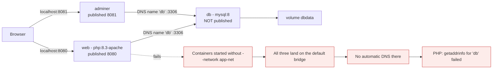
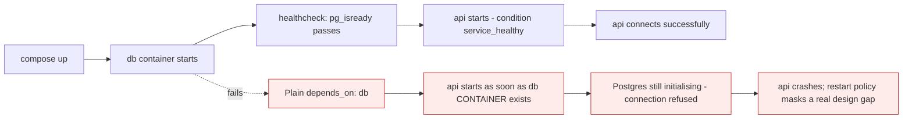

# Docker Compose

*Module 12 · Core*

Everything you typed by hand in module 11, in one file that lives in your repository. This is where
Docker becomes a team tool rather than a personal one.

[Course home](../index.md) / Module 12

## 1. The problem it solves

The stack from module 11 was three long commands with networks and volumes created separately. Nobody
remembers them, they are not reviewed, and they drift between machines. Compose turns the whole stack
into one declarative file.

```bash
docker compose up -d      # create networks, volumes, and every service
docker compose down       # remove containers and networks (volumes survive by default)
```

> **NOTE - `docker compose` with a space**
>
> Compose v2 is a CLI plugin, invoked as `docker compose`. The old `docker-compose` with a hyphen is the legacy Python v1 - end of life. Use v2.

## 2. The pain, demonstrated: a three-container app by hand

Before using Compose, build a real multi-container application the manual way. The point is not the app -
it is to feel exactly what Compose replaces.

The stack: a **PHP web app**, a **MySQL database** it talks to, and **Adminer**, a browser UI for
inspecting that database.



> **Why it matters:** This is module 11 applied. The user-defined bridge is what makes the hostname `db` resolve; the named volume is what makes the data survive; not publishing 3306 is what keeps the database off the internet. Compose will do all three for you, but only because you now know what it is doing.

### 2.1 Get the source and create the network

```bash
git clone https://github.com/docker/awesome-compose.git
cd awesome-compose/nginx-golang-mysql     # any small app with a DB works

docker network create app-net
docker volume create dbdata
```

### 2.2 The database

```bash
docker run -d --name db \
  --network app-net \
  -e MYSQL_ROOT_PASSWORD=rootpw \
  -e MYSQL_DATABASE=appdb \
  -e MYSQL_USER=appuser \
  -e MYSQL_PASSWORD=apppw \
  -v dbdata:/var/lib/mysql \
  mysql:8

docker logs -f db          # wait for "ready for connections", then Ctrl-C
```

No `-p`. The database is reachable by the other containers over `app-net` and by nobody else.

### 2.3 Adminer, the database UI

```bash
docker run -d --name adminer \
  --network app-net \
  -p 8081:8080 \
  adminer:latest
```

Open `http://localhost:8081`, choose **MySQL**, server `db`, user `appuser`, password `apppw`. If that
login works, container-to-container DNS and networking are proven before you touch application code.

### 2.4 The web application

```bash
docker run -d --name web \
  --network app-net \
  -p 8080:80 \
  -v "$PWD/src":/var/www/html \
  -e DB_HOST=db -e DB_NAME=appdb -e DB_USER=appuser -e DB_PASS=apppw \
  php:8.3-apache

# the base image has no MySQL driver compiled in
docker exec web docker-php-ext-install pdo_mysql
docker restart web
```

Open `http://localhost:8080`. Edit a file in `src/` on the host and refresh - the bind mount means the
change is live with no rebuild.

### 2.5 Tearing it down

```bash
docker rm -f web adminer db
docker network rm app-net
docker volume rm dbdata          # this deletes the data
```

### 2.6 Count the cost

| Problem with the manual approach | Consequence |
| --- | --- |
| Eight commands, and order matters | A new joiner cannot start the app without you |
| Flags live in your shell history | Nothing is reviewed, nothing is in git |
| One typo in `-e MYSQL_PASSWORD` | Silent auth failure, debugged for an hour |
| Nothing waits for MySQL to be ready | `web` may start before the database accepts connections |
| Teardown is three more commands | Stale networks and volumes accumulate |
| Machine A and machine B drift | "Works on my machine" |

Everything in section 2 is about to become one file and one command.

## 3. Installing Compose

Compose v2 is a CLI **plugin**, not a separate program.

| Platform | How you get it |
| --- | --- |
| Docker Desktop (Windows, macOS, Linux) | Already installed - nothing to do |
| Linux, Docker installed from the official `docker-ce` repo | `sudo apt-get install docker-compose-plugin` (or `dnf install docker-compose-plugin`) |
| Linux, Docker installed from a distro package | Install the plugin binary manually |

```bash
# manual plugin install, for one user
mkdir -p ~/.docker/cli-plugins
curl -SL https://github.com/docker/compose/releases/latest/download/docker-compose-linux-x86_64 \
  -o ~/.docker/cli-plugins/docker-compose
chmod +x ~/.docker/cli-plugins/docker-compose

docker compose version
# Docker Compose version v2.x.x
```

| | v1 - `docker-compose` | v2 - `docker compose` |
| --- | --- | --- |
| Written in | Python, separate binary | Go, plugin inside the Docker CLI |
| Status | End of life | Current |
| File key | `version: "3.8"` required | `version:` obsolete, omit it |
| Names it creates | `project_service_1` | `project-service-1` |

> **WARNING - Old tutorials, old syntax**
>
> If a guide tells you to `pip install docker-compose` or to start the file with `version: "3"`, it predates Compose v2. The commands mostly still work, but you are learning a dead tool. Use `docker compose`, and delete the `version:` key - v2 warns about it.

## 4. The same stack, as one file

Section 2 in a file called `compose.yaml`, sitting in the repository next to the code.

```yaml
name: demo-app

services:
  db:
    image: mysql:8
    environment:
      MYSQL_ROOT_PASSWORD: rootpw
      MYSQL_DATABASE: appdb
      MYSQL_USER: appuser
      MYSQL_PASSWORD: apppw
    volumes:
      - dbdata:/var/lib/mysql
    healthcheck:
      test: ["CMD", "mysqladmin", "ping", "-h", "localhost"]
      interval: 10s
      retries: 10

  adminer:
    image: adminer:latest
    ports:
      - "8081:8080"
    depends_on:
      - db

  web:
    build: .
    ports:
      - "8080:80"
    volumes:
      - ./src:/var/www/html
    environment:
      DB_HOST: db
      DB_NAME: appdb
      DB_USER: appuser
      DB_PASS: apppw
    depends_on:
      db:
        condition: service_healthy

volumes:
  dbdata:
```

```dockerfile
# Dockerfile - so the PHP driver is baked in instead of installed by hand
FROM php:8.3-apache
RUN docker-php-ext-install pdo_mysql
```

```bash
docker compose up -d
```

That one command replaces all eight. It also does something the manual version never did: `web` now waits
until MySQL actually answers a ping.


> **Why it matters:** Compose does not add capability - every one of those steps was possible with `docker run`. It adds **reproducibility**. The file is reviewed in a pull request, versioned with the code, and identical on every machine.

### 4.1 What Compose created for you

```bash
docker compose ps
docker network ls | Select-String demo-app     # demo-app_default
docker volume ls  | Select-String demo-app     # demo-app_dbdata
```

| Concept | Meaning |
| --- | --- |
| **Project** | A named group of resources, from `name:` or the directory name |
| **Service** | One entry under `services:` - a definition, which can run 1..N containers |
| **Container** | An actual running instance, named `project-service-N` |
| **Default network** | Created automatically; every service joins it and is reachable by service name |
| **Named volume** | Prefixed with the project name, survives `down` |

The critical consequence: `DB_HOST: db` works because **the service name is the DNS name**. You never
write an IP address anywhere in a Compose file.

### 4.2 Starting and stopping

```bash
docker compose up            # foreground - logs from every service, Ctrl-C stops all
docker compose up -d         # detached - the normal way
docker compose logs -f       # the logs you gave up by detaching
docker compose stop          # stop containers, keep them
docker compose start         # start them again
docker compose down          # remove containers + network, keep volumes
```

> **TIP - Run in the foreground once**
>
> The first time you bring up a new stack, run `docker compose up` without `-d`. Interleaved logs from all three services show you the exact moment the database becomes ready and the app connects - the clearest picture of your own startup sequence you will ever get. Use `-d` from then on.

## 5. A production-shaped file

```yaml
services:
  db:
    image: postgres:16
    restart: unless-stopped
    environment:
      POSTGRES_DB: app
      POSTGRES_USER: app
      POSTGRES_PASSWORD_FILE: /run/secrets/db_password
    secrets:
      - db_password
    volumes:
      - pgdata:/var/lib/postgresql/data
    networks:
      - backend
    healthcheck:
      test: ["CMD-SHELL", "pg_isready -U app"]
      interval: 10s
      timeout: 5s
      retries: 5
    deploy:
      resources:
        limits:
          memory: 512M

  api:
    build:
      context: .
      dockerfile: Dockerfile
    image: myorg/api:${TAG:-dev}
    restart: unless-stopped
    depends_on:
      db:
        condition: service_healthy
    environment:
      DB_HOST: db
      DB_PORT: "5432"
    networks:
      - backend
      - frontend
    ports:
      - "127.0.0.1:8080:8080"

  proxy:
    image: nginx:1.25-alpine
    restart: unless-stopped
    depends_on:
      - api
    ports:
      - "80:80"
    volumes:
      - ./nginx.conf:/etc/nginx/nginx.conf:ro
    networks:
      - frontend

volumes:
  pgdata:

networks:
  frontend:
  backend:

secrets:
  db_password:
    file: ./secrets/db_password.txt
```

Everything from module 11 is here: named volume, two networks, database published to nothing, API bound
to localhost, limits, restart policies - plus health checks and dependency ordering that were awkward to
express by hand.

## 6. The sections

| Key | Purpose |
| --- | --- |
| `services` | One entry per container |
| `image` | Image to run; with `build`, also the tag to give the built image |
| `build` | Build from a Dockerfile instead of pulling |
| `environment` / `env_file` | Configuration |
| `volumes` | Named volumes and bind mounts |
| `networks` | Which networks the service joins |
| `ports` | Published ports, `host:container` |
| `depends_on` | Start order, and with `condition`, health-gated start |
| `healthcheck` | How to test the service is actually ready |
| `restart` | `no`, `always`, `on-failure`, `unless-stopped` |
| `deploy.resources` | CPU and memory limits |
| `secrets` | File-based secrets mounted at `/run/secrets/...` |

## 7. `depends_on` is start order, not readiness



> **Why it matters:** Plain `depends_on` waits for the container to be *created*, not for the service inside it to be *ready*. Either add a healthcheck with `condition: service_healthy`, or - better for production - make your application retry its connections. Startup order dependencies are fragile in any distributed system.

## 8. Daily commands

```bash
docker compose up -d               # start everything, detached
docker compose up -d --build       # rebuild images first
docker compose ps                  # status of the stack
docker compose logs -f api         # follow one service
docker compose exec api sh         # shell into a running service
docker compose restart api
docker compose stop                # stop, keep containers
docker compose down                # remove containers + networks (volumes kept)
docker compose down -v             # ALSO remove volumes - destroys data
docker compose config              # render the final resolved file - excellent for debugging
```

> **WARNING - `down -v` deletes your data**
>
> `docker compose down` is safe: it leaves named volumes. Adding `-v` removes them. Two characters between "restart the stack" and "delete the database".

## 9. Environments without duplicating the file

```bash
# .env  - picked up automatically
TAG=1.4.2
DB_PASSWORD_FILE=./secrets/prod_password.txt
```

```yaml
# docker-compose.override.yml - applied automatically on top in development
services:
  api:
    build: .
    volumes:
      - ./src:/app/src        # live reload
    environment:
      LOG_LEVEL: debug
```

```bash
docker compose up -d                                    # base + override (dev)
docker compose -f compose.yaml -f compose.prod.yaml up -d   # explicit prod composition
```

| Pattern | Use |
| --- | --- |
| `.env` file | Values that differ per environment |
| `compose.override.yml` | Developer conveniences: bind mounts, debug ports, hot reload |
| `-f a.yaml -f b.yaml` | Explicit composition for CI or production |
| `profiles:` | Optional services - seeders, admin UIs - not started by default |

## 10. Where Compose stops

Compose is excellent for local development, CI test environments and simple single-host deployments. It is
not a production orchestrator.

| Compose gives you | Compose does not give you |
| --- | --- |
| Multi-container definition on one host | Multi-host scheduling |
| Restart on failure | Rescheduling when the host dies |
| Manual scale (`--scale`) | Autoscaling |
| Start order and health gating | Rolling updates with automatic rollback |
| A file in git | Declarative reconciliation of desired state |

> **TIP - The honest architecture answer**
>
> Compose for dev and CI; Kubernetes (or ECS, or Nomad) when you need multi-host scheduling, self-healing and rolling deployments. Do not put Kubernetes on a laptop-scale problem, and do not run a critical multi-host platform on Compose.

## 11. Extra points

- **The file is called `compose.yaml`** in current versions; `docker-compose.yml` still works.
- **Compose creates a project namespace** from the directory name, so container and network names are
  prefixed. Set `name:` at the top of the file to make it explicit.
- **`docker compose config` is the debugging command.** It shows the file after variable substitution and
  override merging - which is usually where the surprise is.
- **`--scale` for stateless services only**: `docker compose up -d --scale api=3`. It cannot work if the
  service publishes a fixed host port.
- **Commit `compose.yaml`, never commit `.env`.** Commit `.env.example` instead.
- **Compose in CI** is the cheapest way to run integration tests against a real database.

> **PRACTICE - Practice now**
>
> 1. Build the three-container stack from section 2 entirely by hand. Do not skip it - the pain is the lesson.
> 2. Prove the network matters: start `web` without `--network app-net` and read the DNS error.
> 3. Now write the `compose.yaml` from section 4 and bring the same stack up with one command.
> 4. Run `docker compose up` in the foreground once and watch the startup order in the interleaved logs.
> 5. Run `docker compose down` then `up -d` and confirm the database data survived.
> 6. Remove the healthcheck and `condition: service_healthy`, then cold-start the stack and watch the app fail to connect.
> 7. Add a `compose.override.yml` with a bind mount for live reload.
> 8. Run `docker compose config` and read the merged output.
> 9. Scale a stateless service to three replicas and observe what happens to a fixed published port.
> 10. Break something deliberately - wrong `DB_HOST` - and debug it with `logs` and `exec`.

> **ASSIGNMENT - Assignment**
>
> Take a real application and produce a Compose setup a new joiner can run with one command: base file, dev override, `.env.example`, healthchecks, resource limits, and a README section explaining `up`, `down`, and the one command that destroys data. Then hand it to a teammate with no explanation. If they get it running in under five minutes, it is good.

## 12. Interview drill

<details>
<summary><b>What does Compose actually give you over `docker run`?</b></summary>

A declarative, version-controlled definition of an entire multi-container stack - services, networks,
volumes, dependencies, health checks and limits - reproduced with one command. It removes tribal knowledge
about which flags to type and makes the environment reviewable like code.

It adds no new capability. Everything Compose does can be done with `docker network create`,
`docker volume create` and `docker run`. What it adds is reproducibility.

</details>

<details>
<summary><b>How does one container reach another in a Compose project?</b></summary>

By **service name**. Compose creates a default user-defined bridge network for the project and every
service joins it, so the embedded DNS server resolves the service name to the container's current IP.
That is why `DB_HOST: db` works and why an IP address should never appear in a Compose file.

</details>

<details>
<summary><b>What is the difference between `docker-compose` and `docker compose`?</b></summary>

`docker-compose` with a hyphen is v1: a separate Python program, now end of life. `docker compose` with a
space is v2: a Go plugin inside the Docker CLI. v2 also drops the `version:` key and names containers
`project-service-1` instead of `project_service_1`. Anything telling you to `pip install docker-compose`
is out of date.

</details>

<details>
<summary><b>Does `depends_on` guarantee the dependency is ready?</b></summary>

No. By default it only controls start order at the container level. Use `condition: service_healthy`
together with a healthcheck, and design the application to retry its connections - relying on start order
alone is fragile in any distributed system.

</details>

<details>
<summary><b>Is Compose suitable for production?</b></summary>

For a single host with modest requirements, yes - it is honest and simple. It does not provide multi-host
scheduling, self-healing across nodes, autoscaling or rolling updates with rollback, so anything needing
those belongs on Kubernetes, ECS or Nomad.

</details>

<details>
<summary><b>How do you manage differences between dev and production?</b></summary>

A base file with the common definition, an override file for developer conveniences (bind mounts, debug
logging), environment values in `.env`, and explicit `-f base -f prod` composition in CI. Commit
`.env.example`, never the real `.env`.

</details>

<details>
<summary><b>What is the difference between `docker compose down` and `down -v`?</b></summary>

`down` removes containers and networks but keeps named volumes, so data survives. `-v` also deletes the
volumes, which destroys the data. It is the most dangerous two characters in the Compose CLI.

</details>

---

[← Module 11](11-storage-networking.md) &nbsp;&nbsp;|&nbsp;&nbsp; [Module 13: Docker Swarm →](13-swarm.md)

---

Docker: Zero to Architect · Himanshu Kumar.
