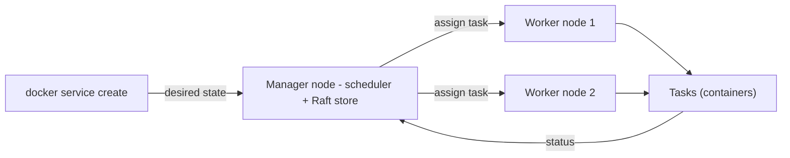

# Docker Swarm

*Module 13 · Orchestration*

One host is a single point of failure. Swarm turns a set of Docker hosts into one cluster with a
scheduler, self-healing and a consensus algorithm underneath - and it is the cheapest way to learn
orchestration properly before you meet Kubernetes.

[Course home](../index.md) / Module 13

## 1. What orchestration actually means

Everything so far has been one host: you type `docker run`, a container appears, and if the host dies so
does everything on it. Orchestration is the layer that answers the questions a single host cannot.

| Question | Single host | Orchestrator |
| --- | --- | --- |
| Where should this container run? | Here. There is nowhere else | Pick a node with capacity |
| A container crashed | It stays dead unless a restart policy catches it | Recreate it, anywhere in the cluster |
| **The host died** | Everything on it is gone | Reschedule its work onto surviving nodes |
| I need ten replicas | Ten `docker run` commands, one host | `--replicas 10`, spread across nodes |
| Deploy a new version | Stop, pull, start, hope | Rolling update with health checks and rollback |
| How do clients reach it? | You publish a port | A cluster-wide load balancer |

Docker Swarm is Docker's own orchestrator, built into the engine. Nothing to install.

> **NOTE - Swarm or Kubernetes?**
>
> Kubernetes won the market and is what most large platforms run. Swarm is far simpler, ships with Docker, and uses the Compose file you already know - which makes it an excellent way to *learn* orchestration concepts (scheduling, desired state, quorum, service discovery, ingress) without the Kubernetes learning curve. Every concept here has a direct Kubernetes equivalent.

## 2. Architecture and vocabulary



> **Why it matters:** You never tell Swarm *how* to run something. You declare the desired state - "five replicas of this image" - and the managers keep reality matching it. That declarative model is the single biggest mental shift from `docker run`.

| Term | Meaning |
| --- | --- |
| **Node** | A Docker host that has joined the swarm |
| **Manager node** | Maintains cluster state, schedules work, exposes the API. Managers also run tasks by default |
| **Worker node** | Runs tasks only. Cannot be used to control the cluster |
| **Service** | The declaration: image, replica count, ports, networks, resources |
| **Task** | One unit of work - a single container - assigned to a node. Tasks are immutable: to change one, Swarm kills it and creates a new one |
| **Desired state** | What you asked for. The managers reconcile the cluster towards it, continuously |
| **Stack** | A group of services defined in one Compose file (module 15) |

| Container vs task | |
| --- | --- |
| Container | You created it directly; you own its lifecycle |
| Task | Swarm created it to satisfy a service; Swarm owns its lifecycle. Deleting the container just makes Swarm start another |

## 3. Setting up a cluster

Three EC2 instances (or any three Linux hosts) with Docker installed - module 05 applies unchanged.

```bash
# On the first host - it becomes the first manager
docker swarm init --advertise-addr <PRIVATE-IP>

# It prints a join command. On each worker:
docker swarm join --token SWMTKN-1-xxxx <MANAGER-PRIVATE-IP>:2377

# Back on the manager
docker node ls           # every node, its role, and availability
docker info | grep -i swarm
```

| Port | Purpose |
| --- | --- |
| **2377/tcp** | Cluster management (managers only) |
| **7946/tcp+udp** | Node-to-node discovery and gossip |
| **4789/udp** | Overlay network data plane (VXLAN) |

> **WARNING - Security groups are where swarm labs die**
>
> If 7946 or 4789 is blocked between nodes, `docker node ls` looks perfectly healthy while overlay networking silently fails and containers on different nodes cannot talk. Open those ports **between the nodes only**, never to the world - 2377 exposed publicly means anyone with the token can join your cluster.

Retrieving tokens and managing roles:

```bash
docker swarm join-token worker      # print the worker join command
docker swarm join-token manager     # print the manager join command
docker node promote node2           # worker -> manager
docker node demote node2            # manager -> worker
docker node update --availability drain node3   # stop scheduling new tasks here
docker swarm leave --force          # on a node, to leave the cluster
```

## 4. Your first service

```bash
docker service create --name web --replicas 3 -p 8080:80 nginx:1.25

docker service ls                 # replica count: 3/3 means desired/running
docker service ps web             # which task is on which node
docker service inspect web
docker service logs web
docker service scale web=5
docker service rm web
```

Now hit `http://<ANY-NODE-IP>:8080` - **any** node answers, even one running no replica of the service.
That is the routing mesh, and it is module 14.

```mermaid
flowchart LR
    S0["docker service create --replicas 3"]
    S1["Managers record desired state"]
    S2["Scheduler places 3 tasks"]
    S3["Tasks running, reachable from any node"]
    S0 --> S1
    S1 --> S2
    S2 --> S3
    F0["A node dies"]
    F1["Its tasks are lost - 2/3 running"]
    F2["Managers detect the gap"]
    F3["Task rescheduled on a surviving node - 3/3 again"]
    S3 -.->|"fails"| F0
    F0 --> F1
    F1 --> F2
    F2 --> F3
    classDef bad fill:#fdecea,stroke:#c62828;
    class F0,F1,F2,F3 bad;
```



> **Why it matters:** Self-healing is not magic - it is the reconciliation loop. The managers compare desired state with actual state on a timer and act on the difference. That is exactly how Kubernetes controllers work too.

## 5. High availability and the Raft consensus algorithm

Managers hold the cluster state, so the cluster survives only as long as the **managers** agree. Swarm
uses **Raft** to keep their copies consistent.

Raft's rule: a decision is committed only when a **majority** of managers - a **quorum** - agrees.

| Managers | Quorum needed | Failures tolerated |
| --- | --- | --- |
| 1 | 1 | **0** - it is a single point of failure |
| **2** | **2** | **0** - and now you have two things that can break it |
| **3** | 2 | **1** |
| 4 | 3 | 1 - no better than 3, more coordination cost |
| **5** | 3 | **2** |
| 6 | 4 | 2 - again no better than 5 |
| 7 | 4 | 3 |

Two conclusions fall straight out of that table.

> **WARNING - Two managers is worse than one**
>
> With two managers, quorum is two. Lose either one and the remaining manager cannot form a majority, so the cluster loses its control plane - **you have doubled the failure probability while tolerating zero failures**. Running tasks keep running, but you cannot deploy, scale or heal anything until quorum returns.

> **TIP - Always use an odd number of managers**
>
> An even count adds a manager without adding fault tolerance - 4 tolerates the same single failure as 3, while adding another machine that can fail and more consensus traffic. Use **3** for most clusters, **5** for large ones. Docker recommends a maximum of seven; beyond that Raft coordination costs more than it returns.

### HA scenarios, as labs

| Scenario | Managers / Workers | Verdict |
| --- | --- | --- |
| 1 | 1 manager, 2 workers | Fine for learning. Manager dies = no control plane |
| 2 | 2 managers, 3 workers | **Worst option.** Zero fault tolerance, two things to break |
| 3 | **3 managers, N workers** | **The right answer.** Survives one manager loss |
| 4 | 3 managers running no tasks | Also correct, and better for large clusters - keep managers free of workload so consensus is never starved |

```bash
docker node update --availability drain manager1   # manager stops running tasks
```

> **NOTE - What actually breaks when quorum is lost**
>
> Existing tasks keep running and keep serving traffic - the data plane is not affected. What stops is the control plane: no deployments, no scaling, no rescheduling of failed tasks. Recover by restoring enough managers, or as a last resort `docker swarm init --force-new-cluster` on a surviving manager to rebuild a single-manager control plane.

## 6. Rolling updates and rollback

```bash
docker service update --image myapp:1.4.3 \
  --update-parallelism 1 \
  --update-delay 10s \
  --update-failure-action rollback \
  web

docker service rollback web       # go back to the previous spec
```

| Option | Effect |
| --- | --- |
| `--update-parallelism` | How many tasks to replace at once |
| `--update-delay` | Wait between batches, so problems surface before the next one |
| `--update-failure-action` | `pause` (default), `continue`, or `rollback` |
| `--update-order start-first` | Start the replacement before stopping the old task - avoids a capacity dip |

This is where health checks stop being optional: without one, Swarm considers a task healthy the moment
the process starts, and a rolling update will happily replace every replica with a broken build.

## 7. Constraints and placement

```bash
docker service create --name db \
  --constraint 'node.labels.storage==ssd' \
  --constraint 'node.role==worker' \
  --replicas 1 mysql:8

docker node update --label-add storage=ssd node2
```

| Placement tool | Use |
| --- | --- |
| `--constraint` | Hard requirement: only nodes matching run the task |
| `--placement-pref spread=node.labels.zone` | Spread replicas across failure domains |
| `--mode global` | Exactly one task per node - monitoring agents, log shippers |

## 8. Extra points

- **Swarm is built into Docker.** No installation, no separate control plane to run. That is its whole
  value proposition against Kubernetes.
- **Managers should be odd and modest in number.** Three is right for almost everyone.
- **Drain managers in production** so consensus never competes with application load.
- **The join token is a credential.** Rotate it with `docker swarm join-token --rotate worker`.
- **Raft state lives on disk** under the swarm directory on each manager. Back it up:
  `docker swarm ca` and the automatic Raft snapshots matter for disaster recovery.
- **Autolock** (`docker swarm update --autolock=true`) encrypts the Raft logs at rest, so a stolen disk
  does not hand over your cluster secrets.
- **Everything here maps to Kubernetes**: node, service, task, desired state, quorum (etcd instead of
  Raft-in-Swarm), rolling update, node labels and constraints.

> **PRACTICE - Practice now**
>
> 1. Create three Linux VMs, install Docker on each (module 05), and open 2377, 7946 and 4789 between them only.
> 2. `docker swarm init` on the first, join the other two as workers, and confirm with `docker node ls`.
> 3. `docker service create --name web --replicas 3 -p 8080:80 nginx:1.25`, then `docker service ps web` to see the placement.
> 4. Hit port 8080 on a node that runs **no** replica. It answers - note that for module 14.
> 5. Stop Docker on one worker and watch `docker service ps web` reschedule the task.
> 6. Promote a worker so you have two managers, then stop one. Try to deploy anything - this is the quorum lesson, felt rather than read.
> 7. Promote a third manager and repeat. Now it survives.
> 8. Do a rolling update to a different nginx tag with `--update-delay 10s` and watch it replace tasks one by one.

> **ASSIGNMENT - Assignment**
>
> Build a three-manager, two-worker cluster with managers drained of tasks. Deploy a service with five replicas, a health check, and a rolling update policy that rolls back on failure. Then write a one-page runbook: how to add a node, how to safely remove one, what happens when a manager dies, how to recover from lost quorum, and how the join token is rotated. Test the "manager dies" path for real before you write that section.

## 9. Interview drill

<details>
<summary><b>What problem does an orchestrator solve that a single Docker host does not?</b></summary>

Scheduling across machines, self-healing when a node or task dies, declarative desired state, rolling
updates with rollback, cluster-wide service discovery and load balancing, and scaling as an operation
rather than a set of manual commands. A single host can restart a container; it cannot survive its own
failure.

</details>

<details>
<summary><b>Explain manager versus worker nodes.</b></summary>

Managers maintain cluster state in a Raft-replicated store, schedule tasks and serve the API; they also
run tasks unless drained. Workers only execute tasks. Roles can be changed with `docker node promote` and
`demote`.

</details>

<details>
<summary><b>Why is an even number of managers a bad idea?</b></summary>

Raft commits a decision only with a majority. Two managers need two for quorum, so tolerating zero
failures while doubling the chance of one - strictly worse than a single manager. Four tolerates the same
single failure as three while adding cost. Use an odd number: three for most clusters, five for large
ones.

</details>

<details>
<summary><b>What happens when a swarm loses quorum?</b></summary>

The data plane keeps running - existing tasks continue serving traffic - but the control plane stops:
no deployments, scaling or rescheduling. Recovery means restoring enough managers, or as a last resort
`docker swarm init --force-new-cluster` on a surviving manager to rebuild the control plane.

</details>

<details>
<summary><b>What is the difference between a service, a task and a container in Swarm?</b></summary>

A service is the declaration - image, replicas, ports, networks. A task is one scheduled unit of that
service assigned to a node, and it is immutable: changing it means killing it and creating a new one. The
container is the actual runtime instance of that task. Deleting the container by hand just causes Swarm to
create another, because the desired state has not changed.

</details>

---

[← Module 12](12-compose.md) &nbsp;&nbsp;|&nbsp;&nbsp; [Module 14: Swarm networking &amp; load balancing →](14-swarm-networking-lb.md)

---

Docker: Zero to Architect · Himanshu Kumar.
