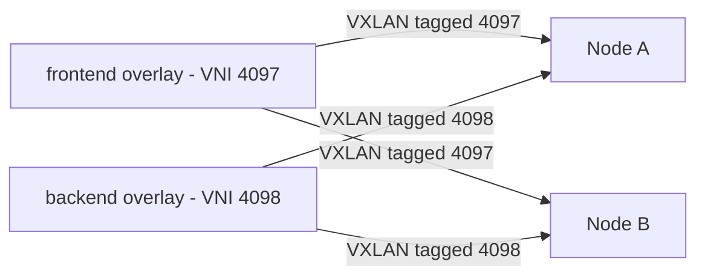
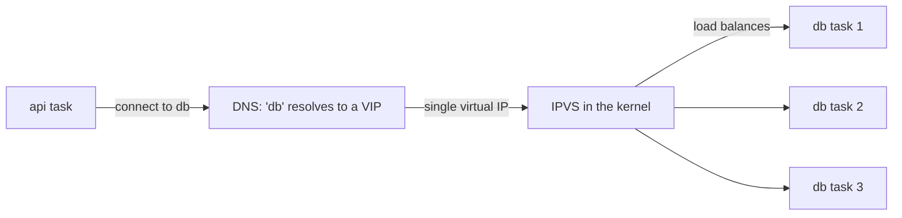
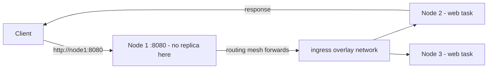
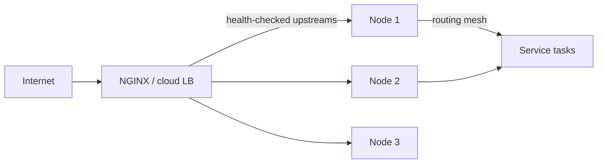

# Swarm networking and load balancing

*Module 14 · Orchestration*

How a request finds a container that could be on any node - routing mesh, virtual IPs, overlay isolation,
and the external load balancer you still need in front of it all.

[Course home](../index.md) / Module 14

## 1. Overlay networks in a real cluster

Module 11 introduced overlay as a driver. In Swarm it is the default way services talk.

```bash
docker network create -d overlay --attachable appnet
docker service create --name api --network appnet myapi:1.0
docker service create --name db  --network appnet postgres:16
```

The API reaches the database as `db` from any node, because Swarm gives every service a DNS name inside
its overlay network. Neither service knows or cares which machine the other is on.

| Property | Detail |
| --- | --- |
| Transport | VXLAN encapsulation over the nodes' real network (`4789/udp`) |
| Scope | `swarm` - the network exists on every node that runs a task attached to it |
| DNS | Service name resolves inside the network, cluster-wide |
| `--attachable` | Also lets standalone `docker run` containers join, which is invaluable for debugging |
| Encryption | `--opt encrypted` encrypts the data plane; the control plane is encrypted already |

### Isolation between overlays - and the VNI

Create two overlay networks and services on one cannot reach services on the other, even on the same
node. That is not a firewall rule - it is built into the encapsulation.



> **Why it matters:** Each overlay gets its own **VNI - Virtual Network Identifier** - carried in the VXLAN header. A node drops any packet whose VNI does not match a network it is a member of, so traffic on `frontend` is invisible to `backend` at the encapsulation layer. This is genuine network segmentation, not access control bolted on afterwards.

```bash
docker network create -d overlay frontend
docker network create -d overlay backend

docker service create --name web --network frontend --replicas 2 nginx:1.25
docker service create --name db  --network backend  --replicas 1 postgres:16
docker service create --name api --network frontend --network backend myapi:1.0
```

`web` cannot reach `db`. `api` sits on both and is the only path between them - defence in depth,
expressed as topology rather than rules.

> **NOTE - "True" isolation has a limit**
>
> Separate overlays isolate traffic between containers, but every node still shares one kernel and one physical network. For hostile multi-tenancy you need separate clusters or VM boundaries - overlays segment your own workloads, they do not make a shared host safe for untrusted tenants.

## 2. Internal load balancing - the VIP

When a service has several replicas, how does a client pick one? It does not.



> **Why it matters:** Swarm gives each service **one stable virtual IP**. Clients resolve the service name to that VIP and connect; the kernel's IPVS layer distributes connections across the healthy tasks. Your application never sees individual task addresses, so replicas can come and go with no client-side changes and no stale DNS.

| Mode | Behaviour | When |
| --- | --- | --- |
| **VIP** (default) | Service name resolves to one virtual IP; the kernel load balances behind it | Almost always |
| **DNS round-robin** (`--endpoint-mode dnsrr`) | Service name resolves to every task IP; the client chooses | When you need client-side balancing, or an external LB that wants real endpoints |

```bash
docker service create --name db --network appnet --endpoint-mode dnsrr postgres:16
docker exec -it <task> nslookup db      # VIP: one address. dnsrr: several
```

> **WARNING - DNS caching bites in dnsrr mode**
>
> Many runtimes cache DNS resolutions - notably older JVMs, which historically cached forever. With `dnsrr` your client can keep dialling a task that no longer exists. VIP mode avoids this entirely, which is one more reason it is the default.

## 3. Ingress and the routing mesh

Publish a port on a service and **every node in the cluster** accepts traffic on it - including nodes
running none of its replicas.

```bash
docker service create --name web --replicas 2 -p 8080:80 nginx:1.25
docker service ps web        # tasks on node2 and node3 only
curl http://node1:8080       # node1 answers anyway
```



> **Why it matters:** The **routing mesh** means your external load balancer can point at every node without knowing where tasks are scheduled. Nodes come and go, replicas move, and the front door never changes. It is also why a published port is cluster-wide: you cannot have two services publishing 8080 in ingress mode.

| Mode | Flag | Behaviour |
| --- | --- | --- |
| **Ingress** (default) | `-p 8080:80` | Every node listens; traffic is routed to a task anywhere |
| **Host** | `-p mode=host,target=80,published=8080` | Only nodes running a task listen; no mesh, no extra hop |

Use host mode when you need the client IP preserved without proxy headers, or when the extra hop matters
for latency - typically paired with `--mode global`.

> **WARNING - The client IP disappears**
>
> Traffic through the routing mesh is source-NATed, so your application sees an internal address rather than the real client. If you need the real IP: use `mode=host` publishing, or terminate at an external proxy that sets `X-Forwarded-For` and trust that header.

## 4. External load balancing

The routing mesh balances *inside* the cluster. Something still has to distribute traffic *to* the
cluster, and to survive a node failing.

| Layer | Job |
| --- | --- |
| **External LB** (NGINX, HAProxy, ALB) | Public entry point, TLS termination, health checks, removes dead nodes from rotation |
| **Ingress routing mesh** | Gets the request from whichever node received it to a node with a task |
| **VIP + IPVS** | Picks a specific healthy task |



A minimal NGINX front end:

```nginx
upstream swarm_nodes {
    server 10.0.1.11:8080 max_fails=3 fail_timeout=10s;
    server 10.0.1.12:8080 max_fails=3 fail_timeout=10s;
    server 10.0.1.13:8080 max_fails=3 fail_timeout=10s;
}

server {
    listen 80;
    location / {
        proxy_pass http://swarm_nodes;
        proxy_set_header Host              $host;
        proxy_set_header X-Real-IP         $remote_addr;
        proxy_set_header X-Forwarded-For   $proxy_add_x_forwarded_for;
        proxy_set_header X-Forwarded-Proto $scheme;
    }
}
```

| Internal LB | External LB |
| --- | --- |
| Built into Swarm, free | You run it, or pay a cloud provider |
| Balances between **tasks** | Balances between **nodes** |
| No TLS, no public DNS, no WAF | TLS termination, certificates, WAF, DDoS protection |
| Invisible to clients | The address your users actually resolve |

> **TIP - Run the external LB outside the cluster**
>
> If NGINX runs as a Swarm service on the same nodes it balances, a node failure can take out both the workload and the front door. Put it on separate machines, or use the cloud provider's managed load balancer, which is what most teams do.

## 5. Diagnosing

```bash
docker network ls --filter driver=overlay
docker network inspect appnet            # peers, subnet, attached services
docker service ps web --no-trunc         # placement and any error text
docker service inspect web --format '{{json .Endpoint}}'   # VIP and published ports

# from inside a task on the network
docker exec -it <task-id> nslookup db
docker exec -it <task-id> nc -zv db 5432
```

| Symptom | Usual cause |
| --- | --- |
| Services on different nodes cannot talk | `4789/udp` or `7946` blocked between nodes |
| Service name does not resolve | Not on the same overlay network |
| Published port answers on some nodes only | Publishing in `mode=host`, not ingress |
| `port is already allocated` on a service | Another service already publishes it in ingress mode - it is cluster-wide |
| App sees the wrong client IP | Routing mesh source-NAT; use host mode or `X-Forwarded-For` |
| Intermittent failures after scaling down | `dnsrr` plus client-side DNS caching |

> **PRACTICE - Practice now**
>
> 1. Create an overlay network and two services on it; resolve one from the other by name.
> 2. Create a second overlay and confirm services on it **cannot** reach the first - that is the VNI at work.
> 3. Put a third service on both networks and watch it become the only bridge between them.
> 4. Publish a service on 8080 with two replicas across three nodes, then curl the node with no replica.
> 5. Inspect the service endpoint and find the VIP; then run `nslookup` for the service name from inside a task.
> 6. Recreate it with `--endpoint-mode dnsrr` and compare the DNS answer.
> 7. Put NGINX in front of all three nodes and kill one - confirm traffic keeps flowing.
> 8. Block `4789/udp` between two nodes and watch cross-node traffic fail while `docker node ls` still looks healthy.

> **ASSIGNMENT - Assignment**
>
> Deploy a three-tier stack on segmented overlays: a public web service, an API on both networks, and a database reachable only from the API. Front it with NGINX on a separate host, with health checks and `X-Forwarded-For`. Then produce a network diagram marking every trust boundary, and a test that proves the web tier cannot reach the database. The proof matters more than the diagram.

## 6. Interview drill

<details>
<summary><b>What is the Swarm routing mesh?</b></summary>

Every node in the cluster listens on a service's published port and forwards traffic over the ingress
overlay to a node actually running a task. That means an external load balancer can point at all nodes
without knowing where replicas are scheduled, and published ports are cluster-wide rather than per-host.

</details>

<details>
<summary><b>How does Swarm load balance between replicas?</b></summary>

Each service gets a stable virtual IP. The service name resolves to that VIP, and the kernel's IPVS layer
distributes connections across healthy tasks. Clients never see task addresses, so replicas can change
freely. The alternative, `dnsrr`, returns all task IPs and pushes the decision to the client - useful with
an external LB, but exposed to client-side DNS caching.

</details>

<details>
<summary><b>How is traffic isolated between two overlay networks?</b></summary>

Each overlay has its own VNI carried in the VXLAN header. Nodes drop packets whose VNI does not belong to
a network they are a member of, so the segmentation happens in the encapsulation itself rather than as an
access rule. Services on separate overlays simply cannot see each other.

</details>

<details>
<summary><b>Why do you still need an external load balancer?</b></summary>

The routing mesh balances inside the cluster but does not give you a public entry point, TLS termination,
certificates, a WAF, or removal of a dead node from rotation. An external LB - NGINX, HAProxy or a cloud
load balancer - provides those, health-checks the nodes, and should run outside the cluster so a node
failure cannot take out the front door too.

</details>

<details>
<summary><b>Your application logs show internal IPs instead of client IPs. Why?</b></summary>

The ingress routing mesh source-NATs traffic. Either publish with `mode=host` so only nodes running tasks
receive traffic directly, or terminate at a proxy that sets `X-Forwarded-For` and read the client address
from that header.

</details>

---

[← Module 13](13-swarm.md) &nbsp;&nbsp;|&nbsp;&nbsp; [Module 15: Stacks &amp; scaling →](15-stack-scaling.md)

---

Docker: Zero to Architect · Himanshu Kumar.
