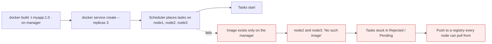
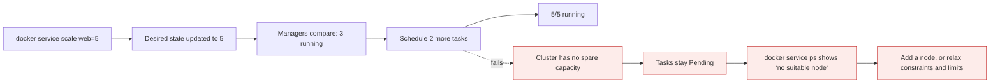

# Stacks, image distribution and scaling

*Module 15 · Orchestration*

Compose files were single-host. `docker stack deploy` takes the same file and runs it across a cluster -
which immediately exposes two new problems: where the image comes from, and how many replicas you want.

[Course home](../index.md) / Module 15

## 1. Compose vs Stack

Same file format, different execution engine.

| | `docker compose` | `docker stack deploy` |
| --- | --- | --- |
| Runs on | One host | A Swarm cluster |
| Creates | Containers | Services (which create tasks) |
| Scope | Local project | Cluster-wide |
| `build:` | **Supported** - builds the image for you | **Ignored** - the image must already exist in a registry |
| `depends_on:` | Honoured | **Ignored** - Swarm has no start ordering |
| `deploy:` block | Mostly ignored | **This is where replicas, limits and update policy live** |
| Restart | `restart:` | `deploy.restart_policy` |
| Networks | Bridge by default | **Overlay** by default |

> **WARNING - The two silent surprises when moving Compose to Stack**
>
> `build:` is ignored, so a stack that "worked in Compose" fails with `No such image` on every node but the one you built on. And `depends_on:` is ignored, so a service that assumed its database was up will start first and crash - which is why applications must retry their connections rather than rely on ordering.

## 2. A stack file

```yaml
# stack.yaml
services:
  web:
    image: myorg/web:1.4.2          # must be pullable by every node
    ports:
      - "8080:80"
    networks: [frontend]
    deploy:
      replicas: 3
      update_config:
        parallelism: 1
        delay: 10s
        failure_action: rollback
      restart_policy:
        condition: on-failure
      resources:
        limits:   { cpus: "0.50", memory: 256M }
        reservations: { cpus: "0.25", memory: 128M }
      placement:
        constraints: [node.role == worker]

  api:
    image: myorg/api:1.4.2
    networks: [frontend, backend]
    environment:
      DB_HOST: db
    deploy:
      replicas: 2

  db:
    image: postgres:16
    networks: [backend]
    volumes:
      - pgdata:/var/lib/postgresql/data
    deploy:
      replicas: 1
      placement:
        constraints: [node.labels.storage == ssd]

networks:
  frontend:
  backend:

volumes:
  pgdata:
```

```bash
docker stack deploy -c stack.yaml myapp
docker stack ls
docker stack services myapp
docker stack ps myapp
docker stack rm myapp
```

Everything is namespaced with the stack name: services become `myapp_web`, networks `myapp_frontend`.

> **WARNING - `volumes:` in a stack is per-node, not shared**
>
> A named volume in a stack is created on **whichever node** the task lands on. Reschedule the task elsewhere and it gets a fresh, empty volume - the data does not follow. For stateful services in a cluster you need a shared-storage volume driver (NFS, cloud block storage plugin) or, more sensibly, a managed database outside the cluster.

## 3. The image distribution problem

This is the single most common Swarm failure, and it is worth doing deliberately once.



> **Why it matters:** A local image is local to one node. Swarm does not copy images between nodes - it expects every node to be able to **pull** what it is asked to run. `docker service ps --no-trunc` shows the real error, which is otherwise invisible.

Four ways to solve it, from worst to best:

| Approach | How | Verdict |
| --- | --- | --- |
| Build on every node | `docker build` on each machine | Works, does not scale, images drift |
| Save and load | `docker save` on one node, `scp`, `docker load` on the others | Fine for an air-gapped one-off, painful as a habit |
| **Registry** | Push to Docker Hub, ECR/ACR/GAR, or a self-hosted registry; every node pulls | **The right answer** |
| **CI/CD to a registry** | Pipeline builds, tests, scans, pushes with a SHA tag, then `docker service update --image` | **The right answer, automated** |

```bash
# self-hosted registry, the quickest cluster-local option
docker service create --name registry --publish 5000:5000 registry:2
docker tag myapp:1.0 <manager-ip>:5000/myapp:1.0
docker push <manager-ip>:5000/myapp:1.0
docker service create --name app --replicas 3 <manager-ip>:5000/myapp:1.0
```

```bash
# private registry authentication - nodes need the credentials too
docker login myregistry.example.com
docker service create --with-registry-auth --name app myregistry.example.com/myapp:1.0
```

> **TIP - `--with-registry-auth` is the flag people miss**
>
> Without it the manager can pull but the workers cannot, so tasks fail on every node except the one you were logged in on. It forwards your registry credentials to the agents that need them.

## 4. Scaling

### Vertical vs horizontal

| | Vertical | Horizontal |
| --- | --- | --- |
| Means | Give one instance more CPU/RAM | Run more instances |
| In Docker | Change resource limits (module 16) | More replicas |
| Ceiling | The biggest machine you can buy | Effectively none |
| Downtime | Usually a restart | None - add replicas alongside |
| Works for | Stateful things that cannot be split | Stateless services |
| Cost curve | Steep at the top end | Linear |

Containers make horizontal scaling the default because start-up is measured in seconds, not minutes.

### Declarative scaling

```bash
docker service scale web=5
docker service update --replicas 5 web
```

Both do the same thing: change the desired state. You never start or stop individual tasks - you state
how many you want and the managers reconcile.



> **Why it matters:** Scaling is a *declaration*, not an action. That is why it is idempotent, why it is safe to run from a pipeline, and why `docker service ps` showing `Pending` means a scheduling constraint - capacity, a placement rule, or a resource reservation nothing can satisfy - rather than a crash.

### Global services

```bash
docker service create --mode global --name node-agent myagent:1.0
```

Exactly one task per node, automatically added when a node joins. Use it for monitoring agents, log
shippers and security agents - anything that must exist everywhere rather than a fixed number of times.

### Automatic scaling - the honest answer

> **WARNING - Swarm has no built-in autoscaler**
>
> There is no `--min-replicas` / `--max-replicas`. Anything you read about "Swarm autoscaling" is either an external tool watching metrics and calling `docker service scale`, or a cloud autoscaling group adding **nodes** (which adds capacity, not replicas). If autoscaling is a hard requirement, that is one of the strongest reasons to choose Kubernetes, which has HPA built in.

A workable pattern if you stay on Swarm:

```bash
# a scheduled job, or an alert webhook
CPU=$(docker stats --no-stream --format '{{.CPUPerc}}' $(docker ps -q -f name=web) \
      | tr -d '%' | awk '{s+=$1} END {print int(s/NR)}')
[ "$CPU" -gt 70 ] && docker service scale web=$((CURRENT + 2))
```

Crude, but honest: metric in, threshold, `service scale`. Add a cooldown so it does not oscillate.

## 5. Extra points

- **Stacks are the production form of Compose.** Keep one file, use `deploy:` for the cluster settings,
  and your dev and prod definitions stay recognisably the same document.
- **Namespacing matters.** Two stacks can define a service called `web` without colliding.
- **`docker stack deploy` is idempotent** - re-running it applies the diff, which makes it a natural fit
  for a deployment pipeline.
- **Scale stateless things freely; scale stateful things carefully.** Three replicas of a database
  writing to three different local volumes is three databases, not one.
- **Reservations affect scheduling.** A replica that reserves 512 MB will not be placed on a node that
  cannot offer it - the commonest reason for a task stuck in `Pending`.
- **Scale down is not graceful by default.** Removed tasks get SIGTERM then SIGKILL; the application must
  drain connections and handle SIGTERM (module 08).

> **PRACTICE - Practice now**
>
> 1. Convert your Compose file to a stack file: move `restart`, replicas and limits into `deploy:`.
> 2. `docker stack deploy -c stack.yaml myapp`, then `docker stack services` and `docker stack ps`.
> 3. Reproduce the image problem deliberately: build locally, deploy with three replicas, and read `docker service ps --no-trunc`.
> 4. Fix it with a local registry service, then again by pushing to Docker Hub.
> 5. Deploy from a private registry with and without `--with-registry-auth` and compare the failures.
> 6. `docker service scale web=5`, watch placement, then scale to 2 and watch tasks removed.
> 7. Set a memory reservation larger than any node can satisfy and read the `Pending` message.
> 8. Deploy a `--mode global` service, then add a node and watch a task appear on it automatically.

> **ASSIGNMENT - Assignment**
>
> Take the three-tier stack from module 14 and make it deployable by a pipeline: images built in CI and tagged with the commit SHA, pushed to a registry, `docker stack deploy` from the pipeline, rolling update with rollback on failure, and a documented scale-up procedure. Then write down the answer to "how do we roll back to the previous version in under two minutes" - and rehearse it.

## 6. Interview drill

<details>
<summary><b>Compose or Stack - what actually changes?</b></summary>

Same file format, different engine. Compose creates containers on one host and honours `build:` and
`depends_on:`. Stack creates Swarm services across a cluster, ignores both of those, and reads the
`deploy:` block for replicas, resource limits, placement and update policy. Networks default to overlay
rather than bridge.

</details>

<details>
<summary><b>You deploy a service with three replicas and two tasks fail with "No such image". Why?</b></summary>

The image exists only on the node where it was built. Swarm does not distribute images - every node must
be able to pull what it is asked to run. Push to a registry all nodes can reach, and use
`--with-registry-auth` for a private one so workers receive the credentials too.

</details>

<details>
<summary><b>Vertical versus horizontal scaling?</b></summary>

Vertical means giving one instance more CPU and memory - simple, but capped by the largest machine and
usually needing a restart. Horizontal means running more instances - effectively unbounded, no downtime,
and the natural fit for containers because they start in seconds. Vertical remains the answer for
stateful components that cannot be split.

</details>

<details>
<summary><b>Does Docker Swarm autoscale?</b></summary>

No. It has no built-in autoscaler - scaling is a declarative command you issue. You can wire an external
metrics watcher to call `docker service scale`, or autoscale the *nodes* with a cloud autoscaling group,
but that adds capacity rather than replicas. Built-in horizontal autoscaling is a genuine reason to
choose Kubernetes.

</details>

<details>
<summary><b>A scaled-up task stays in `Pending`. How do you debug it?</b></summary>

`docker service ps --no-trunc` gives the scheduler's reason. It is almost always a constraint that cannot
be satisfied: a placement constraint or node label, a resource reservation larger than any node can offer,
or simply no spare capacity. Fix by adding a node, relaxing the constraint, or lowering the reservation.

</details>

---

[← Module 14](14-swarm-networking-lb.md) &nbsp;&nbsp;|&nbsp;&nbsp; [Module 16: Resource limits →](16-resource-limits.md)

---

Docker: Zero to Architect · Himanshu Kumar.
