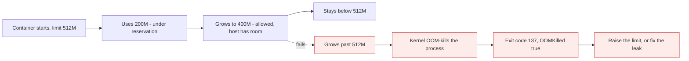

# Resource limits

*Module 16 · Operations*

By default a container can consume every CPU cycle and every byte of RAM on the host. One bad deployment
takes down everything else on that machine - and limits are the only thing standing in the way.

[Course home](../index.md) / Module 16

## 1. The default is "everything"

```bash
docker run -d --name hungry myapp:1.0        # no limits
```

That container may use all cores and all memory. If it leaks, the Linux OOM killer eventually starts
killing processes - and it may not pick yours. On a shared host, one unlimited container is an outage
waiting for a traffic spike.

| Resource | Without a limit | With a limit |
| --- | --- | --- |
| Memory | Grows until the host OOMs; the kernel picks a victim | The container is killed at its own ceiling; the host survives |
| CPU | Competes freely; a busy loop starves neighbours | Throttled to its share |
| PIDs | A fork bomb exhausts the host's process table | Capped |
| Disk I/O | One container can saturate the disk | Weighted or capped |

> **Why this is the whole module:** limits convert "one container can kill the host" into "one container can only kill itself". That is the difference between an incident and a restart.

Limits are enforced by **cgroups** (module 02). Docker is just setting them for you.

## 2. Hard limits and soft limits

This distinction is the part interviews probe.

| | Soft limit (reservation) | Hard limit |
| --- | --- | --- |
| Flag | `--memory-reservation`, `--cpu-shares` | `--memory`, `--cpus` |
| Meaning | "Guarantee me at least this" / "this is my weight" | "Never let me exceed this" |
| Enforced | Only under contention | **Always** |
| Exceeding it | Allowed when the host has spare capacity | Memory: killed. CPU: throttled |
| Used by the scheduler | **Yes** in Swarm - reservations decide placement | No |

```text
        0 ─────────── reservation (soft) ─────────── limit (hard) ────────▶
              guaranteed          may use if free         never crosses
```

## 3. Memory

```bash
# hard limit only
docker run -d --name app -m 512m myapp:1.0

# soft + hard together - the normal production shape
docker run -d --name app \
  --memory-reservation 256m \
  --memory 512m \
  myapp:1.0

# also cap swap; without this the container can use limit + swap
docker run -d -m 512m --memory-swap 512m myapp:1.0
```

| Flag | Effect |
| --- | --- |
| `-m` / `--memory` | Hard ceiling. Exceed it and the container is **OOM-killed** - exit code 137 |
| `--memory-reservation` | Soft floor. Under memory pressure the kernel reclaims from containers above their reservation first |
| `--memory-swap` | Total memory + swap. Set equal to `--memory` to disable swap for that container |
| `--oom-kill-disable` | Do not use. It hangs the container instead of killing it |



> **Why it matters:** Exit code **137** with `"OOMKilled": true` in `docker inspect` is unambiguous - the container hit its own memory ceiling. Without a limit you get the far worse failure: the *host* runs out and the kernel kills something semi-randomly, possibly the database next door.

```bash
docker inspect app --format '{{.State.OOMKilled}} {{.State.ExitCode}}'
```

> **WARNING - The JVM and other runtimes need telling**
>
> Older JVMs read the *host's* memory, not the cgroup limit, and size their heap accordingly - so a JVM in a 512 MB container happily plans for 8 GB and is killed instantly. Modern JVMs are container-aware; otherwise set `-XX:MaxRAMPercentage` explicitly. Node, Python and Go have similar patterns with worker counts and GC tuning.

## 4. CPU

CPU is shared rather than owned, so it has both a hard cap and a relative weight.

```bash
docker run -d --cpus 1.5 myapp:1.0          # hard: at most 1.5 cores' worth
docker run -d --cpu-shares 512 myapp:1.0    # soft: relative weight, default 1024
docker run -d --cpuset-cpus "0,1" myapp:1.0 # pin to specific cores
```

| Flag | Type | Meaning |
| --- | --- | --- |
| `--cpus 1.5` | Hard | Throttled to 150% of one core, even when the host is idle |
| `--cpu-shares 512` | Soft | **Only matters under contention.** Weight relative to other containers |
| `--cpuset-cpus "0,1"` | Hard | Runs only on those cores - for NUMA or licensing constraints |

How shares actually behave:

| Container | Shares | Idle host | Both saturating the CPU |
| --- | --- | --- | --- |
| A | 1024 (default) | Uses whatever it wants | ~67% |
| B | 512 | Uses whatever it wants | ~33% |

> **TIP - The mistake is expecting shares to limit anything**
>
> `--cpu-shares 512` does **not** mean "half a CPU". On an idle host that container can use every core. Shares only allocate a proportion when there is competition. If you need a ceiling, use `--cpus`.

CPU exhaustion has no equivalent of the OOM kill - the container is simply throttled, so the symptom is
latency rather than a crash. That makes it harder to spot and is exactly why you need module 17.

## 5. In Swarm

```yaml
deploy:
  resources:
    limits:
      cpus: "0.50"
      memory: 256M
    reservations:
      cpus: "0.25"
      memory: 128M
```

```bash
docker service create --name api \
  --limit-cpu 0.5 --limit-memory 256M \
  --reserve-cpu 0.25 --reserve-memory 128M \
  myapi:1.0

docker service update --limit-memory 512M api
```

> **WARNING - In Swarm, reservations are a scheduling contract**
>
> Reservations do more than express a preference: the scheduler will only place a task on a node that can still offer that much unreserved CPU and memory. Over-reserve and tasks sit in `Pending` with "no suitable node" even though the cluster looks half idle. Under-reserve and the scheduler packs nodes until everything is fighting for resources. Set reservations from measured usage, not from guesswork.

## 6. Choosing the numbers

There is no formula, but there is a method:

1. Run the workload with **no** limits under realistic load.
2. Watch `docker stats` for peak memory and steady-state CPU (module 17).
3. Set **reservation** at about the steady state - that is what the scheduler should protect.
4. Set the **memory limit** roughly 1.5-2x observed peak, leaving headroom for spikes and GC.
5. Set the **CPU limit** at a level that protects neighbours without throttling normal operation.
6. Re-measure after every significant release. Limits rot as the application changes.

| Anti-pattern | Why it hurts |
| --- | --- |
| No limits at all | One container can take out the host |
| Limit == observed peak | Killed by the first legitimate spike |
| Reservation == limit | No burst headroom; wasteful bin-packing |
| Copying limits from another service | Different memory profile, different failure |
| Raising the limit every time it OOMs | You are funding a leak instead of fixing it |

## 7. Extra points

- **PIDs limit**: `--pids-limit 200` stops a fork bomb. Cheap insurance, almost never set.
- **Block I/O**: `--blkio-weight`, `--device-read-bps` for noisy-neighbour disk problems.
- **Limits are also documentation.** They tell the next engineer what this service is expected to consume.
- **`docker update`** changes limits on a running container - useful in an incident, but the real fix
  belongs in the deployment definition.
- **Kubernetes uses the same two ideas** with different names: `requests` are reservations, `limits` are
  limits, and the ratio between them decides the QoS class. Learning it here transfers directly.
- **Limits interact with health checks.** A container throttled to a fraction of a CPU may fail its health
  check under load and be restarted, producing a restart loop that looks like a crash but is a
  configuration problem.

> **PRACTICE - Practice now**
>
> 1. Run a container with `-m 64m` and a small memory-hog script. Confirm exit code 137 and `OOMKilled: true`.
> 2. Run the same thing without a limit on a small VM and watch the *host* struggle instead. Do this on a VM you can destroy.
> 3. Start two CPU-burning containers with shares 1024 and 512 and watch `docker stats` split the CPU roughly 2:1.
> 4. Give one of them `--cpus 0.5` and watch it stay capped even when the host is idle.
> 5. Set `--memory-reservation 256m --memory 512m` and observe both values in `docker inspect`.
> 6. In Swarm, set a reservation larger than any node can satisfy and read the `Pending` reason.
> 7. Run a JVM or Node app in a 256 MB container without runtime tuning and watch what it does.

> **ASSIGNMENT - Assignment**
>
> Take one real service and produce a resource profile: measured steady-state and peak CPU and memory under realistic load, the reservation and limit you chose, and the reasoning for each. Deploy it with those numbers in Swarm, then deliberately push it past the limit and confirm the failure is contained to that container. Write the runbook entry for "this service is being OOM-killed" - the first three things an on-call engineer should check.

## 8. Interview drill

<details>
<summary><b>What happens if you run containers with no resource limits?</b></summary>

Each container can use all available CPU and memory. One leaking or runaway container exhausts the host,
the kernel OOM killer starts choosing victims - possibly unrelated processes - and everything on that
machine degrades together. Limits confine the blast radius to the offending container.

</details>

<details>
<summary><b>Hard limit versus soft limit?</b></summary>

A hard limit (`--memory`, `--cpus`) is never exceeded: memory over the limit means the container is
OOM-killed, CPU over the limit means throttling. A soft limit is a reservation (`--memory-reservation`) or
a weight (`--cpu-shares`) that only takes effect under contention - and in Swarm, reservations also drive
scheduling decisions.

</details>

<details>
<summary><b>Does `--cpu-shares 512` give the container half a CPU?</b></summary>

No. Shares are a relative weight applied only when containers compete. On an idle host a container with
512 shares can use every core. For an actual ceiling use `--cpus`, which enforces a quota regardless of
what else is running.

</details>

<details>
<summary><b>A container exits with 137. What is your diagnosis path?</b></summary>

137 is SIGKILL. Check `docker inspect` for `OOMKilled: true` - if so it exceeded its memory limit. Then
decide whether the limit is too low or the application is leaking, and check whether the runtime is
container-aware, because a JVM sizing its heap from host memory will be killed immediately. If
`OOMKilled` is false, it was a `docker stop` whose grace period expired because the app ignored SIGTERM.

</details>

<details>
<summary><b>How do you decide what limits to set?</b></summary>

Measure first: run under realistic load with no limits and record steady-state and peak usage. Set the
reservation near steady state so the scheduler protects it, and the limit at roughly 1.5-2x peak for
headroom. Re-measure after significant releases. Copying numbers from another service, or raising the
limit every time it OOMs, are both ways of hiding a problem rather than sizing it.

</details>

---

[← Module 15](15-stack-scaling.md) &nbsp;&nbsp;|&nbsp;&nbsp; [Module 17: Monitoring &amp; logging →](17-monitoring-logging.md)

---

Docker: Zero to Architect · Himanshu Kumar.
