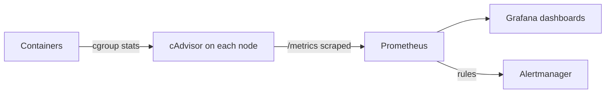
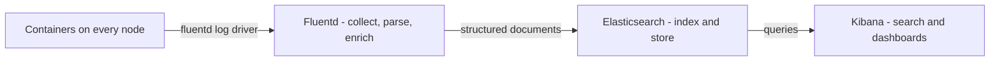

# Monitoring and logging

*Module 17 · Operations*

Limits without measurement is guessing. This module is how you see what containers are actually doing -
`docker stats`, cAdvisor, log drivers, and centralised logging with the EFK stack.

[Course home](../index.md) / Module 17

## 1. Why it is different with containers

| Traditional server | Containers |
| --- | --- |
| Long-lived host you SSH into | Containers are created and destroyed constantly |
| Logs in `/var/log/*` | Logs are stdout/stderr collected by the runtime |
| Metrics per machine | Metrics per container, per service, and per node |
| The failed process is still there to inspect | The container may already be gone |

That last row is the important one. **If the diagnosis lives inside a container, it disappears with the
container.** Everything must be shipped somewhere durable *before* you need it.

## 2. `docker stats` - the first tool

```bash
docker stats                       # live, all running containers
docker stats --no-stream           # one snapshot, scriptable
docker stats web api db
docker stats --format "table {{.Name}}\t{{.CPUPerc}}\t{{.MemUsage}}\t{{.MemPerc}}"
```

| Column | Read it as |
| --- | --- |
| `CPU %` | Percentage of a **single core**. 200% means two cores' worth |
| `MEM USAGE / LIMIT` | Current usage against the limit you set - or the host's total if you set none |
| `MEM %` | Usage over limit. Sustained high values are the OOM warning you get before code 137 |
| `NET I/O` | Total in/out since start |
| `BLOCK I/O` | Disk read/write |
| `PIDS` | Processes inside. Climbing steadily means a leak |

> **TIP - This is how you size limits**
>
> Run the workload under realistic load with no limits, watch `docker stats` for peak memory and steady-state CPU, and use those numbers in module 16. Guessing limits without this step is how services end up either OOM-killed or hogging a node.

Other quick built-ins:

```bash
docker top web                 # processes inside a container
docker inspect web --format '{{.State.Health.Status}}'
docker system df               # disk: images, containers, volumes, build cache
docker events                  # live stream of daemon events - starts, stops, OOMs, health changes
```

`docker stats` is real-time only - there is no history. That is exactly why the next tool exists.

## 3. cAdvisor - metrics with history

cAdvisor (Container Advisor) collects resource usage and performance data per container and exposes it as
a web UI and a Prometheus-format metrics endpoint.

```bash
docker run -d --name cadvisor \
  --volume=/:/rootfs:ro \
  --volume=/var/run:/var/run:ro \
  --volume=/sys:/sys:ro \
  --volume=/var/lib/docker/:/var/lib/docker:ro \
  --publish=8080:8080 \
  --restart unless-stopped \
  gcr.io/cadvisor/cadvisor:latest
```

Open `http://<host>:8080` for per-container CPU, memory, network and filesystem graphs.

| `docker stats` | cAdvisor |
| --- | --- |
| Terminal, live only | Web UI plus a `/metrics` endpoint |
| One host, no history | Per-container history, and a Prometheus scrape target |
| Zero setup | One container per node |
| Debugging right now | Trending, alerting, capacity planning |



> **Why it matters:** cAdvisor alone gives you pretty graphs that nobody watches. The value is the pipeline: cAdvisor exposes, Prometheus stores and evaluates rules, Grafana visualises, Alertmanager wakes someone up. In Swarm, deploy cAdvisor and the node exporter as `--mode global` services so every node is covered automatically.

## 4. Logging fundamentals

**Rule one: log to stdout and stderr.** Do not write log files inside a container - they land in the
writable layer, disappear with the container, and nothing collects them.

```bash
docker logs web
docker logs -f --tail 100 web        # follow the last 100 lines
docker logs --since 10m web
docker logs -t web                   # with timestamps

docker service logs myapp_web        # Swarm: aggregated across all tasks
docker compose logs -f api
```

### Log drivers

The daemon decides what happens to that output.

| Driver | Behaviour | Use for |
| --- | --- | --- |
| `json-file` (default) | Writes JSON files under `/var/lib/docker/containers/...` | Single host, development |
| `local` | More efficient local format with rotation defaults | Single host, better default than json-file |
| `journald` | systemd journal | Hosts already centralising via journald |
| `fluentd` | Forwards to a Fluentd/Fluent Bit collector | **Centralised logging** |
| `syslog`, `gelf` | Forwards to syslog / Graylog | Existing log infrastructure |
| `awslogs`, `gcplogs` | Cloud provider log services | Managed cloud logging |
| `none` | Discards output | Very noisy containers you truly do not need |

> **WARNING - The default is unbounded and will fill your disk**
>
> `json-file` has no rotation unless you configure it. A chatty container fills `/var/lib/docker`, the daemon starts failing, and every container on that host degrades at once. Set this on day one:

```json
// /etc/docker/daemon.json
{
  "log-driver": "json-file",
  "log-opts": { "max-size": "10m", "max-file": "3" }
}
```

```bash
sudo systemctl restart docker        # applies to newly created containers
docker run -d --log-opt max-size=10m --log-opt max-file=3 myapp:1.0   # per container
```

> **TIP - Structured logs, not prose**
>
> Emit JSON with a timestamp, level, message, service name and a request/correlation ID. `docker logs` stays readable, and an aggregator can index and search it. Free text is fine until the day you need to find one request across four services.

## 5. Centralised logging: the EFK stack

Once you have more than one host, `docker logs` on each node stops being a strategy. **EFK** =
Elasticsearch + Fluentd + Kibana.



| Component | Role |
| --- | --- |
| **Fluentd** (or Fluent Bit) | Collector: receives container output, parses it, adds metadata (container name, service, node), forwards it |
| **Elasticsearch** | Stores and indexes the documents so they are searchable |
| **Kibana** | The UI: search, filter, dashboards, saved queries |

> **Why it matters:** The point is not the tools - it is that logs leave the node. A container that crashed twenty minutes ago on a machine that has since been replaced still has its logs, searchable across every service at once. That is the difference between debugging a distributed system and guessing about it.

A minimal stack file:

```yaml
services:
  elasticsearch:
    image: docker.elastic.co/elasticsearch/elasticsearch:8.13.0
    environment:
      - discovery.type=single-node
      - ES_JAVA_OPTS=-Xms512m -Xmx512m
      - xpack.security.enabled=false
    volumes:
      - esdata:/usr/share/elasticsearch/data
    networks: [logging]
    deploy:
      placement:
        constraints: [node.role == manager]

  fluentd:
    image: fluent/fluentd:v1.16-1
    ports:
      - "24224:24224"
      - "24224:24224/udp"
    volumes:
      - ./fluent.conf:/fluentd/etc/fluent.conf:ro
    networks: [logging]
    deploy:
      mode: global          # a collector on every node

  kibana:
    image: docker.elastic.co/kibana/kibana:8.13.0
    ports: ["5601:5601"]
    networks: [logging]

networks:
  logging:
    driver: overlay

volumes:
  esdata:
```

Point an application at it:

```yaml
  web:
    image: myorg/web:1.4.2
    logging:
      driver: fluentd
      options:
        fluentd-address: localhost:24224
        tag: "docker.{{.Name}}"
```

> **WARNING - Elasticsearch is not a "just add a container" component**
>
> It wants memory, it wants a real volume, and `discovery.type=single-node` is a lab setting - a single node is a single point of failure for all your logs. It also needs index lifecycle management, or it will consume disk until it stops. If a managed logging service is available, most teams should use it and spend the saved effort elsewhere.

| Alternative | Note |
| --- | --- |
| **Loki + Promtail + Grafana** | Lighter than EFK, indexes labels rather than full text, same Grafana as your metrics |
| **ELK** (Logstash instead of Fluentd) | Older, heavier collector; Fluent Bit is the modern lightweight choice |
| Cloud native (CloudWatch, Azure Monitor, Cloud Logging) | Least operational burden; use the matching log driver |

## 6. What to actually monitor

| Signal | Why | Alert when |
| --- | --- | --- |
| Container restarts | Restart loops hide as "it's running" | More than N restarts in 10 minutes |
| Memory as % of limit | The warning before exit 137 | Sustained above ~85% |
| CPU throttling | Latency with no errors | Throttled time climbing |
| Health check status | A process can be up and useless | Unhealthy for more than one interval |
| Replica count vs desired | Swarm cannot place tasks | `running < desired` for more than a minute |
| Disk on the Docker host | Images, volumes and logs grow silently | Above ~80% |
| Log volume per service | A spike usually means an error loop | Sudden 10x change |

> **TIP - Alert on symptoms, not on causes**
>
> "CPU is at 90%" wakes someone up for something that may be fine. "p95 latency above 2s for 5 minutes" or "replicas below desired" describes a user-visible problem. Keep the resource metrics for dashboards and debugging.

## 7. Extra points

- **Log rotation on day one.** It is one file and it prevents a whole class of outage.
- **Correlation IDs matter more than log volume.** One ID that follows a request across services turns
  four searches into one.
- **`docker events` is underused** - a live feed of container starts, stops, OOM kills and health
  transitions, excellent during an incident.
- **Deploy monitoring agents as `--mode global`** so every node is covered, including nodes added later.
- **Never log secrets.** Tokens in logs are tokens in your log store, readable by everyone with Kibana.
- **Retention is a cost and a compliance decision.** Decide it deliberately, then enforce it with index
  lifecycle policies.
- **Metrics tell you *that* something is wrong; logs tell you *what*; traces tell you *where*.** All three
  matter once you have more than a handful of services.

> **PRACTICE - Practice now**
>
> 1. Run `docker stats` while load-testing a container and record peak memory and steady-state CPU.
> 2. Use those numbers to set limits (module 16), then re-run and confirm the container stays inside them.
> 3. Deploy cAdvisor and compare its graphs with what `docker stats` showed you.
> 4. Configure `max-size` and `max-file` in `daemon.json`, restart Docker, and verify with `docker inspect` on a new container.
> 5. Run a container that writes a log file *inside* itself, delete the container, and confirm the logs are gone.
> 6. Stand up the EFK stack locally, point one service at the fluentd driver, and find its logs in Kibana.
> 7. Run `docker events` in one terminal while starting, stopping and OOM-killing containers in another.

> **ASSIGNMENT - Assignment**
>
> Build an observability baseline for one real service: cAdvisor plus Prometheus and Grafana for metrics, a log driver shipping to a central store, structured JSON logs with a correlation ID, and three alerts written as user-visible symptoms rather than resource thresholds. Then run a game day - deliberately OOM the service - and check whether your dashboards and alerts actually told you what happened. Whatever they failed to show you is the real deliverable.

## 8. Interview drill

<details>
<summary><b>How do you monitor containers, and why is it different from monitoring servers?</b></summary>

Containers are short-lived and numerous, so per-host monitoring is not enough - you need per-container and
per-service metrics collected centrally, because the container you want to inspect may already be gone.
`docker stats` gives a live view, cAdvisor exposes per-container metrics with history, and Prometheus plus
Grafana turn that into trends and alerts.

</details>

<details>
<summary><b>Where should an application write its logs?</b></summary>

To stdout and stderr. The runtime captures that stream and a log driver decides where it goes. Writing log
files inside the container puts them in the writable layer, where they consume disk, are invisible to
collectors, and vanish when the container is removed.

</details>

<details>
<summary><b>Your Docker host ran out of disk. What is usually to blame?</b></summary>

Unrotated container logs under `/var/lib/docker`, plus accumulated images, stopped containers, volumes and
build cache. Diagnose with `docker system df`. Fix by setting `max-size` and `max-file` log options in
`daemon.json`, and by pruning unused images and build cache on a schedule - carefully, because volumes are
data.

</details>

<details>
<summary><b>Explain the EFK stack.</b></summary>

Fluentd collects container output, parses it and adds metadata; Elasticsearch indexes and stores it;
Kibana provides search and dashboards. The point is that logs leave the node, so they survive the
container and the host and can be searched across all services at once. Loki with Promtail is a lighter
alternative, and managed cloud logging removes the operational burden entirely.

</details>

<details>
<summary><b>What would you alert on?</b></summary>

User-visible symptoms first: error rate, p95 latency, and replicas below desired. Then containment
signals: restart loops, memory sustained near the limit, health checks failing, and host disk above 80%.
Raw CPU utilisation belongs on a dashboard, not in a pager.

</details>

---

[← Module 16](16-resource-limits.md) &nbsp;&nbsp;|&nbsp;&nbsp; [Module 18: Production &amp; interviews →](18-production.md)

---

Docker: Zero to Architect · Himanshu Kumar.
