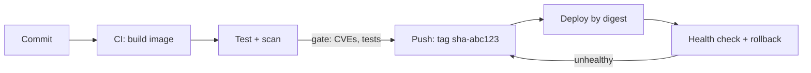

# Production and interviews

*Module 18 · Capstone*

The module that decides whether anything from modules 01-17 is allowed near real traffic - plus the
question bank that gets you through the interview.

[Course home](../index.md) / Module 18

## 1. Security checklist

Work down it. Every line is something an assessor will ask about.

| Control | Why | How |
| --- | --- | --- |
| **Non-root user** | Root inside is one flaw from root outside | `USER app` in the Dockerfile; verify with `whoami` |
| **Read-only root filesystem** | Most exploits need to write | `--read-only` plus `--tmpfs /tmp` |
| **Drop capabilities** | Containers get more than they need by default | `--cap-drop ALL --cap-add NET_BIND_SERVICE` |
| **Never `--privileged`** | Effectively removes the fence | If something "needs" it, redesign |
| **No Docker socket in containers** | Socket access is root on the host | Use a proper CI runner or a socket proxy |
| **No secrets in images or `-e`** | Visible in layers, `inspect` and `ps` | File-based secrets, `tmpfs`, or a secret manager |
| **Minimal base image** | Fewer packages, fewer CVEs | Alpine, slim, distroless, scratch |
| **Scan in CI, fail the build** | Catch known CVEs before deploy | `docker scout cves`, Trivy, Grype |
| **Pin base images** | A moving tag changes production silently | Version tag, ideally digest |
| **Patch the host kernel** | It is the shared component | Host patching schedule, not image rebuilds |
| **Seccomp and AppArmor on** | Restricts which syscalls are even attempted | Keep the defaults; do not disable to "fix" a problem |
| **Segment networks** | Database should not be reachable from the edge | Frontend/backend user-defined networks |

> **WARNING - The three that cause real incidents**
>
> Running as root, mounting the Docker socket, and publishing a database on `0.0.0.0`. Every container security review starts by looking for exactly these three.

## 2. Resource limits and health

```bash
docker run -d --name api \
  -m 512m --memory-reservation 256m \
  --cpus 1.5 \
  --pids-limit 200 \
  --restart unless-stopped \
  --health-cmd "wget -qO- http://localhost:8080/health || exit 1" \
  --health-interval 30s --health-retries 3 \
  myapi:1.4.2
```

| Setting | Without it |
| --- | --- |
| `-m` memory limit | One leaking container OOMs the whole host |
| `--cpus` | A busy loop starves every neighbour |
| `--pids-limit` | A fork bomb takes the host down |
| `--restart` | A crash at 3am stays down until someone notices |
| `HEALTHCHECK` | A hung-but-running process keeps receiving traffic |

> **TIP - Liveness is not readiness**
>
> "The process is alive" and "the process can serve requests" are different questions. A JVM warming up is alive but not ready. Model both, and let the load balancer use readiness so you do not send traffic into a cold start.

## 3. Logging and observability

| Practice | Detail |
| --- | --- |
| **Log to stdout/stderr** | The container runtime collects it. Do not write log files inside a container |
| **Structured JSON logs** | Parseable by your aggregator; include a request ID |
| **Rotate logs** | Default `json-file` grows until the disk is full - set `max-size` and `max-file` |
| **Ship logs off the host** | The host is disposable; the logs must not be |
| **Metrics endpoint** | Expose `/metrics`; scrape it |
| **Label images** | `org.opencontainers.image.source` and `revision` so an incident traces to a commit |

```json
// /etc/docker/daemon.json
{
  "log-driver": "json-file",
  "log-opts": { "max-size": "10m", "max-file": "3" }
}
```

> **WARNING - The disk-full incident everyone has once**
>
> Default log settings are unbounded. A chatty container fills `/var/lib/docker`, the daemon starts failing, and every container on the host degrades at the same time. Set rotation on day one.

## 4. Image and start-up performance

| Lever | Effect | Cost |
| --- | --- | --- |
| Multi-stage build | Largest single size reduction | None - do it always |
| Slim/Alpine/distroless base | Big reduction | Alpine uses musl; test carefully |
| Order layers by change frequency | Fast CI rebuilds | None - just instruction order |
| BuildKit cache mounts | Dependency install cached across builds | Slightly more complex Dockerfile |
| Registry near your nodes | Faster pulls, lower egress | Mirror to run |
| Pre-pull images on nodes | Removes pull time from scaling | Extra orchestration |

Remember what image size costs: pull time on every node, cold-start latency when scaling out, registry
storage and egress, and attack surface. A 1 GB image on 50 nodes is 50 GB of transfer per deploy.

## 5. CI/CD shape



> **Why it matters:** Build the image **once** and promote the same bytes through every environment. Rebuilding per environment reintroduces exactly the drift containers were meant to remove.

| Rule | Reason |
| --- | --- |
| Build once, promote the artefact | Identical bytes in test and production |
| Tag with the commit SHA | Every running container traces to a commit |
| Deploy by digest in regulated environments | Immutable reference |
| Scan and test before push | Do not publish something you already know is broken |
| Keep the previous tag warm | Rollback is a deploy of the old digest |

## 6. When Docker alone is not enough

| Symptom | You have outgrown single-host Docker |
| --- | --- |
| One host is a single point of failure | Need multi-host scheduling |
| Manual scaling during traffic peaks | Need autoscaling |
| Deploys cause downtime | Need rolling updates with health gating |
| Restarting containers by hand at night | Need self-healing |
| Config and secrets copied between hosts | Need a control plane |

That is Kubernetes, ECS or Nomad. But move for a reason from that list - not because it is fashionable.
A single well-run Docker host with Compose, backups and monitoring beats a badly run cluster every time.

## 7. Production readiness checklist

- [ ] Image built from a pinned, minimal, scanned base
- [ ] Multi-stage build; no compilers or source in the final image
- [ ] Runs as a non-root user; read-only root filesystem where possible
- [ ] No secrets in the image, environment or build args
- [ ] Memory, CPU and PID limits set
- [ ] Health check defined; app handles SIGTERM and shuts down cleanly
- [ ] All state in named volumes; backup **and tested restore**
- [ ] Logs to stdout, rotated, shipped off the host
- [ ] Networks segmented; databases not published
- [ ] Restart policy set
- [ ] Deployed by immutable tag or digest, traceable to a commit
- [ ] Rollback procedure documented and rehearsed

> **ASSIGNMENT - Capstone**
>
> Take one real service end to end: multi-stage Dockerfile, Compose stack with health checks and limits, volume backup with a tested restore, CI that builds/scans/pushes with a SHA tag, and a one-page runbook covering deploy, rollback, backup, restore and the commands that destroy data. Then write a short design note recording image size before/after, build time before/after, CVE count, and cost per environment. That document is both your portfolio piece and your interview script.

## 8. Interview question bank

<details>
<summary><b>Explain containers to a non-technical stakeholder.</b></summary>

A container packages an application together with everything it needs to run - runtime, libraries,
configuration - so it behaves identically on a developer's laptop, in test and in production. Unlike a
virtual machine it does not carry a whole operating system, so it starts in under a second and you can fit
many more on the same hardware. The business outcomes are fewer environment-related failures, faster
releases and better hardware utilisation.

</details>

<details>
<summary><b>What is the difference between an image and a container?</b></summary>

An image is an immutable, layered template plus metadata. A container is a running or stopped instance of
that image with its own writable layer. One image, many containers; the image layers are shared on disk.

</details>

<details>
<summary><b>How do containers achieve isolation?</b></summary>

Linux kernel features: namespaces isolate what a process can see (PIDs, network, mounts, hostname, IPC,
users), cgroups limit and account for what it can use (CPU, memory, I/O, PIDs), and a union filesystem
provides layered images with copy-on-write. The kernel itself is shared with the host.

</details>

<details>
<summary><b>How would you reduce a 1.2 GB image?</b></summary>

Run `docker history` to find the large layers. Then: multi-stage build so build tooling never ships, a
slim or Alpine base, clean package caches inside the same `RUN`, add `.dockerignore`, and consider
distroless or scratch for a static binary. Measure size, build time and CVE count before and after.

</details>

<details>
<summary><b>A container keeps restarting in production. How do you debug it?</b></summary>

`docker ps -a` for the exit code, `docker logs` for the application output, `docker inspect` for
`OOMKilled` and the restart policy. Code 137 points at memory limits or an ignored SIGTERM; 127 at a
missing binary; 1 at an application error. Then check whether a dependency is unreachable and whether the
health check is failing.

</details>

<details>
<summary><b>How do you handle secrets?</b></summary>

Never in the image, never in `ENV`, never in build args - they persist in layers and are visible in
`inspect`. Use file-based secrets mounted at runtime, `tmpfs`, or a secret manager with short-lived
credentials, and use BuildKit build secrets when something is needed only at build time.

</details>

<details>
<summary><b>Your team wants to run the database in a container. What do you say?</b></summary>

It is technically fine and common in development and CI. In production it demands named volumes with
tested backup and restore, resource limits, careful storage performance, and a clear failover story - and
on a single host you have a single point of failure. If a managed database is available, that is usually
the better use of the team's time; if not, containerise it deliberately with those controls in place.

</details>

<details>
<summary><b>How do you make deployments reproducible?</b></summary>

Build the image once in CI, tag it with the commit SHA, scan and test it, push it, and deploy that exact
digest to every environment. Never rebuild per environment, never deploy a moving tag, and keep the
previous digest available so rollback is a deploy rather than a rebuild.

</details>

<details>
<summary><b>When would you not use containers?</b></summary>

When the workload needs its own kernel or kernel modules; Windows workloads on Linux infrastructure;
hostile multi-tenancy that needs hypervisor isolation; legacy software whose installer and lifecycle
assume a long-lived OS; or when the migration effort exceeds the benefit. Use VMs, or containers inside
VMs to get both boundaries.

</details>

<details>
<summary><b>What is the biggest mistake teams make when adopting Docker?</b></summary>

Treating containers as small VMs - SSHing in, patching in place, storing data in the writable layer. That
gives all of the complexity and none of the benefit. The shift is to immutable infrastructure: rebuild the
image, replace the container, keep state in volumes and external stores.

</details>

---

[← Module 17](17-monitoring-logging.md) &nbsp;&nbsp;|&nbsp;&nbsp; [Module 19: Docker in Salesforce, AI and cloud work →](19-salesforce-ai-cloud.md)

---

Docker: Zero to Architect · Himanshu Kumar. Docker versions and commands change - verify against the official documentation before you ship.
