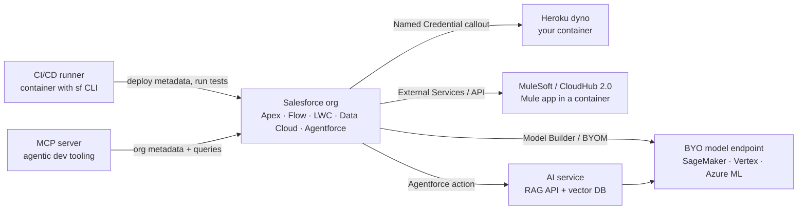
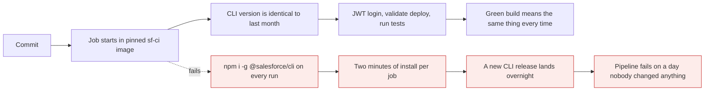
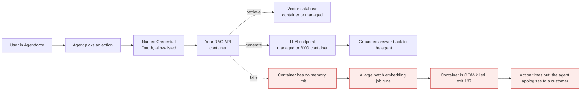

# Docker in Salesforce, AI and cloud work

*Module 19 · Applied*

Eighteen modules of theory, applied to the platform you actually work on. This module answers the
question a Salesforce architect gets asked in every interview and every design review: *Salesforce is
SaaS - so why does anyone on this programme need containers at all?*

[Course home](../index.md) / Module 19

## 1. The honest starting point

You cannot containerize Salesforce.

Sales Cloud, Service Cloud, Data Cloud and Agentforce run on Salesforce's own multi-tenant
infrastructure. Apex, Flow and LWC execute there. There is no image to build, no daemon to run, no
`docker run salesforce/core`. Anyone who tells you otherwise has confused Salesforce with a self-hosted
product.

| Thing | Can it run in your container? | Why |
| --- | --- | --- |
| Apex, Flow, LWC, objects | **No** | Executes on Salesforce's multi-tenant runtime |
| A local copy of your org | **No** | Use a scratch org or sandbox - that is what they are for |
| Salesforce CLI (`sf`) | **Yes** | It is a Node application that talks to the org over API |
| Your integration middleware | **Yes** | It is your code on your infrastructure |
| Your AI / RAG service behind Agentforce | **Yes** | Same - your code, your infrastructure |
| MuleSoft runtime | **Yes** | Runtime Fabric and CloudHub 2.0 are container platforms |

So the real question is not "how do I containerize Salesforce". It is **"what surrounds Salesforce, and
what runs that?"** - and the answer today is almost always containers.

## 2. Where Docker actually shows up on a Salesforce programme



> **Why it matters:** Every arrow leaving the org points at something you own and operate. Salesforce gives you nowhere to run code that is long-running, memory-hungry, written in Python, or dependent on a library that is not on the platform. That gap is exactly the shape of a container.

Five places containers earn their keep, in order of how often you will meet them:

| # | Use | Who touches it |
| --- | --- | --- |
| 1 | CI/CD: `sf` CLI, tests, static analysis in a pinned image | Every developer, every commit |
| 2 | Heroku: your own service next to the org | Integration and platform engineers |
| 3 | MuleSoft / integration runtimes | Integration architects |
| 4 | AI: RAG services, model endpoints behind Agentforce | AI and data teams |
| 5 | Local dev: mocks, databases, MCP servers | Every developer, locally |

## 3. The daily win: Salesforce CLI in a container

This is the one that pays for itself in week one.

```dockerfile
# sf-ci image - pinned, reproducible, built once
FROM node:20-alpine

ARG SF_CLI_VERSION=2.100.0
RUN npm install --global @salesforce/cli@${SF_CLI_VERSION} \
 && sf --version

RUN apk add --no-cache git openjdk17-jre-headless \
 && sf plugins install code-analyzer

RUN addgroup -S ci && adduser -S -G ci ci
USER ci
WORKDIR /workspace
```

```bash
docker build -t ghcr.io/myorg/sf-ci:2026-09 .
docker push ghcr.io/myorg/sf-ci:2026-09
```

Used in a pipeline:

```yaml
# .github/workflows/validate.yml
jobs:
  validate:
    runs-on: ubuntu-latest
    container:
      image: ghcr.io/myorg/sf-ci:2026-09
    steps:
      - uses: actions/checkout@v4

      - name: Authenticate with JWT
        run: |
          echo "$SF_JWT_KEY" > /tmp/server.key
          sf org login jwt \
            --client-id "$SF_CLIENT_ID" \
            --jwt-key-file /tmp/server.key \
            --username "$SF_USERNAME" \
            --instance-url https://test.salesforce.com \
            --alias ci
        env:
          SF_JWT_KEY: ${{ secrets.SF_JWT_KEY }}
          SF_CLIENT_ID: ${{ secrets.SF_CLIENT_ID }}
          SF_USERNAME: ${{ secrets.SF_USERNAME }}

      - run: sf project deploy validate --target-org ci --test-level RunLocalTests
      - run: sf code-analyzer run --workspace force-app
      - run: npm ci && npm run test:unit
```



> **WARNING - "It broke and we changed nothing" is a version pin problem**
>
> An unpinned `npm install --global @salesforce/cli` means your build depends on whatever was published last night. Pin the version in the image, roll it forward deliberately in a pull request, and CLI upgrades stop being incidents.

| Without a CI image | With a pinned CI image |
| --- | --- |
| CLI version differs per runner and per laptop | One version, in git, upgraded on purpose |
| 2-4 minutes of tool install per job | Cached image pull, seconds |
| "Works on my machine" during release week | Same container locally and in CI |
| Java/scanner setup documented in a wiki nobody reads | Documented in a Dockerfile that is executed |

> **TIP - Run the CI image locally**
>
> ```bash
> docker run --rm -it -v "${PWD}:/workspace" ghcr.io/myorg/sf-ci:2026-09 sh
> ```
> Now your laptop reproduces the pipeline exactly. Half of "why does CI fail but it works here" disappears.

## 4. Heroku: the supported place to run your own container next to the org

Salesforce Functions was retired, and the answer to "where does my custom code run" moved to Heroku -
which is a first-class container platform.

```bash
heroku container:login
docker build -t registry.heroku.com/my-service/web .
docker push registry.heroku.com/my-service/web
heroku container:release web --app my-service
```

Three rules that catch every newcomer:

| Rule | Why |
| --- | --- |
| Bind to `$PORT`, not a hard-coded port | The platform injects the port; `EXPOSE 8080` means nothing there |
| The filesystem is ephemeral | Exactly module 11's writable layer - a restart wipes it. Use Postgres or S3 |
| Config comes from environment variables | No `.env` in the image, ever |

```dockerfile
FROM python:3.12-slim
WORKDIR /app
COPY requirements.txt .
RUN pip install --no-cache-dir -r requirements.txt
COPY . .
RUN useradd -r -u 1001 app && chown -R app /app
USER app
CMD ["sh", "-c", "uvicorn main:app --host 0.0.0.0 --port ${PORT:-8000}"]
```

The org reaches it through a **Named Credential** plus an Apex callout, External Services, or a Flow HTTP
action. From Salesforce's side it is just an authenticated HTTPS endpoint - it does not know or care that
a container is behind it.

| Put it in Apex on-platform | Put it in a container |
| --- | --- |
| CRUD, validation, record-triggered logic | Anything over the Apex CPU or heap limit |
| Small callouts, orchestration | Long-running jobs, batch ETL, streaming consumers |
| Anything that must respect sharing natively | Python / ML / numeric libraries with no Apex equivalent |
| Logic that belongs to the data model | PDF generation, image processing, heavy transforms |

> **NOTE - Governor limits are an architecture signal**
>
> When a requirement keeps hitting Apex heap, CPU or callout limits, that is not a tuning problem. It is the platform telling you the workload belongs off-platform. A container is usually the cheapest correct answer.

## 5. MuleSoft and integration runtimes

If the programme uses MuleSoft, containers are already there whether the team says the word or not.

| Deployment target | What it really is |
| --- | --- |
| CloudHub 2.0 | Your Mule application running as a container on MuleSoft-managed Kubernetes |
| Runtime Fabric | The same, on **your** Kubernetes cluster in your cloud account |
| Standalone / hybrid | Mule runtime you operate, very commonly in a container |

Which means every lesson from modules 15-17 applies directly: resource requests and limits decide
whether your API scales, log drivers decide whether you can debug an incident, and health checks decide
whether a hung worker is replaced or quietly drops messages.

> **TIP - The architecture answer interviewers want**
>
> "Runtime Fabric gives me deployment inside my own network and cloud account, so data residency and private connectivity are mine to control; CloudHub 2.0 gives me less operational burden. Both are containers - the difference is who runs the cluster." That single sentence signals you understand the platform rather than the marketing.

## 6. AI: what actually sits behind an Agentforce action

Agentforce reasons and orchestrates. It does not host your model or your document index. Everything below
the agent is yours to run.



> **Why it matters:** An AI failure in front of a customer looks like a *product* failure, but the cause here is module 16 - an unlimited container. Agent actions are user-facing and synchronous, so limits, health checks and timeouts are not hygiene, they are the customer experience.

### 6.1 Bring your own model

Salesforce Model Builder / Einstein Studio can connect to a model endpoint you host on Amazon SageMaker,
Google Vertex AI, Azure ML or Databricks. Every one of those platforms deploys models as **container
images** implementing an inference contract - typically a health route and a predict route.

```dockerfile
FROM python:3.12-slim
WORKDIR /opt/ml
COPY requirements.txt .
RUN pip install --no-cache-dir -r requirements.txt
COPY serve.py model/ ./
ENV MODEL_PATH=/opt/ml/model
EXPOSE 8080
CMD ["python", "serve.py"]        # exposes /ping and /invocations
```

So "bring your own model to Salesforce" is, in practice, "build a container that answers a health check
and a predict call". Modules 09, 16 and 17 are the whole job.

### 6.2 A local RAG stack for Salesforce content

```yaml
name: sf-rag

services:
  api:
    build: ./api
    ports:
      - "127.0.0.1:8000:8000"
    environment:
      QDRANT_URL: http://vectors:6333
      SF_LOGIN_URL: https://test.salesforce.com
    depends_on:
      vectors:
        condition: service_started
    deploy:
      resources:
        limits:
          memory: 2G

  vectors:
    image: qdrant/qdrant:latest
    volumes:
      - qdrant:/qdrant/storage

  cache:
    image: redis:7-alpine
    command: ["redis-server", "--maxmemory", "256mb", "--maxmemory-policy", "allkeys-lru"]

volumes:
  qdrant:
```

```bash
docker compose up -d
docker compose logs -f api
```

One command gives a new joiner the whole retrieval stack. The index of Knowledge articles lives in a
**named volume**, so `docker compose down` does not force a six-hour re-embedding run - module 11, being
useful.

| Layer | Runs where | Container? |
| --- | --- | --- |
| Agent reasoning, topics, actions | Salesforce | No |
| Data Cloud unification and search | Salesforce | No |
| Your retrieval / business API | Your cloud or Heroku | **Yes** |
| Vector database | Managed service or your cluster | **Yes** |
| Embedding model | Managed API, or self-hosted | **Yes**, if self-hosted |
| Fine-tuned or custom model | SageMaker / Vertex / Azure ML | **Yes**, always |

> **WARNING - Never send more org data to a model than the user could see**
>
> A retrieval service running as an integration user can read far more than the person chatting with the agent. Filter results by the *user's* access, not the service account's, before anything reaches a prompt. A container makes it easy to accidentally bypass sharing - the platform is no longer enforcing it for you.

## 7. MCP servers and the agentic dev loop

Coding agents reach your tools through MCP servers, and a container is the natural unit for one: pinned
version, declared dependencies, no host pollution, and a boundary you control.

```bash
docker run --rm -i \
  -e SF_ORG_ALIAS=devhub \
  -v "${HOME}/.sfdx:/home/node/.sfdx:ro" \
  ghcr.io/myorg/sf-mcp:2026-09
```

| Practice | Reason |
| --- | --- |
| Pin the image tag | The agent's toolset stops changing under you |
| Mount credentials read-only, never `COPY` them | Secrets in a layer are permanent |
| Point dev agents at a **scratch org or sandbox** | An agent with production write access is an incident waiting for a schedule |
| Start read-only, add write tools deliberately | Least privilege, applied to your assistant |
| Drop capabilities, run as non-root | Module 18's checklist, unchanged |

> **NOTE - Treat tool output as untrusted input**
>
> Anything an MCP server returns - a record description, a case comment, a Knowledge article - is data written by a user, and it lands in a model's context. A container gives you the isolation boundary, but it does not sanitise content. Assume prompt injection is possible in any org text field.

## 8. Local development that matches production

```yaml
name: sf-local

services:
  wiremock:
    image: wiremock/wiremock:latest
    ports:
      - "8089:8080"
    volumes:
      - ./mocks:/home/wiremock/mappings:ro     # fake Salesforce REST responses

  db:
    image: postgres:16
    environment:
      POSTGRES_PASSWORD: local
    volumes:
      - pgdata:/var/lib/postgresql/data

  broker:
    image: apache/kafka:latest
    ports:
      - "9092:9092"

volumes:
  pgdata:
```

What this buys a Salesforce team:

- **Integration tests without an org.** WireMock replays recorded REST and Bulk API responses, so tests
  run offline, deterministically, and without burning API calls.
- **Platform Event consumers tested locally.** Kafka in a container stands in for the streaming layer
  while you develop the consumer.
- **Identical Node, Java and CLI versions** for every developer, via the same image CI uses.
- **A new joiner productive on day one**: clone, `docker compose up -d`, `sf org create scratch`.

> **TIP - Scratch orgs and containers are complementary**
>
> The container gives you deterministic *tooling*; the scratch org gives you a real *org*. Neither replaces the other, and trying to simulate Salesforce inside a container is a well-known way to waste a quarter.

## 9. Security, with Salesforce-shaped teeth

| Rule | Salesforce-specific consequence if ignored |
| --- | --- |
| Never `COPY` `server.key`, a connected app secret or a refresh token into an image | Anyone who can pull that image has your org. Layers keep it forever, even if a later step deletes it |
| Use build secrets and runtime secrets | `RUN --mount=type=secret`, platform secret stores, `docker secret` in Swarm |
| Integration user, not System Administrator | A compromised container inherits exactly the permission set you gave it |
| Do not log request or response bodies at info level | Module 17's log pipeline will happily archive customer PII for a year |
| Pin base images and scan them | Your container is inside the trust boundary of an org holding regulated data |
| Restrict egress, and use IP relaxation deliberately | An allow-listed container IP is a credential of its own |
| Remember the `docker` group is root | Module 05 - on a build agent that also holds org credentials, that is the whole estate |

> **WARNING - The image is the credential**
>
> The single most common Salesforce container mistake is baking org auth into an image "just for CI". `docker history` will show it, the registry will keep it, and rotating the connected app is then the only remedy. Inject credentials at runtime, always.

## 10. Cost, performance, and when not to reach for a container

| Situation | Better answer |
| --- | --- |
| "Let's run Salesforce locally in Docker" | Scratch org. This is not possible and never will be |
| Caching a few config values | Platform Cache, on-platform |
| A nightly job well within Apex limits | Batch Apex or Scheduled Flow |
| A small callout transformation | Apex, or External Services |
| CPU/heap limits hit repeatedly, Python libraries needed, long-running work | **Container** on Heroku or your cloud |
| Same tooling needed by ten developers and CI | **Container** image, pinned |

Three numbers to bring to any review, straight from earlier modules: image size (pull time on every
deploy and rollback), memory limit versus observed peak (module 16), and p95 latency of the action the
agent calls (module 17). An architect who quotes those three is having a different conversation from one
who says "we'll containerize it".

> **PRACTICE - Practice now**
>
> 1. Build an `sf-ci` image with a pinned CLI version. Run `sf --version` inside it.
> 2. Mount your project into it and run `sf project deploy validate` against a scratch org.
> 3. Use the same image in a pipeline job and confirm the versions match your laptop exactly.
> 4. Bump the pinned CLI version in a branch and see the change as a reviewable diff.
> 5. Containerize a tiny API, deploy it to Heroku, and call it from Apex through a Named Credential.
> 6. Break it on purpose: hard-code a port instead of `$PORT` and read the crash log.
> 7. Bring up the RAG Compose stack, index ten Knowledge articles, and query it.
> 8. Remove the memory limit from the API service, run a large embedding batch, and find exit code 137.
> 9. Run `docker history` on an image where you deliberately copied a dummy key, and find the key.
> 10. Stand up the WireMock stack and run one integration test with no org connection at all.

> **ASSIGNMENT - Assignment**
>
> Take a real requirement from your current programme that keeps hitting a governor limit. Write a two-page decision record: why it does not belong in Apex, what the container does, where it runs (Heroku, Runtime Fabric or your cloud), how Salesforce authenticates to it, what the memory and CPU limits are and how you chose them, what it logs and what it must never log, and what the rollback is. Then price it. That document is the difference between a developer who knows Docker and an architect who uses it.

## 11. Interview drill

<details>
<summary><b>Salesforce is SaaS. Why would a Salesforce architect need Docker at all?</b></summary>

Because nothing outside the org is SaaS. The CI/CD toolchain, integration middleware, AI and retrieval
services, custom model endpoints, and anything that exceeds Apex governor limits all run on
infrastructure you own - and today that infrastructure is containers. Salesforce itself cannot be
containerized; everything you build around it almost certainly is.

</details>

<details>
<summary><b>Where does custom code run now that Salesforce Functions is retired?</b></summary>

On Heroku, or on your own cloud, reached from the org through a Named Credential with Apex callouts,
External Services or Flow HTTP actions. Heroku accepts a container image directly via its container
registry, which makes it the shortest supported path from a Dockerfile to something an org can call.

</details>

<details>
<summary><b>How do you decide between Apex and an off-platform container?</b></summary>

Governor limits are the signal. Data-model logic, sharing-aware CRUD and orchestration belong in Apex.
Work that repeatedly hits CPU, heap or callout limits, needs libraries with no Apex equivalent, runs for
a long time, or is CPU/memory intensive belongs off-platform. Choosing a container for convenience rather
than a limit usually adds an operational burden with no benefit.

</details>

<details>
<summary><b>What runs in a container behind an Agentforce action?</b></summary>

Typically a retrieval or business API, a vector database, and sometimes a self-hosted embedding or custom
model. The agent orchestrates and reasons on the platform; the retrieval and generation path is yours.
Because agent actions are synchronous and customer-facing, resource limits, health checks and timeouts
directly determine whether the customer gets an answer or an apology.

</details>

<details>
<summary><b>Your CI pipeline failed overnight and nobody changed the code. What do you check first?</b></summary>

Whether the toolchain is pinned. An unpinned global install of the Salesforce CLI, a `latest` base image,
or an unpinned scanner plugin means the build depends on whatever was published last night. The fix is a
pinned CI image, version bumped deliberately in a pull request.

</details>

<details>
<summary><b>What is the biggest container security mistake specific to Salesforce work?</b></summary>

Baking org credentials - a JWT server key, a connected app secret, a refresh token - into the image.
Layers are immutable, so deleting the file in a later step does not remove it; `docker history` and
anyone with registry pull access can recover it, and the only real remedy is rotating the connected app.
Inject credentials at runtime through platform secrets or build secrets, and use a least-privilege
integration user rather than an administrator.

</details>

<details>
<summary><b>CloudHub 2.0 or Runtime Fabric - how do you frame the choice?</b></summary>

Both run your Mule application as a container. CloudHub 2.0 is MuleSoft-managed, so you carry less
operational burden. Runtime Fabric runs on your own Kubernetes in your own cloud account, so data
residency, private network connectivity and cluster policy are under your control. The decision is about
who operates the cluster and where the data sits, not about capability.

</details>

---

[← Module 18](18-production.md) &nbsp;&nbsp;|&nbsp;&nbsp; [Course home](../index.md)

---

Docker: Zero to Architect · Himanshu Kumar.
