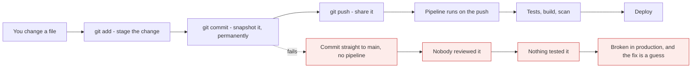

# Git & Pipelines: Zero to Architect

*Course overview*

Git is two things at once, and confusing them is why it feels hard. It is a **content store**
that never loses anything, and it is a **collaboration protocol** for teams. Learn the store
first and the commands stop looking arbitrary.

[Repo home](../README.md) / Git

---

## How to read this

| Block | What it gives you |
| --- | --- |
| **Mental model** | The one idea the rest of the lesson hangs off |
| **Mechanics** | What each command actually does, and to which tree |
| **Build it** | Commands you type yourself, including the manual setup steps |
| **What breaks** | The failure path, drawn next to the happy path |
| **Cost & performance** | The numbers you bring to a review |
| **Interview drill** | Questions answered the way an architect answers them |

> **Why it matters:** That line is the whole course. Modules 01-18 make the left half reliable; modules 19-24 make the right half automatic. Most teams learn the left half and skip the right, which is exactly how you get a repository full of good commits and a production estate nobody can safely change.

---

## Where this goes

| Stage | Modules | You will be able to |
| --- | --- | --- |
| **Foundations** | 01-04 | Explain what Git stores, set it up correctly, and make your first commits |
| **Daily work** | 05-10 | Branch, merge, undo anything, and recover work you thought was gone |
| **Working with people** | 11-14 | Run a review workflow, pick a branching strategy, and cut releases |
| **Power tools** | 15-18 | Rewrite history safely, automate locally, handle big repos, read Git internals |
| **Pipelines** | 19-24 | Build a real CI/CD pipeline with tests, scanning, environments and secrets |
| **Applied** | 25 | Run all of it against a Salesforce org |

---

## Modules

Building now. Cards appear here as each module is finished.

### [Why Git exists, and what Git is](lessons/01-why-git-exists.md)

`MODULE 01`

The problem it solves, and the sentence that removes half the confusion.

- life before version control, and the five things that break
- centralised vs distributed, and what "distributed" buys you
- Git stores **snapshots**, not differences
- **Git is not GitHub** - and why that matters more than it sounds
- where Git sits in a delivery pipeline
- when Git is the wrong tool

### [Install and configure Git](lessons/02-install-and-configure.md)

`MODULE 02`

The setup nobody documents, and the settings that cause pain later.

- install on Windows, macOS and Linux - the manual steps
- identity, and why commits are attributed by **email**
- the three config levels: system, global, local
- line endings on Windows - the setting behind every `CRLF` warning
- HTTPS vs SSH, credential helpers, and generating an SSH key
- a global `.gitignore`, and aliases worth having

### [The three trees](lessons/03-three-trees.md)

`MODULE 03`

Learn this and the commands stop looking arbitrary.

- working directory, staging area, repository - and where each lives on disk
- **why the staging area exists**, which is the question nobody answers
- the four states a file can be in, and reading `git status -s`
- three different `git diff` commands, comparing three different pairs
- the one command that can genuinely lose your work

### [Your first repository](lessons/04-first-repository.md)

`MODULE 04`

The loop you will run several thousand times.

- what `git init` actually creates
- the daily loop, including the two steps beginners skip
- `git add` variants, and `-p` hunk by hunk
- commit messages written for the person debugging this in a year
- `git log -S`, `--graph`, `blame` - finding when a line appeared
- `.gitignore` written **first**, and why it does nothing to tracked files

### [Undoing things safely](lessons/05-undoing-things.md)

`MODULE 05`

Five commands that all seem to undo things, and are not interchangeable.

- start from the question, and the question is **has this been pushed?**
- `reset --soft` vs `--mixed` vs `--hard`, and exactly what each moves
- `revert` as the only safe undo for shared history
- why `switch` and `restore` were split out of `checkout`
- `git clean -fdx` and the `.env` it deletes
- **`git reflog`** - anything committed can be recovered

### [Branching and merging](lessons/06-branching-and-merging.md)

`MODULE 06`

The feature that made Git win, and it is 41 bytes.

- a branch is a file containing a hash - proved on disk
- creating, switching, deleting, and naming that survives a team
- fast-forward vs three-way, and why it is called three-way
- `--no-ff`, and which one your team should pick
- deleting merged vs unmerged branches
- detached HEAD, and getting out of it without losing commits

### [Remotes](lessons/07-remotes.md)

`MODULE 07`

The concept most people never learn explicitly.

- a remote is just a named URL, and `origin` is not special
- the **three** kinds of branch, and why `origin/main` is only a cached note
- `fetch` is always safe; `pull` is fetch plus merge
- the merge commit nobody typed, and `pull --rebase`
- the rejected push, and why forcing past it destroys someone's work
- tracking branches, pruning, and the fork workflow

### [Merge conflicts](lessons/08-merge-conflicts.md)

`MODULE 08`

Not a failure - Git refusing to guess.

- exactly when Git merges automatically and when it stops
- reading the markers, and the `zdiff3` setting that shows the base
- resolve, `add`, `commit` - and the markers people commit by accident
- `--ours`, `--theirs`, `mergetool`, `--abort`
- **ours and theirs flip during a rebase** - the trap that catches everyone
- `rerere`, and the process habits that prevent conflicts entirely

### [Rebase vs merge](lessons/09-rebase-vs-merge.md)

`MODULE 09`

The argument that never ends, because both sides describe different problems.

- rebase does not move commits, it **copies** them - new hashes
- the two history shapes, compared honestly
- the golden rule, and what actually happens when you break it
- merge commit vs rebase-and-merge vs squash - and why squash suits most teams
- `pull --rebase`: the one rebase everyone should turn on
- `rebase --onto`, `ORIG_HEAD`, and recovering from a bad rebase

### [The rescue kit](lessons/10-rescue-kit.md)

`MODULE 10`

Four commands that turn "I have ruined everything" into two minutes.

- `stash`, and the untracked files it silently leaves behind
- `cherry-pick` copies a change - right for a backport, wrong for moving work
- `reflog`: what it can recover, and what it cannot
- **`bisect`**: 1,000 commits in ~10 tests, and `bisect run` unattended
- a disaster recipe table for the situations that actually happen
- `git worktree` - two branches checked out at once

### [Pull requests and review](lessons/11-pull-requests.md)

`MODULE 11`

Not a Git feature - a platform feature, and where your process lives.

- the four gates between push and merge
- `gh pr` from the terminal, including `gh pr checkout`
- why review quality collapses past a few hundred lines
- a PR template, and never mixing formatting with logic
- reviewing well - and why "Request changes" blocks a colleague
- branch protection, CODEOWNERS, and picking exactly one merge method

### [Branching strategies](lessons/12-branching-strategies.md)

`MODULE 12`

The right answer is decided by how often you deploy.

- trunk-based, GitHub Flow, Git Flow - and what each was designed for
- feature flags are not optional in trunk-based, they are the mechanism
- why Git Flow is usually mismatched today, per its own author
- why a branch per environment drifts, and what to promote instead
- the choosing table, and the comparison across eight dimensions
- **branch lifetime dominates every other variable**

### [Commit hygiene](lessons/13-commit-hygiene.md)

`MODULE 13`

Careless commits do not look untidy - they disable the tools.

- atomic commits, and the four features that depend on granularity
- subject, body, footer - and why the body answers what the diff cannot
- Conventional Commits, and the automation they unlock
- trailers: `Fixes`, `Co-authored-by`, `Signed-off-by`
- enforcing it: local hooks advise, CI binds
- if you squash-merge, only the **PR title** matters

### [Tags, releases and versioning](lessons/14-tags-and-releases.md)

`MODULE 14`

Giving a commit a name, and that name a meaning.

- lightweight vs annotated, and why releases must be annotated
- **tags are not pushed by default** - the mistake everyone makes once
- semantic versioning, pre-releases, and what the number actually describes
- `git describe` for stamping builds and image tags
- GitHub Releases and generated notes
- automating the version, changelog and tag from commit messages

### [Rewriting history safely](lessons/15-rewriting-history.md)

`MODULE 15`

Same techniques, wildly different blast radius.

- `--amend`, and why it creates a new commit rather than editing one
- interactive rebase: reword, squash, fixup, drop, reorder, split
- `--fixup` + `--autosquash` - review feedback with no noise commits
- removing a secret from all history - **and why rotation is step one**
- **force push does not remove commits from GitHub** - verified, not assumed
- `--force-with-lease`, `range-diff`, and recovering from a bad rewrite

### [Hooks and local automation](lessons/16-hooks.md)

`MODULE 16`

Instant feedback - and the one property that decides how to use it.

- the hooks worth knowing, and when each fires
- **client hooks advise, CI binds** - `--no-verify` skips them all
- sharing hooks: `core.hooksPath`, husky + lint-staged, `pre-commit`
- hooks worth writing: conflict markers, no commits to `main`, ticket numbers
- why a slow hook trains the team to bypass every hook
- server-side hooks, and the GitHub equivalents

### [Large and multi-repo setups](lessons/17-large-repos.md)

`MODULE 17`

Architecture decisions with long consequences.

- monorepo vs polyrepo decided by **coupling**, not size
- submodules: exact, reproducible, and hostile to newcomers
- subtrees - who carries the complexity, you or every developer
- 20 GB repository: shallow vs blobless clone, sparse checkout, LFS
- why LFS must be set up **before** the first large file
- keeping a monorepo's CI fast, and the required-check trap

### [Git internals](lessons/18-git-internals.md)

`MODULE 18`

Twenty minutes here and the previous seventeen modules stop being rules.

- Git is a key-value store addressed by the hash of the content
- the four object types, walked by hand with `cat-file`
- what a commit really contains - and why rebase must change hashes
- refs: a branch is 41 bytes, proved on disk
- loose objects, packfiles, and what "losing" a commit actually means
- plumbing vs porcelain - build a commit without `git commit`

### [CI/CD fundamentals](lessons/19-cicd-fundamentals.md)

`MODULE 19`

Most broken pipelines are broken in their purpose, not their syntax.

- CI is a practice, not a build server - and it is the branch-lifetime argument again
- continuous delivery vs continuous deployment, precisely
- the stages, ordered by **speed** rather than importance
- **build once, deploy many** - and why rebuilding per environment ships something untested
- a flaky test is worse than no test
- feedback time, the four DORA metrics, and eight anti-patterns

### [Your first GitHub Actions pipeline](lessons/20-github-actions-basics.md)

`MODULE 20`

One YAML file, and every push runs whatever you tell it to.

- event → workflow → job → step → runner, key by key
- jobs are parallel, steps are sequential - and jobs share no filesystem
- triggers, and why `pull_request` matters more than `push`
- artefacts, caching keyed on the lockfile, and matrix builds
- secrets, contexts, and what masking does not protect
- the three first-week mistakes, including `fetch-depth: 0`

### [A real pipeline](lessons/21-real-pipeline.md)

`MODULE 21`

The workflow you would actually put on a production repository.

- three cheap checks in parallel, then one expensive build
- build the image on every PR, publish only from `main`
- caching that works - lockfile keys and `mode=max` for Docker layers
- four kinds of security scan, and why scanning is detection not prevention
- composite actions vs reusable workflows
- the aggregator job that fixes the skipped-required-check trap

### [Deployment](lessons/22-deployment.md)

`MODULE 22`

Approvals, scoped secrets, and no long-lived cloud keys.

- environments as gates: required reviewers, wait timers, branch restrictions
- secret scope - and why production credentials belong to an environment
- **OIDC**: short-lived credentials, with the full AWS trust policy
- the `sub` wildcard that silently undoes the whole benefit
- recreate, rolling, blue-green, canary - a blast-radius decision
- rollback must not require a build, and smoke tests that verify themselves

### [GitOps and release engineering](lessons/23-gitops.md)

`MODULE 23`

Invert the arrow: the cluster pulls its own state from Git.

- the four rules, and why continuous reconciliation is the one people skip
- why the config repo must be separate from the app repo
- folders per environment, not branches - and why merges cannot promote
- **build once, promote the artefact** - and reference it by digest, not tag
- drift, self-healing, and why it will undo your 2am emergency fix
- rollback as `git revert`, with no build in the path
- secrets when the repo is public by design: encrypt, or store a reference

### [Securing the repo and supply chain](lessons/24-securing-supply-chain.md)

`MODULE 24`

Six attacks, and the control that stops each one.

- rulesets, and the "include administrators" box that makes them real
- CODEOWNERS - and why `.github/workflows/` is the most dangerous path
- signed commits: the author field is free text until you sign it
- secret scanning vs **push protection** - detection is not prevention
- rotate first; rewriting history never substitutes for it
- pinning actions to a SHA, and the `pull_request_target` trap
- SBOM, provenance attestation, and an honest read on SLSA levels

### [Git and pipelines for Salesforce](lessons/25-salesforce.md)

`MODULE 25`

The whole course applied to a platform with no artefact and no rollback.

- what is genuinely different, and why "build once, promote" cannot apply literally
- `.forceignore`, and why profiles cause most of the merge pain teams blame on Git
- branches mapped one-to-one onto orgs
- **validate + quick deploy** - the closest thing to verify once, apply once
- JWT authentication end to end, with every manual setup step
- delta deploys, so the deployment matches the pull request
- drift detection - and why auto-committing production back into Git is the opposite of GitOps

---

Git & Pipelines: Zero to Architect · Himanshu Kumar.
