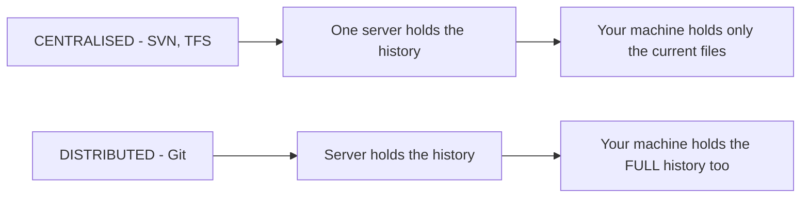
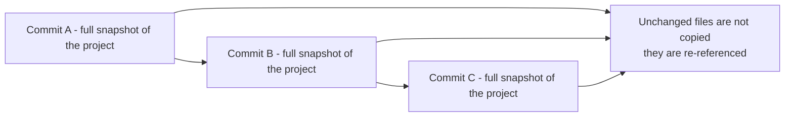
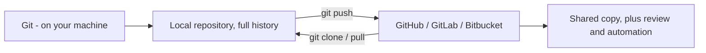
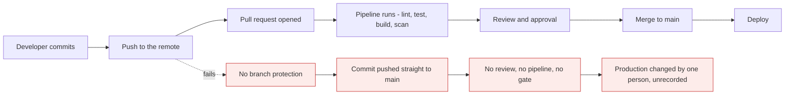

# Why Git exists, and what Git is

*Module 01 · Foundations*

Before any command, one thing has to be clear: **what problem is this solving, and what is Git
actually doing to my files?** Almost everyone learns the commands first and the model never,
which is why Git feels like a set of spells rather than a tool.

[Course home](../index.md) / Module 01

## 1. Life before version control

Everyone has lived this, in some folder somewhere:

```text
report.docx
report_v2.docx
report_v2_final.docx
report_v2_final_FIXED.docx
report_v2_final_FIXED_use_this_one.docx
report_v2_final_FIXED_use_this_one_JOHN_EDIT.docx
```

It is not a joke about naming - it is five real capabilities missing at once.

| What you cannot do | Consequence |
| --- | --- |
| See **what changed** between two versions | You compare files by eye, or not at all |
| Know **who** changed a line, and **why** | Nobody can explain the decision six months later |
| Work on two things **at the same time** | One person edits, everyone else waits |
| **Go back** to a known-good state | A bad change means restoring from a backup, if there is one |
| **Review** a change before it lands | Mistakes are found by users, in production |

A version control system exists to give you all five, permanently and cheaply.

## 2. Centralised vs distributed

Version control has had two generations, and knowing the difference explains most of Git's
design.



> **Why it matters:** In a centralised system every operation - viewing history, comparing two versions, creating a branch - is a network call to a server. In Git your clone **is** a complete repository. History, branches, diffs and commits are all local and instant, and you can work on a plane.

| | Centralised | Distributed (Git) |
| --- | --- | --- |
| Where history lives | The server only | **Every clone** |
| Commit | Needs the network | Local, instant |
| View history / diff | Network call | Local, instant |
| Branching | Expensive, discouraged | **Cheap, encouraged** |
| Server dies | History is at risk | Every developer has a full copy |
| Works offline | Barely | Almost entirely |

That last point is not a small thing: **cheap branching is what made pull requests, feature
branches and modern review culture possible.** The workflow followed the tool.

## 3. What Git actually stores

This is the sentence that removes most confusion:

> **Git stores snapshots, not differences.**

Many people assume Git saves "the change you made". It does not. Every commit records **what
every tracked file looked like at that moment**.



> **Why it matters:** Because each commit is a complete picture, checking out any commit is fast and exact - Git does not replay a chain of patches to reconstruct your project. Storage stays small because a file that did not change is not stored again; the new snapshot simply points at the same stored content. Diffs are **calculated on demand**, not stored.

Three consequences worth carrying forward:

| Consequence | Why you care |
| --- | --- |
| Every commit is identified by a **hash** of its content | Change anything and you get a different commit. History is tamper-evident |
| A commit knows its **parent** | History is a graph, which is what makes branching and merging work |
| Content is stored once, by hash | Two identical files anywhere in history are one object on disk |

That hash is why you will see things like `853e4b2` everywhere - it is the first seven
characters of the commit's identity. Module 18 opens this up properly.

## 4. Git is not GitHub

This confusion causes real problems, so be precise about it.

| | Git | GitHub |
| --- | --- | --- |
| What it is | A program on your computer | A website and hosting service |
| Made by | Linus Torvalds, 2005 | GitHub Inc, 2008, now Microsoft |
| Needs the internet | No | Yes |
| Alternatives | Mercurial, SVN, Perforce | GitLab, Bitbucket, Azure DevOps, Gitea |
| Gives you | Version control | Hosting, pull requests, issues, CI/CD, access control |



> **Why it matters:** You can use Git for years with no GitHub account, and everything in modules 01-10 works with no network at all. GitHub adds the *collaboration* layer - pull requests, reviews, permissions and pipelines. Knowing which half a problem belongs to is the first step in fixing it: "my commit failed" and "my push failed" are completely different problems.

## 5. Where Git sits in delivery

Git is not just where code is kept. In a modern setup it is the **trigger for everything
else.**



> **Why it matters:** Every automated thing your team does hangs off a Git event. That is why "learn Git" and "learn CI/CD" are really one subject, and why this course covers both - modules 19-24 are simply the right-hand side of this diagram.

## 6. When Git is the wrong tool

An architect is judged on this as much as on the rest.

| Situation | Better answer |
| --- | --- |
| Large binaries - videos, PSDs, datasets | **Git LFS**, or object storage. Git stores every version forever |
| A 50 GB game asset repository | Perforce, or LFS with care - Git was built for text |
| Secrets - passwords, keys, tokens | A secret manager. Once committed, it is in history forever |
| Generated build output | `.gitignore` it. Build artefacts belong in a registry |
| A document nobody will version | A shared drive is fine. Not everything needs a repository |

> **WARNING - Git never forgets, and that cuts both ways**
>
> Everything you commit stays in history even after you delete the file. That is a feature for code and a serious problem for a leaked credential. Removing it requires rewriting history - and as module 15 covers, even that does not remove it from a hosting service without extra steps.

## 7. Extra points

- **Git was written to manage the Linux kernel**, after the team lost access to their previous
  tool. It was built for thousands of contributors and enormous history from day one.
- **Everything in Git is content-addressed.** Files, directories, commits and tags are all
  objects named by the hash of their contents.
- **Branches are almost free.** A branch is a 41-byte file containing a commit hash - not a copy
  of your code. Module 06 proves this.
- **Nothing is deleted immediately.** Unreferenced commits survive until garbage collection,
  which is why `git reflog` can rescue almost anything.
- **The default branch is now `main`.** Older repositories and tutorials use `master`; both are
  just names for a branch.

> **PRACTICE - Practice now**
>
> No setup needed beyond Git being installed - module 02 handles installation properly if it is not.
>
> 1. Confirm Git is present and note the version:
>    ```bash
>    git --version
>    ```
> 2. **Prove a clone is a full repository.** Clone something small and look at its history:
>    ```bash
>    git clone https://github.com/octocat/Hello-World.git
>    cd Hello-World
>    git log --oneline
>    ```
> 3. **Now disconnect from the internet** - turn off Wi-Fi - and run these:
>    ```bash
>    git log --oneline --graph --all
>    git show HEAD
>    git diff HEAD~1 HEAD
>    git branch -a
>    ```
>    Everything still works. That is what "distributed" means.
> 4. **Prove commits are identified by content.** Look at any commit's full hash:
>    ```bash
>    git log -1 --format="%H%n%an%n%ae%n%ad%n%s"
>    ```
> 5. **See that a commit knows its parent:**
>    ```bash
>    git log --format="%h parent=%p %s" -5
>    ```
> 6. **See the history as a graph**, which is the shape everything else in this course operates on:
>    ```bash
>    git log --oneline --graph --all --decorate
>    ```
> 7. Reconnect, and delete the clone. You lost nothing - the full copy still exists on the
>    server, and that is the point.

> **ASSIGNMENT - Assignment**
>
> Write a short note to a colleague who has never used version control, explaining why the team should adopt it. Do not name a single command. Describe only the five capabilities from section 1, with one concrete example of each from your own work - a change nobody could explain, a rollback that took a day, two people who could not work in parallel. If the note is convincing without commands, you understand why Git exists. Everything after this module is mechanics.

## 8. Interview drill

<details>
<summary><b>What problem does version control solve?</b></summary>

It gives five things that are otherwise impossible: a precise record of what changed,
attribution of who changed it and why, the ability for several people to work in parallel
without overwriting each other, the ability to return to any previous known-good state, and a
point at which a change can be reviewed before it takes effect. Without it, teams compare files
by eye, cannot explain past decisions, serialise their work, and discover mistakes in
production.

</details>

<details>
<summary><b>What is the difference between centralised and distributed version control?</b></summary>

In a centralised system such as SVN, the history lives only on a server, so committing, viewing
history, diffing and branching are all network operations. In a distributed system such as Git,
every clone contains the complete repository and full history, so those operations are local and
instant, and work continues offline. The practical consequence is that branching became cheap,
which is what made feature branches and pull request review culture possible.

</details>

<details>
<summary><b>Does Git store differences between versions?</b></summary>

No - Git stores **snapshots**. Each commit records the complete state of every tracked file at
that moment. Files that did not change are not duplicated; the new snapshot points at the same
stored object, identified by the hash of its content. Diffs are computed on demand rather than
stored, which is why checking out any commit is fast and exact instead of replaying a chain of
patches.

</details>

<details>
<summary><b>What is the difference between Git and GitHub?</b></summary>

Git is the version control program that runs on your machine and needs no network. GitHub is a
hosting service built around Git that adds the collaboration layer - a shared remote, pull
requests, code review, issues, permissions and CI/CD. You can use Git entirely without GitHub,
and GitHub's competitors - GitLab, Bitbucket, Azure DevOps - all host the same Git repositories.
Knowing which layer a failure belongs to is the first step in diagnosing it.

</details>

<details>
<summary><b>Why is a commit hash useful?</b></summary>

Because it is derived from the commit's content - its tree, its parent, its author and its
message. Any change to any of those produces a different hash, so history is tamper-evident and
a hash uniquely identifies an exact state of the project. It also means identical content is
stored once, and that referring to `853e4b2` is an unambiguous reference to one snapshot rather
than a version number someone assigned.

</details>

<details>
<summary><b>When would you not use Git?</b></summary>

For large binary assets - video, design files, datasets - because every version is stored
forever and Git cannot diff them meaningfully; use Git LFS or object storage, or Perforce for
very large asset repositories. Never for secrets, since anything committed remains in history
even after deletion and requires a history rewrite to remove. And not for generated build
output, which belongs in an artefact registry rather than in source control.

</details>

---

[Course home](../index.md) &nbsp;&nbsp;|&nbsp;&nbsp; [Module 02: Install and configure Git →](02-install-and-configure.md)

---

Git & Pipelines: Zero to Architect · Himanshu Kumar.
