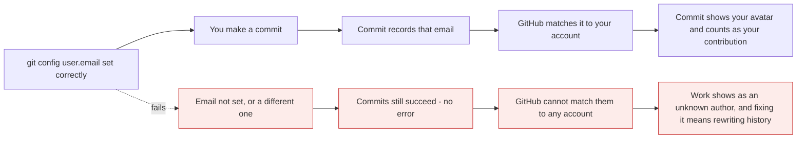
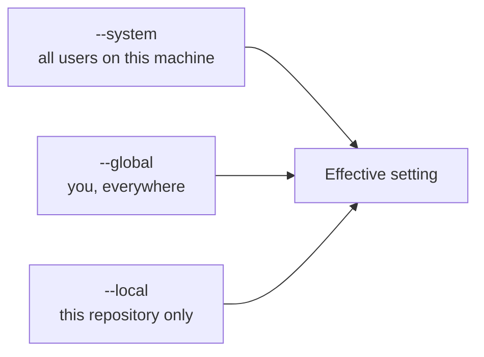

# Install and configure Git

*Module 02 · Foundations*

Nobody documents this properly, and three of these settings cause pain months later - the
Windows line-ending one is behind every `CRLF will be replaced by LF` warning you have ever
seen. Do it once, correctly, and it stops being a topic.

[Course home](../index.md) / Module 02

## 1. Install - the manual steps

| Platform | How |
| --- | --- |
| **Windows** | Download from [git-scm.com/download/win](https://git-scm.com/download/win) and run the installer |
| **macOS** | `brew install git`, or run `git --version` and accept the Xcode tools prompt |
| **Linux (Debian/Ubuntu)** | `sudo apt update && sudo apt install -y git` |
| **Linux (RHEL/Fedora)** | `sudo dnf install -y git` |

**Windows installer choices that matter** - accept the defaults except where noted:

| Screen | Choose |
| --- | --- |
| Default editor | **VS Code** if you have it, otherwise Notepad++. Not Vim, unless you know Vim |
| Default branch name | **Override to `main`** |
| PATH environment | *Git from the command line and also from 3rd-party software* |
| Line ending conversions | **Checkout as-is, commit Unix-style line endings** - see section 4 |
| Terminal emulator | *Use Windows' default console* if you live in PowerShell |
| Credential helper | **Git Credential Manager** |

Verify:

```bash
git --version
```

If a version prints, Git is installed. That is the whole test.

> **NOTE - Git Bash vs PowerShell on Windows**
>
> The installer gives you **Git Bash**, a Unix-like shell. Git itself works identically in PowerShell, CMD, Git Bash or Windows Terminal - the difference is the *surrounding* commands. Examples in this course use `bash`-style syntax; on PowerShell the Git parts are unchanged, only things like `ls` and `cat` differ.

## 2. Identity - the first thing to set

```bash
git config --global user.name "Himanshu Kumar"
git config --global user.email "himanshu.jee.1996@gmail.com"
```

This is not cosmetic. Every commit permanently records a name and an email.



> **Why it matters:** **GitHub links commits to accounts by email address, not by who pushed them.** Get it wrong and your commits are attributed to nobody - the contribution graph stays empty and `git blame` names a stranger. Correcting it afterwards requires rewriting history, which is module 15 and not something you want to do for a whole repository.

> **TIP - Work and personal identities**
>
> If you use one machine for both, set the *personal* identity globally, and override it per repository with `git config user.email "you@company.com"` inside the work repo. Section 3 explains why that works.

## 3. The three config levels

Every Git setting exists at three levels, and the most specific one wins.



> **Why it matters:** `--local` overrides `--global`, which overrides `--system`. This is how one laptop handles a personal identity, a work identity and a client identity without ever mixing them up.

| Level | Flag | File |
| --- | --- | --- |
| System | `--system` | `/etc/gitconfig` or `<install>/etc/gitconfig` |
| Global (per user) | `--global` | `~/.gitconfig` |
| Local (per repo) | `--local` | `.git/config` in the repository |

The command that ends every "why is this setting like that?" argument:

```bash
git config --list --show-origin
```

It prints every setting **and the file it came from**. Learn this one - it turns config
mysteries into a two-second lookup.

## 4. Line endings - the Windows setting everyone hits

Windows ends lines with `CRLF`. Linux and macOS use `LF`. Repositories are shared between
them, so somebody has to convert.

```bash
git config --global core.autocrlf true     # Windows
git config --global core.autocrlf input    # macOS / Linux
```

| Setting | On commit | On checkout | Use on |
| --- | --- | --- | --- |
| `true` | CRLF → LF | LF → CRLF | **Windows** |
| `input` | CRLF → LF | no change | **macOS, Linux** |
| `false` | no change | no change | Only if the team standardises another way |

The goal is always the same: **LF in the repository, whatever your editor uses locally.**

> **NOTE - That warning is not an error**
>
> ```text
> warning: in the working copy of 'README.md', CRLF will be replaced by LF the next time Git touches it
> ```
> This is Git telling you it is doing exactly what you configured. Nothing is broken and nothing is lost. It appears on Windows every time you add a file with Windows line endings, and it is safe to ignore.

The better long-term answer is to put the rule in the repository so it applies to everyone
regardless of their local config:

```text
# .gitattributes
* text=auto
*.sh   text eol=lf
*.ps1  text eol=crlf
*.png  binary
*.jar  binary
```

## 5. Sensible defaults worth setting once

```bash
git config --global init.defaultBranch main       # new repos start on main, not master
git config --global core.editor "code --wait"     # VS Code for commit messages
git config --global pull.rebase false             # git pull merges (see module 09)
git config --global fetch.prune true              # delete local refs to deleted remote branches
git config --global rebase.autoStash true         # stash and restore automatically when rebasing
git config --global diff.colorMoved zebra         # show moved code differently from changed code
git config --global push.autoSetupRemote true     # first push does not need -u
```

| Setting | What it prevents |
| --- | --- |
| `init.defaultBranch main` | New repos silently starting on `master` |
| `core.editor` | Being trapped in Vim with no idea how to exit |
| `pull.rebase` | Git nagging on every pull because you never chose |
| `fetch.prune` | A branch list full of branches deleted months ago |
| `push.autoSetupRemote` | `fatal: The current branch has no upstream branch` |

## 6. Connecting to GitHub: HTTPS or SSH

Two ways to authenticate. Pick one and be consistent.

| | HTTPS | SSH |
| --- | --- | --- |
| URL | `https://github.com/user/repo.git` | `git@github.com:user/repo.git` |
| Auth | Token, stored by a credential helper | A key pair |
| Setup effort | Low | Medium, once |
| Works behind strict firewalls | Usually | Sometimes blocked |
| Best for | Getting started, CI | Daily development |

### 6.1 HTTPS with a credential helper

```bash
git config --global credential.helper manager        # Windows
git config --global credential.helper osxkeychain    # macOS
git config --global credential.helper "cache --timeout=86400"   # Linux
```

The first push opens a browser or asks for a **Personal Access Token** - not your password,
which GitHub stopped accepting in 2021. Create one at **Settings → Developer settings →
Personal access tokens**, scope `repo`. The helper stores it; you enter it once.

### 6.2 SSH keys - the manual steps

```bash
ssh-keygen -t ed25519 -C "himanshu.jee.1996@gmail.com"
```

Press Enter to accept the default path. Set a passphrase if you want one.

```bash
# start the agent and add the key
eval "$(ssh-agent -s)"          # bash / Git Bash
ssh-add ~/.ssh/id_ed25519
```

On Windows PowerShell:

```powershell
Start-Service ssh-agent
ssh-add $env:USERPROFILE\.ssh\id_ed25519
```

Now copy the **public** key:

```bash
cat ~/.ssh/id_ed25519.pub          # macOS/Linux/Git Bash
```

```powershell
Get-Content $env:USERPROFILE\.ssh\id_ed25519.pub | Set-Clipboard
```

**Manual step - on GitHub:**

1. **Settings → SSH and GPG keys → New SSH key**
2. Title: something identifying the machine, e.g. `work-laptop`
3. Key type: **Authentication Key**
4. Paste the key, click **Add SSH key**

Test it:

```bash
ssh -T git@github.com
```

```text
Hi 89himanshu-dwivedi! You've successfully authenticated, but GitHub does not provide shell access.
```

That message is success. It says "no shell access" because there is nothing to log into - only
Git operations.

> **WARNING - Never share `id_ed25519`**
>
> The file **without** `.pub` is your private key. It never leaves your machine, never goes in a repository, and never gets pasted anywhere. Only the `.pub` file is uploaded. If a private key is ever exposed, delete the key on GitHub and generate a new pair.

## 7. A global `.gitignore`

Some files should never be committed from *your* machine, in *any* repository - editor
settings, OS junk. Those belong in a global ignore file rather than in every project's
`.gitignore`.

```bash
git config --global core.excludesfile ~/.gitignore_global
```

```text
# ~/.gitignore_global
.DS_Store
Thumbs.db
desktop.ini
.idea/
*.swp
*~
```

> **TIP - Global for you, repo-level for the project**
>
> Project-specific ignores - `node_modules/`, `dist/`, `.env` - belong in the repository's own `.gitignore`, because they apply to everyone. Your editor's folder does not; that is yours.

## 8. Aliases worth having

```bash
git config --global alias.st status
git config --global alias.co checkout
git config --global alias.br branch
git config --global alias.last "log -1 HEAD --stat"
git config --global alias.lg "log --oneline --graph --decorate --all"
git config --global alias.unstage "restore --staged"
```

```bash
git st
git lg
```

`git lg` in particular is worth muscle memory - it is the only readable way to see branch
history, and you will use it in every module from 06 onward.

## 9. Verify everything

```bash
git --version
git config --list --show-origin
git config user.name
git config user.email
ssh -T git@github.com
```

| Check | Expected |
| --- | --- |
| Version prints | Git installed |
| `user.name` / `user.email` | Set, and the email matches your GitHub account |
| `init.defaultBranch` | `main` |
| `core.autocrlf` | `true` on Windows, `input` elsewhere |
| `ssh -T` | Greets you by username, or you are using HTTPS instead |

> **PRACTICE - Practice now**
>
> 1. Install Git and confirm the version:
>    ```bash
>    git --version
>    ```
> 2. Set your identity - use the email attached to your GitHub account:
>    ```bash
>    git config --global user.name "Your Name"
>    git config --global user.email "you@example.com"
>    ```
> 3. Apply the sensible defaults from section 5, then read where every setting came from:
>    ```bash
>    git config --list --show-origin
>    ```
> 4. **Prove the three levels override each other.** In any folder:
>    ```bash
>    git init config-demo
>    cd config-demo
>    git config user.email "work@company.com"
>    git config user.email
>    git config --global user.email
>    ```
>    The local value wins inside this repository, and the global value is untouched.
> 5. Set line endings for your OS and confirm:
>    ```bash
>    git config --global core.autocrlf true
>    git config core.autocrlf
>    ```
> 6. **Generate an SSH key and connect it to GitHub**, following section 6.2 including the
>    manual browser steps. Then:
>    ```bash
>    ssh -T git@github.com
>    ```
> 7. Create your global ignore file and confirm Git sees it:
>    ```bash
>    git config --global core.excludesfile
>    ```
> 8. Add the aliases and try the one that matters:
>    ```bash
>    git lg
>    ```
> 9. **Prove the email attribution problem.** Set a deliberately wrong email locally, commit,
>    inspect it, then fix it:
>    ```bash
>    git config user.email "wrong@nowhere.invalid"
>    echo test > a.txt && git add a.txt && git commit -m "test"
>    git log -1 --format="%an <%ae>"
>    ```
>    That is what an unattributed commit looks like. Now delete the folder.

> **ASSIGNMENT - Assignment**
>
> Write a `setup-git.sh` (or `.ps1`) containing every configuration command from this module, with a comment on each line saying *why* it is there. Keep it in a repository. When you next get a new machine or join a project, you will configure Git correctly in ten seconds instead of rediscovering `core.autocrlf` three weeks later when someone complains that your pull request changed every line of every file.

## 10. Interview drill

<details>
<summary><b>What are the three levels of Git configuration?</b></summary>

System, global and local. `--system` applies to all users on the machine (`/etc/gitconfig`),
`--global` to your user account (`~/.gitconfig`), and `--local` to a single repository
(`.git/config`). The most specific level wins, which is how one machine can hold a personal
identity globally and a work identity inside work repositories. `git config --list
--show-origin` shows every effective setting and which file it came from.

</details>

<details>
<summary><b>Why does the email in `git config` matter?</b></summary>

Because commits are attributed by email address, not by who pushed them. GitHub matches the
commit's author email to an account, so a wrong or unset email produces commits that belong to
nobody - no avatar, no contribution credit, and `git blame` showing an unrecognised author. The
commit itself still succeeds, which is why it goes unnoticed, and correcting it later requires
rewriting history.

</details>

<details>
<summary><b>What does `core.autocrlf` do, and what should it be set to?</b></summary>

It controls line-ending conversion between your working directory and the repository. On Windows
use `true`, which converts CRLF to LF on commit and back to CRLF on checkout. On macOS and Linux
use `input`, which normalises to LF on commit and changes nothing on checkout. The goal is LF in
the repository regardless of platform. The more robust approach is a `.gitattributes` file with
`* text=auto`, because it applies to everyone who clones rather than depending on each
developer's local config.

</details>

<details>
<summary><b>HTTPS or SSH for GitHub - which and why?</b></summary>

Both work. HTTPS uses a Personal Access Token stored by a credential helper, is simpler to set
up and passes through restrictive firewalls, which makes it the usual choice for CI. SSH uses a
key pair, needs a one-time setup, and is more convenient day to day since there is no token to
rotate. GitHub stopped accepting account passwords over HTTPS in 2021, so "just use my password"
is no longer an option either way.

</details>

<details>
<summary><b>You get "The current branch has no upstream branch". What is happening?</b></summary>

Your local branch is not tracking a remote branch, so Git does not know where to push. The
immediate fix is `git push -u origin <branch>`, which pushes and records the tracking
relationship. Setting `push.autoSetupRemote true` globally makes Git do that automatically on
first push, which removes the message permanently.

</details>

<details>
<summary><b>What belongs in a global `.gitignore` versus a repository one?</b></summary>

The global file is for things specific to *you* and your machine that no project should care
about - `.DS_Store`, `Thumbs.db`, `.idea/`, editor swap files. The repository's own
`.gitignore` is for things specific to the *project* that every contributor must ignore -
`node_modules/`, build output, `.env`. Putting your editor's folder in a shared `.gitignore` is
a common and slightly rude mistake, because it imposes your tooling on everyone else.

</details>

---

[← Module 01](01-why-git-exists.md) &nbsp;&nbsp;|&nbsp;&nbsp; [Module 03: The three trees →](03-three-trees.md)

---

Git & Pipelines: Zero to Architect · Himanshu Kumar.
