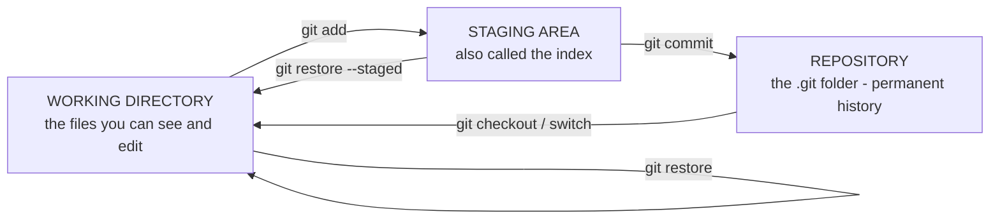
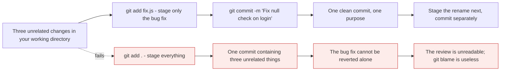
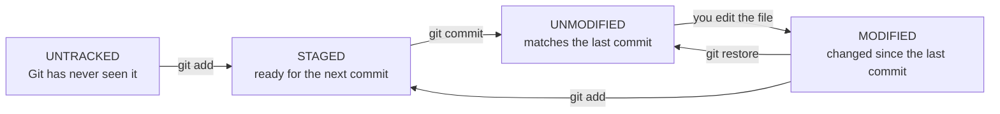

# The three trees

*Module 03 · Foundations*

Almost every confusing thing in Git - "why didn't my change get committed", "why does `reset`
sometimes delete my work", "what does `--staged` mean" - is really confusion about **which of
three places** a command touches. Learn this model and the commands stop looking arbitrary.

[Course home](../index.md) / Module 03

## 1. The model



> **Why it matters:** Git does not copy your files straight into history. There is a deliberate middle step. Every command you will ever run moves content **between two of these three places**, and knowing which two is the whole skill.

| Tree | What it holds | Where it lives |
| --- | --- | --- |
| **Working directory** | The actual files on disk, as you edit them | Your project folder |
| **Staging area (index)** | The exact content of the **next** commit | `.git/index` - a single file |
| **Repository** | Every commit ever made | `.git/objects` |

There is also **HEAD** - a pointer saying "which commit am I currently on". Think of it as a
label rather than a fourth tree; it becomes important in modules 05 and 06.

## 2. Why does the staging area exist?

This is the question nobody answers well, and it is the point of the whole module.

You have been working for an hour. You fixed a bug, renamed a variable, and also started an
unrelated feature. Three changes, one folder.



> **Why it matters:** The staging area separates **what you changed** from **what you are committing**. Without it, a commit would always be "everything I happen to have touched", and history would be a diary rather than a set of deliberate, revertible changes. Every good commit habit in module 13 depends on this one feature existing.

Three concrete things it buys you:

| Capability | How |
| --- | --- |
| Compose a commit from part of your work | `git add <specific files>` |
| Commit **part of a single file** | `git add -p` - stage some hunks, leave others |
| Review exactly what is about to be committed | `git diff --staged` |

## 3. The four states a file can be in



> **Why it matters:** `git status` is simply a report of which files are in which state. Once you can name the four states, the output stops being a wall of text and becomes a checklist.

## 4. Reading `git status` properly

```text
On branch main
Your branch is up to date with 'origin/main'.

Changes to be committed:            <-- STAGED - will go into the next commit
  (use "git restore --staged <file>..." to unstage)
        modified:   app.js

Changes not staged for commit:      <-- MODIFIED but not staged
  (use "git add <file>..." to update what will be committed)
  (use "git restore <file>..." to discard changes in working directory)
        modified:   README.md

Untracked files:                    <-- Git has never seen these
  (use "git add <file>..." to include in what will be committed)
        notes.txt
```

Three headings, three of the four states. Git even tells you the command for each - most people
never read those lines.

| Heading | Tree | The file is... |
| --- | --- | --- |
| Changes to be committed | Staging area | Ready to commit |
| Changes not staged for commit | Working directory | Changed, but not selected |
| Untracked files | Working directory | New, and Git is ignoring it for now |

```bash
git status              # the full report
git status -s           # short form, once you know the model
```

```text
 M README.md      # modified, not staged        (space + M)
M  app.js         # staged                      (M + space)
MM config.js      # staged, then modified again (M + M)
?? notes.txt      # untracked
```

> **TIP - The two-column short format**
>
> In `git status -s` the **left** column is the staging area and the **right** column is the working directory. `MM` means "I staged a change, then edited the file again" - so the commit will contain the first version, not what is on disk. That single insight explains a surprising number of "but I fixed that" moments.

## 5. `git diff` - the command everyone half-learns

There is not one diff. There are three, and they compare different pairs of trees.


> **Why it matters:** Plain `git diff` shows what you have **not** staged yet. If you stage everything and then run `git diff`, it prints nothing - and people conclude their changes vanished. They did not; you are asking the wrong question.

| Command | Compares | Answers |
| --- | --- | --- |
| `git diff` | Working directory ↔ staging area | "What have I changed but not staged?" |
| `git diff --staged` | Staging area ↔ last commit | **"What exactly am I about to commit?"** |
| `git diff HEAD` | Working directory ↔ last commit | "What have I changed in total?" |

```bash
git diff                    # unstaged changes
git diff --staged           # what the next commit will contain
git diff HEAD               # everything since the last commit
git diff --stat             # summary: files and line counts
git diff main..feature      # between two branches
```

> **TIP - `git diff --staged` before every commit**
>
> It is the last chance to see exactly what you are recording. Thirty seconds here catches debug statements, commented-out code, a stray `console.log`, and the API key you did not mean to include.

## 6. Moving content between trees

The complete map. Every one of these is covered properly in module 05 - this is the overview.

| Goal | Command | Moves |
| --- | --- | --- |
| Stage a change | `git add <file>` | Working → staging |
| Stage part of a file | `git add -p <file>` | Working → staging, selectively |
| Unstage, keep the change | `git restore --staged <file>` | Staging → working |
| Discard a change entirely | `git restore <file>` | Overwrites working from staging/HEAD |
| Commit | `git commit` | Staging → repository |
| Go to another commit or branch | `git switch` / `git checkout` | Repository → working + staging |

> **WARNING - `git restore <file>` has no undo**
>
> Unstaging is safe - the change is still in your working directory. **Discarding is not.** `git restore <file>` overwrites your file with the committed version, and because the change was never committed, `reflog` cannot bring it back. This is the one Git command that genuinely destroys work.

## 7. Where the trees actually live

```bash
ls -a              # you see your files, plus .git
ls .git            # HEAD, config, index, objects, refs
```

| Path | Tree |
| --- | --- |
| Your project folder | Working directory |
| `.git/index` | The staging area - one binary file |
| `.git/objects` | The repository - every commit, tree and file |
| `.git/HEAD` | Which commit you are on |

> **NOTE - Delete `.git` and the repository is gone**
>
> The `.git` folder *is* the repository. Your files remain, but every commit, branch and tag disappears. Copy the folder somewhere else and you have copied the entire history - which is precisely what `git clone` does.

## 8. Extra points

- **"Index", "staging area" and "cache" are the same thing.** Git's own commands use all three
  names - `--cached`, `--staged`, `.git/index` - which is a historical accident, not a
  distinction.
- **`git commit -a` skips staging** for files Git already tracks. Convenient, and it is how
  unrelated changes end up in one commit. It does **not** include untracked files.
- **The staging area is what makes `git add -p` possible**, and `-p` is the single best habit in
  this module - it forces you to read your own diff line by line.
- **Nothing is permanent until you commit.** Staged-but-uncommitted work exists only in
  `.git/index`, which no other clone has.

> **PRACTICE - Practice now**
>
> Prove each tree exists by watching a file move between them.
>
> 1. Create a repository and a file:
>    ```bash
>    mkdir trees-demo && cd trees-demo
>    git init
>    echo "line one" > a.txt
>    git status
>    ```
>    `a.txt` is **untracked**.
> 2. Stage it and watch the heading change:
>    ```bash
>    git add a.txt
>    git status
>    ```
>    Now under **Changes to be committed**.
> 3. **Prove the staging area holds a snapshot, not a pointer.** Edit the file *after* staging:
>    ```bash
>    echo "line two" >> a.txt
>    git status -s
>    ```
>    You get `AM` - staged as one thing, changed again since. The commit will contain only
>    `line one`.
> 4. See both diffs, and understand why they differ:
>    ```bash
>    git diff              # line two - not staged
>    git diff --staged     # line one - what will be committed
>    ```
> 5. Commit, then confirm the tree is clean:
>    ```bash
>    git commit -m "Add a.txt"
>    git status
>    git diff --staged     # nothing - staging matches HEAD
>    ```
> 6. **Practise selective staging** - the reason the staging area exists:
>    ```bash
>    printf "one\ntwo\nthree\nfour\n" > b.txt
>    git add b.txt && git commit -m "Add b.txt"
>    printf "ONE\ntwo\nthree\nFOUR\n" > b.txt
>    git add -p b.txt
>    ```
>    Accept one hunk with `y`, reject the other with `n`. Then:
>    ```bash
>    git diff --staged     # only the hunk you accepted
>    git diff              # the one you did not
>    ```
> 7. **Unstage safely** and confirm nothing was lost:
>    ```bash
>    git restore --staged b.txt
>    git status
>    git diff              # your change is still there
>    ```
> 8. **See the danger.** Discard a change and try to get it back:
>    ```bash
>    echo "temporary" >> a.txt
>    git restore a.txt
>    cat a.txt
>    ```
>    It is gone, and no Git command will return it.
> 9. Look at the trees on disk:
>    ```bash
>    ls -a
>    ls .git
>    ```
> 10. Leave the folder in place - module 04 continues in it.

> **ASSIGNMENT - Assignment**
>
> Draw the three trees from memory with every command from section 6 as a labelled arrow. Then, for one week, run `git diff --staged` before every single commit you make - no exceptions. Note down anything it catches that you did not intend to commit. Most people find something within three days, and that is the moment the staging area stops being an annoyance and becomes the reason their history is readable.

## 9. Interview drill

<details>
<summary><b>What are the three trees in Git?</b></summary>

The working directory - the files on disk as you edit them; the staging area, also called the
index, which holds the exact content of the next commit; and the repository, the `.git` folder
containing every commit ever made. `HEAD` is a pointer indicating which commit you are currently
on. Every Git command moves content between two of these, and most confusion about Git is really
uncertainty about which two.

</details>

<details>
<summary><b>Why does the staging area exist? Why not commit directly?</b></summary>

Because it separates what you have changed from what you are committing. Without it, every
commit would contain everything you happened to have touched, so a bug fix and an unrelated
refactor would land together and could never be reverted independently. Staging lets you compose
a commit deliberately - by file with `git add`, or even by hunk with `git add -p` - and lets you
review exactly what is about to be recorded with `git diff --staged`.

</details>

<details>
<summary><b>What is the difference between `git diff` and `git diff --staged`?</b></summary>

`git diff` compares the working directory to the staging area, so it shows changes you have
**not** staged. `git diff --staged` compares the staging area to the last commit, so it shows
exactly what the next commit will contain. `git diff HEAD` compares the working directory to
the last commit and shows everything. If you stage all your work and then run plain `git diff`
it prints nothing - which is correct, not a bug.

</details>

<details>
<summary><b>In `git status -s`, what does `MM` mean?</b></summary>

The left column is the staging area and the right is the working directory, so `MM` means the
file was modified and staged, then modified again afterwards. The commit will contain the
staged version, not what is currently on disk. It is a common cause of "I definitely fixed
that" - the fix is in the working directory but was never added to the index.

</details>

<details>
<summary><b>Which Git command can genuinely lose your work?</b></summary>

`git restore <file>` - or its older form `git checkout -- <file>` - because it overwrites the
file in your working directory with the committed version. Since the change was never committed,
there is no object in the repository and `git reflog` cannot recover it. Almost everything else
in Git is recoverable; uncommitted work discarded from the working directory is not, which is
the strongest argument for committing early and often.

</details>

<details>
<summary><b>What happens if you delete the `.git` folder?</b></summary>

The repository is gone - every commit, branch, tag and remote reference. The files in the
working directory remain, but they become an ordinary folder with no history. The reverse is
also true and more useful: copying `.git` copies the entire repository including all history,
which is essentially what `git clone` does over the network.

</details>

---

[← Module 02](02-install-and-configure.md) &nbsp;&nbsp;|&nbsp;&nbsp; [Module 04: Your first repository →](04-first-repository.md)

---

Git & Pipelines: Zero to Architect · Himanshu Kumar.
