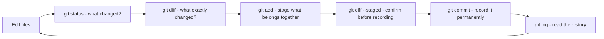
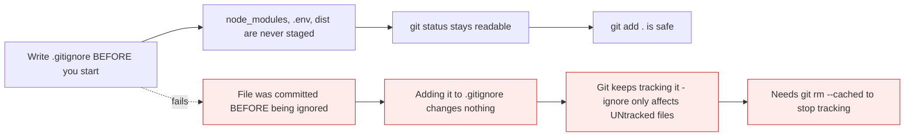

# Your first repository

*Module 04 · Foundations*

Everything so far has been model. This module is the loop you will run several thousand times:
change something, look at it, stage it, commit it, read the history. Nine commands, and they
cover most of daily Git.

[Course home](../index.md) / Module 04

## 1. `git init` - what it actually does

```bash
mkdir my-project && cd my-project
git init
```

```text
Initialized empty Git repository in /home/you/my-project/.git/
```

One thing happened: a hidden `.git` folder appeared. Your files are untouched.

```bash
ls -a
ls .git
```

| Inside `.git` | Purpose |
| --- | --- |
| `HEAD` | Which commit you are on |
| `config` | This repository's local settings |
| `index` | The staging area |
| `objects/` | Every commit, tree and file blob |
| `refs/` | Branches and tags - each a file containing a hash |

> **NOTE - `git init` is safe on an existing folder**
>
> It adds version control to files that already exist; it does not modify, move or delete anything. Running it twice is harmless. The only real mistake is running it in your home directory by accident - then Git tries to track everything you own. If you do, just delete the `.git` folder.

## 2. The daily loop



> **Why it matters:** Two of those six steps are *looking* rather than *doing*. Beginners skip `status` and `diff` and then wonder what a commit contains. Experienced people run them constantly - not from caution, but because it is faster than fixing a bad commit afterwards.

## 3. First commit

```bash
echo "# My Project" > README.md
git status
```

```text
Untracked files:
        README.md
nothing added to commit but untracked files present
```

```bash
git add README.md
git status
```

```text
Changes to be committed:
        new file:   README.md
```

```bash
git commit -m "Add project README"
```

```text
[main (root-commit) f3a1c9e] Add project README
 1 file changed, 1 insertion(+)
 create mode 100644 README.md
```

Read that output - it tells you four things:

| Part | Meaning |
| --- | --- |
| `main` | The branch you committed to |
| `(root-commit)` | The first commit in this repository - it has no parent |
| `f3a1c9e` | The commit's short hash |
| `1 file changed, 1 insertion(+)` | The size of the change |

```bash
git status
```

```text
On branch main
nothing to commit, working tree clean
```

**"Working tree clean"** means all three trees agree. It is the state you want to be in before
switching branches, pulling, or going home.

## 4. `git add` - the variants that matter

| Command | Stages |
| --- | --- |
| `git add file.txt` | One file |
| `git add src/` | Everything under a directory |
| `git add .` | Everything in the current directory and below |
| `git add -A` | Everything in the repository, including deletions |
| `git add -u` | Only files Git already tracks - not new ones |
| `git add -p` | **Interactively, hunk by hunk** |
| `git add "*.js"` | By pattern |

> **WARNING - `git add .` is how secrets get committed**
>
> It stages whatever is there, including the `.env` you created five minutes ago and forgot about. Two habits prevent it permanently: write your `.gitignore` **before** you start work, and run `git status` before every `add`. Once a secret is committed it is in history forever - removing it means rewriting history, which is module 15.

`git add -p` is worth building a habit around:

```bash
git add -p
```

| Key | Does |
| --- | --- |
| `y` | Stage this hunk |
| `n` | Skip it |
| `s` | Split into smaller hunks |
| `q` | Quit |
| `?` | Help |

It forces you to read your own diff before committing, which catches more mistakes than any
review process.

## 5. `git commit` - the options you need

```bash
git commit -m "Short summary"
git commit                     # opens your editor for a full message
git commit -am "message"       # stage tracked files AND commit - skips untracked
git commit --amend             # rewrite the last commit (module 15)
```

A good commit message, in the format module 13 covers properly:

```text
Add null check to login handler

Users with no profile record hit a NullPointerException on sign-in.
The handler now returns an empty profile instead of dereferencing null.

Fixes #142
```

| Line | Rule |
| --- | --- |
| Subject | Under ~50 characters, imperative mood - "Add", not "Added" |
| Blank line | Required - Git treats the first blank line as the separator |
| Body | **Why**, not what. The diff already shows what |

> **TIP - Write the message for the person debugging this in a year**
>
> That person is usually you. "fix", "update", "changes" and "wip" tell them nothing. The diff already shows *what* changed - the message exists to record *why*, which is the one thing the code cannot express.

## 6. `git log` - reading history

```bash
git log
git log --oneline
git log --oneline --graph --decorate --all      # the one worth aliasing
git log -5                                       # last five
git log --stat                                   # with file change counts
git log -p                                       # with the full diff
git log --author="Himanshu"
git log --since="2 weeks ago"
git log --grep="login"                           # search commit messages
git log -S "getUserProfile"                      # commits that added or removed this string
git log -- src/app.js                            # history of one file
```

| Flag | Use it when |
| --- | --- |
| `--oneline` | You want a scannable list |
| `--graph` | You need to see how branches diverged and merged |
| `-p` | You want to read what actually changed |
| `-S <string>` | **Hunting for when a line was introduced or removed** |
| `-- <path>` | Only the history of one file |

`git log -S` is the one people do not know and then use constantly - it answers "when did this
function appear?" in one command.

```bash
git show                    # the full last commit
git show f3a1c9e            # a specific commit
git show HEAD~2             # two commits back
git blame README.md         # who last changed each line, and in which commit
```

## 7. `.gitignore` - write it first

```text
# dependencies
node_modules/
.venv/

# build output
dist/
build/
*.class

# secrets
.env
.env.*
*.pem
credentials.json

# editor and OS
.vscode/
.DS_Store
Thumbs.db

# logs
*.log
```

| Pattern | Matches |
| --- | --- |
| `*.log` | Any `.log` file, anywhere |
| `build/` | Any directory named `build`, at any depth |
| `/build` | Only `build` at the repository root |
| `!important.log` | Exception - do **not** ignore this one |
| `docs/*.pdf` | PDFs directly in `docs`, not in subfolders |
| `**/temp` | `temp` at any depth |



> **Why it matters:** `.gitignore` only applies to files Git is **not already tracking**. Adding a pattern for a file that was committed last week does nothing at all - Git keeps tracking it and you keep seeing it in `git status`. This surprises everyone exactly once.

```bash
git rm --cached .env        # stop tracking, keep the file on disk
git rm --cached -r dist/    # same, for a directory
git commit -m "Stop tracking .env"
```

```bash
git check-ignore -v somefile.log     # which rule is ignoring this?
git status --ignored                 # show ignored files too
```

> **WARNING - `git rm --cached` does not remove it from history**
>
> The file stops being tracked from that commit onward, but every earlier commit still contains it. For a leaked credential that is not enough - rotate the secret immediately, then deal with history separately.

## 8. Moving and removing files

```bash
git rm old.txt                  # delete the file and stage the deletion
git rm --cached old.txt         # stop tracking, keep the file
git mv old.txt new.txt          # rename and stage it
```

> **NOTE - Git does not store renames**
>
> `git mv` is just `mv` plus `git add` for both paths. Git detects renames *when showing you a diff*, by noticing that a file was deleted and a nearly identical one appeared. This is why renaming and heavily editing a file in one commit shows as a delete plus an add - do them in two commits and the history reads far better.

## 9. Extra points

- **A commit is cheap and local.** Committing does not send anything anywhere. Commit far more
  often than feels necessary; you can always tidy history later with module 15.
- **`git commit -am` skips untracked files.** It is not "commit everything" - a new file needs an
  explicit `git add`.
- **The first commit has no parent**, which is why Git labels it `root-commit`. Every later
  commit points to at least one parent, which is what makes history a graph.
- **`git log` opens a pager.** Press `q` to exit, `/text` to search, space to page. `--no-pager`
  or `git --no-pager log` prints straight to the terminal for scripts.
- **`.gitignore` can be committed - and should be.** It is part of the project, not personal
  preference. Your personal ignores belong in the global file from module 02.

> **PRACTICE - Practice now**
>
> Continue in the `trees-demo` folder from module 03, or start a fresh one.
>
> 1. Create a repository and confirm what appeared:
>    ```bash
>    mkdir first-repo && cd first-repo
>    git init
>    ls -a && ls .git
>    ```
> 2. **Write `.gitignore` first** - before any other file:
>    ```bash
>    printf ".env\nnode_modules/\n*.log\n" > .gitignore
>    git add .gitignore && git commit -m "Add gitignore"
>    ```
> 3. Run the full loop once, deliberately:
>    ```bash
>    echo "# First Repo" > README.md
>    git status
>    git add README.md
>    git diff --staged
>    git commit -m "Add project README"
>    git log --oneline
>    ```
> 4. **Prove `.gitignore` works** on an untracked file:
>    ```bash
>    echo "SECRET=abc123" > .env
>    git status
>    ```
>    `.env` does not appear. Confirm which rule caught it:
>    ```bash
>    git check-ignore -v .env
>    ```
> 5. **Now cause the classic failure.** Commit a file *before* ignoring it:
>    ```bash
>    echo "debug output" > app.log
>    git add -f app.log && git commit -m "Oops"
>    echo "app.log" >> .gitignore
>    git status
>    ```
>    It is still tracked. Fix it properly:
>    ```bash
>    git rm --cached app.log
>    git commit -m "Stop tracking app.log"
>    git status
>    ```
> 6. **Practise `git add -p`** on a file with two separate changes:
>    ```bash
>    printf "alpha\nbravo\ncharlie\ndelta\n" > list.txt
>    git add list.txt && git commit -m "Add list"
>    printf "ALPHA\nbravo\ncharlie\nDELTA\n" > list.txt
>    git add -p list.txt
>    ```
>    Accept one hunk, reject the other, then commit and inspect:
>    ```bash
>    git commit -m "Uppercase alpha"
>    git diff
>    ```
> 7. Explore history five ways:
>    ```bash
>    git log --oneline --graph --decorate --all
>    git log --stat
>    git show HEAD
>    git log -S "bravo"
>    git blame list.txt
>    ```
> 8. **Rename properly** and see how Git reports it:
>    ```bash
>    git mv list.txt items.txt
>    git status
>    git commit -m "Rename list to items"
>    git log --stat -1
>    ```
> 9. Confirm a clean tree:
>    ```bash
>    git status
>    ```

> **ASSIGNMENT - Assignment**
>
> Take any small project you already have - notes, scripts, a config folder - and put it under version control properly: `.gitignore` written before the first `git add`, then a series of **small, single-purpose commits** rather than one "initial commit" containing everything. Aim for at least six commits, each with a message a stranger could understand. Then run `git log --oneline` and read it as if you had never seen the project. If the log tells you the story of how the project was built, you have already got more out of Git than most people do.

## 10. Interview drill

<details>
<summary><b>What does `git init` do?</b></summary>

It creates a `.git` directory in the current folder, containing `HEAD`, `config`, the `index`
that acts as the staging area, and empty `objects` and `refs` directories. That folder *is* the
repository. Existing files are untouched and become untracked until you add them. It is safe to
run on a folder that already has content, and running it twice does nothing harmful.

</details>

<details>
<summary><b>What is the difference between `git add .`, `git add -A` and `git add -u`?</b></summary>

`git add .` stages new and modified files from the current directory downward. `git add -A`
stages everything across the whole repository, including deletions. `git add -u` stages only
changes to files Git already tracks, including deletions, but never adds new files. In modern
Git the difference between `.` and `-A` is mostly about the starting directory. All three are
blunt - `git add -p` is what you use when the commit should contain a specific subset of your
work.

</details>

<details>
<summary><b>You added a file to `.gitignore` but it still shows in `git status`. Why?</b></summary>

Because `.gitignore` only affects **untracked** files. Once a file has been committed, Git keeps
tracking it regardless of any ignore rule. You have to remove it from the index with
`git rm --cached <file>`, which stops tracking while leaving the file on disk, and then commit
that removal. Note this does not remove the file from earlier commits - for a leaked secret you
must rotate it, because it remains in history.

</details>

<details>
<summary><b>What makes a good commit message?</b></summary>

A short imperative subject line under about fifty characters - "Add null check to login
handler", not "Added stuff" - then a blank line, then a body explaining **why** the change was
made. The diff already shows what changed; the message exists to record the reasoning, the
constraint or the bug that made it necessary. It should make sense to someone reading it a year
later with no memory of the context, because that person is usually you.

</details>

<details>
<summary><b>How would you find when a particular line of code was introduced?</b></summary>

`git log -S "<string>"` finds commits where the number of occurrences of that string changed -
so it shows exactly when it was added or removed, across the whole history. `git log -p -- <file>`
shows the full diff history of one file, and `git blame <file>` shows who last touched each line
and in which commit. Blame answers "who and when for the current version"; `-S` answers "when
did this ever appear or disappear".

</details>

<details>
<summary><b>Does Git track file renames?</b></summary>

No - it stores snapshots of content, so a rename is recorded as a deletion plus an addition.
Git *detects* renames when generating a diff, by noticing that a removed file and an added file
have very similar content. `git mv` is simply `mv` followed by staging both paths. The practical
consequence is that renaming and substantially editing a file in the same commit defeats the
detection and shows as an unrelated delete and add, so it is better done in two commits.

</details>

---

[← Module 03](03-three-trees.md) &nbsp;&nbsp;|&nbsp;&nbsp; [Module 05: Undoing things safely →](05-undoing-things.md)

---

Git & Pipelines: Zero to Architect · Himanshu Kumar.
