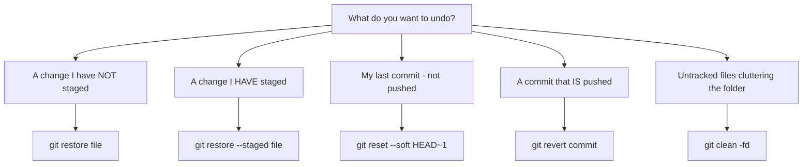
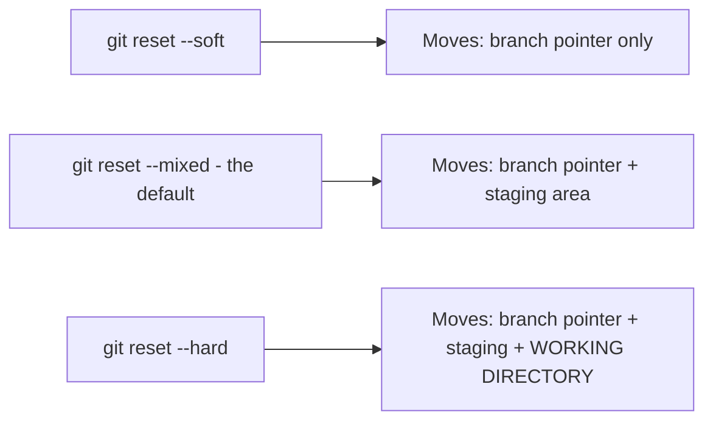
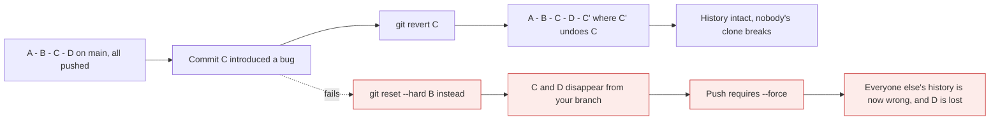
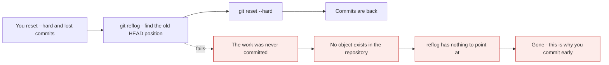

# Undoing things safely

*Module 05 · Daily work*

`restore`, `reset`, `revert`, `checkout`, `clean` - five commands that all seem to undo things,
and are not interchangeable. Picking the wrong one is how people lose work. This module is the
decision tree, and the one command that rescues you when you pick wrong anyway.

[Course home](../index.md) / Module 05

## 1. Start with the question, not the command



> **Why it matters:** The command follows from the question, and the most important part of the question is **has this been pushed?** Everything before a push is yours to rewrite freely. Everything after it is shared, and rewriting it breaks other people's repositories - which is why `revert` exists.

| Situation | Command | Safe? |
| --- | --- | --- |
| Discard an unstaged change | `git restore <file>` | **No - unrecoverable** |
| Unstage, keep the change | `git restore --staged <file>` | Yes |
| Undo last commit, keep changes staged | `git reset --soft HEAD~1` | Yes |
| Undo last commit, keep changes unstaged | `git reset HEAD~1` | Yes |
| Undo last commit and **destroy** the changes | `git reset --hard HEAD~1` | **No** |
| Undo a **pushed** commit | `git revert <commit>` | Yes - the correct choice |
| Fix the last commit message or content | `git commit --amend` | Yes, if not pushed |
| Delete untracked files | `git clean -fd` | **No - unrecoverable** |
| Get back something you destroyed | `git reflog` | The safety net |

## 2. `git restore` - the working directory and the index

Introduced in Git 2.23 precisely because `checkout` did too many unrelated things.

```bash
git restore file.txt              # discard unstaged changes - DESTRUCTIVE
git restore --staged file.txt     # unstage, keep the change in the working directory
git restore --source=HEAD~2 f.txt # bring back an older version of one file
git restore .                     # discard ALL unstaged changes
```

| Command | Working directory | Staging area |
| --- | --- | --- |
| `git restore f` | Overwritten from index | unchanged |
| `git restore --staged f` | unchanged | Overwritten from HEAD |
| `git restore --staged --worktree f` | Overwritten | Overwritten |

> **WARNING - `git restore <file>` is the one true data-loss command**
>
> The change was never committed, so no object exists in the repository and `reflog` has nothing to offer. If you are unsure, commit first - a bad commit is trivially fixable, a discarded edit is not. `git stash` is the safe version of "get this out of my way".

## 3. `git reset` - moving the branch pointer

`reset` is not "undo". It **moves the branch pointer to a different commit**, and the flag
decides what happens to the two trees on the way.



> **Why it matters:** All three move history the same way - the difference is how much of your current work survives. `--soft` keeps everything staged, `--mixed` keeps it as unstaged edits, `--hard` throws it away. That is the entire distinction, and it is worth memorising because `--hard` is unforgiving.

```bash
git reset --soft HEAD~1     # undo the commit, changes stay STAGED
git reset HEAD~1            # undo the commit, changes become UNSTAGED  (--mixed)
git reset --hard HEAD~1     # undo the commit, changes GONE
git reset --hard origin/main   # make local match the remote exactly
```

The most common real use, and worth knowing by heart:

```bash
# committed too early, or with the wrong message
git reset --soft HEAD~1
# ... adjust what is staged ...
git commit -m "A better message"
```

| Flag | Branch pointer | Staging area | Working directory |
| --- | --- | --- | --- |
| `--soft` | moves | untouched | untouched |
| `--mixed` (default) | moves | reset | untouched |
| `--hard` | moves | reset | **overwritten** |

> **WARNING - Never `reset` a branch you have pushed**
>
> Resetting rewrites your local history. If the commits were already pushed, your branch and the remote have diverged, and the only way to push is `--force` - which deletes those commits for everyone else, breaks their local clones, and destroys any work built on top. On a shared branch the correct tool is `revert`.

## 4. `git revert` - the safe undo for shared history

`revert` does not remove anything. It creates a **new commit** that applies the inverse of an
old one.



> **Why it matters:** `revert` is *additive*. The bad commit stays in history where anyone can see what happened, and the fix is a normal commit that flows through review and CI like any other. This is the only acceptable way to undo something on `main`.

```bash
git revert abc1234                 # revert one commit
git revert HEAD                    # revert the most recent commit
git revert abc1234 --no-edit       # accept the default message
git revert abc1234..def5678        # revert a range
git revert -m 1 <merge-commit>     # revert a merge, keeping the first parent
```

| | `reset` | `revert` |
| --- | --- | --- |
| Changes history | Yes | No |
| Creates a commit | No | Yes |
| Safe on pushed branches | **No** | **Yes** |
| Leaves an audit trail | No | Yes |
| Use on | Your own local, unpushed work | Anything shared |

## 5. `git checkout` - the overloaded one

`checkout` historically did three unrelated jobs, which is exactly why it confused everyone.

| Old command | Modern replacement | Job |
| --- | --- | --- |
| `git checkout <branch>` | **`git switch <branch>`** | Change branch |
| `git checkout -b <new>` | **`git switch -c <new>`** | Create and change branch |
| `git checkout -- <file>` | **`git restore <file>`** | Discard file changes |

`checkout` still works and you will see it everywhere, including in older documentation. Prefer
`switch` and `restore` in new habits - they cannot be confused with each other, and the error
messages are clearer.

## 6. `git clean` - removing untracked files

Nothing else in this module touches untracked files. `clean` is the only one that does, and it
deletes them.

```bash
git clean -n            # DRY RUN - always run this first
git clean -f            # delete untracked files
git clean -fd           # ...and untracked directories
git clean -fdx          # ...and ignored files too - wipes node_modules, dist, .env
git clean -i            # interactive
```

> **WARNING - `git clean -fdx` deletes your `.env`**
>
> `-x` includes ignored files, which is exactly where local configuration and credentials live. It is genuinely useful for "give me a build environment identical to a fresh clone", and genuinely destructive otherwise. **Run `git clean -n` first, every time.** There is no recovery.

## 7. `git reflog` - the safety net

Git records every position `HEAD` has occupied, for about 90 days, even for commits no branch
points at any more.

```bash
git reflog
```

```text
f3a1c9e HEAD@{0}: reset: moving to HEAD~1
9b2d4a1 HEAD@{1}: commit: Add payment validation
7c8e5f2 HEAD@{2}: checkout: moving from main to feature
```

You just ran `git reset --hard` and destroyed a commit. Get it back:

```bash
git reflog                        # find the hash from before the reset
git reset --hard 9b2d4a1          # go back to it
```



> **Why it matters:** **Anything that was ever committed can be recovered.** Anything that was never committed cannot. That single sentence should change how often you commit - a messy local history is free and can be tidied later with module 15; lost work cannot be un-lost.

## 8. `git stash` - get out of the way without losing anything

The safe alternative to discarding.

```bash
git stash                          # shelve all changes, clean the working directory
git stash push -m "half-done"      # with a label
git stash -u                       # include untracked files
git stash list
git stash pop                      # reapply the most recent and remove it from the stash
git stash apply stash@{2}          # reapply a specific one, keep it in the stash
git stash drop stash@{0}
```

Module 10 covers the rescue kit properly. It appears here because it is the honest answer to
"I need these changes gone right now" - shelve them instead of destroying them.

## 9. Extra points

- **`HEAD~1` and `HEAD^` mean the previous commit.** They differ only for merge commits, where
  `HEAD^1` is the first parent and `HEAD^2` the second.
- **`git reset` without a commit resets the index only** - `git reset file.txt` is the old way
  of unstaging, now `git restore --staged`.
- **`--force-with-lease` is safer than `--force`.** It refuses to push if the remote moved since
  you last fetched, which protects a colleague who pushed while you were rebasing.
- **`git commit --amend` rewrites the last commit** - fine locally, a force push if it was
  already shared. Module 15 covers this properly.
- **Reflog is local.** Your colleague's reflog cannot recover what you destroyed on your machine,
  and a fresh clone has no reflog at all.

> **PRACTICE - Practice now**
>
> Cause each situation deliberately, then fix it with the right command.
>
> 1. Set up:
>    ```bash
>    mkdir undo-demo && cd undo-demo && git init
>    echo "one" > a.txt && git add . && git commit -m "First"
>    echo "two" >> a.txt && git commit -am "Second"
>    ```
> 2. **Unstage without losing work:**
>    ```bash
>    echo "three" >> a.txt
>    git add a.txt
>    git status
>    git restore --staged a.txt
>    git status
>    cat a.txt
>    ```
>    Still there. Unstaging is safe.
> 3. **Now discard for real** and note that nothing brings it back:
>    ```bash
>    git restore a.txt
>    cat a.txt
>    git reflog
>    ```
> 4. **Undo a commit three ways.** Run each, then redo the commit before the next:
>    ```bash
>    echo "four" >> a.txt && git commit -am "Fourth"
>    git reset --soft HEAD~1 && git status     # staged
>    git commit -m "Fourth"
>    git reset HEAD~1 && git status            # unstaged
>    git commit -am "Fourth"
>    git reset --hard HEAD~1 && git status     # gone
>    ```
> 5. **Recover the commit you just destroyed:**
>    ```bash
>    git reflog
>    git reset --hard <the hash of "Fourth">
>    git log --oneline
>    ```
>    That is the most valuable thing in this module.
> 6. **Revert instead of reset**, and see the difference in history:
>    ```bash
>    git revert HEAD --no-edit
>    git log --oneline
>    ```
>    The bad commit is still there, plus a new one undoing it.
> 7. **Try `clean` safely first:**
>    ```bash
>    echo "junk" > temp.txt
>    mkdir scratch && echo x > scratch/x.txt
>    git clean -n
>    git clean -fd
>    ls
>    ```
> 8. **Prove `-x` is dangerous:**
>    ```bash
>    echo "SECRET=1" > .env
>    echo ".env" >> .gitignore
>    git clean -n
>    git clean -nx
>    ```
>    Note that `.env` appears only with `-x`. Do not run it with `-f`.
> 9. **Stash instead of discarding:**
>    ```bash
>    echo "wip" >> a.txt
>    git stash push -m "half-done"
>    git status
>    git stash list
>    git stash pop
>    cat a.txt
>    ```

> **ASSIGNMENT - Assignment**
>
> Write your own one-page decision table: for each of the ten situations in section 1, the command, whether it is recoverable, and whether it is safe on a pushed branch. Then delete this module's page and answer five scenarios from memory - *"I committed to main by mistake and pushed it"*, *"I staged the wrong file"*, *"I need my colleague's branch state exactly"*, *"my working directory is full of build junk"*, *"I ran reset --hard an hour ago"*. Getting these right under pressure is the difference between a five-minute problem and a lost afternoon.

## 10. Interview drill

<details>
<summary><b>What is the difference between `git reset --soft`, `--mixed` and `--hard`?</b></summary>

All three move the branch pointer to another commit; they differ in what happens to the staging
area and working directory. `--soft` moves only the pointer, so your changes remain staged.
`--mixed`, the default, also resets the staging area, so changes become unstaged edits.
`--hard` additionally overwrites the working directory, discarding those changes entirely.
`--soft` is the standard way to redo a commit you just made; `--hard` is the one that loses
work.

</details>

<details>
<summary><b>When would you use `revert` instead of `reset`?</b></summary>

Whenever the commit has been pushed. `reset` rewrites local history, so a shared branch would
then require a force push - which deletes those commits for everyone else and breaks clones
built on top of them. `revert` creates a new commit applying the inverse change, leaving history
intact and auditable, and it flows through review and CI like any other commit. Rule of thumb:
`reset` for private history, `revert` for public.

</details>

<details>
<summary><b>You ran `git reset --hard` and lost a commit. Can you recover it?</b></summary>

Yes, if it was committed. `git reflog` lists every position `HEAD` has held, including commits
no branch points at any more, and those objects survive for about ninety days before garbage
collection. Find the hash and `git reset --hard <hash>`. What cannot be recovered is work that
was never committed - `git restore` on an uncommitted change, or `git clean` on untracked files,
leave no object behind.

</details>

<details>
<summary><b>Why were `git switch` and `git restore` introduced?</b></summary>

Because `git checkout` did several unrelated jobs - changing branch, creating a branch, and
discarding file changes - which made both its behaviour and its error messages ambiguous, and
made it easy to destroy work while intending to change branch. Git 2.23 split it: `switch` for
branches, `restore` for file contents. `checkout` still works for compatibility, but new code
and new habits should use the specific commands.

</details>

<details>
<summary><b>What does `git clean -fdx` do, and when is it dangerous?</b></summary>

It deletes untracked files (`-f`), untracked directories (`-d`), and files that `.gitignore`
would normally protect (`-x`). It is useful for reproducing a truly clean checkout - no stale
build output, no cached dependencies. It is dangerous because ignored files are exactly where
local configuration and credentials live, so `.env` and local settings are destroyed with no
recovery. Always run `git clean -n` first to see what would be removed.

</details>

<details>
<summary><b>What is the difference between `--force` and `--force-with-lease`?</b></summary>

`--force` overwrites the remote branch unconditionally, so if a colleague pushed after your last
fetch, their commits are silently destroyed. `--force-with-lease` first checks that the remote
is still where you last saw it, and refuses the push if it has moved. It gives you the ability
to rewrite your own history while protecting other people's work, so it should be the default
whenever a force push is genuinely needed.

</details>

---

[← Module 04](04-first-repository.md) &nbsp;&nbsp;|&nbsp;&nbsp; [Module 06: Branching and merging →](06-branching-and-merging.md)

---

Git & Pipelines: Zero to Architect · Himanshu Kumar.
