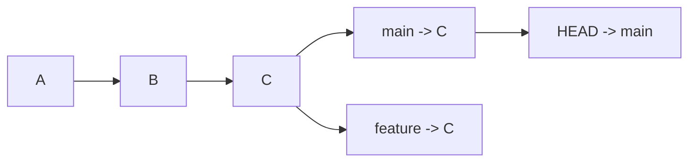
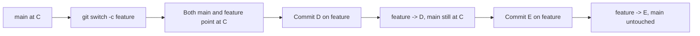
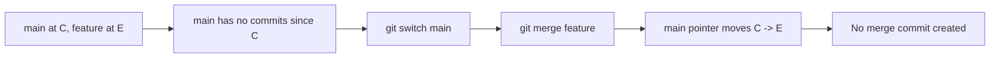
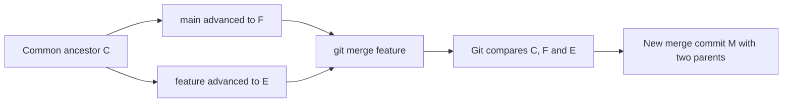
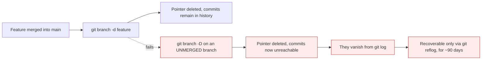

# Branching and merging

*Module 06 · Daily work*

Branching is the feature that made Git win, and it is far simpler than it looks. Once you know
what a branch physically **is**, every branching command becomes obvious - and so does why
merges sometimes produce an extra commit and sometimes do not.

[Course home](../index.md) / Module 06

## 1. A branch is a file containing a hash

That is the entire implementation.

```bash
cat .git/refs/heads/main
```

```text
f3a1c9e4b8d2a7c1e9f0b3d5a8c2e4f6b1d9a7c3
```

41 bytes. A branch is a **movable pointer to one commit** - not a copy of your code, not a
folder, not a container.



> **Why it matters:** Creating a branch writes one small file. It does not copy your project, which is why it is instant even in a repository with a million commits - and why Git encourages a branch per task while older tools discouraged branching entirely. The cost is genuinely zero.

| Concept | What it really is |
| --- | --- |
| **Branch** | A file in `.git/refs/heads/` containing a commit hash |
| **HEAD** | A file saying which branch you are on |
| **Commit** | A snapshot that knows its parent |
| **History** | The chain you get by following parents backwards |

When you commit, Git creates the commit and then **moves the current branch pointer forward** to
it. That is all "being on a branch" means.

## 2. Creating and switching

```bash
git branch                       # list local branches; * marks current
git branch -a                    # include remote-tracking branches
git branch -v                    # with the last commit on each

git switch -c feature/login      # create and switch  (old: checkout -b)
git switch main                  # switch  (old: checkout)
git switch -                     # switch back to the previous branch

git branch -d feature/login      # delete - refuses if not merged
git branch -D feature/login      # delete anyway - force
git branch -m old-name new-name  # rename
```

> **TIP - Branch naming that survives a team**
>
> `feature/checkout-validation`, `fix/null-pointer-on-login`, `chore/bump-deps`. A prefix and a description of the *change*, not the person. `himanshu-branch-2` tells a reviewer nothing, and in six months tells you nothing either.

> **NOTE - Switching branches changes your files**
>
> `git switch` rewrites the working directory to match the target branch. Uncommitted changes that would be overwritten cause Git to refuse - commit them, or `git stash` them first. This is a protection, not an obstacle.

## 3. What happens as you work



> **Why it matters:** `main` did not move because nobody committed to it. Branches diverge only when commits are made on them - and that divergence is precisely what a merge later has to reconcile.

## 4. Fast-forward merge

If the target branch has not moved since you branched, there is nothing to reconcile. Git just
slides the pointer forward.



```bash
git switch main
git merge feature/login
```

```text
Updating f3a1c9e..9b2d4a1
Fast-forward
 login.js | 24 ++++++++++++++++++++++++
 1 file changed, 24 insertions(+)
```

**"Fast-forward"** means exactly that: no merge commit, because none was needed. History stays
a straight line.

## 5. Three-way merge

If both branches moved, Git has to combine them - and it records that fact with a **merge
commit** that has two parents.



> **Why it matters:** It is called three-way because Git uses **three** snapshots: the common ancestor and both branch tips. Comparing each side against the ancestor tells Git who changed what - which is how it merges automatically, and how it knows a *conflict* has occurred when both sides changed the same lines.

```bash
git merge feature/login
```

```text
Merge made by the 'ort' strategy.
 login.js | 24 ++++++++++++++++++++++++
 1 file changed, 24 insertions(+)
```

| | Fast-forward | Three-way |
| --- | --- | --- |
| When | Target branch has not moved | Both branches have new commits |
| Merge commit | No | **Yes**, with two parents |
| History shape | Straight line | Visibly branched and rejoined |
| Can conflict | No | **Yes** |

## 6. `--no-ff` - keeping the branch visible

```bash
git merge --no-ff feature/login
```

Forces a merge commit even when a fast-forward was possible.

| | Default (`--ff`) | `--no-ff` |
| --- | --- | --- |
| History | Linear, cleaner | Shows every feature as a distinct bubble |
| Can you tell a feature existed? | No | **Yes** |
| Revert the whole feature at once? | Awkward | `git revert -m 1 <merge>` |

> **TIP - Which one should a team use?**
>
> Teams that want a readable, linear `main` use fast-forward (often with squash on merge). Teams that want to see exactly which commits belonged to which feature use `--no-ff`. Both are defensible; what is not defensible is a repository where different people do different things. Decide once and enforce it in the platform's merge settings - module 12.

## 7. Deleting branches

```bash
git branch -d feature/login       # safe - refuses if unmerged
git branch -D feature/login       # force - the commits become unreachable
git branch --merged               # branches fully merged into the current one - safe to delete
git branch --no-merged            # branches with commits not yet merged
```



> **Why it matters:** Deleting a **merged** branch loses nothing - the commits are part of `main`'s history and the pointer was redundant. Deleting an **unmerged** branch orphans its commits. Use `-d` and let Git protect you; reach for `-D` only when you are deliberately abandoning work.

## 8. Detached HEAD

```bash
git switch --detach f3a1c9e     # or: git checkout f3a1c9e
```

```text
You are in 'detached HEAD' state...
```

This is not an error. `HEAD` points directly at a commit rather than at a branch, so any commit
you make belongs to no branch - and is lost when you switch away.

| Situation | Do this |
| --- | --- |
| Just looking at an old commit | `git switch main` when done - nothing to save |
| You committed and want to keep it | `git switch -c rescue-branch` **before switching away** |
| You already switched away | `git reflog`, find the hash, `git branch rescue <hash>` |

## 9. Extra points

- **`git merge` is not symmetric.** You merge *into* the branch you are on. Being on the wrong
  branch when you merge is a common and confusing mistake - check with `git status` first.
- **A merge commit has two parents.** `HEAD^1` is the branch you were on, `HEAD^2` is the branch
  you merged in. That numbering is what `git revert -m 1` refers to.
- **`git switch` and `git branch` do different things.** `git branch feature` creates the branch
  but leaves you where you are - a common source of "why are my commits on main?"
- **Branch from the right base.** Branching from a stale `main` means your merge later includes
  weeks of unrelated changes. `git switch main && git pull` first.
- **Long-lived branches are the real cost.** A branch open for three weeks is three weeks of
  divergence and a painful merge. Branch small, merge often - module 12.

> **PRACTICE - Practice now**
>
> 1. Set up a repository with some history:
>    ```bash
>    mkdir branch-demo && cd branch-demo && git init
>    echo "line 1" > file.txt && git add . && git commit -m "A"
>    echo "line 2" >> file.txt && git commit -am "B"
>    ```
> 2. **Prove a branch is just a file:**
>    ```bash
>    git branch feature
>    cat .git/refs/heads/main
>    cat .git/refs/heads/feature
>    cat .git/HEAD
>    ```
>    Two files, the same hash. That is a branch.
> 3. **Prove `git branch` does not switch you:**
>    ```bash
>    git status
>    git switch feature
>    git status
>    ```
> 4. **Cause a fast-forward merge:**
>    ```bash
>    echo "feature work" >> file.txt && git commit -am "C on feature"
>    git switch main
>    git merge feature
>    git log --oneline --graph --all
>    ```
>    Read the word `Fast-forward` and note the straight line.
> 5. **Now cause a three-way merge.** Make both branches move:
>    ```bash
>    git switch -c feature2
>    echo "feature2 work" > other.txt && git add . && git commit -m "D on feature2"
>    git switch main
>    echo "main work" > main.txt && git add . && git commit -m "E on main"
>    git merge feature2
>    git log --oneline --graph --all
>    ```
>    A merge commit appears, and the graph visibly splits and rejoins.
> 6. **Inspect the merge commit's two parents:**
>    ```bash
>    git log -1 --format="%h parents=%p"
>    git show HEAD^1 --oneline -s
>    git show HEAD^2 --oneline -s
>    ```
> 7. **Compare `--no-ff`:**
>    ```bash
>    git switch -c feature3
>    echo x > f3.txt && git add . && git commit -m "F"
>    git switch main
>    git merge --no-ff feature3 -m "Merge feature3"
>    git log --oneline --graph --all
>    ```
> 8. **See branch protection in action:**
>    ```bash
>    git switch -c abandoned
>    echo y > gone.txt && git add . && git commit -m "Unmerged work"
>    git switch main
>    git branch -d abandoned
>    ```
>    Git refuses. Note the hash it prints, then force it and recover:
>    ```bash
>    git branch -D abandoned
>    git reflog
>    git branch rescued <that hash>
>    git log --oneline rescued
>    ```
> 9. **Experience detached HEAD:**
>    ```bash
>    git log --oneline
>    git switch --detach <an older hash>
>    git status
>    echo z > detached.txt && git add . && git commit -m "Made in detached HEAD"
>    git switch main
>    git log --oneline --all
>    ```
>    Your commit is not there. Recover it with `git reflog` and `git branch`.
> 10. Clean up:
>     ```bash
>     git branch --merged
>     git branch -d feature feature2 feature3
>     ```

> **ASSIGNMENT - Assignment**
>
> Reproduce the fast-forward and three-way cases from memory in a fresh repository, then draw both graphs on paper and explain to someone else why one produced a merge commit and the other did not. Then answer the follow-up they will ask: *"why do some teams ban fast-forward merges?"* If you can explain both the mechanics and the team-level tradeoff, you understand branching well enough to choose a strategy - which is module 12.

## 10. Interview drill

<details>
<summary><b>What is a branch in Git?</b></summary>

A file in `.git/refs/heads/` containing a single commit hash - a movable pointer, not a copy of
the code. `HEAD` is another pointer indicating which branch you are currently on. When you
commit, Git creates the commit and moves the current branch pointer to it. Because a branch is
41 bytes, creating one is instant regardless of repository size, which is why Git encourages a
branch per task where older centralised tools discouraged branching.

</details>

<details>
<summary><b>What is the difference between a fast-forward and a three-way merge?</b></summary>

A fast-forward happens when the target branch has not moved since the feature branched, so Git
simply advances the pointer - no merge commit, and history stays linear. A three-way merge
happens when both branches have new commits: Git uses three snapshots, the common ancestor and
the two branch tips, works out what each side changed relative to the ancestor, and records the
result in a merge commit with two parents. Only a three-way merge can produce a conflict.

</details>

<details>
<summary><b>Why is it called a "three-way" merge?</b></summary>

Because Git needs three commits to do it: the two branch tips and their common ancestor.
Comparing each tip against the ancestor tells Git which side changed which lines - if only one
side changed a region, that change is taken automatically; if both changed the same region
differently, that is a conflict. Without the ancestor Git could only see that two files differ,
not who changed what, and every merge would need manual resolution.

</details>

<details>
<summary><b>When would you use `--no-ff`?</b></summary>

When you want the history to show that a set of commits belonged to one feature. A fast-forward
merge erases that grouping and leaves a flat sequence, whereas `--no-ff` always creates a merge
commit, so the feature appears as a distinct bubble in the graph and can be reverted as a unit
with `git revert -m 1`. The alternative view prefers linear history for readability and uses
squash merges instead. Either is fine; the important thing is that the team does one of them
consistently, enforced in the platform's merge settings.

</details>

<details>
<summary><b>What is detached HEAD, and how do you get out of it safely?</b></summary>

`HEAD` pointing directly at a commit rather than at a branch - usually from checking out a
specific hash or a tag. It is not an error, and it is fine for looking around. The risk is that
commits made in this state belong to no branch, so switching away leaves them unreachable. If
you have made commits, create a branch before switching: `git switch -c rescue`. If you already
switched away, `git reflog` will show the hash and `git branch <name> <hash>` recovers it.

</details>

<details>
<summary><b>Why does `git branch -d` sometimes refuse?</b></summary>

Because the branch contains commits that are not reachable from the branch you are currently on,
so deleting the pointer would orphan them. It is a deliberate safety check. `-D` forces the
deletion, and the commits become unreachable - recoverable through `git reflog` for around
ninety days, but invisible in `git log`. Using `-d` by default and `git branch --merged` to see
what is genuinely safe to remove is the sane workflow.

</details>

---

[← Module 05](05-undoing-things.md) &nbsp;&nbsp;|&nbsp;&nbsp; [Module 07: Remotes →](07-remotes.md)

---

Git & Pipelines: Zero to Architect · Himanshu Kumar.
