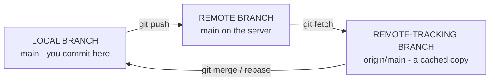
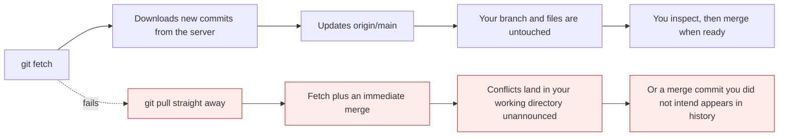
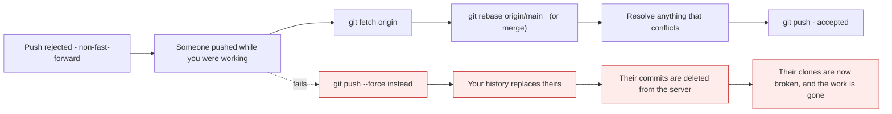

# Remotes

*Module 07 · Daily work*

Everything so far worked with no network at all. This module adds the other copies - and one
concept that most people never learn explicitly, which is why `git pull` occasionally does
something they did not ask for.

[Course home](../index.md) / Module 07

## 1. A remote is a named URL

```bash
git remote -v
```

```text
origin  https://github.com/89himanshu-dwivedi/til.git (fetch)
origin  https://github.com/89himanshu-dwivedi/til.git (push)
```

That is all a remote is: a **nickname for a URL**. `origin` is not special - it is simply the
name `git clone` uses by default.

```bash
git remote add upstream https://github.com/original/repo.git
git remote rename origin github
git remote set-url origin git@github.com:user/repo.git    # switch HTTPS to SSH
git remote remove old-mirror
git remote show origin                                     # detail: branches, tracking, URLs
```

## 2. The three kinds of branch

This is the concept that explains everything else in the module.



> **Why it matters:** `origin/main` is **not** the branch on the server. It is your local, read-only note of *where the server's branch was the last time you fetched.* It only moves when you `fetch`, `pull` or `push`. This is why `git log origin/main` can be days out of date and why "but it looks fine on my machine" happens.

| Branch | Lives | You commit to it? | Updated by |
| --- | --- | --- | --- |
| `main` | Your machine | **Yes** | Your commits |
| `origin/main` | Your machine | No - read only | `fetch`, `pull`, `push` |
| `main` on the server | The server | No, not directly | Someone's `push` |

```bash
git branch                # local branches only
git branch -r             # remote-tracking branches only
git branch -a             # both
```

## 3. `git clone`

```bash
git clone https://github.com/user/repo.git
git clone https://github.com/user/repo.git my-folder     # into a different folder name
git clone --depth 1 https://github.com/user/repo.git     # shallow - latest commit only, fast
git clone -b develop https://github.com/user/repo.git    # start on a specific branch
```

Four things happen, and it is worth knowing all of them:

| Step | Result |
| --- | --- |
| 1 | Creates the folder and runs `git init` |
| 2 | Adds a remote called `origin` pointing at the URL |
| 3 | Downloads **all** objects - the entire history |
| 4 | Creates a local branch tracking the remote's default branch, and checks it out |

> **NOTE - `--depth 1` is for CI, not for you**
>
> A shallow clone skips history, which makes pipeline checkouts much faster. It also breaks `git log`, `git blame` and anything comparing against an older commit. Use it in a build job; never on your development machine.

## 4. `fetch` and `pull` - the difference that matters

```bash
git fetch origin          # download new commits; change NOTHING in your working directory
git pull origin main      # fetch, then merge into your current branch
```



> **Why it matters:** **`git pull` is `git fetch` followed by `git merge`.** Fetch is always safe - it only downloads. Pull changes your working directory immediately. Fetching first and looking before merging costs ten seconds and removes every surprise.

The habit worth building:

```bash
git fetch origin
git log --oneline HEAD..origin/main     # what is on the server that I do not have
git log --oneline origin/main..HEAD     # what I have that the server does not
git diff HEAD origin/main               # the actual changes
git merge origin/main                   # now merge, knowingly
```

### 4.1 The merge commit you did not ask for

You committed locally. Meanwhile a colleague pushed. You run `git pull`:

```text
Merge branch 'main' of github.com:user/repo
```

Nobody typed that. It appeared because both sides had new commits, so `pull` performed a
three-way merge - module 06. In a busy repository this produces a history full of noise merges.

```bash
git pull --rebase                             # replay your commits on top instead
git config --global pull.rebase true          # make it the default
git config --global pull.ff only              # or: refuse to merge, make me decide
```

| `pull.rebase` | Behaviour |
| --- | --- |
| `false` (default) | Merge - creates a merge commit when both sides moved |
| `true` | Rebase - replays your local commits on top, keeps history linear |
| `pull.ff only` | Refuse unless it can fast-forward - forces you to choose deliberately |

Rebase gets its own module (09), including the rule about when **not** to use it.

## 5. `git push`

```bash
git push                                  # to the tracked branch
git push origin main                      # explicit
git push -u origin feature/login          # push AND set up tracking
git push origin --delete feature/login    # delete a branch on the server
git push --tags                           # push tags (module 14)
```

### 5.1 The error everyone hits

```text
! [rejected]        main -> main (fetch first)
error: failed to push some refs to 'github.com:user/repo.git'
hint: Updates were rejected because the remote contains work that you do
hint: not have locally.
```



> **Why it matters:** The rejection is Git **protecting someone else's work**. It is not an obstacle to be forced past. Integrate first - fetch and rebase or merge - then push. `--force` on a shared branch is how teams lose a day.

When a force push is genuinely needed - after rebasing your own feature branch:

```bash
git push --force-with-lease
```

It refuses if the remote moved since your last fetch, so a colleague who pushed in the meantime
is protected. Make it the reflex; plain `--force` should feel wrong to type.

## 6. Tracking branches

```bash
git push -u origin feature/login          # -u sets upstream
git branch -vv                            # show what each local branch tracks
git branch -u origin/main                 # set upstream for the current branch
git config --global push.autoSetupRemote true   # do it automatically on first push
```

Tracking is what makes bare `git push`, `git pull` and `git status`'s "ahead by 2 commits"
work. Without it:

```text
fatal: The current branch feature/login has no upstream branch
```

## 7. Keeping remotes tidy

```bash
git fetch --prune                              # delete refs to branches removed on the server
git config --global fetch.prune true           # always
git remote prune origin --dry-run
git branch -vv | Select-String ": gone]"       # local branches whose remote is deleted
```

After a pull request is merged and the branch deleted on GitHub, your `origin/feature-x` sticks
around until you prune. On a busy repository `git branch -a` becomes unusable within weeks.

## 8. Multiple remotes: the fork workflow

```bash
git clone https://github.com/me/project.git         # origin = my fork
git remote add upstream https://github.com/original/project.git

git fetch upstream
git switch main
git merge upstream/main        # bring my fork up to date
git push origin main
```

| Remote | Points at | You push to it? |
| --- | --- | --- |
| `origin` | Your fork | Yes |
| `upstream` | The original project | No - you open a pull request instead |

## 9. Extra points

- **`origin` is just a name.** Rename it, have five remotes, or none. Nothing in Git treats it
  specially.
- **`git fetch` never changes your files.** It is always safe to run, at any time, in any state.
- **`git remote show origin`** tells you which local branches are configured for push and pull,
  and which remote branches are stale.
- **Pushing does not push everything.** Only the current branch by default, and never your
  stash, reflog or local config.
- **A push updates your `origin/main` too**, because after a successful push your local note of
  the server's position is known to be correct.
- **`git ls-remote origin`** queries the server without downloading anything - useful for
  checking whether a branch or tag exists.

> **PRACTICE - Practice now**
>
> You need a remote for this. Create an empty repository on GitHub called `remote-demo` - do not add a README.
>
> 1. Connect a local repository to it:
>    ```bash
>    mkdir remote-demo && cd remote-demo && git init
>    echo "# Remote demo" > README.md
>    git add . && git commit -m "First commit"
>    git remote add origin https://github.com/<you>/remote-demo.git
>    git remote -v
>    git push -u origin main
>    ```
> 2. **See all three kinds of branch:**
>    ```bash
>    git branch
>    git branch -r
>    git branch -a
>    git branch -vv
>    ```
> 3. **Prove `origin/main` is only a cached note.** Change something on GitHub directly - edit
>    the README in the browser and commit. Then, without fetching:
>    ```bash
>    git log --oneline origin/main
>    ```
>    Your new commit is not there. Now:
>    ```bash
>    git fetch origin
>    git log --oneline origin/main
>    ```
> 4. **Prove `fetch` does not touch your files:**
>    ```bash
>    cat README.md
>    git status
>    ```
>    Unchanged, even though `origin/main` moved.
> 5. **Look before you merge:**
>    ```bash
>    git log --oneline HEAD..origin/main
>    git diff HEAD origin/main
>    git merge origin/main
>    ```
> 6. **Cause the merge commit you did not ask for:**
>    ```bash
>    echo "local change" >> README.md && git commit -am "Local work"
>    ```
>    Edit the README on GitHub again, then:
>    ```bash
>    git pull
>    git log --oneline --graph
>    ```
>    Read the "Merge branch 'main' of..." commit nobody typed.
> 7. **Now do it the other way:**
>    ```bash
>    git reset --hard HEAD~2
>    echo "local again" >> README.md && git commit -am "Local work"
>    git pull --rebase
>    git log --oneline --graph
>    ```
>    Linear. No merge commit.
> 8. **Trigger the rejected push and fix it properly:**
>    ```bash
>    # edit the README on GitHub, then:
>    echo "conflicting local" >> README.md && git commit -am "Mine"
>    git push
>    ```
>    Read the rejection, then:
>    ```bash
>    git fetch origin
>    git rebase origin/main
>    git push
>    ```
> 9. **Practise pruning:**
>    ```bash
>    git switch -c temp-branch && git push -u origin temp-branch
>    git push origin --delete temp-branch
>    git branch -a
>    git fetch --prune
>    git branch -a
>    ```

> **ASSIGNMENT - Assignment**
>
> Write down, in your own words, what each of these four things is and where it lives: `main`, `origin/main`, `origin`, and the branch on the server. Then explain why `git log origin/main` can be wrong, and what command makes it right. If you can teach that distinction to someone else, you will never again be confused by a rejected push, a surprise merge commit, or a branch that "still exists" after being deleted on GitHub.

## 10. Interview drill

<details>
<summary><b>What is the difference between `git fetch` and `git pull`?</b></summary>

`git fetch` downloads new commits from the remote and updates your remote-tracking branches such
as `origin/main`, changing nothing in your working directory or local branches - it is always
safe. `git pull` is `fetch` followed immediately by `merge` (or `rebase` if configured), so it
modifies your branch and can produce conflicts or an unexpected merge commit. Fetching first and
inspecting with `git log HEAD..origin/main` before merging removes every surprise.

</details>

<details>
<summary><b>What exactly is `origin/main`?</b></summary>

A remote-tracking branch: a **local, read-only pointer** recording where the remote's `main` was
the last time you communicated with the server. It is not the server's branch and it does not
update by itself - only `fetch`, `pull` or a successful `push` moves it. That is why
`git log origin/main` can be days stale, and why the fix is always to fetch first.

</details>

<details>
<summary><b>Your push is rejected as non-fast-forward. What happened and what do you do?</b></summary>

Someone else pushed commits that you do not have, so accepting your push would discard their
work - Git refuses to do that. The fix is to integrate first: `git fetch`, then either
`git rebase origin/main` to replay your commits on top, or `git merge origin/main`, resolve
anything that conflicts, and push again. Forcing past the rejection deletes their commits from
the server and breaks every clone that has them.

</details>

<details>
<summary><b>What is the difference between `--force` and `--force-with-lease`?</b></summary>

`--force` overwrites the remote branch unconditionally. `--force-with-lease` first verifies the
remote is still where your last fetch said it was, and aborts if it has moved - so it lets you
rewrite your own history while protecting anyone who pushed in the meantime. Force pushing is
legitimate on a personal feature branch after a rebase, and never appropriate on a shared branch
such as `main`, which should be protected in the platform anyway.

</details>

<details>
<summary><b>Where does the "Merge branch 'main' of..." commit come from?</b></summary>

From `git pull` when both your local branch and the remote have new commits. Pull runs a merge,
and because the histories diverged it cannot fast-forward, so it creates a merge commit
automatically. In an active repository this fills history with noise. Setting
`pull.rebase true` replays your commits on top instead and keeps history linear, or
`pull.ff only` makes Git refuse and forces you to choose consciously.

</details>

<details>
<summary><b>Why do deleted remote branches keep appearing in `git branch -a`?</b></summary>

Because remote-tracking references are only removed when you prune. Deleting a branch on GitHub
does not reach into your clone, so `origin/feature-x` remains until `git fetch --prune` removes
it. Setting `fetch.prune true` globally makes every fetch clean up automatically, which keeps
`git branch -a` usable on a repository where branches are created and merged constantly.

</details>

---

[← Module 06](06-branching-and-merging.md) &nbsp;&nbsp;|&nbsp;&nbsp; [Module 08: Merge conflicts →](08-merge-conflicts.md)

---

Git & Pipelines: Zero to Architect · Himanshu Kumar.
