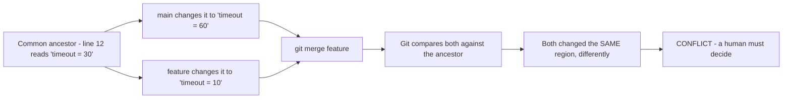
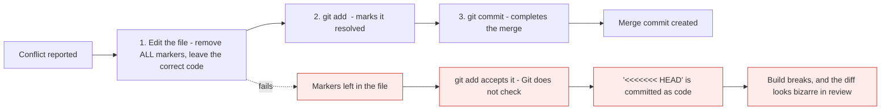
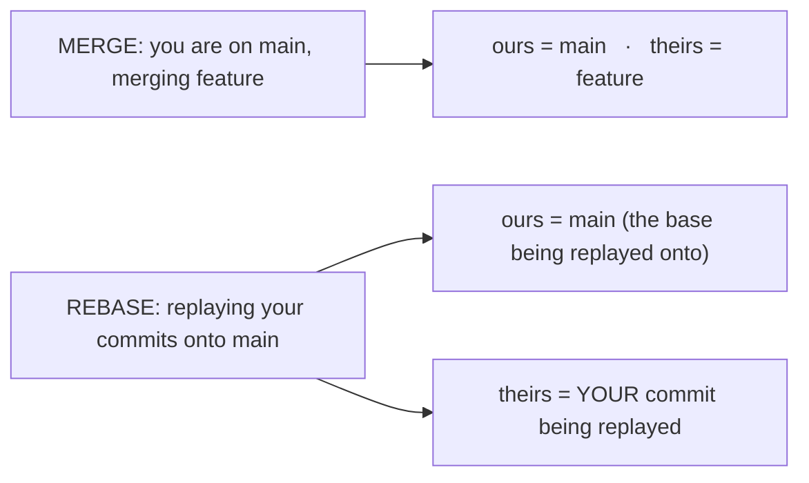

# Merge conflicts

*Module 08 · Daily work*

A conflict is not a failure and not an error. It is Git saying: *two people changed the same
lines, and I will not guess which one is right.* People fear conflicts because nobody ever
explained the markers - so this module reads them properly, resolves them, and then covers the
one thing that reverses everything: conflicts during a rebase.

[Course home](../index.md) / Module 08

## 1. Why conflicts happen



> **Why it matters:** Git merges automatically whenever only **one** side changed a region - which is the overwhelming majority of the time. A conflict means both sides changed the same lines and there is no correct answer available from the data. Refusing to guess is the right behaviour; silently picking one would be far worse.

| Situation | Git's decision |
| --- | --- |
| Only `main` changed a region | Take `main`'s version |
| Only `feature` changed it | Take `feature`'s version |
| Both changed **different** regions of the same file | Merge both automatically |
| Both changed the **same** region | **Conflict** |
| One side deleted the file, the other modified it | **Conflict** - modify/delete |
| Both added a file with the same name | **Conflict** - add/add |

## 2. What a conflict looks like

```bash
git merge feature/timeout
```

```text
Auto-merging config.js
CONFLICT (content): Merge conflict in config.js
Automatic merge failed; fix conflicts and then commit the result.
```

```bash
git status
```

```text
You have unmerged paths.
  (fix conflicts and run "git commit")
  (use "git merge --abort" to abort the merge)

Unmerged paths:
  (use "git add <file>..." to mark resolution)
        both modified:   config.js
```

Open the file:

```text
const config = {
<<<<<<< HEAD
  timeout: 60,
=======
  timeout: 10,
>>>>>>> feature/timeout
  retries: 3,
};
```

| Marker | Means |
| --- | --- |
| `<<<<<<< HEAD` | Start of **your** version - the branch you are on |
| `=======` | Divider |
| `>>>>>>> feature/timeout` | End of **their** version - the branch being merged in |

> **NOTE - "ours" and "theirs" are positional, not moral**
>
> `HEAD` / *ours* is whichever branch you are currently on. If you are on `main` merging `feature`, then `main` is ours. Nothing about it is more correct - and section 6 shows how this flips completely during a rebase, which is where most confusion comes from.

## 3. Resolving one

Three steps, always the same:



> **Why it matters:** **Git does not verify that you removed the markers.** `git add` marks a file resolved because you said so. Committing `<<<<<<< HEAD` into a source file is a genuinely common mistake - which is why section 8's `grep` check is worth adding to a pre-commit hook.

Resolved:

```text
const config = {
  timeout: 30,
  retries: 3,
};
```

```bash
git add config.js
git status                 # "All conflicts fixed but you are still merging"
git commit                 # default message is fine - explain your choice if it was subtle
```

Or abandon the whole thing:

```bash
git merge --abort          # back to exactly before the merge started
```

`--abort` is always available while a merge is in progress, and always safe. Nothing about a
conflict is permanent until you commit.

## 4. A far better conflict display

The default markers hide the most useful information: **what the line looked like before either
side touched it.**

```bash
git config --global merge.conflictStyle zdiff3
```

Now the same conflict reads:

```text
<<<<<<< HEAD
  timeout: 60,
||||||| base
  timeout: 30,
=======
  timeout: 10,
>>>>>>> feature/timeout
```

The `||||||| base` section is the common ancestor.

> **TIP - This one setting makes conflicts twice as easy**
>
> Without the base you see two answers and must guess the question. With it you can see that one side raised the value and the other lowered it - so the resolution is a decision about intent, not a coin toss. Set it once and never turn it off.

## 5. Tools that help

```bash
git diff                                  # during a conflict, shows the combined diff
git diff --name-only --diff-filter=U      # list only conflicted files
git checkout --ours config.js             # take my whole version of this file
git checkout --theirs config.js           # take their whole version
git restore --merge config.js             # undo my edits, put the markers back
git mergetool                             # open a configured 3-way merge tool
```

```bash
git config --global merge.tool vscode
git config --global mergetool.vscode.cmd 'code --wait $MERGED'
```

| Command | Use when |
| --- | --- |
| `--ours` / `--theirs` | The whole file should come from one side - generated files, lock files |
| `git restore --merge` | You edited badly and want the markers back to start again |
| `git mergetool` | Large or structural conflicts where side-by-side helps |
| `git merge --abort` | You should not be doing this merge yet |

> **WARNING - `--ours` and `--theirs` take the entire file**
>
> Not the conflicted region - the whole file, discarding every change the other side made to it. That is correct for a regenerated lock file and wrong for source code, where you almost always want some of both.

## 6. Conflicts during a rebase - where ours and theirs flip

This catches everyone, including experienced people.



> **Why it matters:** During a rebase Git checks out the upstream branch and replays your commits on top of it - so **"ours" is the branch you are rebasing onto, and "theirs" is your own work.** It is the opposite of what the words suggest. Anyone who reflexively picks `--ours` during a rebase throws away their own changes.

```bash
git rebase main
# ... conflict ...
git add <resolved files>
git rebase --continue        # NOT git commit
git rebase --skip            # drop this commit entirely
git rebase --abort           # give up, return to where you started
```

| | Merge | Rebase |
| --- | --- | --- |
| Finish with | `git commit` | **`git rebase --continue`** |
| Abandon with | `git merge --abort` | `git rebase --abort` |
| `ours` | Your current branch | The branch you are rebasing **onto** |
| `theirs` | The branch being merged | **Your own commits** |
| Conflicts occur | Once | Potentially **once per commit** |

## 7. `rerere` - stop resolving the same conflict twice

```bash
git config --global rerere.enabled true
```

**Re**use **re**corded **re**solution: Git remembers how you resolved a particular conflict and
applies the same resolution automatically if it reappears. On a long-lived branch that you
rebase repeatedly, this converts a recurring twenty-minute chore into nothing.

## 8. Avoiding conflicts in the first place

Most conflict pain is a process problem, not a Git problem.

| Habit | Why it works |
| --- | --- |
| **Small, short-lived branches** | A branch open for two days diverges far less than one open for three weeks |
| **Integrate `main` frequently** | Resolve two small conflicts today instead of forty next month |
| **One concern per pull request** | Fewer files touched means fewer collisions |
| **Agree formatting, enforce it in CI** | Formatter wars produce conflicts in every file |
| **Do not reformat and refactor in one commit** | The diff becomes unmergeable |
| **Split large files** | A 3,000-line file is a conflict magnet for the whole team |

```bash
# a pre-commit safety net
git diff --cached | Select-String -Pattern "^(<<<<<<<|=======|>>>>>>>)"
```

## 9. Extra points

- **A conflict never loses anything.** Both versions are in the repository; you are choosing what
  the *next* commit contains. `--abort` returns you to safety at any point.
- **`git log --merge`** during a conflict lists only the commits that touched the conflicted
  region - usually the fastest way to understand *why* both sides changed it.
- **Binary files always conflict as a whole.** There is no line merge, so you pick one side -
  `--ours` or `--theirs` - which is one reason binaries belong in LFS or a registry.
- **Ask the other author.** The commit that conflicts with yours has a name on it. Thirty seconds
  of conversation beats twenty minutes of guessing at intent.
- **A conflicted merge is a normal repository state.** `git status` tells you exactly what to do
  next, in plain English, every time.

> **PRACTICE - Practice now**
>
> Create conflicts deliberately. They are much less frightening once you have caused a dozen.
>
> 1. Set up:
>    ```bash
>    mkdir conflict-demo && cd conflict-demo && git init
>    git config merge.conflictStyle zdiff3
>    printf "const config = {\n  timeout: 30,\n  retries: 3,\n};\n" > config.js
>    git add . && git commit -m "Add config"
>    ```
> 2. **Make both branches change the same line:**
>    ```bash
>    git switch -c feature/timeout
>    (Get-Content config.js) -replace 'timeout: 30', 'timeout: 10' | Set-Content config.js
>    git commit -am "Lower timeout to 10"
>    git switch main
>    (Get-Content config.js) -replace 'timeout: 30', 'timeout: 60' | Set-Content config.js
>    git commit -am "Raise timeout to 60"
>    ```
> 3. **Trigger it:**
>    ```bash
>    git merge feature/timeout
>    git status
>    cat config.js
>    ```
>    Read the markers, including the `||||||| base` section.
> 4. **Abort, and confirm nothing was harmed:**
>    ```bash
>    git merge --abort
>    git status
>    cat config.js
>    ```
> 5. **Now resolve it properly:**
>    ```bash
>    git merge feature/timeout
>    git diff --name-only --diff-filter=U
>    ```
>    Edit `config.js` to `timeout: 30`, remove every marker, then:
>    ```bash
>    git add config.js
>    git status
>    git commit
>    git log --oneline --graph
>    ```
> 6. **Cause the classic mistake on purpose:**
>    ```bash
>    git switch -c bad-resolution
>    ```
>    Recreate a conflict, then `git add` **without** removing the markers and commit. Look at the
>    file. Then add the safety-net check from section 8 and see it catch the problem.
> 7. **Try `--ours` and `--theirs`:**
>    ```bash
>    git merge feature/timeout
>    git checkout --ours config.js && cat config.js
>    git checkout --theirs config.js && cat config.js
>    git merge --abort
>    ```
> 8. **Prove the rebase flip.** Create the same conflict, but rebase instead of merge:
>    ```bash
>    git switch feature/timeout
>    git rebase main
>    ```
>    During the conflict, inspect both sides and confirm that `--ours` is now `main` and
>    `--theirs` is your own commit. Then:
>    ```bash
>    git add config.js
>    git rebase --continue
>    ```
> 9. **Turn on `rerere`**, resolve the same conflict twice, and watch the second one resolve
>    itself:
>    ```bash
>    git config rerere.enabled true
>    ```

> **ASSIGNMENT - Assignment**
>
> Pair with someone. Both clone the same repository, both edit the same function in different ways, and both try to push. One of you will be rejected. Work through it together: fetch, rebase, resolve, push. Then swap roles and do it again with a merge instead of a rebase, and note where `ours` and `theirs` pointed each time. Twenty minutes of this removes conflict anxiety permanently, and it is the single most useful exercise in this course to do with another person.

## 10. Interview drill

<details>
<summary><b>What causes a merge conflict?</b></summary>

Both branches changing the same region of the same file, relative to their common ancestor. Git
performs a three-way comparison: if only one side changed a region it applies that change
automatically, and it merges changes to different regions of the same file without trouble.
Only when both sides changed the same lines differently does it stop, because there is no
correct answer derivable from the content. Modify/delete and add/add situations conflict for the
same reason.

</details>

<details>
<summary><b>Explain the conflict markers.</b></summary>

`<<<<<<< HEAD` opens your current branch's version, `=======` divides the two, and
`>>>>>>> branch-name` closes the incoming version. With `merge.conflictStyle` set to `zdiff3`
you also get a `||||||| base` section showing the common ancestor, which is far more useful
because it reveals what each side actually changed rather than just presenting two answers.
Resolution means editing the file to the correct content, removing every marker, then
`git add` and `git commit`.

</details>

<details>
<summary><b>Why do "ours" and "theirs" swap during a rebase?</b></summary>

Because rebase checks out the upstream branch and replays your commits on top of it. From Git's
point of view the checked-out branch is "ours" - so during a rebase *ours* is the branch you are
rebasing **onto**, and *theirs* is your own commit being applied. It is the reverse of a merge,
and reflexively choosing `--ours` during a rebase silently discards your own work. It is also
why you finish a rebase with `git rebase --continue` rather than `git commit`.

</details>

<details>
<summary><b>You are halfway through a messy conflict and want out. What are your options?</b></summary>

`git merge --abort` returns the repository to exactly its pre-merge state, and
`git rebase --abort` does the same for a rebase - both are always safe while the operation is in
progress. If you only want to restart on one file, `git restore --merge <file>` puts the
conflict markers back so you can begin again. Nothing is permanent until you commit, so a
conflict is never a situation you can be trapped in.

</details>

<details>
<summary><b>What is `git rerere` and when is it worth enabling?</b></summary>

Reuse Recorded Resolution. Git records how you resolved a specific conflict and replays that
resolution automatically if the same conflict appears again. It pays for itself on long-lived
branches that get rebased repeatedly against a moving `main`, where the same conflict otherwise
recurs on every rebase. It costs nothing to enable and is invisible until it saves you.

</details>

<details>
<summary><b>How do you reduce conflicts across a team?</b></summary>

Almost entirely through process rather than Git. Keep branches small and short-lived so they
diverge less; integrate `main` into your branch frequently so you resolve small conflicts early;
keep one concern per pull request so fewer files are touched; agree a code formatter and enforce
it in CI so nobody's editor reformats whole files; never combine reformatting with a refactor in
one commit; and split very large files, which are conflict magnets for the whole team.

</details>

---

[← Module 07](07-remotes.md) &nbsp;&nbsp;|&nbsp;&nbsp; [Module 09: Rebase vs merge →](09-rebase-vs-merge.md)

---

Git & Pipelines: Zero to Architect · Himanshu Kumar.
