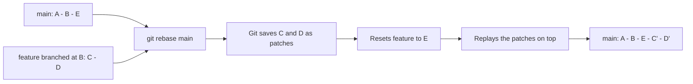
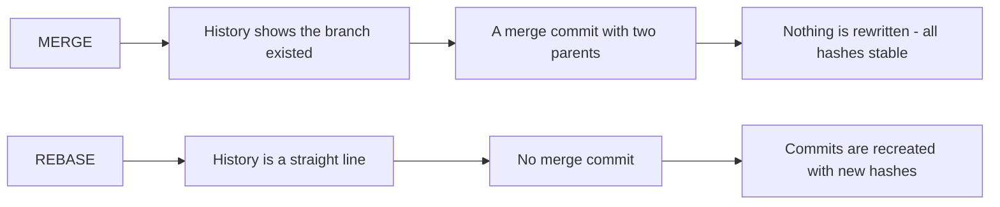
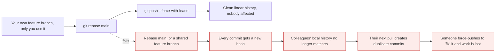
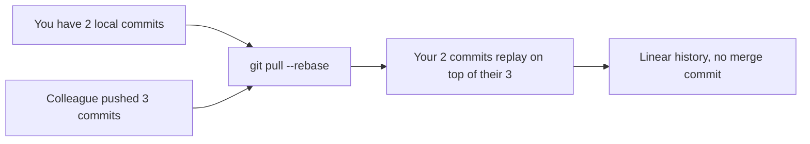

# Rebase vs merge

*Module 09 · Daily work*

The argument that never ends, mostly because both sides are describing different problems. This
module explains what rebase physically does, why that makes it dangerous on shared branches,
and how to decide - rather than picking a side.

[Course home](../index.md) / Module 09

## 1. What rebase actually does

Not "moves your commits". **Copies them.**



> **Why it matters:** `C'` and `D'` are **new commits with new hashes**. The originals still exist, unreferenced, until garbage collection. That single fact - rebase creates new objects rather than moving old ones - explains every rule that follows, including why rebasing shared history breaks other people's repositories.

```bash
git switch feature
git rebase main
```

| | Before | After |
| --- | --- | --- |
| Commits | `C`, `D` | `C'`, `D'` |
| Hashes | `9b2d4a1`, `7c8e5f2` | **different** |
| Content | Same changes | Same changes |
| Parent of the first | `B` | `E` |
| Old commits | on the branch | orphaned, recoverable via reflog |

## 2. The two shapes



| | `git merge main` | `git rebase main` |
| --- | --- | --- |
| History shape | Branched and rejoined | **Linear** |
| Extra commit | Yes, a merge commit | No |
| Rewrites history | **No** | **Yes** |
| Hashes preserved | Yes | No |
| Safe on a pushed branch | **Yes** | Only if nobody else uses it |
| Shows when integration happened | Yes | No |
| Conflicts | Once, at the merge | **Possibly once per commit** |
| `git log` readability | Noisier, but truthful | Cleaner, but rearranged |
| `git bisect` | Works | Works better - linear |

## 3. The golden rule

> **Never rebase commits that other people have pulled.**



> **Why it matters:** Your colleague's repository still contains the **original** `C` and `D`. When they pull your rebased branch, Git sees commits with different hashes containing the same changes - and merges them, producing duplicates. Untangling that costs an afternoon and usually ends with someone force-pushing over someone else's work.

| Branch | Rebase? |
| --- | --- |
| Your local feature branch, unpushed | **Yes** - freely |
| Your feature branch, pushed, only you work on it | **Yes** - then `--force-with-lease` |
| A feature branch two people share | Only after agreeing, out loud |
| `main`, `develop`, `release/*` | **Never** |

## 4. The three ways to integrate

```bash
git switch feature

git merge main          # bring main INTO feature - preserves history
git rebase main         # replay feature ON TOP of main - linear
```

And the third, which happens at the platform rather than locally:

| Strategy | Result on `main` | Feature branch history |
| --- | --- | --- |
| **Merge commit** | Merge commit with two parents | Every commit preserved |
| **Rebase and merge** | Commits appended linearly | Every commit preserved, new hashes |
| **Squash and merge** | **One** commit | Collapsed - individual commits discarded |

> **TIP - Squash merge is the pragmatic default for most teams**
>
> The team gets a clean, linear `main` where one commit equals one pull request and reverting a feature is trivial - while developers stay free to commit messily on their branch. The cost is that intermediate commits disappear, which matters if your branches are long-lived and their internal history is meaningful. For short-lived feature branches, it rarely is.

## 5. Keeping a feature branch current

While your branch is open, `main` moves. Two ways to stay current:

```bash
# Option A - merge main in, repeatedly
git switch feature
git merge main

# Option B - rebase onto the new main
git switch feature
git fetch origin
git rebase origin/main
git push --force-with-lease
```

| | Merging `main` in | Rebasing onto `main` |
| --- | --- | --- |
| Branch history | Accumulates merge commits from `main` | Stays clean |
| Force push needed | No | **Yes** |
| Reviewer experience | Diff gets noisy over time | Diff stays focused |
| Risk | None | Must be sure nobody else uses the branch |

> **NOTE - Rebase conflicts can repeat**
>
> A merge resolves conflicts once, against the final state. A rebase replays each commit in turn, so the same conflict can appear on several commits. Two things fix this: turn on `rerere` from module 08, and keep your commits few and meaningful - which is also what makes review easier.

## 6. `git pull --rebase`

```bash
git pull --rebase
git config --global pull.rebase true
```

This is the safest, most useful rebase there is: your *unpushed* local commits get replayed on
top of what the server has, instead of producing a merge commit. Nothing shared is rewritten,
because those commits were never shared.



> **Why it matters:** This is the one rebase that essentially every team should turn on. It removes the "Merge branch 'main' of..." noise from module 07 permanently, and it rewrites only commits that exist nowhere but your machine - so the golden rule is not violated.

## 7. `rebase --onto` - the surgical version

You branched `feature-b` from `feature-a`, then `feature-a` was abandoned. You want `feature-b`
on `main`, without dragging `feature-a`'s commits along.

```bash
git rebase --onto main feature-a feature-b
```

Read it as: **take the commits after `feature-a` up to `feature-b`, and put them onto `main`.**

```bash
git rebase --onto main HEAD~3        # move the last 3 commits onto main
git rebase --onto HEAD~5 HEAD~3      # drop two commits from the middle of history
```

Rare, but when you need it nothing else does the job.

## 8. Recovering from a bad rebase

```bash
git rebase --abort            # while it is still in progress
git reflog                    # after it finished - find the pre-rebase HEAD
git reset --hard HEAD@{5}     # go back to it
```

> **TIP - `ORIG_HEAD` is a shortcut**
>
> Git stores your position before a rebase, merge or reset in `ORIG_HEAD`. `git reset --hard ORIG_HEAD` undoes the last such operation without hunting through the reflog. It only holds the most recent one, so use it immediately.

## 9. Extra points

- **Rebase is a rewrite, so it is history editing.** Everything from module 15 - amend, squash,
  interactive rebase - is the same operation with more control.
- **A rebased commit keeps its author and author date**, but gets a new committer and commit
  date. `git log --format="%an %ad %cn %cd"` shows both.
- **`git merge --squash`** is the local equivalent of the platform's squash merge: it stages all
  the changes without creating a merge commit, and you commit once.
- **Linear history makes `git bisect` faster and clearer** - module 10 - which is a genuine
  operational argument for rebasing, not just an aesthetic one.
- **The debate is really about a tradeoff**: merge preserves *what actually happened*, rebase
  produces *what you wish had happened*. Both are defensible; inconsistency is not.

> **PRACTICE - Practice now**
>
> 1. Set up two diverging branches:
>    ```bash
>    mkdir rebase-demo && cd rebase-demo && git init
>    echo "A" > f.txt && git add . && git commit -m "A"
>    echo "B" >> f.txt && git commit -am "B"
>    git switch -c feature
>    echo "C" > c.txt && git add . && git commit -m "C"
>    echo "D" > d.txt && git add . && git commit -m "D"
>    git switch main
>    echo "E" > e.txt && git add . && git commit -m "E"
>    git log --oneline --graph --all
>    ```
> 2. **Record the hashes before rebasing** - this is the point of the exercise:
>    ```bash
>    git log --oneline feature
>    ```
> 3. **Rebase and compare:**
>    ```bash
>    git switch feature
>    git rebase main
>    git log --oneline --graph --all
>    git log --oneline feature
>    ```
>    Same messages, **different hashes**. The commits were recreated.
> 4. **Prove the originals still exist:**
>    ```bash
>    git reflog
>    git show <an old C hash>
>    ```
> 5. **Undo the whole rebase:**
>    ```bash
>    git reset --hard ORIG_HEAD
>    git log --oneline --graph --all
>    ```
> 6. **Now merge instead, and compare the shapes:**
>    ```bash
>    git merge main
>    git log --oneline --graph --all
>    ```
>    A merge commit, and every original hash intact.
> 7. **Try squash:**
>    ```bash
>    git switch main
>    git merge --squash feature
>    git status
>    git commit -m "Add feature C and D"
>    git log --oneline --graph --all
>    ```
>    One commit on `main`; the branch's individual commits are gone from it.
> 8. **Prove `pull --rebase` removes the noise merge.** Using the `remote-demo` repository from
>    module 07: commit locally, change the README on GitHub, then compare:
>    ```bash
>    git pull                  # merge commit appears
>    git reset --hard ORIG_HEAD
>    git pull --rebase         # linear
>    git log --oneline --graph
>    ```
> 9. **Try `--onto`:**
>    ```bash
>    git switch -c feature-b feature
>    echo "F" > f2.txt && git add . && git commit -m "F"
>    git rebase --onto main feature feature-b
>    git log --oneline --graph --all
>    ```

> **ASSIGNMENT - Assignment**
>
> Write the branching and integration policy you would propose to a team: which strategy for feature branches, what happens on merge to `main`, whether force pushing is permitted and where, and what `pull.rebase` should be set to. One page, with a sentence of reasoning for each decision. Then find the setting in GitHub's repository options that **enforces** each one - because a policy that lives only in a wiki is not a policy. That document is a genuine architect deliverable, and interviewers ask for exactly this.

## 10. Interview drill

<details>
<summary><b>What is the difference between merge and rebase?</b></summary>

`merge` combines two branches with a new merge commit that has two parents, leaving all existing
commits untouched - history shows the branch existed and when it was integrated. `rebase`
replays your commits on top of another branch, producing **new commits with new hashes** and a
linear history with no merge commit. Merge preserves what actually happened; rebase produces a
tidier story. The critical practical difference is that rebase rewrites history, which is safe
only where that history is not shared.

</details>

<details>
<summary><b>What is the golden rule of rebasing, and why does it exist?</b></summary>

Never rebase commits that other people have already pulled. Rebasing creates new commits with
new hashes, so anyone holding the originals now has a history that no longer matches yours. When
they pull, Git treats the rebased commits as unrelated and merges them, producing duplicates -
and resolving that usually ends with a force push that destroys someone's work. Your own
unpushed or personally-owned branches are fine; `main` and shared branches never are.

</details>

<details>
<summary><b>Why can a rebase produce the same conflict several times?</b></summary>

Because it replays commits one at a time. Each commit is applied to a moving base, so if several
of your commits touch a region that also changed upstream, the conflict recurs for each of them.
A merge resolves once, against the final state of both sides. Enabling `git rerere` records each
resolution and replays it automatically, and keeping commits few and coherent reduces the number
of replays in the first place.

</details>

<details>
<summary><b>What is squash merging, and what does it cost?</b></summary>

Collapsing all commits from a branch into a single commit on the target branch. It gives a clean
`main` where one commit equals one pull request, makes reverting a whole feature trivial, and
lets developers commit freely on their branch without worrying about tidiness. The cost is that
the individual commits are discarded, so bisecting within a feature is impossible and the
reasoning captured in intermediate commit messages is lost. For short-lived branches that is a
good trade; for long-lived ones it may not be.

</details>

<details>
<summary><b>Should `pull.rebase` be true?</b></summary>

For most teams, yes. `git pull --rebase` replays your **unpushed local** commits on top of what
was fetched instead of creating a merge commit, which removes the "Merge branch 'main' of..."
noise entirely. It does not violate the golden rule, because the commits being rewritten exist
only on your machine. The alternative, `pull.ff only`, is also defensible - it refuses to do
anything ambiguous and makes you choose consciously.

</details>

<details>
<summary><b>You rebased and it went badly. How do you recover?</b></summary>

If it is still running, `git rebase --abort` returns you to the starting point. If it completed,
`git reset --hard ORIG_HEAD` undoes it, since Git records your previous position before any
rebase, merge or reset. If `ORIG_HEAD` has been overwritten by a later operation, `git reflog`
lists every position `HEAD` has held and you can reset to the entry from before the rebase. The
original commits are not deleted by a rebase, only orphaned, and they survive until garbage
collection.

</details>

---

[← Module 08](08-merge-conflicts.md) &nbsp;&nbsp;|&nbsp;&nbsp; [Module 10: The rescue kit →](10-rescue-kit.md)

---

Git & Pipelines: Zero to Architect · Himanshu Kumar.
