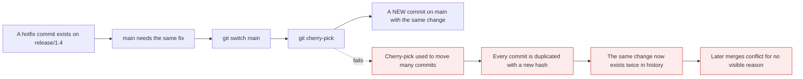

# The rescue kit

*Module 10 · Daily work*

Four commands that turn "I have ruined everything" into a two-minute fix: `stash`,
`cherry-pick`, `reflog` and `bisect`. The last one is the least known and the most impressive -
it finds the commit that introduced a bug in a repository with ten thousand commits, in about
fourteen steps.

[Course home](../index.md) / Module 10

## 1. `git stash` - shelve work without committing

You are half-way through something and need a clean working directory *right now* - to switch
branches, to pull, to reproduce a bug on `main`.

```bash
git stash                          # shelve tracked changes, clean the working directory
git stash push -m "half-done nav"  # with a label - always do this
git stash -u                       # include untracked files
git stash -a                       # include ignored files too
git stash push src/app.js          # stash only specific paths

git stash list
git stash show stash@{0}           # summary
git stash show -p stash@{0}        # full diff

git stash pop                      # reapply the newest AND remove it from the stash
git stash apply stash@{1}          # reapply a specific one, KEEP it in the stash
git stash drop stash@{0}
git stash clear                    # delete every stash - no confirmation
git stash branch fix-nav stash@{0} # create a branch from a stash and apply it
```

| Command | Reapplies | Removes from stash |
| --- | --- | --- |
| `git stash pop` | Yes | Yes |
| `git stash apply` | Yes | **No** |
| `git stash drop` | No | Yes |

> **WARNING - `git stash` ignores untracked files by default**
>
> A brand-new file you created five minutes ago is **not** stashed unless you pass `-u`. People stash, switch branch, and find their new file has followed them - or worse, gets overwritten. If you created files, use `git stash -u`.

> **TIP - Always label your stashes**
>
> `stash@{0}: WIP on main: 9b2d4a1 Fix login` tells you nothing three days later. `git stash push -m "half-finished nav refactor"` takes two seconds and makes `git stash list` readable. A stack of unlabelled stashes is functionally the same as deleted work.

## 2. `git cherry-pick` - take one commit from anywhere

```bash
git cherry-pick abc1234                 # apply that commit here
git cherry-pick abc1234 def5678         # several
git cherry-pick abc1234..def5678        # a range, exclusive of the first
git cherry-pick -n abc1234              # apply but do not commit - stage only
git cherry-pick -x abc1234              # record "cherry picked from commit abc1234"
```



> **Why it matters:** Cherry-pick **copies** a change - it creates a new commit with a new hash. That is exactly right for backporting one hotfix to a release branch. It is exactly wrong as a way of moving a batch of work between branches, because you end up with the same change recorded twice and merges that conflict for reasons nobody can see.

```bash
git cherry-pick --continue     # after resolving conflicts
git cherry-pick --abort
git cherry-pick --skip
```

> **TIP - Use `-x` for backports**
>
> It appends `(cherry picked from commit abc1234)` to the message, so six months later you can tell that this commit is a copy and find the original. On a release branch that single line answers "did this fix ever make it to main?"

## 3. `git reflog` - the undo history for everything

Module 05 introduced it. Here is the full picture.

```bash
git reflog                       # HEAD's movement history
git reflog show main             # a specific branch's movement
git reflog --date=relative
git reflog expire --expire=90.days.ago --all
```

```text
f3a1c9e HEAD@{0}: rebase finished: returning to refs/heads/feature
9b2d4a1 HEAD@{1}: rebase: Add payment validation
7c8e5f2 HEAD@{2}: reset: moving to HEAD~2
1a2b3c4 HEAD@{3}: commit: Add null check
```

Every entry is a position `HEAD` held, with the operation that put it there. Entries survive
about 90 days.

| Disaster | Recipe |
| --- | --- |
| `reset --hard` destroyed commits | `git reflog` → `git reset --hard <hash>` |
| Rebase went wrong | `git reset --hard ORIG_HEAD` |
| Deleted a branch with `-D` | `git reflog` → `git branch <name> <hash>` |
| Commits made in detached HEAD | `git reflog` → `git branch rescue <hash>` |
| Amended a commit and lost the original | `git reflog` → `git reset --hard <hash>` |
| Force-pushed over your own work | `git reflog` locally still has it |

```bash
git fsck --lost-found            # find dangling commits reflog does not list
```

> **NOTE - Reflog is local and personal**
>
> It is not pushed, not cloned, and not shared. A fresh clone has an empty reflog, and your colleague's reflog cannot recover what you destroyed. It also cannot recover anything that was never committed - which remains the strongest argument for committing early and often.

## 4. `git bisect` - binary search for the commit that broke it

The bug exists today. It did not exist in the release three months ago. Somewhere in 800
commits is the one that caused it.


> **Why it matters:** Binary search over history. 1,000 commits takes about **10** tests, 10,000 takes about 14. Reading the diffs by hand would take days. This is the single most impressive Git command to know, and almost nobody reaches for it.

```bash
git bisect start
git bisect bad                    # HEAD is broken
git bisect good v1.4.0            # this tag was fine

# Git checks out a commit in the middle. Test it, then:
git bisect good                   # ...or: git bisect bad

# repeat until:
# abc1234 is the first bad commit

git bisect reset                  # return to where you started
```

### 4.1 Automate it

If you can write a command that exits 0 for good and non-zero for bad, Git will do the whole
search unattended:

```bash
git bisect start HEAD v1.4.0
git bisect run npm test
```

```bash
git bisect run ./scripts/check-bug.sh
git bisect run pytest tests/test_login.py
```

```bash
#!/usr/bin/env bash
# check-bug.sh - exit 0 if good, 1 if bad
npm run build --silent || exit 125    # 125 = "cannot test this commit, skip it"
grep -q "expected output" <(./run.sh) && exit 0 || exit 1
```

| Exit code | Meaning |
| --- | --- |
| `0` | Good |
| `1`-`124`, `126`, `127` | Bad |
| `125` | **Skip** - this commit cannot be tested |

```bash
git bisect skip                   # manually skip an untestable commit
git bisect log > bisect.log       # save the session
git bisect replay bisect.log      # restore it
```

## 5. Disaster recipes

The situations that actually happen, and the exact fix.

| "I..." | Fix |
| --- | --- |
| ...committed to `main` instead of a branch | `git branch feature` → `git reset --hard HEAD~1` → `git switch feature` |
| ...committed the wrong file | `git reset --soft HEAD~1` → restage correctly → commit |
| ...need to change the last commit message | `git commit --amend` |
| ...forgot a file in the last commit | `git add f` → `git commit --amend --no-edit` |
| ...need this one commit on another branch | `git cherry-pick <hash>` |
| ...need to pull but have dirty files | `git stash` → `git pull` → `git stash pop` |
| ...committed a secret | Rotate it **first**, then module 15 |
| ...pushed to the wrong branch | `git push origin --delete wrong` → push correctly |
| ...deleted a branch I needed | `git reflog` → `git branch <name> <hash>` |
| ...have no idea what state I am in | `git status` → `git log --oneline --graph --all` → `git reflog` |

```bash
# committed to main by mistake, not yet pushed
git branch feature/my-work        # save the commit on a new branch
git reset --hard HEAD~1           # rewind main
git switch feature/my-work        # continue there
```

## 6. `git worktree` - two branches checked out at once

```bash
git worktree add ../hotfix main
cd ../hotfix
# ...fix, commit, push...
cd -
git worktree remove ../hotfix
git worktree list
```

Instead of stashing to look at another branch, check it out into a second folder that shares the
same repository. No stash, no context loss, and both folders stay usable - useful when a build
takes ten minutes and you do not want to throw it away.

## 7. Extra points

- **`git stash` is a commit.** Stashes are real commits on a hidden ref, which is why
  `git fsck` can recover a dropped stash.
- **`git cherry-pick` on a merge commit needs `-m 1`**, to say which parent's side to take -
  the same flag as `git revert -m 1`.
- **`git bisect` works with anything testable**, not just automated tests - "does the page load"
  is a perfectly valid manual bisect.
- **Linear history makes bisect better.** Merge commits mean a "bad" commit may be a merge rather
  than the change itself, which is a real argument for the rebase side of module 09.
- **`git blame -C -M`** follows code through moves and copies between files, which plain `blame`
  does not - useful after a refactor.

> **PRACTICE - Practice now**
>
> **Stash**
>
> 1. ```bash
>    mkdir rescue-demo && cd rescue-demo && git init
>    echo "v1" > app.txt && git add . && git commit -m "Initial"
>    echo "work in progress" >> app.txt
>    echo "brand new file" > new.txt
>    git stash push -m "wip"
>    git status
>    ```
>    **Note that `new.txt` is still there** - untracked files were not stashed.
> 2. ```bash
>    git stash pop
>    git stash push -u -m "wip with untracked"
>    git status
>    git stash list
>    git stash show -p stash@{0}
>    git stash pop
>    ```
>
> **Cherry-pick**
>
> 3. ```bash
>    git switch -c release
>    echo "hotfix" > fix.txt && git add . && git commit -m "Critical hotfix"
>    git log --oneline -1
>    git switch main
>    git cherry-pick -x <that hash>
>    git log --oneline -1
>    git show HEAD | Select-String "cherry picked"
>    ```
>    Same change, new hash, with a note pointing at the original.
>
> **Reflog**
>
> 4. **Destroy something and get it back:**
>    ```bash
>    echo "important" > important.txt && git add . && git commit -m "Important work"
>    git reset --hard HEAD~1
>    git log --oneline
>    git reflog
>    git reset --hard <the "Important work" hash>
>    cat important.txt
>    ```
> 5. **Recover a force-deleted branch:**
>    ```bash
>    git switch -c doomed
>    echo x > d.txt && git add . && git commit -m "Doomed work"
>    git switch main
>    git branch -D doomed
>    git reflog
>    git branch recovered <that hash>
>    git log --oneline recovered
>    ```
>
> **Bisect**
>
> 6. **Build a history with a planted bug:**
>    ```bash
>    for ($i=1; $i -le 12; $i++) { "line $i" | Add-Content build.txt; git add .; git commit -m "commit $i" }
>    ```
>    Now break it in the middle - edit `build.txt` at commit 7 by amending, or simply plant the
>    bug and note which commit did it.
> 7. **Find it without reading any diffs:**
>    ```bash
>    git bisect start
>    git bisect bad HEAD
>    git bisect good <the first commit hash>
>    ```
>    Test each checkout, answer `git bisect good` or `git bisect bad`, and count how few steps
>    it takes. Then:
>    ```bash
>    git bisect reset
>    ```
> 8. **Automate it:**
>    ```bash
>    git bisect start HEAD <first hash>
>    git bisect run bash -c 'grep -q "BUG" build.txt && exit 1 || exit 0'
>    git bisect reset
>    ```
>
> **Recipes**
>
> 9. **Commit to `main` by mistake, then fix it properly:**
>    ```bash
>    echo "should have been a branch" > oops.txt && git add . && git commit -m "Oops"
>    git branch feature/rescue
>    git reset --hard HEAD~1
>    git switch feature/rescue
>    git log --oneline -1
>    ```
> 10. **Try a worktree:**
>     ```bash
>     git worktree add ../rescue-hotfix main
>     git worktree list
>     git worktree remove ../rescue-hotfix
>     ```

> **ASSIGNMENT - Assignment**
>
> Take a real repository with meaningful history - one of your own, or a public one - and use `git bisect run` to find a specific commit, driving it entirely from a script. Then write your own version of the disaster recipe table in section 5, but only include situations **you have actually been in**, with the command that fixed it. Pin it somewhere visible. The value of this module is not knowing the commands exist; it is reaching for the right one within thirty seconds while under pressure.

## 8. Interview drill

<details>
<summary><b>What is the difference between `git stash pop` and `git stash apply`?</b></summary>

Both reapply stashed changes to your working directory. `pop` also removes the entry from the
stash list; `apply` leaves it there. `apply` is safer when reapplying to a different branch,
because if the result is wrong you still have the stash. Note that `git stash` does not include
untracked files unless you pass `-u`, which surprises people who have just created new files.

</details>

<details>
<summary><b>When is `git cherry-pick` the right tool, and when is it a mistake?</b></summary>

It is right for taking a single specific commit somewhere else - typically backporting a hotfix
from `main` to a release branch, ideally with `-x` so the new commit records where it came from.
It is a mistake as a way of moving a batch of work between branches: because it copies rather
than moves, the same change ends up in history twice with different hashes, and later merges
conflict for reasons that are invisible to whoever hits them. Moving work is what merge and
rebase are for.

</details>

<details>
<summary><b>Explain `git bisect`.</b></summary>

A binary search through history for the commit that introduced a problem. You mark a known-bad
commit and a known-good one, and Git repeatedly checks out the midpoint for you to test,
halving the range each time - about ten tests for a thousand commits. If the test can be
automated, `git bisect run <command>` does the entire search unattended, using the exit code:
zero is good, non-zero is bad, and 125 means the commit cannot be tested and should be skipped.
`git bisect reset` returns you to where you started.

</details>

<details>
<summary><b>You committed to `main` when you meant to be on a branch, and have not pushed. How do you fix it?</b></summary>

Create a branch at the current position so the commit is preserved, rewind `main`, then continue
on the branch: `git branch feature/my-work`, `git reset --hard HEAD~1`, `git switch
feature/my-work`. Since nothing was pushed, resetting `main` is safe. If it had already been
pushed, you would instead `git revert` the commit on `main` and cherry-pick it onto the branch.

</details>

<details>
<summary><b>What can `git reflog` recover, and what can it not?</b></summary>

It can recover anything that was ever committed but is no longer reachable - commits lost to
`reset --hard`, a bad rebase, a force-deleted branch, work made in detached HEAD, or an amended
commit's original. Entries last around ninety days. It cannot recover anything that was never
committed: changes discarded with `git restore`, or untracked files removed by `git clean`. It
is also strictly local, so it is not in a fresh clone and cannot help a colleague.

</details>

<details>
<summary><b>What is `git worktree` for?</b></summary>

Checking out more than one branch of the same repository at the same time, in separate
directories that share one object store. Instead of stashing your work to investigate something
on `main`, you add a worktree, work in the second folder, and remove it afterwards. It preserves
build state and context in both places, which matters when builds are slow, and it uses far less
disk than a second clone because the history is shared.

</details>

---

[← Module 09](09-rebase-vs-merge.md) &nbsp;&nbsp;|&nbsp;&nbsp; [Module 11: Pull requests and review →](11-pull-requests.md)

---

Git & Pipelines: Zero to Architect · Himanshu Kumar.
