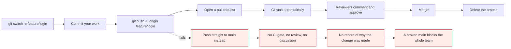
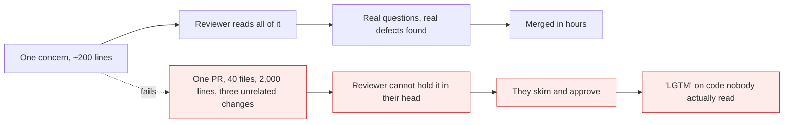

# Pull requests and code review

*Module 11 · Working with people*

Everything so far has been Git. A pull request is **not** a Git feature - it is a platform
feature built on top of one. That distinction matters, because it is where the automation, the
gates and most of the team's actual engineering process live.

[Course home](../index.md) / Module 11

## 1. What a pull request actually is

Three things wrapped together:

| Layer | What it is |
| --- | --- |
| **A request** | "Please merge branch `feature/login` into `main`" |
| **A conversation** | Comments, questions, suggestions, attached to specific lines |
| **A gate** | CI must pass, reviewers must approve, before merging is allowed |

The underlying Git operation is a single merge. Everything around it - review, checks,
approvals, discussion, audit trail - is the platform.

```bash
git merge feature/login        # what a PR ultimately performs
```

> **NOTE - Different names, same thing**
>
> GitHub and Bitbucket call it a **pull request**; GitLab calls it a **merge request**. Identical concept. "MR" and "PR" are used interchangeably in conversation, and neither is more correct.

## 2. The lifecycle



> **Why it matters:** The value of a PR is not the merge - you could do that locally in one command. It is the **four gates between push and merge**: automated checks, a second pair of eyes, a written record of intent, and an approval trail. Bypassing it saves five minutes and costs the ability to answer "why is this like this?" forever.

## 3. From the command line

```bash
git switch -c feature/login
# ... work, commit ...
git push -u origin feature/login
```

The push output contains the link:

```text
remote: Create a pull request for 'feature/login' on GitHub by visiting:
remote:      https://github.com/user/repo/pull/new/feature/login
```

Or skip the browser entirely with the GitHub CLI:

```bash
gh pr create --title "Add login validation" --body "Fixes #142" --base main
gh pr create --draft
gh pr list
gh pr status
gh pr view 42
gh pr view 42 --web
gh pr checks 42
gh pr diff 42
gh pr review 42 --approve
gh pr review 42 --request-changes --body "See comment on line 40"
gh pr merge 42 --squash --delete-branch
gh pr checkout 42                    # check out someone else's PR locally
```

> **TIP - `gh pr checkout` is underused**
>
> Reviewing a non-trivial change by reading a diff in a browser is guessing. `gh pr checkout 42` puts the branch on your machine so you can run it, debug it and try to break it. For anything touching behaviour rather than text, that is the only honest review.

## 4. What makes a pull request reviewable



> **Why it matters:** Review quality falls off a cliff with size. A 200-line PR gets read; a 2,000-line PR gets approved. If you want genuine review, the single most effective thing you can do is **make the change smaller** - everything else is secondary.

| Property | Good | Bad |
| --- | --- | --- |
| Size | Under ~400 lines changed | "It touches 60 files" |
| Scope | One concern | Feature + refactor + formatting |
| Title | "Add null check to login handler" | "fixes" |
| Description | What, why, how to test, what to watch | Empty |
| Commits | Meaningful and atomic | `wip`, `wip2`, `fix`, `fix again` |
| CI | Green before requesting review | "Ignore the failing test, unrelated" |

A description template worth committing to `.github/pull_request_template.md`:

```markdown
## What
One or two sentences.

## Why
The problem, the ticket, the constraint.

## How to test
1. ...
2. ...

## Risk
What could this break? What did you deliberately not change?

Closes #142
```

> **TIP - Never mix formatting with logic**
>
> Reformatting 500 lines and changing three of them produces a diff where the three real changes are invisible. Do the reformat in its own commit - ideally its own PR - so the logic change can actually be reviewed.

## 5. Reviewing well

| Do | Do not |
| --- | --- |
| Ask questions - "what happens if this is null?" | Rewrite it in the comments |
| Distinguish blocking from optional | Make everything sound mandatory |
| Prefix nits clearly - `nit: naming` | Block a merge over a variable name |
| Use suggestions for small fixes | Describe a one-character change in prose |
| Review within a day | Leave it for a week |
| Say what is good, briefly | Only ever point out problems |
| Pull it and run it, for behaviour changes | Approve a UI change from the diff alone |

GitHub's suggestion syntax, which the author can apply with one click:

````markdown
```suggestion
if (user?.profile == null) return EMPTY_PROFILE;
```
````

| Review outcome | Means |
| --- | --- |
| **Comment** | Feedback, no judgement - fine for a partial review |
| **Approve** | I am happy for this to merge |
| **Request changes** | **Blocks the merge** - use for genuine defects, not preferences |

> **WARNING - "Request changes" is a blocking action**
>
> On a protected branch it stops the merge until you personally re-review. Using it for a naming preference and then going on holiday blocks a colleague for a week. If it is not a defect, leave a comment and approve.

## 6. Branch protection - where policy becomes real

A rule everyone agreed to but nothing enforces is not a rule.

| Setting | Prevents |
| --- | --- |
| **Require a pull request before merging** | Direct pushes to `main` |
| **Require approvals** (1-2) | Merging your own unreviewed work |
| **Dismiss stale approvals on new commits** | Approving, then pushing something different |
| **Require status checks to pass** | Merging with red CI |
| **Require branches to be up to date** | Merging code never tested against current `main` |
| **Require conversation resolution** | Merging with unanswered review comments |
| **Require linear history** | Merge commits, if the team chose rebase or squash |
| **Require signed commits** | Unverifiable authorship - module 24 |
| **Block force pushes** | History rewriting on `main` |
| **Restrict who can push** | Everything above being bypassed |

```bash
gh api repos/OWNER/REPO/branches/main/protection --method PUT --input protection.json
```

**Manual steps:** *Settings → Branches → Add branch protection rule → `main` → tick the boxes.*
Two minutes, once, and every module in this course stops depending on people remembering.

### 6.1 CODEOWNERS

```text
# .github/CODEOWNERS
*                       @89himanshu-dwivedi
/force-app/main/apex/   @salesforce-team
/.github/workflows/     @platform-team
*.tf                    @infra-team
/docs/                  @tech-writers
```

Matching files automatically request review from that owner, and with "require review from Code
Owners" enabled, their approval becomes mandatory. It is the cleanest way to make "the platform
team must see workflow changes" a fact rather than a hope.

## 7. Merging: the three buttons

| Button | Result on `main` | Choose when |
| --- | --- | --- |
| **Create a merge commit** | Merge commit, all commits preserved | You want the branch visible in history |
| **Squash and merge** | **One** commit per PR | You want a clean linear `main` - most teams |
| **Rebase and merge** | Commits appended linearly, new hashes | You want linear history *and* individual commits |

> **TIP - Turn the other two off**
>
> In *Settings → General → Pull Requests*, disable the merge methods you did not choose. Otherwise different people click different buttons and `main` ends up with three history styles, which makes `git log` unreadable and `bisect` unreliable.

Also enable **"Automatically delete head branches"**. It removes the merged branch on the server,
and with `fetch.prune = true` from module 07, your local list stays clean too.

## 8. Extra points

- **Draft PRs exist for a reason.** Open one early to trigger CI and show direction, without
  requesting review. `gh pr ready` promotes it when it is finished.
- **`Closes #142` in the description** closes the issue automatically on merge, and links the
  two forever.
- **A merge queue** serialises merges and re-tests each PR against the latest `main`. Worth it
  once "green when I opened it, broken when it merged" starts happening.
- **Review your own PR first.** Open the diff and read it as a stranger. You will find something
  every time, and it costs the reviewer nothing.
- **PR comments are documentation.** In three years the discussion explaining *why* an approach
  was rejected is often more valuable than the code.

> **PRACTICE - Practice now**
>
> Use the `remote-demo` repository from module 07, or create a fresh one on GitHub.
>
> 1. **Protect `main` first**, so the rest of the exercise is real:
>    *Settings → Branches → Add rule → `main`* → require a pull request, require 1 approval,
>    block force pushes.
> 2. **Prove protection works:**
>    ```bash
>    git switch main
>    echo "direct change" >> README.md
>    git commit -am "Direct to main"
>    git push
>    ```
>    Read the rejection.
> 3. **Do it properly:**
>    ```bash
>    git reset --hard origin/main
>    git switch -c feature/readme-update
>    echo "A proper change" >> README.md
>    git commit -am "Expand README introduction"
>    git push -u origin feature/readme-update
>    ```
> 4. **Open the PR from the terminal:**
>    ```bash
>    gh pr create --title "Expand README introduction" --body "Adds context for new readers."
>    gh pr status
>    gh pr view --web
>    ```
> 5. **Add a PR template** and see it appear next time:
>    ```bash
>    mkdir -p .github
>    ```
>    Create `.github/pull_request_template.md` with the template from section 4, commit, and open
>    another PR.
> 6. **Add CODEOWNERS**, then confirm reviewers are requested automatically:
>    ```bash
>    mkdir -p .github
>    "* @<your-username>" | Set-Content .github/CODEOWNERS
>    ```
> 7. **Review from the CLI:**
>    ```bash
>    gh pr list
>    gh pr diff <number>
>    gh pr checkout <number>
>    gh pr review <number> --approve
>    ```
> 8. **Merge with squash, and delete the branch:**
>    ```bash
>    gh pr merge <number> --squash --delete-branch
>    git switch main && git pull
>    git fetch --prune
>    git log --oneline --graph
>    ```
>    One commit for the whole PR.
> 9. **Feel the difference in size.** Open one PR changing 20 lines and another changing 600.
>    Review both properly and time yourself. That number is the argument for small PRs.

> **ASSIGNMENT - Assignment**
>
> Configure a repository from scratch as if a team of five were about to start on it: branch protection on `main`, required approvals, required status checks, conversation resolution, automatic branch deletion, exactly one merge method enabled, a PR template, and a CODEOWNERS file. Then write a half-page "how we work" note explaining each setting in one sentence. Hand the repository to someone and ask them to try pushing to `main`. If they cannot, your process is real - and this is exactly the artefact an interviewer means when they ask how you would set up a team's workflow.

## 9. Interview drill

<details>
<summary><b>What is a pull request?</b></summary>

A platform feature - not a Git feature - that wraps a merge in a review process. It requests that
one branch be merged into another, and attaches a discussion, automated checks and an approval
gate to that request. The underlying Git operation is a single merge; the value is everything
around it: CI must pass, a second person must look, the reasoning is recorded, and there is an
audit trail of who approved what.

</details>

<details>
<summary><b>What makes a pull request easy to review?</b></summary>

Size, above everything else - review quality collapses beyond a few hundred lines, because a
reviewer cannot hold a large change in their head and starts skimming. Beyond that: one concern
per PR, a title that states the change, a description covering what, why, how to test and what
might break, meaningful commits rather than `wip`, formatting kept out of logic changes, and CI
already green before review is requested.

</details>

<details>
<summary><b>How do you stop people pushing directly to `main`?</b></summary>

Branch protection on the platform, since Git itself has no such concept. Require a pull request
before merging, require at least one approving review, require status checks to pass, dismiss
stale approvals when new commits arrive, block force pushes, and restrict who may push at all.
Combined with CODEOWNERS this makes review of sensitive paths mandatory rather than optional. A
policy that is only written in a wiki is not a policy.

</details>

<details>
<summary><b>Which merge method should a team use?</b></summary>

Most teams are best served by **squash and merge**: one commit per pull request gives a clean,
linear `main`, makes reverting a whole feature trivial, and lets developers commit messily on
their branch. Merge commits are better when you want the branch structure visible and each
feature revertible as a unit. Rebase-and-merge gives linear history while preserving individual
commits. The important part is choosing one and disabling the others in repository settings, so
history stays consistent.

</details>

<details>
<summary><b>What is CODEOWNERS for?</b></summary>

A file mapping path patterns to people or teams who automatically become reviewers when matching
files change. With "require review from Code Owners" enabled in branch protection, their approval
becomes mandatory - so the platform team must approve workflow changes, the security team must
approve auth code, and so on. It turns an informal expectation into an enforced rule and removes
the need to remember who to add as a reviewer.

</details>

<details>
<summary><b>When should you use "Request changes" rather than a comment?</b></summary>

Only for genuine defects - a bug, a security problem, a broken contract, a missing test for
risky behaviour. On a protected branch it blocks the merge until you personally re-review, so
using it for preferences or naming holds up a colleague for as long as you are unavailable.
Preferences belong in a comment, ideally prefixed `nit:` so the author knows it is optional, with
an approval alongside.

</details>

---

[← Module 10](10-rescue-kit.md) &nbsp;&nbsp;|&nbsp;&nbsp; [Module 12: Branching strategies →](12-branching-strategies.md)

---

Git & Pipelines: Zero to Architect · Himanshu Kumar.
