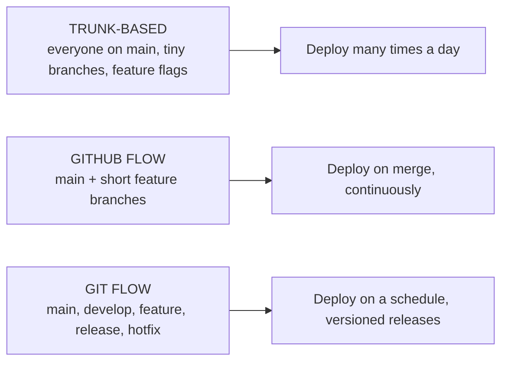
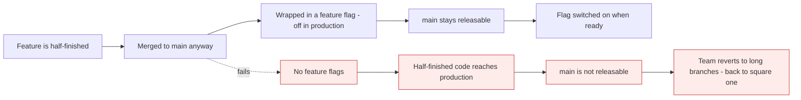
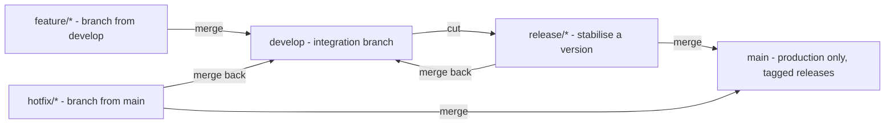
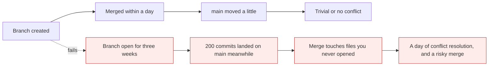

# Branching strategies

*Module 12 · Working with people*

Which branches exist, who may commit where, and how code reaches production. Teams argue about
this endlessly and usually pick a strategy by habit. The honest position is that the right
answer is determined by **how often you deploy** - everything else follows from that.

[Course home](../index.md) / Module 12

## 1. The three that matter



> **Why it matters:** These are not levels of maturity, and Git Flow is not "the professional one". Each was designed for a different release model. Choosing the one that does not match how you ship is what creates the pain teams blame on Git.

## 2. Trunk-based development

Everyone commits to `main`. Branches, if any, live for hours.

```text
main  ──●──●──●──●──●──●──●──●──►   always releasable
         \_/  \_/     \_/
        tiny branches, merged same day
```

| Property | |
| --- | --- |
| Branches | `main`, plus branches lasting under a day |
| Merge frequency | Several times a day, per developer |
| Incomplete work | Hidden behind **feature flags** |
| Release | Any commit on `main` can ship |
| Needs | Strong automated tests, fast CI, feature flags |
| Merge conflicts | Rare - nothing diverges long enough |



> **Why it matters:** **Feature flags are not an optional extra in trunk-based development - they are the mechanism that makes it possible.** Merging unfinished work is only safe because the code is unreachable in production. Adopting trunk-based without flags is how teams conclude "it does not work for us".

**Best for:** SaaS, continuous deployment, mature test suites, teams that deploy daily or more.

## 3. GitHub Flow

One long-lived branch, short feature branches, deploy on merge.

```text
main  ──●─────────●─────────●──────►
         \       / \       /
          ●──●──●   ●──●──●
        feature/a  feature/b
```

| Step | |
| --- | --- |
| 1 | Branch from `main` |
| 2 | Commit, push, open a PR |
| 3 | CI runs, colleagues review |
| 4 | Merge to `main` |
| 5 | **Deploy `main`** |
| 6 | Delete the branch |

| Property | |
| --- | --- |
| Branches | `main` + `feature/*` |
| Branch lifetime | Hours to a few days |
| Release | Every merge to `main` |
| Needs | Branch protection, CI, quick review |

**Best for:** most web applications and services. It is the default for a reason - simple enough
that everyone understands it, structured enough to be safe.

## 4. Git Flow

Two permanent branches and three temporary types.



| Branch | From | Merges to | Purpose |
| --- | --- | --- | --- |
| `main` | - | - | Production. Every commit is a tagged release |
| `develop` | `main` | `release/*` | Where completed features accumulate |
| `feature/*` | `develop` | `develop` | One feature |
| `release/*` | `develop` | `main` **and** `develop` | Stabilise, fix, version bump |
| `hotfix/*` | `main` | `main` **and** `develop` | Urgent production fix |

> **WARNING - Git Flow is heavy, and usually mismatched**
>
> It was designed in 2010 for **versioned software with scheduled releases** - desktop applications, libraries, on-premise products that ship v2.3 every quarter. Applied to a continuously deployed web service it produces long-lived branches, painful merges, and a `develop` branch permanently out of sync with `main`. Its own author later wrote that most teams do not need it.

**Best for:** versioned products, multiple supported versions in the field, scheduled releases,
regulated environments requiring a formal release branch.

## 5. Environment branches - and why they usually fail

```text
main  →  develop  →  staging  →  production
```

A branch per environment, promoted by merging. It looks tidy on a whiteboard.

| Problem | Consequence |
| --- | --- |
| Branches drift | A hotfix on `production` is missing from `develop` for weeks |
| Merges pile up | Promotion becomes a merge exercise, not a deployment decision |
| "What is actually in staging?" | Nobody can answer without a diff |
| Cherry-picking begins | The same change exists three times with three hashes |

> **TIP - Promote artefacts, not branches**
>
> The modern approach is one branch and one **build**, promoted through environments by configuration - the exact same artefact that passed staging is deployed to production. Environments become deployment targets, not branches. Module 22 builds this properly, and module 23 shows the GitOps version.

## 6. Choosing

| Question | Answer points to |
| --- | --- |
| Do you deploy several times a day? | **Trunk-based** |
| Do you deploy on every merge to `main`? | **GitHub Flow** |
| Do you ship numbered versions on a schedule? | **Git Flow** |
| Do you support multiple released versions at once? | **Git Flow**, or release branches |
| Do you have feature flags and fast reliable tests? | **Trunk-based** is available to you |
| Is CI slow, or are tests unreliable? | **GitHub Flow** - trunk-based will hurt |
| Is the team fewer than ten people on one product? | **GitHub Flow**, almost always |
| Does an auditor need a named release branch? | **Git Flow** |

| | Trunk-based | GitHub Flow | Git Flow |
| --- | --- | --- | --- |
| Long-lived branches | 1 | 1 | **2** |
| Branch lifetime | Hours | Days | Weeks |
| Merge pain | Minimal | Low | **High** |
| Release cadence | Continuous | On merge | Scheduled |
| Feature flags | **Required** | Useful | Optional |
| Cognitive load | Low | **Lowest** | High |
| Supports old versions | No | No | **Yes** |
| Suits regulated release gates | Poorly | Partly | **Well** |

## 7. The real variable: branch lifetime



> **Why it matters:** Whatever strategy you name, **merge pain is a function of how long branches live.** A team running Git Flow with two-day branches will be happier than a team running GitHub Flow with three-week ones. If you fix nothing else, shorten branch lifetime - it dominates every other variable.

## 8. Naming and hygiene

```text
feature/checkout-validation
fix/null-pointer-on-login
chore/bump-node-20
docs/api-authentication
release/1.4.0
hotfix/1.4.1-payment-timeout
```

| Rule | Why |
| --- | --- |
| Prefix by type | `git branch` groups usefully, and automation can match on it |
| Describe the **change**, not the person | `himanshu-2` means nothing to anyone, including you |
| Include the ticket if you have one | `fix/PROJ-142-null-login` links code to context |
| Lowercase and hyphens | Case-sensitivity differs between Windows and Linux |
| Delete after merge | Enable auto-delete, and `fetch.prune = true` |

```bash
git branch -vv | Select-String ": gone]"    # local branches whose remote is deleted
git branch --merged main                     # safe to delete
```

## 9. Extra points

- **A strategy that is not enforced is a preference.** Encode it in branch protection, required
  checks and merge settings - module 11.
- **Feature flags need a lifecycle.** An unremoved flag is permanent dead code and a source of
  untested combinations. Schedule removal when you create it.
- **`develop` and `main` diverging is the classic Git Flow smell.** If a hotfix goes to `main`
  and never returns to `develop`, the next release silently reintroduces the bug.
- **Salesforce and similar platforms often need release branches** because deployments are
  metadata-based and slow, but the same rule holds: short-lived feature branches, integrate
  frequently.
- **Monorepos change the calculus** - many teams on one repository push toward trunk-based with
  path-scoped CI, because long branches would collide constantly. Module 17.

> **PRACTICE - Practice now**
>
> 1. **Simulate GitHub Flow properly** on a real repository with protection enabled from module 11:
>    ```bash
>    git switch main && git pull
>    git switch -c feature/add-validation
>    echo "validation" > v.txt && git add . && git commit -m "Add validation"
>    git push -u origin feature/add-validation
>    gh pr create --fill
>    gh pr merge --squash --delete-branch
>    git switch main && git pull && git fetch --prune
>    ```
> 2. **Feel merge debt.** Create two branches from the same point, one you merge immediately and
>    one you leave while `main` moves:
>    ```bash
>    git switch -c short-lived
>    echo "a" > a.txt && git add . && git commit -m "Short"
>    git switch main
>    git switch -c long-lived
>    echo "b" > shared.txt && git add . && git commit -m "Long branch work"
>    git switch main
>    git merge short-lived
>    ```
>    Now make ten commits on `main` touching `shared.txt`, then merge `long-lived` and count the
>    conflicts.
> 3. **Build a Git Flow structure and see the overhead:**
>    ```bash
>    git switch -c develop main
>    git switch -c feature/x develop
>    echo x > x.txt && git add . && git commit -m "Feature x"
>    git switch develop && git merge --no-ff feature/x
>    git switch -c release/1.0 develop
>    echo "1.0" > VERSION && git add . && git commit -m "Bump to 1.0"
>    git switch main && git merge --no-ff release/1.0 && git tag v1.0.0
>    git switch develop && git merge --no-ff release/1.0
>    git log --oneline --graph --all
>    ```
>    Count the merges required to ship one feature.
> 4. **Simulate the classic Git Flow failure** - a hotfix that never returns:
>    ```bash
>    git switch -c hotfix/1.0.1 main
>    echo "urgent fix" > fix.txt && git add . && git commit -m "Urgent fix"
>    git switch main && git merge --no-ff hotfix/1.0.1 && git tag v1.0.1
>    git switch develop
>    ls
>    ```
>    `fix.txt` is missing. The next release from `develop` would reintroduce the bug.
> 5. **Practise a feature flag** instead of a long branch:
>    ```bash
>    git switch main
>    "if (FEATURE_NEW_CHECKOUT) { newCheckout(); } else { oldCheckout(); }" | Set-Content checkout.js
>    git add . && git commit -m "Add new checkout behind a flag"
>    ```
>    Merged, shipped, and inactive - the trunk-based model in one commit.
> 6. **Audit branch hygiene:**
>    ```bash
>    git branch -a
>    git branch --merged main
>    git branch --no-merged main
>    git fetch --prune
>    ```

> **ASSIGNMENT - Assignment**
>
> Pick a real project - yours or one you know well - and write a one-page branching policy for it: which strategy and **why, in terms of release cadence**, branch naming, expected branch lifetime, who merges, which merge method, and which branch protection settings enforce it. Then note the one thing that would have to change for a different strategy to become viable - usually feature flags or test reliability. Interviewers ask "which branching strategy do you use?" expecting a name; answering with the tradeoff is what separates an engineer from an architect.

## 10. Interview drill

<details>
<summary><b>What branching strategies do you know, and how do you choose between them?</b></summary>

Trunk-based development, GitHub Flow and Git Flow. The deciding factor is release cadence.
Deploy many times a day with feature flags and a strong test suite: trunk-based. Deploy on every
merge to `main`, which suits most web services: GitHub Flow. Ship numbered versions on a
schedule, or support several released versions at once: Git Flow. They are not maturity levels -
each was designed for a different release model, and most of the pain teams attribute to Git
comes from using one that does not match how they actually ship.

</details>

<details>
<summary><b>Why is Git Flow often the wrong choice today?</b></summary>

Because it was designed in 2010 for versioned software with scheduled releases, and most teams
now deploy continuously. It brings two permanent branches and three temporary types, which means
long-lived branches, painful merges, and a `develop` branch that drifts out of sync with `main` -
particularly when hotfixes are merged to `main` and never merged back. Its own author has since
said most teams do not need it. It remains a good fit for products supporting multiple released
versions or operating under formal release gates.

</details>

<details>
<summary><b>What makes trunk-based development possible?</b></summary>

Feature flags, plus fast and reliable automated tests. The model requires merging work to `main`
several times a day, including work that is not finished, so `main` stays releasable only
because incomplete code is unreachable in production behind a flag. Without flags, half-finished
work reaches users and the team retreats to long branches. Flags also need a lifecycle - an
unremoved flag becomes permanent dead code and an untested combination of behaviours.

</details>

<details>
<summary><b>What is wrong with a branch per environment?</b></summary>

The branches drift. A hotfix applied to `production` is missing from `develop` for weeks,
promotion becomes a merge exercise rather than a deployment decision, nobody can say what is
actually in staging without diffing, and people start cherry-picking - so the same change exists
several times with different hashes. The modern alternative is to promote **artefacts**: build
once, and deploy that identical build to each environment with configuration, so environments
are deployment targets rather than branches.

</details>

<details>
<summary><b>What single change most reduces merge pain?</b></summary>

Shortening branch lifetime. Merge difficulty is a function of divergence, and divergence is a
function of time - a branch open for three weeks must reconcile with everything that landed on
`main` meanwhile, in files its author never opened. A team using Git Flow with two-day branches
will suffer less than a team using GitHub Flow with three-week ones. Strategy names matter far
less than how long branches stay open.

</details>

<details>
<summary><b>How do you enforce a branching strategy?</b></summary>

Through the platform, because Git has no concept of policy. Branch protection on the long-lived
branches: require pull requests, require approvals and status checks, block force pushes, and
restrict who may push. Enable exactly one merge method so history stays consistent, turn on
automatic branch deletion, and use CODEOWNERS for paths that need a specific team's approval. A
strategy documented only in a wiki is a preference; a strategy in branch protection is a rule.

</details>

---

[← Module 11](11-pull-requests.md) &nbsp;&nbsp;|&nbsp;&nbsp; [Module 13: Commit hygiene →](13-commit-hygiene.md)

---

Git & Pipelines: Zero to Architect · Himanshu Kumar.
