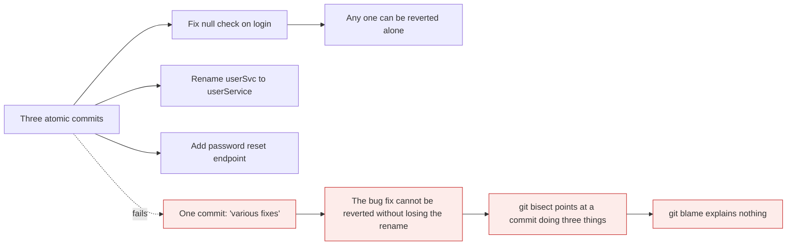
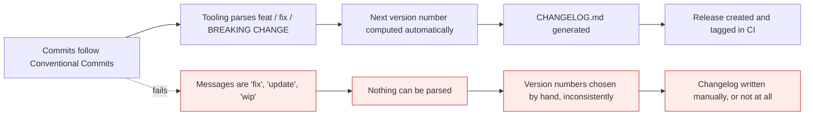

# Commit hygiene

*Module 13 · Working with people*

A commit is not a save point. It is the smallest unit that can be reviewed, reverted, bisected
and explained - and every one of those breaks when commits are careless. This module is about
making history a tool rather than a diary.

[Course home](../index.md) / Module 13

## 1. Atomic commits

**One commit, one logical change.** Not one file, not one hour of work - one *idea*.



> **Why it matters:** Four Git features depend entirely on commit granularity - `revert`, `bisect`, `blame` and code review. A commit containing three unrelated changes cannot be reverted selectively, tells `bisect` nothing useful when it is identified as the culprit, and makes `blame` attribute a line to a commit whose message does not describe it. Careless commits do not just look untidy; they disable the tools.

| Test | A good commit... |
| --- | --- |
| Can you describe it in one sentence without "and"? | Yes |
| Could it be reverted on its own? | Yes |
| Does the project still build and pass tests? | Yes |
| Does it mix formatting with behaviour? | No |

The staging area from module 03 is what makes this achievable - `git add -p` lets you split an
hour of mixed work into three clean commits.

## 2. The anatomy of a message

```text
Add null check to login handler

Users with no profile record hit a NullPointerException on sign-in
because the handler dereferenced profile without checking. It now
returns an empty profile object instead.

Chose an empty object over throwing so existing callers keep working.

Fixes #142
Co-authored-by: Jane Smith <jane@example.com>
```

| Part | Rule |
| --- | --- |
| **Subject** | ~50 characters, imperative mood, capitalised, **no full stop** |
| **Blank line** | Mandatory - Git uses it to separate subject from body |
| **Body** | Wrapped at ~72 characters. **Why**, not what |
| **Footer** | Issue references and trailers |

**Imperative mood** means writing the subject as an instruction: *"Add"*, *"Fix"*, *"Remove"* -
not *"Added"* or *"Adds"*. The test is that it completes the sentence **"If applied, this commit
will ___"**. Git's own generated messages use it, so yours match.

> **TIP - The body answers the one question the diff cannot**
>
> The diff already shows exactly *what* changed - reading it again in prose is wasted. What the diff can never show is **why**: which bug, which constraint, which alternative you rejected and for what reason. Six months later that paragraph is worth more than the code.

| Bad | Why | Better |
| --- | --- | --- |
| `fix` | Fix what? | `Fix timeout on slow database queries` |
| `updated files` | Which, and why? | `Bump lodash to 4.17.21 for CVE-2021-23337` |
| `wip` | Should not be on `main` | Squash it before merging |
| `Fixed the bug where users couldn't log in when their profile was missing` | 78 characters | Subject + body |
| `Add validation.` | Full stop, vague | `Add email format validation to signup` |

## 3. Conventional Commits

A small, widely-adopted convention that makes messages machine-readable.

```text
<type>(<optional scope>): <description>

[optional body]

[optional footer]
```

```text
feat(auth): add password reset endpoint
fix(login): handle missing user profile
docs: clarify environment variable setup
refactor(api): extract validation into a helper
perf(query): add index on orders.customer_id
test(cart): cover empty basket case
build(deps): bump express to 4.19.2
ci: run tests on Node 20 and 22
chore: update .gitignore
style: apply prettier formatting
revert: revert "feat(auth): add password reset endpoint"
```

| Type | Use for | Version impact |
| --- | --- | --- |
| `feat` | A new feature | **MINOR** |
| `fix` | A bug fix | **PATCH** |
| `docs` | Documentation only | none |
| `style` | Formatting, whitespace - no behaviour change | none |
| `refactor` | Restructuring with no behaviour change | none |
| `perf` | A performance improvement | PATCH |
| `test` | Adding or fixing tests | none |
| `build` | Build system or dependencies | none |
| `ci` | Pipeline configuration | none |
| `chore` | Everything else | none |

Breaking changes are marked in one of two ways:

```text
feat(api)!: remove deprecated /v1/users endpoint
```

```text
feat(api): change user id from int to uuid

BREAKING CHANGE: user.id is now a string. Clients parsing it as an
integer must be updated.
```



> **Why it matters:** This is the real payoff, and it is why the convention spread. Structured messages let a pipeline decide the next semantic version, write the changelog and publish the release with no human involvement - which module 14 builds and module 21 automates. Free-form messages make all of that impossible.

## 4. Trailers

Machine-readable key-value lines at the end of a message.

```text
Fixes #142
Closes #87
Refs #200
Co-authored-by: Jane Smith <jane@example.com>
Signed-off-by: Himanshu Kumar <himanshu.jee.1996@gmail.com>
Reviewed-by: Alex Chen <alex@example.com>
```

| Trailer | Effect |
| --- | --- |
| `Fixes #142` / `Closes #142` | Closes the issue automatically when merged to the default branch |
| `Refs #200` | Links without closing |
| `Co-authored-by:` | Both people appear as authors on GitHub, including on contribution graphs |
| `Signed-off-by:` | Developer Certificate of Origin - required by many open-source projects |

```bash
git commit -s -m "Fix login timeout"       # adds Signed-off-by automatically
git log --format="%(trailers:key=Fixes)"
```

## 5. Fixing messages before they are shared

```bash
git commit --amend                        # rewrite the last message
git commit --amend --no-edit              # add staged changes, keep the message
git rebase -i HEAD~5                      # rewrite the last five - module 15
```

> **WARNING - Only before pushing**
>
> Amending or rebasing rewrites commits and changes their hashes, so doing it after sharing violates module 09's golden rule. On your own unpushed work, tidy freely. On a pushed shared branch, leave the history alone - a slightly untidy message costs far less than a broken repository for the team.

## 6. Enforcing it

A convention nobody checks is a convention half the team ignores.

```text
# commitlint.config.js
module.exports = { extends: ['@commitlint/config-conventional'] };
```

```bash
npm install --save-dev @commitlint/cli @commitlint/config-conventional husky
npx husky init
"npx --no -- commitlint --edit `$1" | Set-Content .husky/commit-msg
```

Or as a CI check, which cannot be bypassed with `--no-verify`:

```yaml
# .github/workflows/lint-commits.yml
name: Lint commits
on: pull_request
jobs:
  commitlint:
    runs-on: ubuntu-latest
    steps:
      - uses: actions/checkout@v4
        with: { fetch-depth: 0 }
      - uses: wagoid/commitlint-github-action@v6
```

> **NOTE - Local hooks are advisory, CI checks are binding**
>
> `git commit --no-verify` skips every client-side hook, so a local hook is a helpful reminder rather than a gate. If the convention actually matters - because releases are automated from it - it must also be checked in CI, where nobody can skip it. Module 16 covers hooks properly.

## 7. Squash merging changes what matters

If your team squash-merges (module 11), the individual commit messages on the branch never reach
`main` - only the **PR title** does.

| Merge method | Which message ends up in `main` |
| --- | --- |
| Squash and merge | The **PR title** - so that is what must follow the convention |
| Merge commit | Every commit message, plus the merge commit |
| Rebase and merge | Every commit message |

> **TIP - Match your discipline to your merge method**
>
> With squash merging, obsessing over branch commit messages is wasted effort - commit `wip` all day, and put the care into the PR title and description. With merge or rebase, every commit lands in `main` and every message matters. Knowing which regime you are in saves a lot of pointless ceremony.

## 8. Extra points

- **Commit early and often; tidy before pushing.** Local history is free and rewritable. Module
  15 is the tidying step.
- **`git log --oneline` is the acceptance test.** If the last twenty subjects do not tell the
  story of the last two weeks, the messages are not doing their job.
- **A commit template helps:**
  `git config --global commit.template ~/.gitmessage` with the section 2 skeleton in it.
- **`git log --format` is scriptable** - release notes, audit reports and metrics all come from
  well-formed messages.
- **Reverts should say why.** `git revert` writes "This reverts commit abc1234" - add a sentence
  explaining what went wrong, or the next person repeats it.

> **PRACTICE - Practice now**
>
> 1. Set up and deliberately make a bad commit:
>    ```bash
>    mkdir hygiene-demo && cd hygiene-demo && git init
>    echo "app" > app.js && echo "style" > style.css && echo "docs" > README.md
>    git add . && git commit -m "stuff"
>    git log --oneline
>    ```
> 2. **Undo it and do it atomically instead:**
>    ```bash
>    git reset HEAD~1
>    git add app.js && git commit -m "feat(app): add application entry point"
>    git add style.css && git commit -m "style: add base stylesheet"
>    git add README.md && git commit -m "docs: add project README"
>    git log --oneline
>    ```
>    Read both versions of the log and compare what each tells you.
> 3. **Write a full message with a body and footer:**
>    ```bash
>    echo "validation" >> app.js
>    git add app.js
>    git commit
>    ```
>    In the editor: subject, blank line, body explaining *why*, then `Fixes #1`.
>    ```bash
>    git log -1
>    git log -1 --format="%s"
>    git log -1 --format="%b"
>    ```
> 4. **Split mixed work with `git add -p`:**
>    ```bash
>    printf "line1\nline2\nline3\nline4\n" > mixed.txt
>    git add . && git commit -m "chore: add mixed file"
>    printf "FIXED1\nline2\nline3\nFEATURE4\n" > mixed.txt
>    git add -p mixed.txt
>    ```
>    Stage only the fix hunk, commit it, then stage and commit the feature separately.
> 5. **Try trailers:**
>    ```bash
>    git commit --allow-empty -m "feat: pair-programmed feature" -m "Co-authored-by: Jane Smith <jane@example.com>"
>    git log -1
>    git commit -s --allow-empty -m "chore: signed commit"
>    git log -1
>    ```
> 6. **Amend before sharing:**
>    ```bash
>    git commit --allow-empty -m "fix stuff"
>    git commit --amend -m "fix(cart): prevent negative quantities"
>    git log -1 --format="%h %s"
>    ```
>    Note that the hash changed - that is why this is unpushed-only.
> 7. **Prove the convention is machine-readable:**
>    ```bash
>    git log --oneline | Select-String -Pattern "^\w+ (feat|fix)"
>    git log --format="%s" | Select-String -Pattern "^feat"
>    ```
>    That is exactly how a release tool decides the next version.
> 8. **Set up a commit template:**
>    ```bash
>    @"
>    # <type>(<scope>): <subject - 50 chars, imperative>
>
>    # Why is this change needed?
>
>    # Fixes #
>    "@ | Set-Content $HOME\.gitmessage
>    git config --global commit.template $HOME\.gitmessage
>    git commit --allow-empty
>    ```

> **ASSIGNMENT - Assignment**
>
> Run `git log --oneline -30` on a repository you have worked on for a while and read it as a stranger. Count how many subjects tell you what actually changed. Then write a one-page commit convention for your team: format, allowed types, when the body is required, which trailers you use, and - critically - **where it is enforced**, locally and in CI. Include a worked example of a good and a bad commit from your own real history. Using your own bad commits makes the point far better than an invented example, and nobody can argue the standard is unrealistic.

## 9. Interview drill

<details>
<summary><b>What makes a good commit?</b></summary>

It is atomic - one logical change that can be described in a sentence without "and", reverted on
its own, and leaves the project building. Its message has an imperative subject of about fifty
characters, a blank line, and a body explaining **why** rather than what, since the diff already
shows what. Granularity matters because `revert`, `bisect`, `blame` and code review all operate
on commits: a commit doing three things breaks all four of those tools.

</details>

<details>
<summary><b>What are Conventional Commits and why use them?</b></summary>

A convention structuring the subject as `type(scope): description` - `feat`, `fix`, `docs`,
`refactor`, `chore` and so on - with breaking changes marked by `!` or a `BREAKING CHANGE:`
footer. The point is machine readability: tooling can derive the next semantic version from the
types present, generate a changelog, and publish a release automatically. Without a structured
format, versioning and release notes stay manual and inconsistent.

</details>

<details>
<summary><b>Why write commit messages in the imperative mood?</b></summary>

Because the message describes what applying the commit **will do**, completing the sentence "If
applied, this commit will ___". It also matches the messages Git generates itself for merges and
reverts, so history reads consistently. It is a small convention, but mixed tense in a log is
noticeably harder to scan.

</details>

<details>
<summary><b>Your team squash-merges. Do branch commit messages still matter?</b></summary>

Much less. With squash merging only the pull request title reaches `main`, so that is what must
follow the convention and describe the change - the branch's individual commits are discarded.
Developers can commit `wip` freely while working. With merge commits or rebase-and-merge every
message lands in `main` and every one matters. Knowing which regime you are in avoids a lot of
pointless ceremony.

</details>

<details>
<summary><b>How do you enforce a commit convention?</b></summary>

Two layers. Locally, a `commit-msg` hook running commitlint gives immediate feedback while
writing - but it is advisory, because `git commit --no-verify` skips every client-side hook. So
if it genuinely matters, add a CI check on pull requests that lints the commits or the PR title.
Local hooks are a helpful reminder; the CI check is the gate.

</details>

<details>
<summary><b>When is it acceptable to rewrite a commit message?</b></summary>

Before it has been shared. `git commit --amend` for the last one and interactive rebase for
earlier ones both rewrite history and change hashes, which is fine on unpushed work or a branch
only you use. Once others have pulled it, rewriting breaks their history - a slightly untidy
message is far cheaper than that. On a shared branch, leave it alone.

</details>

---

[← Module 12](12-branching-strategies.md) &nbsp;&nbsp;|&nbsp;&nbsp; [Module 14: Tags, releases and versioning →](14-tags-and-releases.md)

---

Git & Pipelines: Zero to Architect · Himanshu Kumar.
