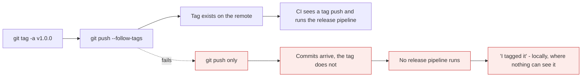
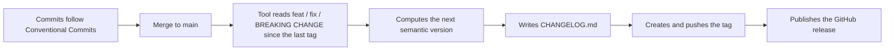

# Tags, releases and versioning

*Module 14 · Working with people*

A commit hash identifies a state precisely and tells a human nothing. A **tag** gives that state
a name, and a **version number** gives it meaning. Get this right and your pipeline can decide
the version, write the changelog and publish the release without anyone typing a number.

[Course home](../index.md) / Module 14

## 1. Two kinds of tag

```bash
git tag v1.0.0                                  # lightweight
git tag -a v1.0.0 -m "First stable release"     # annotated
```

| | Lightweight | Annotated |
| --- | --- | --- |
| What it is | A file containing a commit hash - like a branch that never moves | A **real object** in the repository |
| Stores | Nothing else | Tagger, email, date, message, optional signature |
| Can be signed | No | **Yes** |
| Appears in `git describe` | Only with `--tags` | Yes |
| Use for | A private bookmark | **Every release** |

> **TIP - Always use `-a` for anything anyone else will see**
>
> An annotated tag records who created the release and when, and can be GPG-signed so its authenticity is verifiable. A lightweight tag is just a pointer with no provenance at all. If a tag will ever appear in a changelog, a deployment or an audit, it should be annotated.

```bash
git tag                            # list
git tag -l "v1.*"                  # filter
git tag -n                         # with messages
git show v1.0.0                    # tag object + the commit it points to
git tag -a v1.0.0 abc1234 -m "..."  # tag an older commit retrospectively
```

## 2. Tags are not pushed by default

```bash
git push origin v1.0.0             # one tag
git push origin --tags             # all tags
git push --follow-tags             # push commits + annotated tags only - the sane default
```

```bash
git tag -d v1.0.0                          # delete locally
git push origin --delete v1.0.0            # delete on the remote
git fetch --tags
```



> **Why it matters:** `git push` sends commits, not tags. This catches everyone once, and it is confusing because everything looks correct locally. Set `git config --global push.followTags true` and the problem disappears permanently.

> **WARNING - Never move a published tag**
>
> `git tag -f v1.0.0` re-points a tag, but anyone who already fetched it keeps the old one - so `v1.0.0` now means two different things depending on who you ask, and deployments become unreproducible. If a release was wrong, publish `v1.0.1`. A tag is a promise that a name refers to a specific commit, permanently.

## 3. Semantic versioning

```text
MAJOR.MINOR.PATCH
```

| Increment | When | Example |
| --- | --- | --- |
| **MAJOR** | A breaking change - existing users must alter their code | `1.4.2` → `2.0.0` |
| **MINOR** | New functionality, backward compatible | `1.4.2` → `1.5.0` |
| **PATCH** | A backward-compatible bug fix | `1.4.2` → `1.4.3` |

Additional labels:

```text
1.0.0-alpha.1        pre-release: unstable, lower precedence than 1.0.0
1.0.0-beta.3         pre-release
1.0.0-rc.1           release candidate
1.0.0+20260902.abc   build metadata: ignored when comparing versions
```

| Rule | |
| --- | --- |
| `0.y.z` | Anything may change. No stability promised |
| `1.0.0` | The first release that promises a stable public API |
| Pre-release versions | Sort **below** the release: `1.0.0-rc.1` < `1.0.0` |
| Build metadata | Ignored for precedence: `1.0.0+a` and `1.0.0+b` are equal |
| Once published | **Never** change the contents of a version |

> **NOTE - The version describes your contract, not your effort**
>
> A six-month rewrite that changes nothing users can see is a MINOR or even a PATCH. A one-character change that renames a public field is a MAJOR. The number describes the impact on people depending on you - not how much work it was, and not how important it felt.

## 4. `git describe` - where am I relative to a release?

```bash
git describe --tags
```

```text
v1.4.2-17-gf3a1c9e
```

| Part | Meaning |
| --- | --- |
| `v1.4.2` | The most recent tag reachable from here |
| `17` | Seventeen commits since that tag |
| `gf3a1c9e` | The current commit, `g` for git |

```bash
git describe --tags --abbrev=0        # just the last tag: v1.4.2
git describe --tags --dirty           # appends -dirty if the tree has changes
git describe --tags --always          # fall back to a hash if there are no tags
```

This is how build systems stamp a version into a binary or a Docker image tag - unique,
sortable, and traceable back to an exact commit.

## 5. GitHub Releases

A tag is Git. A **release** is the platform layer on top: release notes, attached binaries, and
a page people can link to.

```bash
gh release create v1.0.0 --generate-notes
gh release create v1.0.0 --title "v1.0.0" --notes "First stable release"
gh release create v1.0.0 ./dist/app.zip ./dist/app.tar.gz    # attach artefacts
gh release create v1.1.0-rc.1 --prerelease
gh release create v1.0.0 --draft
gh release list
gh release view v1.0.0
gh release download v1.0.0
```

`--generate-notes` builds the notes from merged pull requests since the previous tag, which is
the quickest route to a usable changelog if your PR titles are meaningful - module 13.

Control the grouping with a config file:

```yaml
# .github/release.yml
changelog:
  categories:
    - title: Features
      labels: [feature, enhancement]
    - title: Bug Fixes
      labels: [bug, fix]
    - title: Other
      labels: ["*"]
```

## 6. Automating the whole thing

This is what modules 13 and 14 have been building towards.



> **Why it matters:** Nobody chooses a version number, writes release notes or remembers to push a tag. The commit messages already contain that information - the pipeline just reads it. This removes an entire class of human error, and it is only possible because the messages are structured.

```yaml
# .github/workflows/release.yml
name: Release
on:
  push:
    branches: [main]
permissions:
  contents: write
jobs:
  release:
    runs-on: ubuntu-latest
    steps:
      - uses: actions/checkout@v4
        with: { fetch-depth: 0 }
      - uses: googleapis/release-please-action@v4
        with:
          release-type: node
```

| Tool | Ecosystem |
| --- | --- |
| **release-please** | Language-agnostic, opens a release PR you approve |
| **semantic-release** | Node-centric, releases immediately on merge |
| **changesets** | Monorepos with independently versioned packages |
| `git-cliff` | Changelog generation only, from conventional commits |

> **TIP - release-please over semantic-release for most teams**
>
> release-please opens a pull request containing the version bump and the changelog, so a human approves the release rather than it happening the instant something merges. That single approval step catches a surprising number of accidental majors, and it fits naturally with the review gates from module 11.

## 7. Signed tags

```bash
gpg --full-generate-key
gpg --list-secret-keys --keyid-format=long
git config --global user.signingkey <KEY_ID>
git config --global tag.gpgSign true

git tag -s v1.0.0 -m "Signed release"
git tag -v v1.0.0                       # verify
```

**Manual step:** export the public key with `gpg --armor --export <KEY_ID>` and add it in
GitHub under *Settings → SSH and GPG keys → New GPG key*. Releases then show as **Verified**.

Module 24 covers signing, provenance and supply-chain security properly.

## 8. Extra points

- **A tag can point at any commit, at any time.** Forgot to tag last week's release? Tag it
  retrospectively with `git tag -a v1.0.0 <hash>`.
- **Tags are not branches.** They never move, nothing is committed "on" a tag, and checking one
  out puts you in detached HEAD - module 06.
- **Deleting a tag on the remote does not delete anyone's local copy.** They keep it until they
  prune, which is another reason not to reuse names.
- **`v` prefix is convention, not a rule** - `v1.0.0` is conventional in Git and GitHub, while
  some ecosystems (Python, Maven) use a bare `1.0.0`. Be consistent within a project.
- **Docker image tags should match your Git tags.** `myapp:1.4.2` built from `v1.4.2` makes an
  incident answerable in one step: which commit is running in production?

> **PRACTICE - Practice now**
>
> Use the `remote-demo` repository from module 07, or any repository with a GitHub remote.
>
> 1. **Create both kinds of tag and see the difference:**
>    ```bash
>    git tag light-1.0
>    git tag -a v1.0.0 -m "First stable release"
>    git show light-1.0 | Select-Object -First 5
>    git show v1.0.0 | Select-Object -First 8
>    ```
>    The annotated one has a tagger, a date and a message. The lightweight one has nothing.
> 2. **Prove tags are not pushed by default:**
>    ```bash
>    git push
>    git ls-remote --tags origin
>    git push origin v1.0.0
>    git ls-remote --tags origin
>    ```
> 3. **Fix it permanently:**
>    ```bash
>    git config --global push.followTags true
>    ```
> 4. **Use `git describe`:**
>    ```bash
>    echo "change 1" >> README.md && git commit -am "feat: change 1"
>    echo "change 2" >> README.md && git commit -am "fix: change 2"
>    git describe --tags
>    git describe --tags --abbrev=0
>    echo "uncommitted" >> README.md
>    git describe --tags --dirty
>    ```
> 5. **Decide versions from a changelog.** For each, write the next version from `1.4.2`:
>    - Added an optional parameter to an existing function
>    - Fixed a crash on empty input
>    - Removed a deprecated endpoint
>    - Rewrote the internals with identical behaviour
>    - Added a new endpoint *and* removed an old one
> 6. **Tag and release properly:**
>    ```bash
>    git commit -am "feat: prepare 1.1.0"
>    git tag -a v1.1.0 -m "Add change 1 and fix change 2"
>    git push --follow-tags
>    gh release create v1.1.0 --generate-notes
>    gh release view v1.1.0
>    ```
> 7. **Try a pre-release:**
>    ```bash
>    git tag -a v2.0.0-rc.1 -m "Release candidate"
>    git push --follow-tags
>    gh release create v2.0.0-rc.1 --prerelease --generate-notes
>    ```
>    Note that GitHub marks it "Pre-release" and does not treat it as the latest.
> 8. **Prove why moving a tag is bad:**
>    ```bash
>    git tag -f v1.1.0 HEAD~1
>    git log --oneline --decorate -3
>    ```
>    Now consider that a colleague who already fetched `v1.1.0` still has the original. Restore
>    it, then delete the practice tags:
>    ```bash
>    git tag -d light-1.0 v2.0.0-rc.1
>    git push origin --delete v2.0.0-rc.1
>    ```

> **ASSIGNMENT - Assignment**
>
> Add automated releases to a real repository: adopt Conventional Commits from module 13, add the release-please workflow from section 6, then merge a `fix:` and confirm it proposes a PATCH bump, and a `feat:` and confirm it proposes a MINOR. Finally merge something with `BREAKING CHANGE:` and confirm it proposes a MAJOR. When you have watched the pipeline choose the version, write the changelog and publish the release without you typing a number, you have connected commit hygiene to delivery - which is exactly the thread the pipeline modules pick up from here.

## 9. Interview drill

<details>
<summary><b>What is the difference between a lightweight and an annotated tag?</b></summary>

A lightweight tag is just a named pointer to a commit, stored as a file, with no other
information. An annotated tag is a full object in the repository containing the tagger's name
and email, a date, a message, and optionally a GPG signature. Annotated tags are what
`git describe` uses by default and what releases should always be, because they carry provenance;
lightweight tags are fine as private bookmarks.

</details>

<details>
<summary><b>Why did your tag not appear on GitHub after pushing?</b></summary>

Because `git push` sends commits, not tags. You need `git push origin <tag>`,
`git push --tags`, or better `git push --follow-tags`, which pushes commits together with the
annotated tags that point at them. Setting `push.followTags true` globally removes the problem
permanently. It is confusing precisely because everything looks correct locally.

</details>

<details>
<summary><b>Explain semantic versioning.</b></summary>

`MAJOR.MINOR.PATCH`. MAJOR increments on a breaking change that forces consumers to alter their
code, MINOR on backward-compatible new functionality, PATCH on backward-compatible bug fixes.
Pre-release labels such as `-rc.1` sort below the corresponding release, and build metadata after
`+` is ignored when comparing. `0.y.z` promises nothing; `1.0.0` is the point at which you commit
to a stable public API. Crucially the number describes impact on consumers, not the size of the
effort.

</details>

<details>
<summary><b>Why should you never move a published tag?</b></summary>

Because anyone who already fetched it keeps the original, so the same name now refers to two
different commits depending on who you ask - and any deployment or build referencing that tag
becomes unreproducible. Tags are a promise that a name maps permanently to one commit. If a
release was wrong, publish a new patch version; the old one stays in history as a record of what
happened.

</details>

<details>
<summary><b>How would you automate versioning and release notes?</b></summary>

Adopt Conventional Commits so the type of each change is machine-readable, then run a tool such
as release-please or semantic-release in CI. It reads the commits since the last tag, derives the
next semantic version from the presence of `fix`, `feat` and `BREAKING CHANGE`, generates the
changelog, creates and pushes the tag, and publishes the release. release-please raises a pull
request for the release rather than publishing immediately, which keeps a human approval in the
loop and catches accidental major bumps.

</details>

<details>
<summary><b>What does `git describe` output mean, and what is it used for?</b></summary>

`v1.4.2-17-gf3a1c9e` means the nearest reachable tag is `v1.4.2`, there have been seventeen
commits since, and the current commit is `f3a1c9e` - the `g` simply denotes git. It gives a
unique, sortable, human-readable identifier for any commit relative to the last release, which
makes it ideal for stamping versions into binaries and Docker image tags so that a running
artefact can always be traced back to an exact commit.

</details>

---

[← Module 13](13-commit-hygiene.md) &nbsp;&nbsp;|&nbsp;&nbsp; [Module 15: Rewriting history safely →](15-rewriting-history.md)

---

Git & Pipelines: Zero to Architect · Himanshu Kumar.
