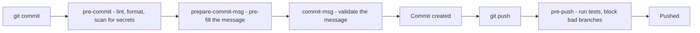
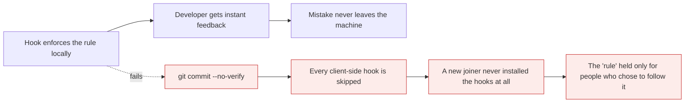

# Hooks and local automation

*Module 16 · Power tools*

Hooks are scripts Git runs at specific moments - before a commit, before a push, after a
checkout. They give instant feedback and catch mistakes at the cheapest possible point. They
also have one property that decides how you should use them: **anyone can skip them.**

[Course home](../index.md) / Module 16

## 1. What a hook is

```bash
ls .git/hooks
```

```text
applypatch-msg.sample     pre-commit.sample      pre-push.sample
commit-msg.sample         pre-rebase.sample      prepare-commit-msg.sample
post-update.sample        pre-receive.sample     update.sample
```

Every `.sample` is an inert example. Remove the extension, make it executable, and Git runs it.

```bash
Copy-Item .git/hooks/pre-commit.sample .git/hooks/pre-commit
```

| Fact | Consequence |
| --- | --- |
| Hooks live in `.git/hooks` | **Not versioned** - they are not cloned and not shared |
| Any executable works | Bash, Python, PowerShell, a compiled binary |
| **A non-zero exit aborts the operation** | This is the whole mechanism |
| Client hooks can be skipped | `git commit --no-verify` |

## 2. The hooks worth knowing



> **Why it matters:** Each hook is a chance to fail **before** the mistake becomes expensive. A secret caught by `pre-commit` costs ten seconds; the same secret caught after pushing to a public repository costs a rotation, a history rewrite and an incident report - module 15.

| Hook | Fires | Typical use |
| --- | --- | --- |
| `pre-commit` | Before the commit is created | Lint, format, scan for secrets, block large files |
| `prepare-commit-msg` | Before the editor opens | Insert a ticket number from the branch name |
| `commit-msg` | After the message is written | Enforce Conventional Commits |
| `post-commit` | After committing | Notifications, local bookkeeping |
| `pre-rebase` | Before a rebase | Refuse to rebase a protected branch |
| `pre-push` | Before sending to a remote | Run tests, block direct pushes to `main` |
| `post-checkout` | After switching branch | Reinstall dependencies if lockfiles changed |
| `post-merge` | After a merge | Same |

## 3. The property that decides everything



> **Why it matters:** **Client-side hooks are advisory. CI checks are binding.** `--no-verify` skips them, and because `.git/hooks` is not cloned, someone who never ran your setup script has no hooks at all. Use hooks for fast feedback, and enforce the same rule again in CI where it cannot be bypassed - module 21.

| Layer | Speed | Bypassable | Use for |
| --- | --- | --- | --- |
| **Client hook** | Instant | **Yes** | Fast feedback while working |
| **CI check** | Minutes | No | The actual gate |
| **Branch protection** | - | No | Requiring the CI check to pass |
| **Server-side hook** | Instant | No | Self-hosted platforms only |

## 4. Sharing hooks with the team

`.git/hooks` is not versioned, so hooks need a mechanism to reach everyone.

### `core.hooksPath` - plain Git, no dependencies

```bash
mkdir .githooks
git config core.hooksPath .githooks
```

```bash
# .githooks/pre-commit
#!/usr/bin/env bash
set -e
if git diff --cached --name-only | grep -qE '\.env$|\.pem$'; then
  echo "Refusing to commit a .env or .pem file"
  exit 1
fi
```

```bash
chmod +x .githooks/pre-commit
git add .githooks && git commit -m "chore: add shared git hooks"
```

Commit the folder, and each developer runs the `git config` line once - or your setup script
does.

### Husky - the Node ecosystem standard

```bash
npm install --save-dev husky lint-staged
npx husky init
```

```json
{
  "lint-staged": {
    "*.{js,ts}": ["eslint --fix", "prettier --write"],
    "*.{json,md,yml}": ["prettier --write"]
  }
}
```

```bash
# .husky/pre-commit
npx lint-staged
```

```bash
# .husky/commit-msg
npx --no -- commitlint --edit $1
```

> **TIP - `lint-staged` is the detail that makes this usable**
>
> Linting the whole project on every commit is slow enough that people start using `--no-verify`. `lint-staged` runs your linters only on the files you actually staged, which keeps a `pre-commit` hook under a second and stops it becoming something to route around.

### `pre-commit` - the language-agnostic framework

```yaml
# .pre-commit-config.yaml
repos:
  - repo: https://github.com/pre-commit/pre-commit-hooks
    rev: v4.6.0
    hooks:
      - id: trailing-whitespace
      - id: end-of-file-fixer
      - id: check-merge-conflict
      - id: check-added-large-files
        args: ['--maxkb=500']
      - id: detect-private-key
  - repo: https://github.com/gitleaks/gitleaks
    rev: v8.18.4
    hooks:
      - id: gitleaks
```

```bash
pip install pre-commit
pre-commit install
pre-commit run --all-files
```

Best choice for mixed-language repositories, and it manages its own tool versions.

## 5. Hooks worth actually writing

**Block the merge markers from module 08:**

```bash
# .githooks/pre-commit
#!/usr/bin/env bash
if git diff --cached | grep -qE '^\+(<<<<<<<|=======|>>>>>>>)'; then
  echo "Conflict markers found in staged changes"
  exit 1
fi
```

**Refuse to commit directly to `main`:**

```bash
# .githooks/pre-commit
#!/usr/bin/env bash
branch=$(git symbolic-ref --short HEAD)
if [ "$branch" = "main" ]; then
  echo "Do not commit directly to main - use a branch"
  exit 1
fi
```

**Insert the ticket number from the branch name:**

```bash
# .githooks/prepare-commit-msg
#!/usr/bin/env bash
branch=$(git symbolic-ref --short HEAD)
ticket=$(echo "$branch" | grep -oE '[A-Z]+-[0-9]+' || true)
[ -n "$ticket" ] && sed -i.bak "1s/^/[$ticket] /" "$1"
```

**Run tests before pushing:**

```bash
# .githooks/pre-push
#!/usr/bin/env bash
npm test || { echo "Tests failed - push aborted"; exit 1; }
```

> **WARNING - A slow hook is a hook people disable**
>
> A `pre-commit` over about two seconds, or a `pre-push` over about thirty, trains the whole team to type `--no-verify` reflexively - and then none of your hooks run, including the useful ones. Keep `pre-commit` to staged files only, and put the full test suite in CI where it belongs.

## 6. Server-side hooks

On a self-hosted server, hooks run in the repository itself and **cannot be bypassed**.

| Hook | Fires | Use |
| --- | --- | --- |
| `pre-receive` | Before any ref is updated | Reject a whole push - policy enforcement |
| `update` | Once per branch being updated | Per-branch rules |
| `post-receive` | After the push completes | Trigger a deployment, notify chat |

```bash
# hooks/pre-receive on the server
#!/usr/bin/env bash
while read old new ref; do
  if [ "$ref" = "refs/heads/main" ] && [ "$old" != "0000000000000000000000000000000000000000" ]; then
    if ! git merge-base --is-ancestor "$old" "$new"; then
      echo "Force push to main is not permitted"
      exit 1
    fi
  fi
done
```

> **NOTE - On GitHub you cannot install server-side hooks**
>
> They are a feature of self-hosted Git and GitHub Enterprise Server. On github.com the equivalents are **branch protection rules**, **rulesets**, **required status checks** and **push protection** - module 11 and module 24. Same purpose, different mechanism.

## 7. Extra points

- **`git commit --no-verify`** skips `pre-commit` and `commit-msg`; `git push --no-verify` skips
  `pre-push`. There is no way to prevent this client-side.
- **Hooks run from the repository root** regardless of your current directory, so relative paths
  in scripts behave predictably.
- **Windows needs care.** A hook with a `#!/bin/sh` shebang requires Git Bash or WSL. Frameworks
  like husky and pre-commit handle this; hand-written bash hooks may not.
- **`core.hooksPath` also works globally**, which is how you apply a personal secret-scanning hook
  to every repository you clone.
- **Hooks are not security.** They are a convenience for the well-intentioned. Anything that
  actually matters belongs in CI and branch protection.

> **PRACTICE - Practice now**
>
> 1. Look at what Git ships:
>    ```bash
>    mkdir hooks-demo && cd hooks-demo && git init
>    ls .git/hooks
>    Get-Content .git/hooks/pre-commit.sample
>    ```
> 2. **Write your first hook** - block conflict markers:
>    ```bash
>    mkdir .githooks
>    git config core.hooksPath .githooks
>    ```
>    Create `.githooks/pre-commit` with the marker check from section 5, then:
>    ```bash
>    chmod +x .githooks/pre-commit
>    "<<<<<<< HEAD" | Set-Content bad.txt
>    git add bad.txt
>    git commit -m "test"
>    ```
>    Blocked. Fix the file and commit successfully.
> 3. **Prove hooks are bypassable:**
>    ```bash
>    "<<<<<<< HEAD" | Set-Content bad.txt
>    git add bad.txt
>    git commit -m "test" --no-verify
>    git log --oneline -1
>    ```
>    That single flag is why CI exists.
> 4. **Prove hooks are not cloned:**
>    ```bash
>    cd ..
>    git clone hooks-demo hooks-clone
>    cd hooks-clone
>    ls .git/hooks
>    git config core.hooksPath
>    ```
>    The `.githooks` folder came with the repository, but the `core.hooksPath` setting did not -
>    which is why teams need a setup step.
> 5. **Add a commit-message hook:**
>    ```bash
>    cd ../hooks-demo
>    ```
>    Create `.githooks/commit-msg`:
>    ```bash
>    #!/usr/bin/env bash
>    grep -qE '^(feat|fix|docs|refactor|test|chore|ci|build|perf|style)(\(.+\))?!?: .+' "$1" || {
>      echo "Message must follow Conventional Commits"
>      exit 1
>    }
>    ```
>    ```bash
>    chmod +x .githooks/commit-msg
>    git commit --allow-empty -m "bad message"
>    git commit --allow-empty -m "feat: good message"
>    ```
> 6. **Block commits to `main`:** add the section 5 hook, then try committing on `main` and on a
>    branch.
> 7. **Time a slow hook** and understand the failure mode:
>    ```bash
>    "#!/usr/bin/env bash`nsleep 10" | Set-Content .githooks/pre-commit
>    chmod +x .githooks/pre-commit
>    Measure-Command { git commit --allow-empty -m "chore: slow" }
>    ```
>    Now imagine that on every commit, all day.
> 8. **Try the `pre-commit` framework** on a real project:
>    ```bash
>    pip install pre-commit
>    ```
>    Add the `.pre-commit-config.yaml` from section 4, then:
>    ```bash
>    pre-commit install
>    pre-commit run --all-files
>    ```
> 9. **Set a global secret-scanning hook** that applies to every repository you clone:
>    ```bash
>    git config --global core.hooksPath $HOME\.githooks-global
>    ```

> **ASSIGNMENT - Assignment**
>
> Build a two-layer enforcement setup for one rule you care about - Conventional Commits, no secrets, or no direct commits to `main`. Layer one is a shared hook committed to the repository with `core.hooksPath`, giving instant feedback. Layer two is the same rule as a CI check on pull requests, which cannot be skipped. Then deliberately bypass layer one with `--no-verify`, push, and watch layer two catch it. Being able to explain **why both layers exist and what each is for** is the point of this module, and it is a question that separates people who have configured a team from people who have configured a laptop.

## 8. Interview drill

<details>
<summary><b>What is a Git hook?</b></summary>

A script Git executes at a defined point in its workflow - before a commit is created, after a
message is written, before a push, after a checkout. They live in `.git/hooks`, any executable
works, and a non-zero exit status aborts the operation. They are the mechanism for catching
problems at the cheapest point, before a mistake leaves the developer's machine.

</details>

<details>
<summary><b>Why can't you rely on client-side hooks to enforce policy?</b></summary>

Two reasons. `git commit --no-verify` and `git push --no-verify` skip them entirely, and there
is no way to prevent that. And `.git/hooks` is not part of the repository, so it is not cloned -
a new joiner who never ran the setup step has no hooks at all. Client hooks are therefore fast
feedback for people who want it; the actual gate must be a CI check plus branch protection,
which nobody can bypass.

</details>

<details>
<summary><b>How do you share hooks across a team?</b></summary>

Commit them to a versioned directory such as `.githooks` and point Git at it with
`git config core.hooksPath .githooks`, which each developer or a setup script runs once. In Node
projects husky does this automatically on install, usually paired with `lint-staged` so hooks run
only against staged files. For mixed-language repositories the `pre-commit` framework manages
hooks and their tool versions from a single YAML file.

</details>

<details>
<summary><b>What would you put in a `pre-commit` hook, and what would you keep out?</b></summary>

In: fast checks on staged files only - formatting, linting, secret scanning, blocking conflict
markers or oversized files. Out: the full test suite, integration tests, or anything taking more
than a couple of seconds. A slow `pre-commit` trains the whole team to use `--no-verify`
reflexively, at which point none of your hooks run. Slow and thorough belongs in CI; fast and
immediate belongs in the hook.

</details>

<details>
<summary><b>What are server-side hooks and can you use them on GitHub?</b></summary>

`pre-receive`, `update` and `post-receive` run on the server when a push arrives and cannot be
bypassed by the client, which makes them true policy enforcement - rejecting force pushes,
requiring signed commits, validating branch names. They are only available on self-hosted Git and
GitHub Enterprise Server. On github.com the equivalents are branch protection rules, repository
rulesets, required status checks and push protection - the same purpose implemented as platform
configuration.

</details>

<details>
<summary><b>Where does hook enforcement fit alongside CI?</b></summary>

As the fast, optional first layer. The hook gives feedback in under a second while the developer
is still in context, which is where fixing a problem is cheapest. The CI check runs the same rule
in an environment nobody controls and is required to pass by branch protection, which makes it
the binding gate. Neither replaces the other: hooks without CI are advisory, CI without hooks
means slow feedback loops for problems that could have been caught instantly.

</details>

---

[← Module 15](15-rewriting-history.md) &nbsp;&nbsp;|&nbsp;&nbsp; [Module 17: Large and multi-repo setups →](17-large-repos.md)

---

Git & Pipelines: Zero to Architect · Himanshu Kumar.
