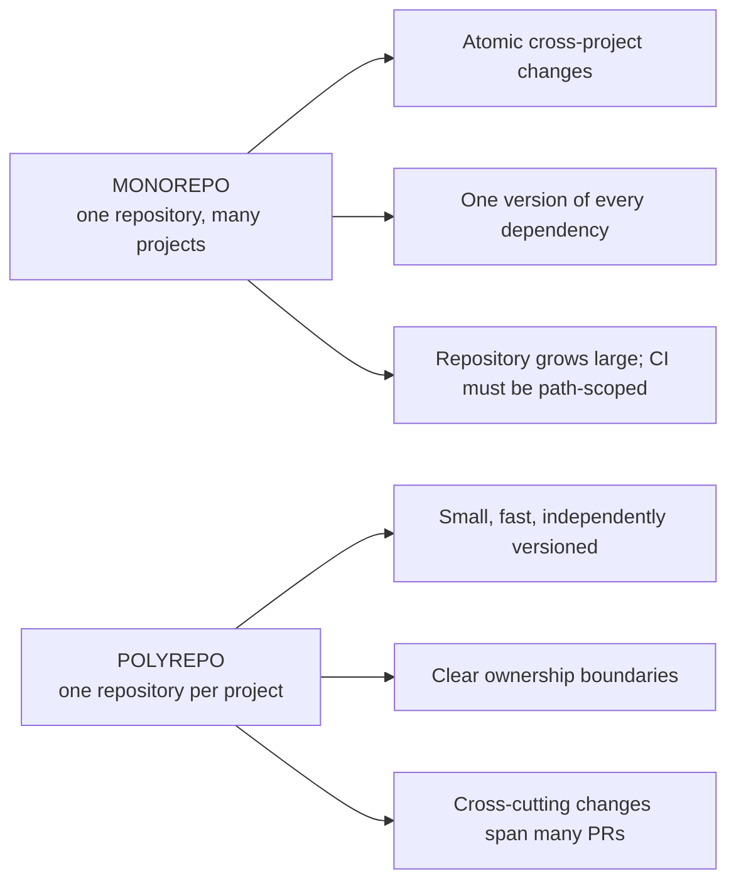
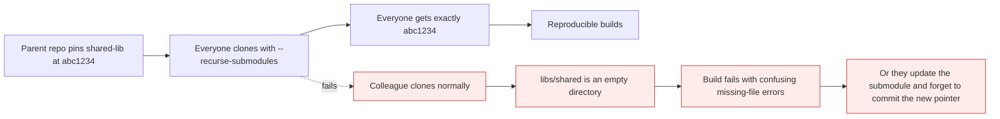

# Large and multi-repo setups

*Module 17 · Power tools*

One repository or many? And what do you do when one repository grows to twenty gigabytes and a
clone takes an hour? These are architecture decisions with long consequences, and the tools Git
gives you - submodules, subtrees, sparse checkout, LFS - each solve a different problem badly if
you pick the wrong one.

[Course home](../index.md) / Module 17

## 1. Monorepo or polyrepo



> **Why it matters:** The real trade is **atomicity versus autonomy**. A monorepo lets one commit change an API and every consumer together, and forces everyone onto one version of everything. A polyrepo lets each team move independently, and makes a breaking change a coordination exercise across several repositories and several weeks.

| | Monorepo | Polyrepo |
| --- | --- | --- |
| Cross-project change | **One commit, one PR** | Several PRs, ordered carefully |
| Dependency versions | One, enforced | Each project chooses |
| Clone size and time | Grows with everything | Small |
| CI | Must be path-scoped or it runs everything | Naturally scoped |
| Ownership | CODEOWNERS by path | Repository permissions |
| Refactoring across projects | Straightforward | Painful |
| Independent release cadence | Harder - needs tooling | **Natural** |
| Tooling needed | Nx, Turborepo, Bazel, changesets | Almost none |
| Suits | One product, one org, shared code | Independent services, separate teams |

> **TIP - The deciding question is not size, it is coupling**
>
> If a change to project A routinely requires a change to project B in the same week, they belong together. If they genuinely release independently and rarely change together, keep them apart. Google's monorepo and Amazon's thousands of service repos are both correct - for their coupling.

## 2. Submodules - a repository inside a repository

```bash
git submodule add https://github.com/org/shared-lib.git libs/shared
git commit -m "Add shared-lib submodule"
```

The parent repository stores **a path, a URL and one commit hash** - not the files.

```bash
git clone --recurse-submodules https://github.com/org/app.git
git submodule update --init --recursive        # after a normal clone
git submodule update --remote                  # move submodules to their latest
git submodule status
git config --global submodule.recurse true     # make pull/checkout handle them
```



> **Why it matters:** Submodules are exact and reproducible, and they are hostile to anyone who does not already understand them. The empty-directory failure hits every new joiner, updating one is a two-step commit dance, and the tooling around branches and merges is genuinely awkward. Use them for a real dependency pinned at a version - a vendored library, a shared theme - and not as a substitute for a package manager.

| Submodules are good for | Use something else for |
| --- | --- |
| Vendoring a third-party repo at an exact commit | Sharing code between your own services - publish a package |
| A shared config or theme repository | Anything that changes weekly |
| Reproducing an exact toolchain | Splitting a monorepo you did not want |

## 3. Subtrees - the alternative

```bash
git subtree add --prefix libs/shared https://github.com/org/shared-lib.git main --squash
git subtree pull --prefix libs/shared https://github.com/org/shared-lib.git main --squash
git subtree push --prefix libs/shared https://github.com/org/shared-lib.git main
```

Subtree **copies the files into your repository** as ordinary content.

| | Submodule | Subtree |
| --- | --- | --- |
| Files in the parent repo | No - a pointer | **Yes - real files** |
| Consumer needs to know | **Yes** - extra commands | No - it just works |
| Clone | Needs `--recurse-submodules` | Normal |
| Repository size | Small | Larger |
| Pushing changes back upstream | Natural | Possible, more awkward |
| Complexity | On the consumer | On the maintainer |

> **TIP - Subtree when consumers should not have to care**
>
> If the people cloning your repository are not going to learn submodule commands - which is most people - subtree is kinder. The cost lands on whoever maintains the vendoring rather than on every developer, every day.

## 4. When the repository itself is too big

Three different problems, three different fixes.

| Problem | Fix |
| --- | --- |
| Too much **history** | Shallow clone, or a blobless partial clone |
| Too many **files** in the working tree | Sparse checkout |
| Large **binary** files | Git LFS |

### 4.1 Partial and shallow clones

```bash
git clone --depth 1 <url>                      # only the latest commit
git clone --filter=blob:none <url>             # all history, file contents on demand
git clone --filter=tree:0 <url>                # even less - for automation
git fetch --unshallow                          # convert a shallow clone to full
```

| Type | Downloads | Good for |
| --- | --- | --- |
| `--depth 1` | One commit | CI builds |
| `--filter=blob:none` | Full history, no file contents until needed | **Developers on a large repo** |
| `--filter=tree:0` | Commits only | Scripts that only read metadata |

> **NOTE - Blobless beats shallow for humans**
>
> `--depth 1` breaks `git log`, `git blame` and anything comparing to an older commit. `--filter=blob:none` keeps the full commit graph so history commands work, and fetches file contents lazily only when you actually check something out. It is the right default on a very large repository.

### 4.2 Sparse checkout

```bash
git clone --filter=blob:none --sparse <url>
cd repo
git sparse-checkout init --cone
git sparse-checkout set services/payments libs/shared
git sparse-checkout list
git sparse-checkout disable
```

You get the whole repository's history, but only the directories you asked for appear on disk.
Essential in a large monorepo where one team needs three folders out of four hundred.

### 4.3 Git LFS

```bash
git lfs install
git lfs track "*.psd" "*.mp4" "*.zip"
git add .gitattributes
git commit -m "Track large binaries with LFS"
git lfs ls-files
```


> **Why it matters:** Git stores every version of every file forever and cannot delta-compress binaries meaningfully - so ten revisions of a 200 MB video is 2 GB in history, permanently, for everyone who clones. **Set LFS up before the first large file is committed.** Retrofitting it requires rewriting history, and by then everyone has already paid for the clone.

## 5. Keeping a large repository fast

```bash
git maintenance start                # schedule background optimisation - modern Git
git gc --aggressive --prune=now      # manual, occasional
git commit-graph write --reachable   # dramatically speeds up log and merge-base
git config --global core.fsmonitor true      # fast status on huge working trees
git config --global feature.manyFiles true
git count-objects -vH                # how big is this actually?
```

| Command | Fixes |
| --- | --- |
| `git maintenance start` | Everything below, on a schedule |
| `commit-graph` | Slow `git log --graph`, slow merges |
| `core.fsmonitor` | `git status` taking seconds |
| `gc` | Thousands of loose objects after heavy rewriting |

## 6. Monorepo CI - the part people forget

A monorepo without path filtering runs every test on every commit, and the pipeline becomes the
bottleneck that pushes teams back to polyrepo.

```yaml
# .github/workflows/payments.yml
on:
  push:
    paths:
      - 'services/payments/**'
      - 'libs/shared/**'
      - '.github/workflows/payments.yml'
```

```bash
git diff --name-only origin/main...HEAD        # what actually changed in this PR
```

| Tool | Gives you |
| --- | --- |
| GitHub Actions `paths:` | Simple per-directory triggering |
| **Nx / Turborepo** | Dependency-aware task graph, remote caching |
| **Bazel / Pants** | Fully hermetic builds, only affected targets |
| `changesets` | Independent versioning of packages in one repository |

> **WARNING - `paths:` filters and required checks fight each other**
>
> If a required status check is skipped because its paths did not match, the pull request can wait forever for a check that will never run. The usual fix is a job that always runs and reports success when it has nothing to do.

## 7. Extra points

- **Submodules do not track a branch by default.** They pin a commit. `--remote` follows a
  branch, and forgetting to commit the updated pointer is the classic mistake.
- **`git submodule foreach`** runs a command in every submodule - useful for status sweeps.
- **LFS pointers are text.** Open one and you will see the OID and size, which makes "why is my
  image a text file?" easy to diagnose - LFS is not installed.
- **Shallow clones cannot be pushed from reliably** in some workflows, and break
  `git describe` - which is why module 14's version stamping needs `fetch-depth: 0` in CI.
- **A monorepo is not a mono-build.** The point is one source of truth, not one giant build; if
  every change rebuilds everything, the tooling is wrong, not the model.

> **PRACTICE - Practice now**
>
> **Submodules**
>
> 1. ```bash
>    mkdir -p demo/lib && cd demo/lib && git init
>    echo "shared code" > shared.js && git add . && git commit -m "Initial"
>    cd .. && mkdir app && cd app && git init
>    echo "app" > app.js && git add . && git commit -m "Initial"
>    git -c protocol.file.allow=always submodule add ../lib libs/shared
>    git commit -m "Add shared submodule"
>    cat .gitmodules
>    git submodule status
>    ```
> 2. **Prove the empty-directory failure:**
>    ```bash
>    cd ..
>    git clone app app-clone
>    ls app-clone/libs/shared
>    cd app-clone && git submodule update --init --recursive
>    ls libs/shared
>    ```
> 3. **Prove it pins a commit, not a branch:**
>    ```bash
>    cd ../lib && echo "new function" >> shared.js && git commit -am "Add function"
>    cd ../app && git submodule update --remote
>    git status
>    ```
>    The parent shows a *modified* submodule - you must commit the new pointer.
>
> **Sparse checkout**
>
> 4. ```bash
>    git clone --filter=blob:none --sparse https://github.com/octocat/Spoon-Knife.git sparse-demo
>    cd sparse-demo
>    git sparse-checkout init --cone
>    git sparse-checkout list
>    ls
>    git sparse-checkout disable
>    ls
>    ```
>
> **Clone strategies**
>
> 5. **Compare the three:**
>    ```bash
>    git clone https://github.com/octocat/Hello-World.git full
>    git clone --depth 1 https://github.com/octocat/Hello-World.git shallow
>    git clone --filter=blob:none https://github.com/octocat/Hello-World.git blobless
>    ```
>    Then in each:
>    ```bash
>    git log --oneline | Measure-Object -Line
>    git count-objects -vH | Select-String "size-pack"
>    ```
>    Note that `shallow` has almost no history and `blobless` has all of it.
>
> **LFS**
>
> 6. ```bash
>    git lfs install
>    mkdir lfs-demo && cd lfs-demo && git init
>    git lfs track "*.bin"
>    cat .gitattributes
>    fsutil file createnew big.bin 10000000
>    git add .gitattributes big.bin && git commit -m "Add binary via LFS"
>    git lfs ls-files
>    cat big.bin | Select-Object -First 3
>    ```
>    The committed file is a small pointer, not the binary.
>
> **Performance**
>
> 7. ```bash
>    git count-objects -vH
>    git commit-graph write --reachable
>    git maintenance start
>    git maintenance unregister
>    ```

> **ASSIGNMENT - Assignment**
>
> Take two projects you work on and answer, in writing: do they change together in the same week? Then write a one-page recommendation - monorepo or polyrepo - justified by that coupling rather than by preference, and include what would need to be true for the other answer to be right. If you propose a monorepo, specify how CI stays fast; if you propose polyrepo, specify how a breaking API change is coordinated. That second half is what separates a real recommendation from a slogan, and it is exactly what an interviewer is listening for.

## 8. Interview drill

<details>
<summary><b>Monorepo or polyrepo - how do you decide?</b></summary>

By coupling, not size. If a change to one project routinely requires a change to another in the
same week, a monorepo lets you do it in one atomic commit and one review, and enforces a single
version of shared dependencies. If projects genuinely release independently and rarely change
together, separate repositories give teams autonomy and keep clones and CI small. The cost of a
monorepo is that CI must be path-scoped and you need tooling such as Nx, Turborepo or Bazel; the
cost of polyrepo is that cross-cutting changes become multi-repository coordination.

</details>

<details>
<summary><b>What is a submodule and what are its problems?</b></summary>

A reference from one repository to a specific commit of another - the parent stores a path, URL
and commit hash rather than the files. It gives exact, reproducible pinning, but it is hostile to
newcomers: a normal clone leaves the directory empty until `git submodule update --init`,
updating a submodule requires committing the new pointer separately, and branch and merge
behaviour is awkward. It suits vendoring a third-party dependency at a fixed commit, not sharing
code between your own actively developed services - use a package registry for that.

</details>

<details>
<summary><b>How does a subtree differ from a submodule?</b></summary>

A subtree copies the other repository's files into yours as ordinary content, so consumers need
no special commands and a normal clone just works. A submodule stores only a pointer, keeping
the parent small but requiring every consumer to understand submodules. Subtree moves the
complexity onto the maintainer; submodules push it onto every developer, every day. If the people
cloning will not learn the commands, subtree is the kinder choice.

</details>

<details>
<summary><b>Your repository is 20 GB and cloning takes an hour. What do you do?</b></summary>

Diagnose which of three problems it is. Too much history: use a blobless partial clone,
`--filter=blob:none`, which keeps the full commit graph so `log` and `blame` still work while
fetching file contents lazily - preferable to `--depth 1`, which breaks those commands. Too many
files in the working tree: sparse checkout, so only the directories you need appear. Large
binaries: Git LFS - though retrofitting it requires rewriting all history, so the real answer is
to set it up before the first large file lands.

</details>

<details>
<summary><b>What does Git LFS actually do?</b></summary>

It replaces large files in the repository with small text pointer files and stores the real
content in a separate LFS store, downloading only the versions you actually check out. This
matters because Git keeps every version of every file forever and cannot delta-compress binaries
usefully, so ten revisions of a 200 MB asset is 2 GB in history for every person who ever clones.
Tracking is configured in `.gitattributes`, so it must be committed for the whole team.

</details>

<details>
<summary><b>How do you keep CI fast in a monorepo?</b></summary>

Path-scoped triggering, so a change under `services/payments` runs only that service's pipeline -
`paths:` filters in GitHub Actions at the simplest level, and a dependency-aware build graph such
as Nx, Turborepo or Bazel for anything larger, ideally with remote caching so unchanged targets
are not rebuilt at all. Watch out for the interaction between path filters and required status
checks: a skipped required check blocks the pull request forever, so add a job that always runs
and reports success when there is nothing to do.

</details>

---

[← Module 16](16-hooks.md) &nbsp;&nbsp;|&nbsp;&nbsp; [Module 18: Git internals →](18-git-internals.md)

---

Git & Pipelines: Zero to Architect · Himanshu Kumar.
