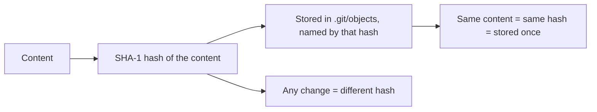
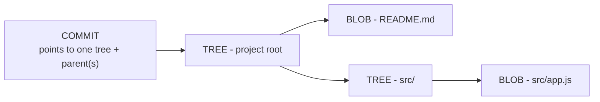
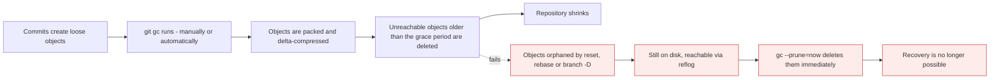

# Git internals

*Module 18 · Power tools*

Everything in the previous seventeen modules is a consequence of four object types and one idea:
**content addressing**. Spend twenty minutes here and branching, rebasing, immutability and
recovery all stop being rules to memorise and become obvious.

[Course home](../index.md) / Module 18

## 1. Git is a key-value store

At the bottom, Git stores content and gives you back a key - the SHA-1 hash of that content.

```bash
echo "hello world" | git hash-object --stdin
```

```text
3b18e512dba79e4c8300dd08aeb37f8e728b8dad
```

That hash is derived from the content itself. Same content anywhere, any repository, any year -
same hash.

```bash
mkdir internals-demo && cd internals-demo && git init
echo "hello world" | git hash-object -w --stdin      # -w actually writes it
git cat-file -p 3b18e512
git cat-file -t 3b18e512
```



> **Why it matters:** This single property produces almost everything else. Deduplication is free - the same file in a hundred commits is one object. History is tamper-evident - change any byte and every hash downstream changes. And commits are **immutable**, which is why `amend` and `rebase` create new commits rather than editing old ones.

## 2. The four object types

```bash
ls .git/objects
git cat-file --batch-all-objects --batch-check
```

| Type | Holds | Analogy |
| --- | --- | --- |
| **blob** | File contents. No name, no permissions | The file's bytes |
| **tree** | A list of names, modes and hashes | A directory |
| **commit** | One tree, parent(s), author, committer, message | A snapshot with metadata |
| **tag** | A commit hash, tagger, message, signature | An annotated tag - module 14 |



> **Why it matters:** A commit does not contain your files. It points at **one tree**, which points at blobs and further trees. That is how a snapshot can be complete yet cheap - unchanged subtrees are simply referenced again, so committing in a repository with 100,000 files writes only the objects that changed.

Look inside a real commit:

```bash
echo "# Demo" > README.md
mkdir src && echo "console.log(1)" > src/app.js
git add . && git commit -m "First commit"

git cat-file -p HEAD
```

```text
tree 4b825dc642cb6eb9a060e54bf8d69288fbee4904
author Himanshu Kumar <him@example.com> 1756800000 +0530
committer Himanshu Kumar <him@example.com> 1756800000 +0530

First commit
```

```bash
git cat-file -p HEAD^{tree}
```

```text
100644 blob a1b2c3d...    README.md
040000 tree e4f5a6b...    src
```

```bash
git cat-file -p HEAD^{tree}:src
git cat-file -p HEAD:README.md
```

You have just walked the entire data model by hand.

| Mode | Means |
| --- | --- |
| `100644` | Normal file |
| `100755` | Executable file |
| `040000` | Directory (tree) |
| `120000` | Symlink |
| `160000` | **Submodule** - a commit hash, module 17 |

## 3. What a commit really is

```text
commit = tree + parent(s) + author + committer + message
```

Hash all of that together and you get the commit's identity. Which explains, finally:

| Behaviour | Because |
| --- | --- |
| `amend` changes the hash | The message or tree changed, so the hash must |
| `rebase` creates new commits | The **parent** changed, so every downstream hash changes |
| Cherry-pick produces a different hash | Same tree, different parent and committer |
| History cannot be quietly altered | Changing an old commit changes every descendant |
| A merge commit has two parents | It literally lists two |

```bash
git cat-file -p HEAD | Select-String "parent"
git log --format="%h tree=%t parents=%p" -5
```

## 4. Refs - branches and tags are files

```bash
cat .git/HEAD
cat .git/refs/heads/main
ls .git/refs/heads
cat .git/packed-refs
```

```text
ref: refs/heads/main
f3a1c9e4b8d2a7c1e9f0b3d5a8c2e4f6b1d9a7c3
```

| File | Is |
| --- | --- |
| `.git/HEAD` | Which branch you are on - or a raw hash in detached HEAD |
| `.git/refs/heads/<name>` | A branch: 41 bytes containing a commit hash |
| `.git/refs/tags/<name>` | A tag |
| `.git/refs/remotes/origin/<name>` | A remote-tracking branch - module 07 |
| `.git/packed-refs` | The same, compressed into one file after `gc` |

```bash
git rev-parse HEAD
git rev-parse main
git rev-parse HEAD~2
git rev-parse --abbrev-ref HEAD        # the branch name
git symbolic-ref HEAD
```

> **NOTE - This is why branching is free**
>
> Module 06 claimed a branch is 41 bytes. Now you can see it: `git branch feature` writes one small file containing a hash. Nothing is copied, which is why it is instant in a repository of any size - and why deleting a branch removes a pointer, not any commits.

## 5. The index

```bash
git ls-files --stage
```

```text
100644 a1b2c3d... 0    README.md
100644 e4f5a6b... 0    src/app.js
```

`.git/index` is a binary file listing every staged path with its blob hash and mode. It is
literally the tree that your next commit will be built from - which is precisely module 03's
staging area, seen from underneath.

## 6. Packfiles and garbage collection

```bash
git count-objects -vH
git gc
git count-objects -vH
```

Git starts by writing **loose objects** - one file per object, zlib-compressed. Periodically it
packs them into a single packfile using **delta compression**, storing similar objects as
differences from one another.

| | Loose objects | Packfile |
| --- | --- | --- |
| Layout | One file per object | Many objects in one file |
| Compression | zlib per object | zlib **plus deltas between objects** |
| Created by | Everyday commits | `git gc`, `git push`, `git clone` |
| Efficiency | Poor at scale | Very high |



> **Why it matters:** **Nothing is deleted when you "lose" a commit - it becomes unreachable.** The reflog keeps a path back to it for roughly ninety days, and `gc` is what eventually removes it. That is the mechanism behind every recovery in module 10, and the reason `git gc --prune=now` is the one command that turns a recoverable mistake into a permanent one.

```bash
git fsck --lost-found          # unreachable objects
git verify-pack -v .git/objects/pack/pack-*.idx | Select-Object -Last 5
```

## 7. Plumbing and porcelain

| Layer | Commands | For |
| --- | --- | --- |
| **Porcelain** | `add`, `commit`, `log`, `merge`, `push` | Humans |
| **Plumbing** | `hash-object`, `cat-file`, `ls-tree`, `update-index`, `write-tree`, `commit-tree`, `rev-parse`, `rev-list` | Scripts, and understanding |

You can build a commit entirely from plumbing - which is the clearest possible proof that
`git commit` is a convenience wrapper:

```bash
$blob = "content" | git hash-object -w --stdin
git update-index --add --cacheinfo 100644 $blob file.txt
$tree = git write-tree
$commit = git commit-tree $tree -m "Made with plumbing"
git update-ref refs/heads/plumbing-demo $commit
git log --oneline plumbing-demo
```

## 8. SHA-1, and the move to SHA-256

Git uses SHA-1 by default. SHA-1 collisions have been demonstrated, so Git added **collision
detection** - it refuses content matching known attack patterns - and supports SHA-256
repositories.

```bash
git init --object-format=sha256 new-repo
```

In practice SHA-1 remains the default because migration breaks interoperability, and Git's
threat model - where a collision must also be a valid, useful object that survives review -
makes exploitation impractical. Worth knowing the answer exists.

## 9. Extra points

- **`.git/objects/xx/yyyy...`** - the first two hex characters are the directory, the rest the
  filename. Just filesystem sharding.
- **The empty tree has a fixed hash**: `4b825dc642cb6eb9a060e54bf8d69288fbee4904`. It is the same
  in every Git repository ever created.
- **Blobs store no filename.** The name lives in the tree, which is why renaming a file creates
  no new blob and why Git detects renames rather than recording them - module 04.
- **`git log` is `rev-list` plus formatting.** Almost every porcelain command is plumbing with a
  friendlier interface.
- **`git cat-file --batch-check --batch-all-objects`** lists every object with type and size -
  the quickest way to find what is actually making a repository large.

> **PRACTICE - Practice now**
>
> 1. Create a repository and hash some content by hand:
>    ```bash
>    mkdir internals-demo && cd internals-demo && git init
>    "hello world" | git hash-object --stdin
>    "hello world" | git hash-object -w --stdin
>    ls .git/objects
>    ```
> 2. **Read the object back:**
>    ```bash
>    git cat-file -t 3b18e512
>    git cat-file -p 3b18e512
>    git cat-file -s 3b18e512
>    ```
> 3. **Prove identical content is stored once:**
>    ```bash
>    "hello world" | git hash-object -w --stdin
>    "hello world" | git hash-object -w --stdin
>    git count-objects -v
>    ```
> 4. **Walk a real commit by hand:**
>    ```bash
>    "# Demo" | Set-Content README.md
>    mkdir src; "console.log(1)" | Set-Content src/app.js
>    git add . && git commit -m "First commit"
>    git cat-file -p HEAD
>    git cat-file -p HEAD^{tree}
>    git cat-file -p HEAD^{tree}:src
>    git cat-file -p HEAD:README.md
>    ```
> 5. **Prove a commit's hash depends on its parent:**
>    ```bash
>    git log --format="%h tree=%t parents=%p"
>    "more" | Add-Content README.md
>    git commit -am "Second commit"
>    git log --format="%h tree=%t parents=%p"
>    ```
>    Now amend the first commit and watch every later hash change.
> 6. **Prove a branch is a file:**
>    ```bash
>    Get-Content .git/HEAD
>    Get-Content .git/refs/heads/main
>    git branch feature
>    Get-Content .git/refs/heads/feature
>    git rev-parse main feature
>    ```
> 7. **Look at the index:**
>    ```bash
>    "staged" | Set-Content new.txt
>    git add new.txt
>    git ls-files --stage
>    ```
>    The blob hash is already there, before any commit.
> 8. **Watch packing happen:**
>    ```bash
>    git count-objects -vH
>    git gc
>    git count-objects -vH
>    ls .git/objects/pack
>    ```
> 9. **Prove unreachable objects survive:**
>    ```bash
>    "temp" | Set-Content temp.txt
>    git add . && git commit -m "Temporary"
>    $lost = git rev-parse HEAD
>    git reset --hard HEAD~1
>    git cat-file -p $lost
>    git fsck --lost-found
>    ```
>    The commit is gone from `log` and still fully readable.
> 10. **Build a commit with plumbing only:**
>     ```bash
>     $blob = "made by hand" | git hash-object -w --stdin
>     git update-index --add --cacheinfo 100644 $blob handmade.txt
>     $tree = git write-tree
>     $commit = git commit-tree $tree -m "Made with plumbing"
>     git update-ref refs/heads/plumbing-demo $commit
>     git log --oneline plumbing-demo
>     git show plumbing-demo
>     ```

> **ASSIGNMENT - Assignment**
>
> Take five behaviours from earlier modules and explain each one purely in terms of objects and refs, in two sentences: why branching is instant, why `rebase` changes hashes, why identical files across a thousand commits cost almost nothing, why `git reflog` can recover a "deleted" commit, and why you cannot secretly alter an old commit. If you can do that without using the word "magic", you understand Git at a level most people never reach - and it is the difference between remembering commands and being able to reason about any situation you meet.

## 10. Interview drill

<details>
<summary><b>What are Git's object types?</b></summary>

Four. A **blob** holds file contents with no name or permissions. A **tree** is a directory
listing - names, modes and the hashes they point to. A **commit** points to exactly one tree plus
its parent commits, with author, committer and message. An annotated **tag** points to a commit
with a tagger, message and optional signature. Every object is stored in `.git/objects` under a
name that is the SHA-1 of its own content.

</details>

<details>
<summary><b>Why is Git content-addressed, and what does that buy you?</b></summary>

Because an object's name is the hash of its content. That gives free deduplication - identical
content is stored once no matter how many commits or paths reference it - and makes history
tamper-evident, since altering any byte changes that object's hash and therefore every commit
descending from it. It is also why commits are immutable, which is the underlying reason `amend`,
`rebase` and `cherry-pick` all produce new commits rather than modifying existing ones.

</details>

<details>
<summary><b>What is actually inside a commit object?</b></summary>

A reference to exactly one tree, one or more parent commit hashes, author name, email and
timestamp, committer name, email and timestamp, and the message. Not the files - those live in
blobs referenced through the tree. Because the parent is part of what gets hashed, changing a
commit's parent changes its hash, which is precisely why rebasing recreates every commit
downstream of the rebase point.

</details>

<details>
<summary><b>What is the difference between a loose object and a packfile?</b></summary>

A loose object is a single zlib-compressed file per object, written as you work. A packfile
combines many objects into one file and additionally uses delta compression, storing similar
objects as differences from each other, which is far more space-efficient. Git packs
automatically during `gc`, `push` and `clone`. It also explains why a repository can shrink
dramatically after `git gc` following heavy history rewriting.

</details>

<details>
<summary><b>What actually happens when you "lose" a commit?</b></summary>

Nothing is deleted - the commit simply becomes unreachable from any ref. The object stays in
`.git/objects`, the reflog keeps a record of where `HEAD` has been for about ninety days, and
`git fsck --lost-found` can find dangling objects the reflog does not list. Garbage collection is
what eventually removes unreachable objects past the grace period, which is why
`git gc --prune=now` converts a recoverable mistake into a permanent one.

</details>

<details>
<summary><b>What is the difference between plumbing and porcelain commands?</b></summary>

Porcelain commands - `add`, `commit`, `log`, `merge` - are the user-facing interface. Plumbing
commands - `hash-object`, `cat-file`, `write-tree`, `commit-tree`, `update-ref`, `rev-list` -
are the low-level operations they are built from, intended for scripting and stable across
versions. You can construct a commit entirely from plumbing, which demonstrates that `git
commit` is a convenience wrapper around writing a tree and a commit object and moving a ref.

</details>

---

[← Module 17](17-large-repos.md) &nbsp;&nbsp;|&nbsp;&nbsp; [Module 19: CI/CD fundamentals →](19-cicd-fundamentals.md)

---

Git & Pipelines: Zero to Architect · Himanshu Kumar.
