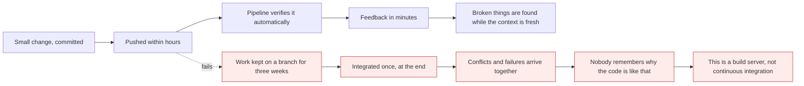
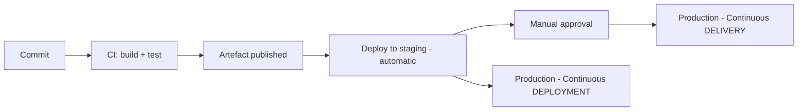
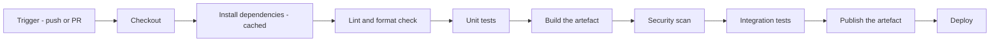
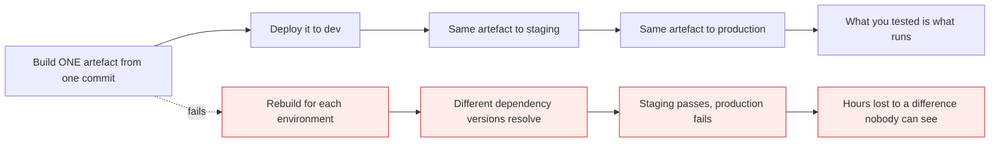
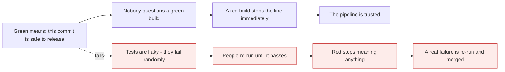

# CI/CD fundamentals

*Module 19 · Pipelines*

Modules 01-18 made the left half of the delivery line reliable. This is where the right half
becomes automatic. Before any YAML, it is worth being precise about what a pipeline is actually
for - because most broken pipelines are broken in their purpose, not their syntax.

[Course home](../index.md) / Module 19

## 1. What CI actually means

**Continuous Integration** is not "we have a build server". It is a practice:

> Every developer integrates their work into the shared branch **frequently** - at least daily -
> and every integration is **verified automatically**.



> **Why it matters:** The *continuous* is the point. A team with a perfect pipeline and three-week branches is not doing CI - they are doing batch integration with automation attached. This is module 12's argument arriving from the other direction: **branch lifetime and CI are the same conversation.**

## 2. Delivery, deployment, and the difference

| Term | Means | Human involved? |
| --- | --- | --- |
| **Continuous Integration** | Every change is built and tested automatically | No |
| **Continuous Delivery** | Every change is **always releasable** - deploying is one button | **Yes** - someone presses it |
| **Continuous Deployment** | Every change that passes automatically goes to production | **No** |



> **Why it matters:** Continuous **delivery** is an engineering achievement - the pipeline proves every commit is shippable. Continuous **deployment** is an organisational decision on top of it. Most teams should aim for delivery first; deployment without strong tests, monitoring and fast rollback is how a bad afternoon becomes a bad week.

## 3. The stages of a pipeline



| Stage | Answers | Typical time |
| --- | --- | --- |
| Lint | Does it meet our standards? | Seconds |
| Unit tests | Does the logic work? | Under 2 minutes |
| Build | Does it compile and package? | 1-5 minutes |
| Security scan | Known CVEs? Leaked secrets? | 1-2 minutes |
| Integration tests | Do the parts work together? | 5-15 minutes |
| Deploy | Does it run in a real environment? | Minutes |

> **TIP - Order stages by speed, not importance**
>
> Put the fastest, cheapest checks first so a missing semicolon fails in twenty seconds rather than after a fifteen-minute integration suite. This is exactly the Docker layer-caching argument from that course: cheap and stable first, expensive and volatile last.

## 4. Build once, deploy many

The single most important architectural rule in this module.



> **Why it matters:** If you rebuild per environment, you have never actually tested what you ship. Dependencies resolve differently, a base image moves, a build tool updates - and "works in staging, fails in production" becomes routine. **Build once, promote the artefact, vary only configuration.** This is why module 12 rejected environment branches: promote artefacts, not code.

| Varies per environment | Never varies |
| --- | --- |
| Configuration and environment variables | The artefact |
| Secrets | The build |
| Replica counts and resource limits | The commit hash it came from |
| Feature flag values | The tests it passed |

## 5. What "green" should mean



> **Why it matters:** **A flaky test is worse than no test.** It trains the team to ignore red, which disables every other check in the pipeline at the same time. When a test is flaky, quarantine it the same day - fix it or delete it. Tolerating it is the decision that quietly destroys the pipeline's value.

| Symptom | What it really means |
| --- | --- |
| "Just re-run it" | The pipeline is not trusted |
| "That test always fails" | You have no test there |
| "Ignore the red, it is unrelated" | Red no longer stops anything |
| CI takes 45 minutes | People will batch changes to avoid it - which kills CI |
| Only one person can fix the pipeline | It is a single point of failure |

## 6. Feedback time is the metric that matters

| Feedback time | Behaviour it produces |
| --- | --- |
| Under 10 minutes | Developers wait for it and fix immediately |
| 10-30 minutes | They context-switch; fixes are slower |
| Over 30 minutes | They batch changes and stop watching |
| Over an hour | The pipeline is a gate, not a tool |

How to get there:

```text
- cache dependencies between runs
- run independent jobs in parallel
- split fast unit tests from slow integration tests
- run the expensive suite on merge, not on every push
- use path filters in a monorepo (module 17)
- fail fast: lint before tests, tests before build
```

## 7. The four DORA metrics

The industry-standard way to describe delivery performance - and useful language in a review.

| Metric | Question | Elite |
| --- | --- | --- |
| **Deployment frequency** | How often do you ship? | On demand, multiple times a day |
| **Lead time for change** | Commit to production? | Under an hour |
| **Change failure rate** | What share of deploys cause a problem? | Under 15% |
| **Time to restore** | How fast do you recover? | Under an hour |

> **TIP - The two speed metrics and the two stability metrics move together**
>
> The intuition that shipping faster must mean breaking more turns out to be wrong: teams that deploy frequently in small batches also recover faster and fail less, because each change is small enough to understand and revert. Small batches are the mechanism behind all four - which is, again, module 12's short branches.

## 8. Pipeline anti-patterns

| Anti-pattern | Why it hurts | Fix |
| --- | --- | --- |
| Secrets in the workflow file | They are in history forever - module 15 | Secret store + OIDC (module 22) |
| Rebuilding per environment | You ship something untested | Build once, promote |
| Manual steps in the middle | Not reproducible, not auditable | Automate or gate explicitly |
| One giant job | No parallelism, no partial reruns | Split into jobs |
| Deploying from a laptop | No record of what was deployed, or by whom | Deploy only from CI |
| No rollback path | Recovery becomes a redeploy under pressure | Keep the previous artefact ready |
| CI that only runs on `main` | Failures found after merge | Run on pull requests |
| Ignoring pipeline maintenance | Rot until nobody trusts it | Treat it as production code |

> **WARNING - Your pipeline has production credentials**
>
> A workflow that can deploy can, by definition, reach production - so anyone who can modify it can reach production. That makes `.github/workflows/` one of the most security-sensitive paths in the repository. Protect it with CODEOWNERS, require review, and be extremely careful with workflows triggered by pull requests from forks. Module 24 covers this properly.

> **PRACTICE - Practice now**
>
> No YAML yet - module 20 starts that. Today, measure and design.
>
> 1. **Time your current feedback loop.** On a project you work on, note the time from pushing a
>    commit to knowing whether it passed. Write the number down.
> 2. **Classify your team.** Which of the three are you actually doing - CI, continuous delivery,
>    or continuous deployment? Be honest about the definitions in section 2.
> 3. **Check the build-once rule.** Does your deployment build a fresh artefact for each
>    environment, or promote one? If it rebuilds, list what could differ between builds.
> 4. **Count the flaky tests.** Ask the team which tests "sometimes fail". Every one of those is a
>    hole in the pipeline's meaning.
> 5. **Estimate your DORA metrics** from memory: deploys per week, commit-to-production time,
>    percentage of deploys causing an incident, and typical recovery time.
> 6. **Design a pipeline on paper** for a project you know: the stages in order, what each proves,
>    how long each takes, which run in parallel, and which are required to merge.
> 7. **Find the manual steps.** List everything a human does between "merged" and "running in
>    production". Each one is a candidate for automation or an explicit approval gate.
> 8. **Audit workflow permissions.** If your repository has workflows, check who can edit
>    `.github/workflows/` and whether that path is covered by CODEOWNERS.

> **ASSIGNMENT - Assignment**
>
> Write a one-page pipeline design for a real project: every stage in order, the purpose of each, expected duration, which are required status checks for merging, where the artefact is built and where it is promoted, and what the rollback procedure is. Then add the honest section most designs omit - **what this pipeline does not check**, and what risk that leaves. Modules 20 to 24 implement exactly this document, so make it something you would be willing to build.

## 9. Interview drill

<details>
<summary><b>What is continuous integration, really?</b></summary>

The practice of every developer integrating their work into the shared branch frequently - at
least daily - with every integration verified automatically. The automation is necessary but not
sufficient: a team with a build server and three-week feature branches is doing batch
integration, not CI. The point of *continuous* is that conflicts and failures surface while
changes are small and the context is fresh, which is why CI and short-lived branches are really
the same conversation.

</details>

<details>
<summary><b>What is the difference between continuous delivery and continuous deployment?</b></summary>

Continuous delivery means every change that passes the pipeline is **always releasable** and
deploying is a single button press - a human decides when. Continuous deployment removes that
human: anything passing the pipeline goes to production automatically. Delivery is an engineering
achievement; deployment is an organisational decision layered on top, and it only makes sense
with strong automated tests, real monitoring and fast rollback.

</details>

<details>
<summary><b>Why "build once, deploy many"?</b></summary>

Because rebuilding per environment means you never tested what you actually ship. Dependencies
resolve differently, base images move, toolchains update - so staging and production diverge in
ways nobody can see, and "works in staging, fails in production" becomes routine. Build a single
artefact from a single commit, promote that exact artefact through environments, and vary only
configuration and secrets. It is also the reason environment branches are a poor pattern:
promote artefacts, not code.

</details>

<details>
<summary><b>Why is a flaky test worse than no test?</b></summary>

Because it teaches the team to ignore red. Once "just re-run it" becomes normal, a genuine
failure gets re-run and merged too - so a single flaky test disables the signal from every other
check in the pipeline. The correct response is immediate: quarantine it the same day, then fix
it or delete it. Tolerating flakiness is the decision that quietly removes the pipeline's value.

</details>

<details>
<summary><b>How would you make a slow pipeline faster?</b></summary>

Order stages by cost so the cheapest checks fail first, cache dependencies between runs, run
independent jobs in parallel, split fast unit tests from slow integration tests and run the
expensive suite on merge rather than every push, and use path filters in a monorepo so only
affected projects build. The target is under ten minutes, because beyond about thirty developers
stop waiting, start batching changes, and CI stops being continuous.

</details>

<details>
<summary><b>What are the DORA metrics?</b></summary>

Deployment frequency, lead time for change, change failure rate and time to restore service -
two speed measures and two stability measures. The counter-intuitive finding is that they move
together: teams deploying frequently in small batches also fail less and recover faster, because
each change is small enough to reason about and revert. That makes small batch size the
underlying mechanism, which connects directly to short-lived branches and frequent integration.

</details>

---

[← Module 18](18-git-internals.md) &nbsp;&nbsp;|&nbsp;&nbsp; [Module 20: Your first GitHub Actions pipeline →](20-github-actions-basics.md)

---

Git & Pipelines: Zero to Architect · Himanshu Kumar.
