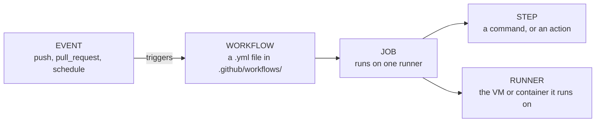
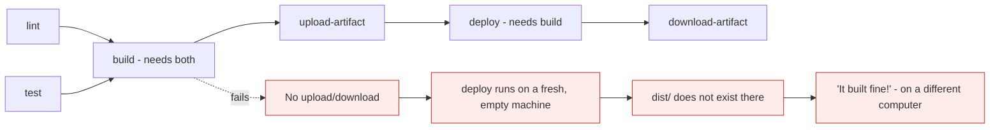

# Your first GitHub Actions pipeline

*Module 20 · Pipelines*

One YAML file in one folder, and every push to your repository runs whatever you tell it to.
This module builds that file from nothing, explains every key in it, and covers the three
mistakes everyone makes in their first week.

[Course home](../index.md) / Module 20

## 1. The anatomy



| Term | Is |
| --- | --- |
| **Workflow** | One YAML file in `.github/workflows/`. A repository can have many |
| **Event** | What triggers it - a push, a pull request, a schedule, a manual click |
| **Job** | A group of steps sharing one runner. Jobs run **in parallel** by default |
| **Step** | A single command (`run:`) or a reusable action (`uses:`) |
| **Runner** | The machine - GitHub-hosted Ubuntu/Windows/macOS, or your own |
| **Action** | A packaged, reusable step from the marketplace or your own repository |

> **NOTE - Jobs are parallel, steps are sequential**
>
> Steps inside a job run in order on the same machine and share a filesystem. Jobs run on **separate machines** simultaneously unless you declare `needs:` - which is why a build job's output is invisible to a deploy job until you pass it through an artefact. This surprises everyone once.

## 2. The smallest possible workflow

```yaml
# .github/workflows/hello.yml
name: Hello

on: push

jobs:
  greet:
    runs-on: ubuntu-latest
    steps:
      - run: echo "The pipeline ran"
```

```bash
mkdir -p .github/workflows
# create the file, then:
git add .github/workflows/hello.yml
git commit -m "ci: add first workflow"
git push
```

Open the **Actions** tab and it is already running. That is the entire setup - no server, no
agent, no registration.

## 3. A real one, key by key

```yaml
name: CI

on:
  push:
    branches: [main]
  pull_request:
    branches: [main]

jobs:
  test:
    runs-on: ubuntu-latest

    steps:
      - name: Check out the code
        uses: actions/checkout@v4

      - name: Set up Node
        uses: actions/setup-node@v4
        with:
          node-version: '20'
          cache: 'npm'

      - name: Install dependencies
        run: npm ci

      - name: Lint
        run: npm run lint

      - name: Test
        run: npm test
```

| Key | Does |
| --- | --- |
| `name` | What appears in the Actions tab |
| `on` | Which events trigger this workflow |
| `jobs` | One or more jobs, parallel by default |
| `runs-on` | The runner image |
| `steps` | Executed in order, on that runner |
| `uses` | A reusable action, pinned to a version |
| `with` | Inputs to that action |
| `run` | A shell command |

> **WARNING - The runner starts empty**
>
> A fresh runner does **not** have your code. `actions/checkout` is what clones it, and forgetting it produces a confusing "no such file or directory" on the very first command. It is the first step of almost every workflow you will ever write.

## 4. Triggers

```yaml
on:
  push:
    branches: [main, 'release/**']
    paths: ['src/**', 'package.json']
    tags: ['v*']

  pull_request:
    types: [opened, synchronize, reopened]

  schedule:
    - cron: '0 3 * * 1'          # 03:00 UTC every Monday

  workflow_dispatch:              # a manual "Run workflow" button
    inputs:
      environment:
        description: Target environment
        required: true
        default: staging
        type: choice
        options: [staging, production]

  release:
    types: [published]
```

| Trigger | Use for |
| --- | --- |
| `push` to `main` | Build, publish, deploy |
| `pull_request` | Lint and test **before** merge - the important one |
| `push` with `tags:` | Release pipelines - module 14 |
| `schedule` | Nightly security scans, dependency checks |
| `workflow_dispatch` | Manual deploys, one-off jobs |
| `release` | Publishing artefacts when a release is created |

> **TIP - Run on `pull_request`, not only on `push`**
>
> A pipeline that only runs after merge finds failures when they are already on `main` and everyone is blocked. Running on pull requests is what makes the required-status-check gate from module 11 possible - and that gate is the entire point.

## 5. Jobs, dependencies and artefacts

```yaml
jobs:
  lint:
    runs-on: ubuntu-latest
    steps:
      - uses: actions/checkout@v4
      - run: npm ci && npm run lint

  test:
    runs-on: ubuntu-latest
    steps:
      - uses: actions/checkout@v4
      - run: npm ci && npm test

  build:
    needs: [lint, test]           # only after BOTH succeed
    runs-on: ubuntu-latest
    steps:
      - uses: actions/checkout@v4
      - run: npm ci && npm run build
      - uses: actions/upload-artifact@v4
        with:
          name: dist
          path: dist/
          retention-days: 7

  deploy:
    needs: build
    runs-on: ubuntu-latest
    if: github.ref == 'refs/heads/main'
    steps:
      - uses: actions/download-artifact@v4
        with:
          name: dist
      - run: echo "Deploying the artefact built once, upstream"
```



> **Why it matters:** `lint` and `test` run **simultaneously**, so the pipeline takes as long as the slower one rather than their sum. And because every job gets a clean machine, artefacts are the only way to move a build between them - which is exactly module 19's "build once, deploy many" expressed in YAML.

## 6. Contexts, variables and secrets

```yaml
env:
  NODE_ENV: test                  # workflow-wide

jobs:
  build:
    env:
      LOG_LEVEL: debug            # job-wide
    steps:
      - run: echo "Building"
        env:
          STEP_VAR: value         # step-only

      - run: echo "Branch is ${{ github.ref_name }}"
      - run: echo "Commit is ${{ github.sha }}"
      - run: echo "Actor is ${{ github.actor }}"
      - run: echo "Event is ${{ github.event_name }}"

      - name: Use a secret
        run: ./deploy.sh
        env:
          API_TOKEN: ${{ secrets.API_TOKEN }}
```

**Manual step:** *Settings → Secrets and variables → Actions → New repository secret.*

| Context | Contains |
| --- | --- |
| `github` | Event, ref, sha, actor, repository |
| `secrets` | Encrypted secrets - never printed in logs |
| `vars` | Non-secret configuration values |
| `env` | Environment variables |
| `job` / `steps` | Status and outputs of earlier steps |
| `runner` | OS, architecture, temp directory |

> **WARNING - Never put a secret in the workflow file**
>
> It is committed, it is in history forever (module 15), and it is visible to anyone who can read the repository. Use `secrets.*`, which GitHub masks in logs. And note that a secret is only masked if it is *used* as a secret - `echo ${{ secrets.TOKEN }}` still leaks it via a build artefact or an error message. Module 22 replaces long-lived secrets with OIDC entirely.

## 7. Caching - the biggest speed win

```yaml
      - uses: actions/setup-node@v4
        with:
          node-version: '20'
          cache: 'npm'            # simplest: the setup action handles it

      # or explicitly, for anything else
      - uses: actions/cache@v4
        with:
          path: ~/.m2/repository
          key: ${{ runner.os }}-maven-${{ hashFiles('**/pom.xml') }}
          restore-keys: ${{ runner.os }}-maven-
```

| Part | Meaning |
| --- | --- |
| `path` | What to cache |
| `key` | Exact match - a hash of the lockfile, so it invalidates correctly |
| `restore-keys` | Prefix fallback when the exact key misses |

> **TIP - Key on the lockfile, never on a fixed string**
>
> `hashFiles('**/package-lock.json')` means the cache is reused while dependencies are unchanged and rebuilt automatically when they change. A fixed key gives you a cache that is silently stale forever, which is worse than no cache.

## 8. Matrix builds

```yaml
jobs:
  test:
    runs-on: ${{ matrix.os }}
    strategy:
      fail-fast: false
      matrix:
        os: [ubuntu-latest, windows-latest]
        node: [18, 20, 22]
        exclude:
          - os: windows-latest
            node: 18
    steps:
      - uses: actions/checkout@v4
      - uses: actions/setup-node@v4
        with:
          node-version: ${{ matrix.node }}
      - run: npm ci && npm test
```

Six combinations minus one exclusion - five parallel jobs from twelve lines. `fail-fast: false`
runs them all rather than cancelling the rest on the first failure, which is what you want when
you are trying to see *which* combinations break.

## 9. The three first-week mistakes

| Mistake | Symptom | Fix |
| --- | --- | --- |
| Forgot `actions/checkout` | "No such file or directory" on the first command | Add it as step one |
| Expecting files between jobs | Deploy cannot find `dist/` | `upload-artifact` / `download-artifact` |
| Shallow clone by default | `git describe` fails, versioning breaks | `with: fetch-depth: 0` |

```yaml
      - uses: actions/checkout@v4
        with:
          fetch-depth: 0          # full history - needed for tags and git describe
```

> **NOTE - `actions/checkout` clones with depth 1**
>
> Which is fine for building, and breaks anything reading history: `git describe` from module 14, commit linting from module 13, and any "what changed since the last tag" logic. Set `fetch-depth: 0` in workflows that need history, and leave the default when they do not.

## 10. Debugging a workflow

```yaml
      - name: Debug context
        run: |
          echo "ref:   ${{ github.ref }}"
          echo "sha:   ${{ github.sha }}"
          echo "event: ${{ github.event_name }}"
          ls -la
```

```bash
gh run list
gh run view <run-id>
gh run view <run-id> --log-failed
gh run watch
gh run rerun <run-id> --failed
gh workflow list
gh workflow run deploy.yml -f environment=staging
```

Enable step debug logging by adding a repository secret `ACTIONS_STEP_DEBUG` set to `true`. To
avoid pushing twenty times to test a workflow, run it locally first:

```bash
act -j test          # https://github.com/nektos/act
```

## 11. Extra points

- **Pin actions to a version**, and to a commit SHA for anything security-sensitive -
  `uses: actions/checkout@v4` is convenient; `@<sha>` is what module 24 recommends.
- **`permissions:` defaults to broad.** Set `permissions: contents: read` at workflow level and
  grant more only where needed.
- **GitHub-hosted runners are free for public repositories** and metered by minute for private
  ones, with Windows and macOS costing 2x and 10x Linux.
- **Concurrency prevents overlapping runs:**
  `concurrency: { group: ${{ github.ref }}, cancel-in-progress: true }` cancels superseded runs
  on the same branch.
- **Workflows are code.** They belong in review, under CODEOWNERS, and they are among the most
  security-sensitive files in the repository - a workflow that can deploy *is* production access.

> **PRACTICE - Practice now**
>
> Use any repository with a GitHub remote.
>
> 1. **The smallest workflow:**
>    ```bash
>    mkdir -p .github/workflows
>    ```
>    Create `hello.yml` from section 2, then:
>    ```bash
>    git add . && git commit -m "ci: add first workflow" && git push
>    gh run list
>    gh run watch
>    ```
> 2. **Prove the runner starts empty.** Add a step *before* checkout:
>    ```yaml
>          - run: ls -la
>          - uses: actions/checkout@v4
>          - run: ls -la
>    ```
>    Compare the two listings in the logs.
> 3. **Prove jobs run in parallel** - add two jobs that each `sleep 20`, and note the total run
>    time in the Actions tab.
> 4. **Prove jobs do not share a filesystem:**
>    ```yaml
>    jobs:
>      make:
>        runs-on: ubuntu-latest
>        steps:
>          - run: echo "hello" > out.txt && ls
>      read:
>        needs: make
>        runs-on: ubuntu-latest
>        steps:
>          - run: cat out.txt
>    ```
>    It fails. Now fix it with `upload-artifact` and `download-artifact`.
> 5. **Add a real CI workflow** from section 3 to a project with tests, and watch it run on a
>    pull request.
> 6. **Make it a required check:** *Settings → Branches → protect `main` → require status checks*
>    → select the job. Then open a PR that fails and confirm merging is blocked.
> 7. **Add caching** and compare two runs' durations in the Actions tab.
> 8. **Add a matrix** across two Node versions and watch parallel jobs appear.
> 9. **Use a secret:**
>    ```bash
>    gh secret set MY_TOKEN --body "s3cr3t"
>    ```
>    ```yaml
>          - run: echo "Token length is ${#MY_TOKEN}"
>            env:
>              MY_TOKEN: ${{ secrets.MY_TOKEN }}
>    ```
>    Confirm the value is masked in the logs.
> 10. **Add a manual trigger** with `workflow_dispatch` and run it:
>     ```bash
>     gh workflow run hello.yml
>     gh run watch
>     ```

> **ASSIGNMENT - Assignment**
>
> Implement the pipeline you designed in module 19's assignment, as far as the build stage: triggers on push and pull request, parallel lint and test jobs, a build job depending on both, an uploaded artefact, dependency caching, and the test job set as a required status check on `main`. Then deliberately break the tests, open a pull request, and confirm you cannot merge it. That last step is the one that matters - a pipeline nobody is forced to obey is a report, not a gate.

## 12. Interview drill

<details>
<summary><b>Explain the structure of a GitHub Actions workflow.</b></summary>

A workflow is a YAML file in `.github/workflows/`, triggered by an event such as a push, a pull
request, a schedule or a manual dispatch. It contains jobs, which run in parallel by default on
separate runners unless linked with `needs:`. Each job contains steps that run sequentially on
that runner, and a step is either a shell command via `run:` or a reusable action via `uses:`.
The runner is a fresh machine each time, which is why the first step is almost always
`actions/checkout`.

</details>

<details>
<summary><b>Why can't a deploy job see the files a build job produced?</b></summary>

Because jobs run on separate runners with separate filesystems - only steps within a job share
one machine. To pass a build between jobs you upload it with `actions/upload-artifact` and
retrieve it with `actions/download-artifact`. That constraint is actually helpful: it forces the
build-once-deploy-many pattern, since the artefact you promote is provably the one that was
built and tested.

</details>

<details>
<summary><b>How do you handle secrets in a pipeline?</b></summary>

Store them as encrypted secrets in repository, environment or organisation settings and reference
them as `${{ secrets.NAME }}`, never in the workflow file - anything committed is in history
permanently and readable by anyone with repository access. GitHub masks secret values in logs,
though that protection is lost if you deliberately print or export them. The stronger answer for
cloud deployments is OIDC: exchange a short-lived token for cloud credentials at run time so
there is no long-lived secret to leak at all.

</details>

<details>
<summary><b>Your workflow fails with "no such file or directory" on the first command. Why?</b></summary>

The runner starts as a clean machine with no repository content, and `actions/checkout` was
omitted. It is the most common first-week mistake and the error is misleading because the file
clearly exists in the repository. A related trap is that checkout clones shallowly by default, so
anything reading history - `git describe`, commit linting, "changes since the last tag" - needs
`fetch-depth: 0`.

</details>

<details>
<summary><b>How would you speed up a slow Actions workflow?</b></summary>

Cache dependencies keyed on a hash of the lockfile so the cache invalidates correctly; split work
into parallel jobs rather than one long sequential one; order steps so the cheapest checks fail
first; use a matrix instead of duplicate jobs; apply `paths:` filters so unrelated changes do not
trigger it; and move slow integration suites to run on merge rather than on every push. Adding
`concurrency` with `cancel-in-progress` also stops superseded runs from consuming minutes.

</details>

<details>
<summary><b>Why are workflow files security-sensitive?</b></summary>

Because a workflow that can deploy holds production access, so anyone who can modify
`.github/workflows/` can effectively reach production. They should be covered by CODEOWNERS and
require review, `permissions:` should be narrowed to the minimum rather than left at the default,
and third-party actions should be pinned to a commit SHA rather than a moving tag. Workflows
triggered by pull requests from forks need particular care, since they can run attacker-authored
changes.

</details>

---

[← Module 19](19-cicd-fundamentals.md) &nbsp;&nbsp;|&nbsp;&nbsp; [Module 21: A real pipeline →](21-real-pipeline.md)

---

Git & Pipelines: Zero to Architect · Himanshu Kumar.
