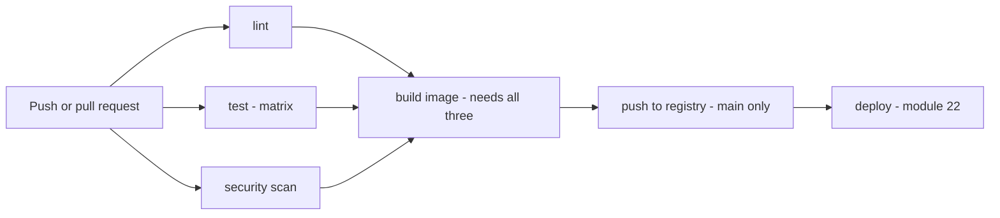
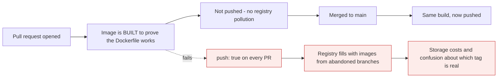

# A real pipeline

*Module 21 · Pipelines*

Module 20 built a workflow that runs tests. This one builds the pipeline you would actually put
on a production repository: parallel checks, dependency and secret scanning, a container image
built once and published, caching that works, and a set of required checks that make `main`
genuinely hard to break.

[Course home](../index.md) / Module 21

## 1. The shape



> **Why it matters:** Three cheap checks run **simultaneously**, so the gate costs the slowest of them rather than their sum. The expensive step - building and publishing an image - only happens once all three have passed, and publishing only happens on `main`. Every pull request gets the full verification; only merges produce artefacts.

## 2. The workflow, in full

```yaml
# .github/workflows/ci.yml
name: CI

on:
  push:
    branches: [main]
  pull_request:
    branches: [main]

concurrency:
  group: ci-${{ github.ref }}
  cancel-in-progress: true

permissions:
  contents: read

jobs:
  lint:
    runs-on: ubuntu-latest
    steps:
      - uses: actions/checkout@v4
      - uses: actions/setup-node@v4
        with: { node-version: '20', cache: 'npm' }
      - run: npm ci
      - run: npm run lint
      - run: npm run format:check

  test:
    runs-on: ubuntu-latest
    strategy:
      fail-fast: false
      matrix:
        node: [20, 22]
    steps:
      - uses: actions/checkout@v4
      - uses: actions/setup-node@v4
        with: { node-version: ${{ matrix.node }}, cache: 'npm' }
      - run: npm ci
      - run: npm test -- --coverage
      - name: Publish test report
        uses: dorny/test-reporter@v1
        if: always()
        with:
          name: Tests (Node ${{ matrix.node }})
          path: reports/junit.xml
          reporter: jest-junit
      - uses: codecov/codecov-action@v4
        if: matrix.node == 20

  security:
    runs-on: ubuntu-latest
    permissions:
      contents: read
      security-events: write
    steps:
      - uses: actions/checkout@v4
      - name: Dependency review
        if: github.event_name == 'pull_request'
        uses: actions/dependency-review-action@v4
      - name: Filesystem vulnerability scan
        uses: aquasecurity/trivy-action@master
        with:
          scan-type: fs
          format: sarif
          output: trivy.sarif
          severity: CRITICAL,HIGH
      - uses: github/codeql-action/upload-sarif@v3
        if: always()
        with: { sarif_file: trivy.sarif }

  build:
    needs: [lint, test, security]
    runs-on: ubuntu-latest
    permissions:
      contents: read
      packages: write
    steps:
      - uses: actions/checkout@v4
        with: { fetch-depth: 0 }

      - name: Derive version
        id: version
        run: echo "value=$(git describe --tags --always --dirty)" >> $GITHUB_OUTPUT

      - uses: docker/setup-buildx-action@v3

      - uses: docker/login-action@v3
        if: github.ref == 'refs/heads/main'
        with:
          registry: ghcr.io
          username: ${{ github.actor }}
          password: ${{ secrets.GITHUB_TOKEN }}

      - uses: docker/build-push-action@v6
        with:
          context: .
          push: ${{ github.ref == 'refs/heads/main' }}
          tags: |
            ghcr.io/${{ github.repository }}:${{ steps.version.outputs.value }}
            ghcr.io/${{ github.repository }}:${{ github.sha }}
          cache-from: type=gha
          cache-to: type=gha,mode=max
          provenance: true
```

## 3. Reading the parts that matter

| Block | Why it is there |
| --- | --- |
| `concurrency` with `cancel-in-progress` | A second push cancels the first run - saves minutes and money on busy branches |
| `permissions: contents: read` | The default token is broad. Start read-only and grant per job |
| `fail-fast: false` | See **which** matrix combinations fail, not just the first |
| `if: always()` on the report step | Publish test results even when tests failed - that is when you need them |
| `fetch-depth: 0` | `git describe` needs history - module 14 |
| `push: ${{ github.ref == ... }}` | Build on every PR, publish only from `main` |
| `cache-from/to: type=gha` | Docker layer cache across runs - the biggest single speed win |
| `provenance: true` | Signed build attestation - module 24 |



> **Why it matters:** Building on a pull request proves the Dockerfile is valid without publishing anything. Pushing only from `main` keeps the registry meaningful - every tag there corresponds to a commit that passed review and is a candidate for deployment.

## 4. Caching that actually works

| What | How | Saves |
| --- | --- | --- |
| npm / pip / Maven | `cache:` on the setup action, or `actions/cache` keyed on the lockfile | 30-90s |
| Docker layers | `cache-from: type=gha` with `cache-to: mode=max` | Minutes |
| Build output | `actions/cache` on `dist/`, `target/`, `.next/` | Varies |
| Test fixtures | `actions/cache` on the fixture directory | Varies |

```yaml
      - uses: actions/cache@v4
        with:
          path: |
            ~/.m2/repository
            target/
          key: ${{ runner.os }}-maven-${{ hashFiles('**/pom.xml') }}
          restore-keys: ${{ runner.os }}-maven-
```

> **TIP - `mode=max` for the Docker cache**
>
> The default caches only the final layer, which is nearly useless. `mode=max` caches every intermediate layer, so an unchanged dependency-install step is restored rather than re-run - which, combined with the layer ordering from the Docker course, turns a five-minute image build into thirty seconds.

## 5. Security scanning - three different questions

| Scan | Answers | Tool |
| --- | --- | --- |
| **Dependencies** | Do my libraries have known CVEs? | `dependency-review-action`, Dependabot, Snyk |
| **Code (SAST)** | Does my own code have vulnerable patterns? | CodeQL, Semgrep |
| **Secrets** | Did someone commit a credential? | Gitleaks, GitHub secret scanning |
| **Container** | Does my base image have known CVEs? | Trivy, Grype, Docker Scout |

```yaml
  codeql:
    runs-on: ubuntu-latest
    permissions: { security-events: write, contents: read }
    steps:
      - uses: actions/checkout@v4
      - uses: github/codeql-action/init@v3
        with: { languages: javascript }
      - uses: github/codeql-action/autobuild@v3
      - uses: github/codeql-action/analyze@v3
```

```yaml
  secrets:
    runs-on: ubuntu-latest
    steps:
      - uses: actions/checkout@v4
        with: { fetch-depth: 0 }
      - uses: gitleaks/gitleaks-action@v2
```

> **WARNING - Scanning finds it after it is committed**
>
> A secret-scanning job that fails a pull request is useful and it is already too late - the credential is in history (module 15) and must be rotated. The control that actually prevents the problem is **push protection**, which rejects the push at the server. Scanning is detection; push protection is prevention. Module 24 covers both.

## 6. Keeping it maintainable

Once you have four workflows they start to duplicate. Two mechanisms fix that.

**Reusable workflow** - a whole callable job:

```yaml
# .github/workflows/reusable-node-ci.yml
on:
  workflow_call:
    inputs:
      node-version: { type: string, default: '20' }
    secrets:
      NPM_TOKEN: { required: false }

jobs:
  build:
    runs-on: ubuntu-latest
    steps:
      - uses: actions/checkout@v4
      - uses: actions/setup-node@v4
        with: { node-version: ${{ inputs.node-version }}, cache: 'npm' }
      - run: npm ci && npm test
```

```yaml
# any other workflow
jobs:
  ci:
    uses: ./.github/workflows/reusable-node-ci.yml
    with: { node-version: '22' }
    secrets: inherit
```

**Composite action** - a reusable group of *steps*:

```yaml
# .github/actions/setup/action.yml
name: Setup project
runs:
  using: composite
  steps:
    - uses: actions/setup-node@v4
      with: { node-version: '20', cache: 'npm' }
    - run: npm ci
      shell: bash
```

```yaml
      - uses: ./.github/actions/setup
```

| Use | When |
| --- | --- |
| **Composite action** | The same handful of steps repeat inside jobs |
| **Reusable workflow** | An entire job repeats across workflows or repositories |

## 7. Monorepo path filtering

```yaml
on:
  pull_request:
    paths:
      - 'services/payments/**'
      - 'libs/shared/**'
      - '.github/workflows/payments.yml'
```

```yaml
  # the required-check trap from module 17, solved
  required-check:
    if: always()
    needs: [lint, test, security]
    runs-on: ubuntu-latest
    steps:
      - run: |
          if [ "${{ contains(needs.*.result, 'failure') }}" = "true" ]; then exit 1; fi
          echo "All required jobs passed or were skipped"
```

> **NOTE - Make the required check the aggregator**
>
> Set branch protection to require *this* job rather than the individual ones. It always runs, so a skipped path-filtered job never leaves a pull request waiting forever - and it still fails if any real job failed.

## 8. Making it a gate

| Branch protection setting | Effect |
| --- | --- |
| Require status checks: `lint`, `test`, `security`, `build` | Red pipeline blocks merge |
| Require branches to be up to date | Code is tested against current `main` |
| Require conversation resolution | No unanswered review comments |
| Require approvals | Module 11 |
| Include administrators | Nobody bypasses it, including you |

```bash
gh api repos/:owner/:repo/branches/main/protection --method PUT --input protection.json
```

## 9. Extra points

- **Pin third-party actions to a commit SHA**, not a tag - a tag can be moved by its owner.
  `uses: aquasecurity/trivy-action@<sha>`.
- **`${{ secrets.GITHUB_TOKEN }}` is issued per run** and expires when the job finishes - prefer
  it over a personal access token wherever it is sufficient.
- **Publish test results even on failure** with `if: always()`, otherwise the one run you need to
  inspect is the one with no report.
- **Add `timeout-minutes`** to every job. A hung job otherwise consumes six hours of runner time
  before GitHub kills it.
- **Job summaries are underused**: `echo "## Result" >> $GITHUB_STEP_SUMMARY` puts markdown
  straight onto the run page - ideal for coverage numbers and image tags.

> **PRACTICE - Practice now**
>
> 1. **Build up the workflow one job at a time.** Start from module 20's file, add `lint`, push,
>    and confirm it runs. Then add `test` and confirm they run in parallel.
> 2. **Add concurrency** and prove it works - push twice quickly and watch the first run cancel:
>    ```bash
>    gh run list
>    ```
> 3. **Add caching**, then compare two consecutive runs' durations in the Actions tab. Write both
>    numbers down.
> 4. **Add a matrix** across two versions with `fail-fast: false`, break one deliberately, and
>    confirm the other still completes.
> 5. **Add secret scanning** and prove it catches something:
>    ```bash
>    git switch -c test/secret
>    "AWS_SECRET_ACCESS_KEY=wJalrXUtnFEMIK7MDENGbPxRfiCYEXAMPLEKEY" | Set-Content .env.test
>    git add -f .env.test && git commit -m "test: fake secret"
>    git push -u origin test/secret
>    gh pr create --fill
>    ```
>    Watch the job fail, then delete the branch. **Never do this with a real credential.**
> 6. **Add the Docker build** with `push: false`, open a pull request, and confirm the image is
>    built but nothing appears in the registry.
> 7. **Merge it** and confirm the image is published:
>    ```bash
>    gh api /user/packages?package_type=container
>    ```
> 8. **Enable Docker layer caching** and compare build times before and after.
> 9. **Extract a composite action** for the setup steps and use it in two jobs.
> 10. **Make the checks required** in branch protection, then open a failing pull request and
>     confirm the merge button is disabled.

> **ASSIGNMENT - Assignment**
>
> Take a repository you own and bring it to this standard: parallel lint and test, dependency and secret scanning, a container image built on every pull request and published only from `main`, caching for both dependencies and Docker layers, an aggregated required check, and branch protection that enforces all of it including for administrators. Then record two numbers - pipeline duration before and after caching - and write one paragraph on what the pipeline still does **not** verify. That last paragraph is what an architect is expected to know without being asked.

## 10. Interview drill

<details>
<summary><b>Walk me through a production-grade CI pipeline.</b></summary>

Triggered on pushes to `main` and on pull requests, with concurrency cancelling superseded runs.
Three cheap jobs run in parallel - lint and format, a test matrix across supported runtimes, and
security scanning covering dependencies, code and secrets. A build job depends on all three and
produces the artefact or container image, tagged from `git describe` and the commit SHA, with
layer caching. The image is built on pull requests to prove the Dockerfile works but published
only from `main`. All of it is enforced by branch protection as required status checks.

</details>

<details>
<summary><b>Why build a container image on a pull request but not push it?</b></summary>

Because building proves the Dockerfile is valid and the application compiles, which is exactly
what a reviewer needs to know - while pushing would fill the registry with images from branches
that may never merge, costing storage and making it unclear which tag is a real candidate. Every
tag in the registry should correspond to a commit that passed review, so publishing is gated on
`github.ref == 'refs/heads/main'`.

</details>

<details>
<summary><b>What kinds of security scanning belong in a pipeline?</b></summary>

Four, answering different questions. Dependency scanning finds known CVEs in libraries.
Static analysis such as CodeQL or Semgrep finds vulnerable patterns in your own code. Secret
scanning finds committed credentials. Container scanning with Trivy or Grype finds CVEs in the
base image. The important caveat is that secret scanning is detection, not prevention - by the
time it fires the credential is already in history and must be rotated, so push protection at
the server is the control that actually stops it.

</details>

<details>
<summary><b>How do you avoid duplication across many workflows?</b></summary>

Composite actions for repeated groups of **steps** - checkout, set up the runtime, install
dependencies - referenced as `uses: ./.github/actions/setup`. Reusable workflows via
`workflow_call` for an entire repeated **job**, which can be shared across repositories and take
inputs and secrets. Treat workflow files as code: they belong under review, under CODEOWNERS, and
they benefit from the same refactoring as anything else.

</details>

<details>
<summary><b>In a monorepo, path filters skip a required check and the PR is stuck. Why, and how do you fix it?</b></summary>

Because branch protection waits for a named check to report, and a job skipped by a `paths:`
filter never reports at all - so the pull request blocks indefinitely. The fix is an aggregator
job with `if: always()` that depends on the real jobs, inspects their results, and fails only if
one genuinely failed. Make that aggregator the required check instead of the individual jobs.

</details>

<details>
<summary><b>What is the single biggest speed improvement in a typical pipeline?</b></summary>

Caching, in two places. Dependency caching keyed on the lockfile removes a fresh install on every
run, and Docker layer caching with `cache-to: type=gha,mode=max` removes the rebuild of unchanged
image layers - `mode=max` matters because the default caches only the final layer. Combined with
running independent jobs in parallel and ordering cheap checks first, that usually takes a
typical pipeline from double-digit minutes to single figures.

</details>

---

[← Module 20](20-github-actions-basics.md) &nbsp;&nbsp;|&nbsp;&nbsp; [Module 22: Deployment →](22-deployment.md)

---

Git & Pipelines: Zero to Architect · Himanshu Kumar.
