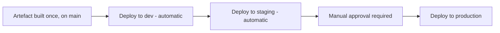
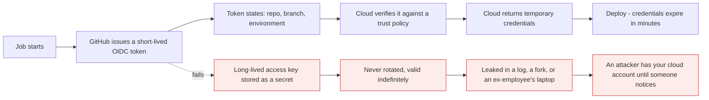
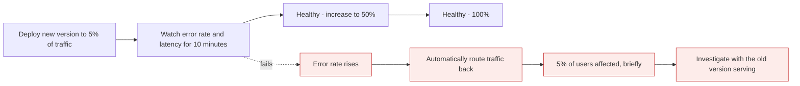
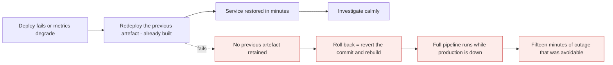

# Deployment

*Module 22 · Pipelines*

The pipeline can now prove a commit is good. This module makes it reach production - with
approvals, environment-scoped secrets, and short-lived cloud credentials instead of long-lived
keys. That last part is the single biggest security improvement most teams can make in an
afternoon.

[Course home](../index.md) / Module 22

## 1. Environments

A GitHub **environment** is a named deployment target with its own rules and secrets.



**Manual step:** *Settings → Environments → New environment.* For each one you can set:

| Setting | Effect |
| --- | --- |
| **Required reviewers** | The job **pauses** until a named person approves |
| **Wait timer** | Forced delay before deploying - a window to abort |
| **Deployment branches** | Only `main` or only tags may deploy here |
| **Environment secrets** | Values scoped to this environment only |
| **Environment variables** | Non-secret per-environment configuration |

```yaml
jobs:
  deploy-staging:
    needs: build
    runs-on: ubuntu-latest
    environment:
      name: staging
      url: https://staging.example.com
    steps:
      - run: ./deploy.sh
        env:
          API_URL: ${{ vars.API_URL }}
          DEPLOY_KEY: ${{ secrets.DEPLOY_KEY }}

  deploy-production:
    needs: deploy-staging
    runs-on: ubuntu-latest
    environment:
      name: production
      url: https://example.com
    steps:
      - run: ./deploy.sh
```

> **Why it matters:** `environment: production` is what converts a workflow into a **gate**. The job stops and waits for a human, the approval is recorded against a named person, and production secrets are only readable by jobs that declare that environment. Without it, any workflow in the repository can reach production silently.

## 2. Secrets, scoped correctly

| Scope | Visible to | Use for |
| --- | --- | --- |
| **Organisation** | Selected repositories | Shared registry credentials |
| **Repository** | Every workflow in the repo | CI-only tokens |
| **Environment** | Only jobs declaring that environment | **Production credentials** |

```bash
gh secret set DEPLOY_KEY --env production --body "..."
gh secret list --env production
gh variable set API_URL --env staging --body "https://staging.example.com"
```

> **WARNING - A repository secret is readable by every workflow**
>
> Including a workflow added in a pull request, if your triggers allow it. Anything that can reach production belongs in an **environment** secret behind required reviewers - that is the difference between "protected by policy" and "protected by configuration".

## 3. OIDC - stop storing cloud keys entirely

The most valuable thing in this module.



> **Why it matters:** A stored `AWS_SECRET_ACCESS_KEY` is a permanent credential sitting in a system many people can configure. **OIDC removes it entirely** - GitHub proves the job's identity cryptographically, the cloud issues credentials valid for minutes, and there is nothing to leak, rotate or revoke. If you do one thing from this course in production, do this.

### 3.1 AWS

**Manual steps in AWS:**

1. *IAM → Identity providers → Add provider → OpenID Connect*
2. Provider URL `https://token.actions.githubusercontent.com`, audience `sts.amazonaws.com`
3. *IAM → Roles → Create role → Web identity* → select that provider
4. Attach only the permissions the deployment needs
5. Edit the trust policy to restrict **which repository and branch** may assume it:

```json
{
  "Effect": "Allow",
  "Principal": { "Federated": "arn:aws:iam::123456789012:oidc-provider/token.actions.githubusercontent.com" },
  "Action": "sts:AssumeRoleWithWebIdentity",
  "Condition": {
    "StringEquals": {
      "token.actions.githubusercontent.com:aud": "sts.amazonaws.com",
      "token.actions.githubusercontent.com:sub": "repo:my-org/my-repo:environment:production"
    }
  }
}
```

```yaml
jobs:
  deploy:
    runs-on: ubuntu-latest
    environment: production
    permissions:
      id-token: write        # REQUIRED - without it there is no OIDC token
      contents: read
    steps:
      - uses: actions/checkout@v4
      - uses: aws-actions/configure-aws-credentials@v4
        with:
          role-to-assume: arn:aws:iam::123456789012:role/github-deploy
          aws-region: eu-west-2
      - run: aws s3 sync ./dist s3://my-bucket --delete
```

> **WARNING - The `sub` condition is the whole security boundary**
>
> `repo:my-org/my-repo:*` lets **any branch** in that repository assume the role - so anyone who can push a branch can deploy to production. Scope it to `:environment:production` or `:ref:refs/heads/main`. A wildcard `sub` is the most common OIDC misconfiguration and it silently undoes the entire benefit.

| Cloud | Action |
| --- | --- |
| AWS | `aws-actions/configure-aws-credentials@v4` |
| Azure | `azure/login@v2` with `client-id`, `tenant-id`, `subscription-id` |
| Google Cloud | `google-github-actions/auth@v2` with Workload Identity Federation |

## 4. Deployment strategies

| Strategy | How | Rollback | Cost |
| --- | --- | --- | --- |
| **Recreate** | Stop old, start new | Redeploy the old version | Downtime |
| **Rolling** | Replace instances gradually | Roll forward or back gradually | Two versions live at once |
| **Blue-green** | Two full environments, switch traffic | **Instant** - switch back | Double infrastructure |
| **Canary** | 5% of traffic, then 25%, then 100% | Route the small share away | Needs traffic control and metrics |



> **Why it matters:** The strategy is really a **blast-radius** decision. Recreate exposes 100% of users to a bad release; canary exposes 5% and gives you ten minutes of real production signal before the rest. Kubernetes gives you rolling updates by default - see that course's module 13 - and canary needs a traffic-shaping layer such as a service mesh or an ingress that supports weighting.

## 5. Rollback



> **Why it matters:** **Rollback must not require a build.** If recovery means running the pipeline again, your time-to-restore is your pipeline duration - one of the four DORA metrics from module 19, measured while users are affected. Keep the previous image tagged and deployable, and make redeploying it a one-command operation.

```yaml
  rollback:
    runs-on: ubuntu-latest
    environment: production
    steps:
      - run: ./deploy.sh --image ghcr.io/${{ github.repository }}:${{ inputs.version }}
```

```yaml
on:
  workflow_dispatch:
    inputs:
      version:
        description: Image tag to deploy
        required: true
```

## 6. Smoke tests and automatic verification

```yaml
      - name: Deploy
        run: ./deploy.sh

      - name: Smoke test
        run: |
          for i in {1..30}; do
            if curl -fsS https://example.com/healthz; then exit 0; fi
            sleep 5
          done
          exit 1

      - name: Roll back on failure
        if: failure()
        run: ./deploy.sh --image ghcr.io/${{ github.repository }}:${{ github.event.before }}
```

> **TIP - A deploy that does not verify itself is a hope**
>
> "The deploy step exited 0" only means the command ran. Hit a health endpoint, check a real response, and roll back automatically on failure. Ten lines of `curl` in a retry loop catches most bad deploys before a user does.

## 7. Deployment records

Every deployment through an environment is recorded: what was deployed, by whom, when, approved
by which reviewer, and to which URL.

```bash
gh api repos/:owner/:repo/deployments
gh run list --workflow=deploy.yml
```

| Question an auditor asks | Where the answer is |
| --- | --- |
| What is in production right now? | The deployment record's SHA and image tag |
| Who approved it? | The environment's approval record |
| When did it change? | Deployment history |
| Was it reviewed and tested? | The pull request and its required checks |

That chain - commit → PR → review → checks → build → approval → deployment - is the audit trail,
and it exists automatically once modules 11, 21 and 22 are in place.

## 8. Extra points

- **Never deploy from a laptop.** It leaves no record, uses someone's personal credentials, and
  cannot be reproduced. If a human must trigger it, use `workflow_dispatch`.
- **`permissions: id-token: write` is required for OIDC** and is the step people forget - without
  it the token request fails with a confusing error.
- **Environment protection also applies to reruns**, so re-running a production deploy requires
  approval again.
- **Deploy the digest, not the tag.** `ghcr.io/org/app@sha256:...` is immutable; a tag can be
  overwritten - the same argument as never moving a Git tag, from module 14.
- **Database migrations are the hard part.** They are not covered by rollback: make them
  backward-compatible and deploy them separately from the code that uses them.

> **PRACTICE - Practice now**
>
> 1. **Create two environments** - *Settings → Environments* - called `staging` and `production`.
>    Add yourself as a required reviewer on `production` only.
> 2. **Add environment-scoped configuration:**
>    ```bash
>    gh variable set API_URL --env staging --body "https://staging.example.com"
>    gh variable set API_URL --env production --body "https://example.com"
>    ```
> 3. **Write a deploy workflow** with two jobs using those environments, each echoing
>    `${{ vars.API_URL }}`.
> 4. **Prove the approval gate works.** Push to `main` and watch the production job **pause**.
>    Approve it in the Actions tab and watch it continue.
> 5. **Prove secret scoping.** Add a secret to `production` only, then try to read it from the
>    staging job. It is empty.
> 6. **Set up OIDC** against a cloud account you control, following section 3.1 including the
>    manual IAM steps. Then deploy something trivial - a file to a bucket.
> 7. **Prove the trust policy matters.** Temporarily widen `sub` to `repo:org/repo:*`, push a
>    branch, and confirm it can now assume the role. **Then narrow it back immediately.**
> 8. **Add a smoke test** with the retry loop from section 6, and make it fail deliberately.
>    Confirm the rollback step runs.
> 9. **Add a manual rollback workflow** with `workflow_dispatch` and a version input. Use it to
>    redeploy a previous image tag.
> 10. **Read the audit trail:**
>     ```bash
>     gh api repos/:owner/:repo/deployments
>     ```

> **ASSIGNMENT - Assignment**
>
> Build the full path for one real service: build once on `main`, deploy automatically to staging, require approval for production, use OIDC with a `sub` condition scoped to the production environment, smoke test after deploying, and provide a one-command rollback to the previous image digest. Then run the drill that matters - **deliberately deploy a broken version and time your recovery**. That number is your time-to-restore, and it is the DORA metric most teams have never actually measured rather than estimated.

## 9. Interview drill

<details>
<summary><b>What is a GitHub environment and why use one?</b></summary>

A named deployment target with its own protection rules and secrets. It can require named
reviewers, enforce a wait timer, restrict which branches may deploy to it, and hold secrets and
variables scoped so that only jobs declaring that environment can read them. It is what turns a
deploy job into an approval gate, and it produces a deployment record showing what was deployed,
by whom and with whose approval - which is the audit trail auditors ask for.

</details>

<details>
<summary><b>What is OIDC in CI, and why is it better than storing cloud keys?</b></summary>

Instead of storing a long-lived cloud access key as a secret, GitHub issues a short-lived signed
token asserting the repository, branch and environment of the running job. The cloud provider
verifies it against a trust policy and returns temporary credentials valid for minutes. There is
no permanent credential to leak, rotate or revoke, and access can be scoped so only a specific
repository, branch or environment can assume the role. It is the single highest-value security
change most pipelines can make.

</details>

<details>
<summary><b>What is the most common OIDC misconfiguration?</b></summary>

A `sub` condition that is too broad - typically `repo:org/repo:*`, which lets **any** branch in
that repository assume the deployment role. Since most repositories allow anyone to push a
branch, that is effectively production access for the whole team and anyone who can open a fork
workflow. Scope it to `:environment:production` or `:ref:refs/heads/main`. Forgetting
`permissions: id-token: write` is the other frequent problem, though that one fails loudly rather
than silently.

</details>

<details>
<summary><b>Compare deployment strategies.</b></summary>

Recreate stops the old version and starts the new one - simple, with downtime, and 100% blast
radius. Rolling replaces instances gradually, so there is no downtime but two versions run
simultaneously and must be compatible. Blue-green runs two complete environments and switches
traffic, giving instant rollback at the cost of double infrastructure. Canary sends a small
percentage of traffic to the new version and increases it while watching metrics, which gives the
smallest blast radius but requires traffic shaping and good observability. The choice is
fundamentally about how many users a bad release should be allowed to reach.

</details>

<details>
<summary><b>What makes a good rollback?</b></summary>

That it does not require a build. The previous artefact should already exist, tagged and
deployable, so recovery is a single command that redeploys it - ideally by immutable digest
rather than a tag. If rolling back means reverting a commit and running the pipeline again, your
time to restore is your pipeline duration, measured while users are affected. The exception is
database migrations, which rollback does not cover: they must be backward-compatible and deployed
separately from the code that depends on them.

</details>

<details>
<summary><b>Why should nobody deploy from a laptop?</b></summary>

Because there is no record of what was deployed or by whom, it uses an individual's personal
credentials rather than a scoped identity, it cannot be reproduced, and it bypasses every gate -
review, required checks and approvals. Deploying only from CI means every deployment has an
artefact, a commit, an approver and a timestamp. If a human needs to initiate it, that is what
`workflow_dispatch` with an environment approval is for.

</details>

---

[← Module 21](21-real-pipeline.md) &nbsp;&nbsp;|&nbsp;&nbsp; [Module 23: GitOps and release engineering →](23-gitops.md)

---

Git & Pipelines: Zero to Architect · Himanshu Kumar.
