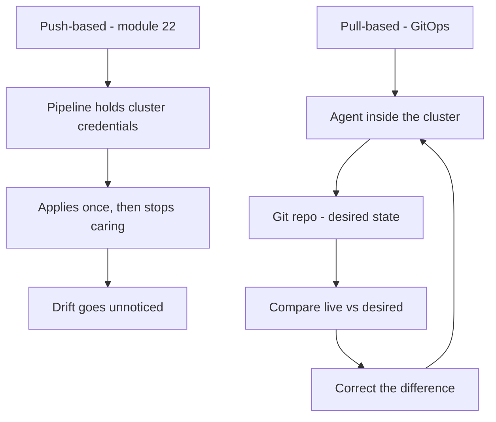
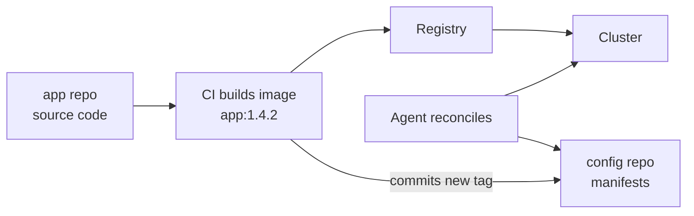
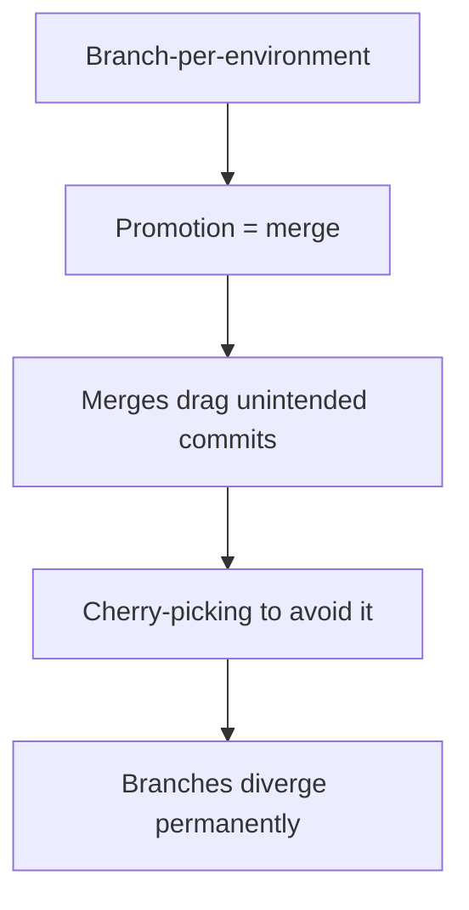
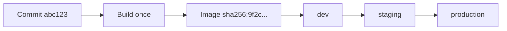
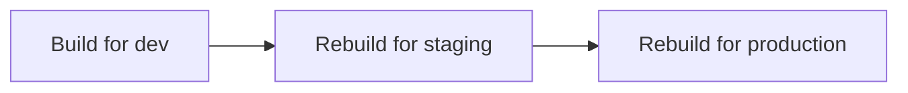
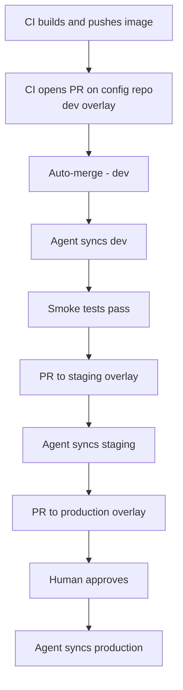
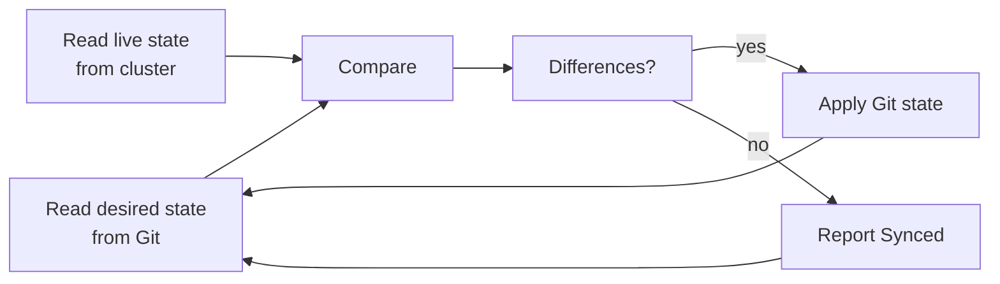

# GitOps and release engineering

*Module 23 · Pipelines*

Module 22 pushed to production. That is **push-based** delivery: the pipeline holds credentials
and reaches into the cluster. GitOps inverts it - the cluster pulls its own desired state from
Git, and Git becomes the only place anyone changes anything. This module covers that inversion,
and the release engineering around it: how a version is promoted from dev to production without
ever being rebuilt.

[Course home](../index.md) / Module 23

## 1. What GitOps actually is

GitOps is four rules. Everything else is tooling.

| Rule | Meaning |
| --- | --- |
| **Declarative** | The system is described by state, not by steps |
| **Versioned** | That description lives in Git, immutable and auditable |
| **Pulled automatically** | Agents fetch approved state - nobody pushes into the cluster |
| **Continuously reconciled** | Agents correct drift, forever, without being asked |

The fourth rule is the one people miss. A pipeline **applies** state once and stops caring. A
reconciler compares desired state to live state on a loop and fixes the difference every time.



> **Why it matters:** In the push model the pipeline must hold **write credentials to production**, and the cluster's real state can drift from your Git repo without anyone noticing. In the pull model the credentials never leave the cluster, the firewall stays closed inbound, and drift is corrected automatically. The repository stops being a record of what you *intended* and becomes a description of what is *actually running*.

## 2. Config lives in its own repository

The single most important structural decision: **application code and deployment config are
separate repositories.**



| Concern | App repo | Config repo |
| --- | --- | --- |
| Contains | Source, tests, Dockerfile | Manifests, Helm values, Kustomize overlays |
| Changes when | A feature changes | A deployment changes |
| Reviewed by | Developers | Developers **and** platform/ops |
| History answers | "Why is the code like this?" | "What was running on 4 March?" |

> **Why it matters:** If manifests sit in the app repo, every deployment change is also a code commit, and every code commit looks like a deployment change. You cannot answer "what changed in production last Tuesday?" without reading through unrelated feature work. Separating them means the config repo's history *is* your deployment history - `git log` on that repo is the audit trail.

> **NOTE - This is not a rule about repository count**
>
> Some teams use one config repo per environment, some use one repo with a folder per
> environment. Both work. What does not work is mixing config into the app repo, because then
> the two histories are entangled and neither is readable on its own.

## 3. Environments as folders, not branches

The common first design is a branch per environment - `dev`, `staging`, `production`. It looks
natural and it fails.



Folder-per-environment on a single branch instead:

```
config-repo/
  base/
    deployment.yaml
    service.yaml
    kustomization.yaml
  overlays/
    dev/
      kustomization.yaml
      replicas.yaml
    staging/
      kustomization.yaml
    production/
      kustomization.yaml
      replicas.yaml
      hpa.yaml
```

```yaml
# overlays/production/kustomization.yaml
resources:
  - ../../base
patches:
  - path: replicas.yaml
  - path: hpa.yaml
images:
  - name: myapp
    newTag: 1.4.2
```

Promotion is then a one-line change to one file:

```bash
cd overlays/production
kustomize edit set image myapp=myapp:1.4.2
git commit -am "promote myapp 1.4.2 to production"
```

| | Branch per environment | Folder per environment |
| --- | --- | --- |
| Promotion | Merge - carries everything | Edit one tag |
| Diff between envs | Compare branches, noisy | Compare folders, exact |
| Drift | Branches diverge silently | Visible in one tree |
| Review | "What is in this merge?" | One line |

> **Why it matters:** Promotion should move **one thing** - a version - and a merge cannot do that. It moves every commit since the last merge. Within a month someone cherry-picks to work around it, the branches diverge, and nobody can say what production has that staging does not.

## 4. Build once, promote the artefact

The release engineering rule that everything else depends on:

> **An artefact is built exactly once and promoted unchanged through every environment.**



What must **not** happen:



> **WARNING - Rebuilding per environment invalidates all your testing**
>
> Between the staging build and the production build, a transitive dependency published a
> patch, a base image moved, or a build tool updated. The bytes differ. Everything you verified
> in staging was verified against an artefact that no longer exists. This is the source of the
> genuinely unexplainable "worked in staging" incident.

Environment differences belong in **configuration injected at runtime**, never in the artefact:

| Belongs in the image | Belongs in config |
| --- | --- |
| Application code | Database URL |
| Dependencies | Feature flags |
| Runtime | Replica count |
| Entrypoint | Log level, resource limits |

**Reference images by digest, not tag**, in production:

```yaml
image: myapp@sha256:9f2c1a7e4b...   # immutable
# image: myapp:1.4.2                # a tag can be repointed
```

> **TIP - A tag is a pointer, a digest is the content**
>
> Anyone with registry write access can move `1.4.2` to different bytes. A digest cannot be
> moved - it *is* the bytes. Use tags for humans, digests for production manifests.

## 5. The promotion pipeline

Promotion is a commit to the config repo. That means it goes through review and required checks
like any other change.



```yaml
name: Promote to dev
on:
  workflow_run:
    workflows: ["Build"]
    types: [completed]

jobs:
  promote:
    if: github.event.workflow_run.conclusion == 'success'
    runs-on: ubuntu-latest
    steps:
      - name: Check out config repo
        uses: actions/checkout@v4
        with:
          repository: myorg/config-repo
          token: ${{ secrets.CONFIG_REPO_TOKEN }}

      - name: Update dev image tag
        run: |
          cd overlays/dev
          kustomize edit set image myapp=myapp:${{ github.sha }}

      - name: Open promotion PR
        uses: peter-evans/create-pull-request@v6
        with:
          token: ${{ secrets.CONFIG_REPO_TOKEN }}
          branch: promote-dev-${{ github.sha }}
          title: "promote myapp ${{ github.sha }} to dev"
          commit-message: "promote myapp ${{ github.sha }} to dev"
```

> **Why it matters:** A pull request on the config repo means the promotion has a diff, a reviewer, required checks and a merge commit. "Who put this in production and when?" is answered by `git log`, not by a chat search. Auto-merge for dev, required approval for production - same mechanism, different rules.

> **PRACTICE - Practice now**
>
> 1. Create a folder `gitops-demo/` with `base/` and `overlays/dev`, `overlays/production`.
> 2. Put a `deployment.yaml` in `base/` with `image: myapp:1.0.0` and `replicas: 1`.
> 3. In `overlays/production/kustomization.yaml`, patch replicas to `3` and set the image tag.
> 4. Run `kustomize build overlays/dev` and `kustomize build overlays/production`. Diff the two
>    outputs - that difference is the entire delta between your environments.
> 5. Commit. Now change **only** the production image tag and commit again.
> 6. Run `git log -p overlays/production/` - that output is your production deployment history.

## 6. Reconciliation, drift and self-healing

The agent runs a loop:



| State | Meaning |
| --- | --- |
| **Synced** | Live matches Git |
| **OutOfSync** | Live differs - Git has not been applied, or someone changed the cluster |
| **Healthy** | Resources are actually running correctly |
| **Degraded** | Applied, but failing - crash loops, failed probes |

> **NOTE - Synced and Healthy are different questions**
>
> Synced means "the cluster has what Git says." Healthy means "it works." A deployment can be
> perfectly Synced and completely Degraded, because Git said to run an image that crashes on
> start. Your alerting needs both.

**Self-healing** means the agent reverts manual changes. Somebody runs `kubectl scale` at 2am
to survive an incident; within the sync interval the agent scales it back, because Git still
says otherwise.

> **WARNING - Self-healing will undo your emergency fix**
>
> This is correct behaviour and it surprises everyone once. During an incident either commit
> the change to Git, or explicitly pause reconciliation for that application. Fixing it live and
> walking away means the fix disappears - usually after the responder has gone back to sleep.

## 7. Rollback in GitOps

Rollback is `git revert`. The desired state goes back, the agent reconciles, the previous
version returns.

```bash
git revert <promotion-commit> --no-edit
git push
```

| Approach | Result |
| --- | --- |
| `git revert` | New commit undoing the change - history intact, agent syncs |
| `git reset --hard` + force push | Rewrites shared history - breaks every clone and the agent's view |
| Manual `kubectl` rollback | Works for minutes, then self-healing undoes it |

> **Why it matters:** Because the artefact was never rebuilt, rollback needs no build. Reverting the commit points the manifest at a digest that already exists in the registry and is already known-good. Time to restore is a revert plus a sync interval - typically under two minutes, with a permanent record of both the break and the fix.

## 8. Secrets in a Git-based world

You cannot commit plaintext secrets to a repository whose whole purpose is being readable. Three
workable answers:

| Approach | How it works | Trade-off |
| --- | --- | --- |
| **Sealed Secrets** | Encrypt with a cluster public key; only that cluster can decrypt | Encrypted blob is safe in Git; tied to one cluster's key |
| **SOPS + age/KMS** | Encrypt values, not keys - diffs stay readable | Key management is on you |
| **External Secrets Operator** | Git holds a *reference*; operator fetches from a vault | No secret in Git at all; needs a vault |

```yaml
# External Secrets - Git stores a pointer, never a value
apiVersion: external-secrets.io/v1beta1
kind: ExternalSecret
metadata:
  name: db-credentials
spec:
  secretStoreRef:
    name: aws-secrets-manager
    kind: ClusterSecretStore
  target:
    name: db-credentials
  data:
    - secretKey: password
      remoteRef:
        key: prod/db/password
```

> **TIP - Prefer the reference model where you can**
>
> Encrypted-in-Git means the ciphertext is public forever. If the key leaks in 2029, every
> secret ever committed is retroactively exposed - and rotation does not help, because the old
> ciphertext is still in history. A reference to a vault has nothing to decrypt later.

## 9. Release engineering: versions and freezes

| Concept | Practice |
| --- | --- |
| **Version source** | The Git tag - `v1.4.2` - not a file someone edits |
| **Traceability** | Image label carries the commit SHA and tag |
| **Release notes** | Generated from conventional commits (module 13) |
| **Freeze** | A branch protection rule, not an email |

```dockerfile
ARG VERSION
ARG COMMIT
LABEL org.opencontainers.image.version=$VERSION \
      org.opencontainers.image.revision=$COMMIT \
      org.opencontainers.image.source=https://github.com/myorg/myapp
```

```bash
docker inspect myapp:1.4.2 --format '{{json .Config.Labels}}'
```

> **Why it matters:** During an incident the first question is "which commit is this?" With labels it is one command against the running image. Without them it is guesswork against a registry tag that may have been repointed.

> **ASSIGNMENT - Assignment**
>
> Build a promotion trail you can actually read.
>
> 1. Create a config repo with `base/` plus `dev`, `staging` and `production` overlays.
> 2. Add a GitHub Actions workflow that, on push to the app repo, opens a PR bumping only the
>    dev overlay's image tag. Enable auto-merge on it.
> 3. Add a manual `workflow_dispatch` workflow that promotes the tag currently in dev to
>    staging, and another that promotes staging to production behind an environment approval.
> 4. Promote a version all the way through. Then `git log --oneline overlays/production/`.
> 5. Now revert the production promotion commit and confirm the diff points back at the
>    previous digest.
> 6. Write down: how long did rollback take, and how much of it was a build? The answer should
>    be "none."

## 10. Interview drill

<details>
<summary><b>What is GitOps, in one answer?</b></summary>

A model where the desired state of a system is declared in Git and an agent running inside the
target environment continuously pulls that state and reconciles the live system against it. The
distinguishing features are the pull direction - the pipeline never holds cluster credentials -
and continuous reconciliation, which means drift is corrected automatically rather than
discovered during an incident. Git stops being a record of intent and becomes a description of
what is actually running.

</details>

<details>
<summary><b>Why separate the config repo from the app repo?</b></summary>

So the two histories stay readable. The config repo's log becomes the deployment history: every
commit is a real change to what is running, reviewable on its own and often by a different set of
owners. If manifests live with the code, deployment changes and feature changes interleave, and
answering "what changed in production last week?" means filtering unrelated commits. It also
avoids the loop where CI commits a new image tag back into the repo that CI watches.

</details>

<details>
<summary><b>Why folders per environment rather than branches?</b></summary>

Because promotion should move one thing - a version - and a merge cannot do that. Merging
staging into production carries every commit made since the last merge, so people start
cherry-picking to control it, the branches permanently diverge, and the diff between
environments becomes unreadable. With overlays, promotion is a one-line image tag change, and
comparing environments is a diff of two folders on the same branch.

</details>

<details>
<summary><b>Why build once and promote the same artefact?</b></summary>

Because rebuilding produces different bytes. Dependencies resolve differently, base images move,
build tools update. If production runs a different binary from the one staging tested, every
result from staging is void - and the resulting incident is genuinely unexplainable, because the
thing you tested no longer exists. Environment differences belong in runtime configuration, and
production manifests should reference an immutable digest rather than a tag, since a tag can be
repointed.

</details>

<details>
<summary><b>What is drift, and how does GitOps handle it?</b></summary>

Drift is any difference between the state declared in Git and the state actually running,
usually caused by someone changing the cluster directly. A reconciler detects it on every sync
and re-applies the Git state, which is self-healing. The trade-off is that an emergency manual
fix will be reverted within the sync interval, so during an incident you either commit the fix or
explicitly pause reconciliation for that application - anything else disappears silently, often
after the responder has stood down.

</details>

<details>
<summary><b>Synced but broken - what is happening?</b></summary>

Sync status answers "does the cluster have what Git says?" while health status answers "is it
working?" A deployment can be fully Synced and Degraded because Git declares an image that
crash-loops, fails its readiness probe or cannot pull. They are separate signals and alerting
needs both; treating Synced as success means a successful deployment of a broken release looks
green.

</details>

<details>
<summary><b>How do you handle secrets when the repo is the source of truth?</b></summary>

Either encrypt before committing - Sealed Secrets, or SOPS with a KMS or age key - or, better,
store only a reference and let an operator fetch the real value from a vault at runtime. The
argument for references is history: an encrypted value committed today stays in history forever,
so a key compromise years later retroactively exposes it, and rotating the secret does not
change the old ciphertext. A reference has nothing to decrypt later.

</details>

<details>
<summary><b>How does rollback work, and why is it fast?</b></summary>

Revert the promotion commit and push. The agent sees the previous desired state and reconciles.
It is fast because no build is involved - the manifest points at a digest that already exists in
the registry and has already been verified. Never roll back with a force push, because that
rewrites shared history, and never with a manual cluster command, because self-healing will undo
it.

</details>

<details>
<summary><b>Where does GitOps not fit?</b></summary>

It assumes a declarative target with a reconciling agent, which is why it maps naturally to
Kubernetes and awkwardly to imperative systems. Database migrations do not reconcile - they are
one-way and must be handled separately, backward-compatibly, and deployed ahead of the code that
depends on them. It also adds real operational surface: the agent itself must be deployed,
upgraded and monitored, and for a small system with one environment the push model in module 22
is often the honest answer.

</details>

---

[← Module 22](22-deployment.md) &nbsp;&nbsp;|&nbsp;&nbsp; [Module 24: Securing the repo and supply chain →](24-securing-supply-chain.md)
