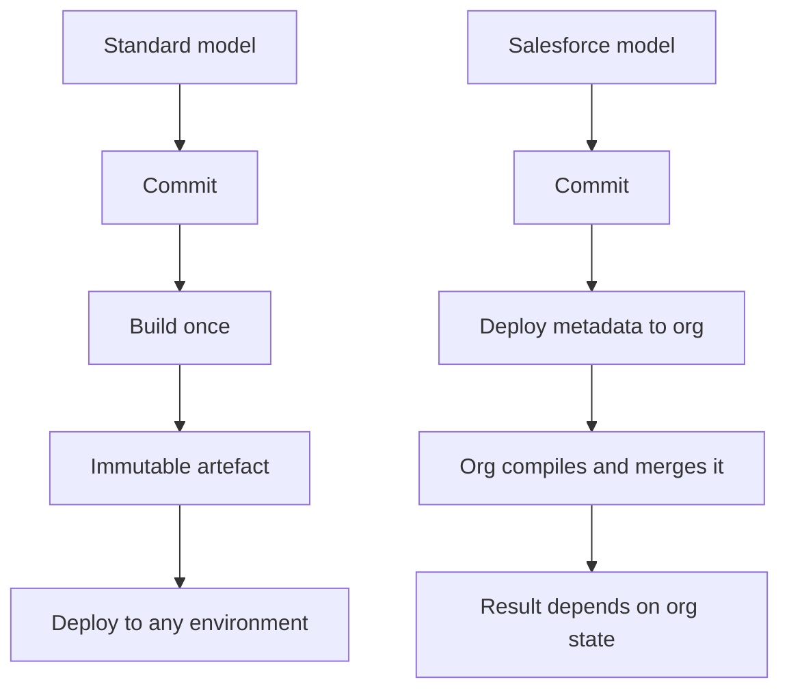
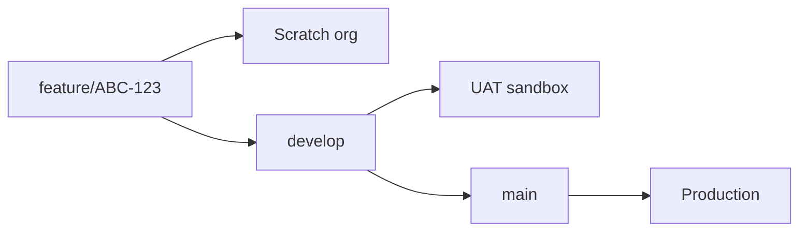
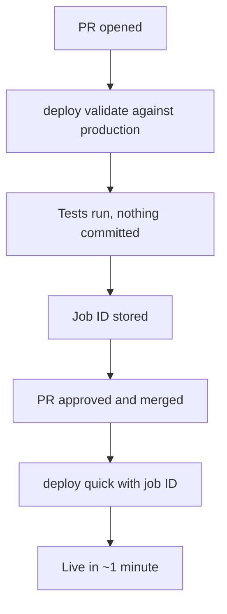
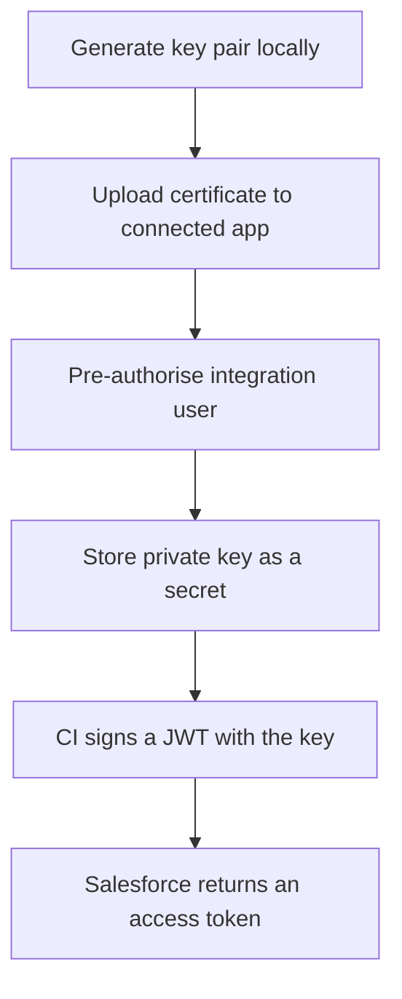
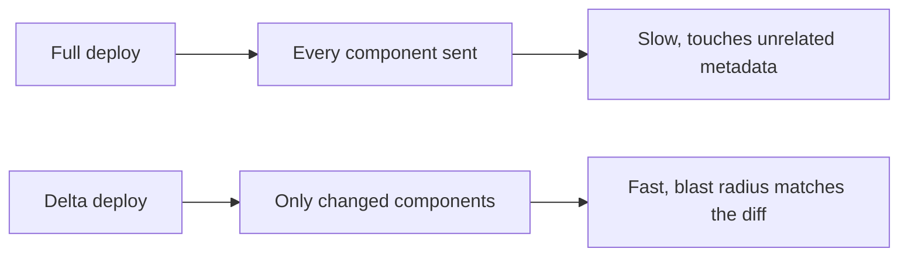
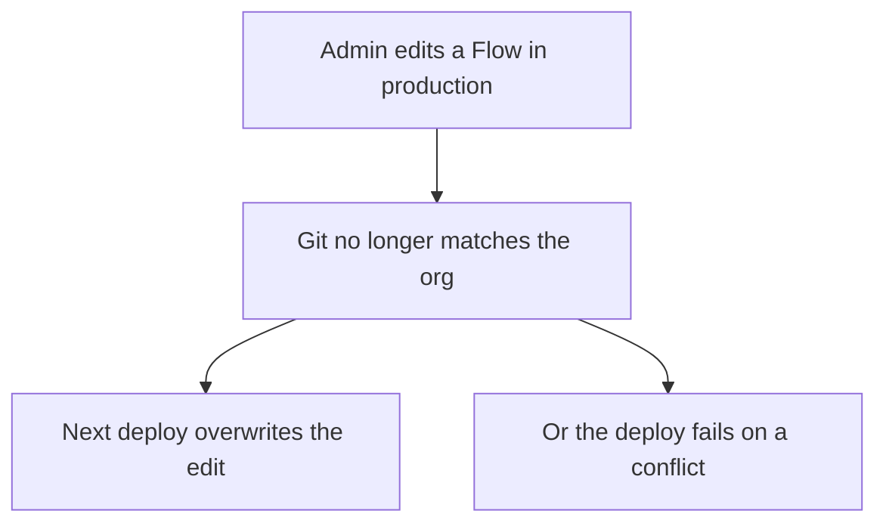
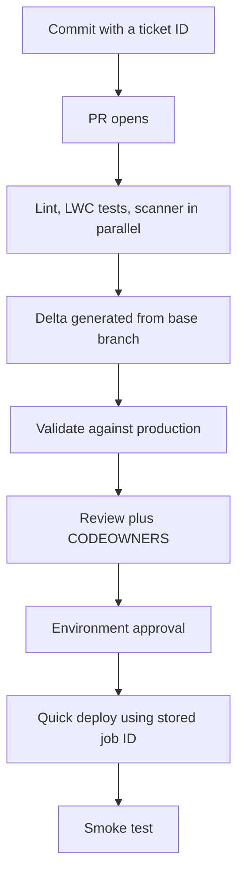

# Git and pipelines for Salesforce

*Module 25 · Applied*

Everything so far assumed a normal repository: source code in, artefact out, artefact deployed.
Salesforce breaks two of those assumptions. There is no artefact, and the "environment" is a
stateful org that already contains data, configuration and changes somebody made in the UI this
morning. This module takes the whole course and applies it to that reality.

[Course home](../index.md) / Module 25

## 1. What is genuinely different

| Normal application | Salesforce |
| --- | --- |
| Build produces an artefact | **No artefact** - metadata is deployed, then compiled by the org |
| Environments are disposable | Orgs are long-lived and stateful |
| Config injected at runtime | Config *is* metadata, and differs per org |
| Deploy replaces everything | Deploy is a **partial merge** into existing state |
| Rollback = redeploy old artefact | **There is no rollback** - only a forward deploy |
| All changes come from Git | Changes also come from the **UI**, by admins, in production |



> **Why it matters:** Module 23's rule - build once, promote the same artefact - **cannot be applied literally**. The same metadata deployed to two orgs can produce two different outcomes, because the orgs contain different existing metadata, different picklist values, and different data that validation rules run against. Everything you do in Salesforce CI is an attempt to reduce that gap, not eliminate it.

> **NOTE - "There is no rollback" is the sentence to remember**
>
> A metadata deploy is not transactional across a release. If you deploy twenty components and
> discover a problem an hour later, recovery means deploying the previous version *forward* -
> and deletions, field type changes and picklist removals often will not go backwards at all.
> Module 22's rollback story is replaced by "make the forward path fast and the change small."

## 2. What goes in the repository

The repository is source-format metadata, not a change set.

```
force-app/main/default/
  classes/
    AccountService.cls
    AccountService.cls-meta.xml
  lwc/
    accountCard/
  objects/
    Account/
      fields/
        Region__c.field-meta.xml
  flows/
  permissionsets/
manifest/
  package.xml
  destructiveChanges.xml
config/
  project-scratch-def.json
sfdx-project.json
.forceignore
```

| Commit it | Do not commit it |
| --- | --- |
| Apex, LWC, Aura, triggers | `.sfdx/`, `.sf/` - local auth state |
| Objects, fields, layouts | `.env`, JWT private keys, certificates |
| Flows, permission sets | Retrieved profiles in full |
| `sfdx-project.json`, `.forceignore` | Anything containing an org ID or session |

```
# .gitignore
.sfdx/
.sf/
.localdevserver/
*.log
server.key
*.jks
.env
```

> **WARNING - Never commit `server.key` or any certificate**
>
> The JWT private key in section 5 authenticates as an integration user with deploy rights to
> production. Committing it hands over the org. This is exactly what module 24's push protection
> exists for - and it is worth adding a local `pre-commit` hook (module 16) that rejects `*.key`
> outright.

**`.forceignore` is where most repositories go wrong:**

```
# .forceignore
**/jsconfig.json
**/.eslintrc.json
**/profiles/**
**/settings/**
**/*.profile-meta.xml
**/standardValueSet/**
```

> **TIP - Ignore profiles, use permission sets**
>
> Profiles retrieve differently depending on what else exists in the org, so they produce enormous, unstable diffs that conflict on every branch and tell you nothing. Put access in **permission sets**, which are self-contained and diff cleanly. This single change removes most of the merge pain teams blame on Git.

## 3. Org strategy and branching

Map module 12's branching strategy onto orgs.



| Branch | Org | Deploy trigger |
| --- | --- | --- |
| `feature/*` | Scratch org or dev sandbox | On push - **validate only** |
| `develop` | Integration sandbox | On merge - deploy + tests |
| `release/*` | UAT / full sandbox | On merge - deploy + full tests |
| `main` | Production | On merge - deploy, with approval |

> **Why it matters:** The org is the environment, so branch strategy and sandbox strategy are the same decision. Teams that pick a branching model without mapping it to orgs end up with a `develop` branch nobody can test, because there is no org that reflects it.

> **NOTE - Scratch orgs are the closest thing to a disposable environment**
>
> They are created from `project-scratch-def.json` plus your source, so they contain only what
> Git says. That makes them the only place where "the repository is the source of truth" is
> literally true - and the only reliable way to catch metadata that exists in your sandbox but
> was never committed.

## 4. The `sf` CLI commands that matter

```bash
# Authenticate (interactive, local only)
sf org login web --alias devhub --set-default-dev-hub
sf org list

# Scratch orgs
sf org create scratch --definition-file config/project-scratch-def.json \
  --alias ci-org --duration-days 1 --wait 20
sf org delete scratch --target-org ci-org --no-prompt

# Push and pull (scratch orgs only - source tracking)
sf project deploy start --target-org ci-org
sf project retrieve start --target-org ci-org

# Deploy and validate (sandboxes and production)
sf project deploy start --target-org uat --test-level RunLocalTests
sf project deploy validate --target-org prod --test-level RunLocalTests
sf project deploy quick --job-id <id> --target-org prod

# Tests
sf apex run test --target-org ci-org --test-level RunLocalTests \
  --code-coverage --result-format json --wait 30

# Static analysis
sf scanner run --target force-app --format sarif --outfile scan.sarif
```

| Command | What it does | Where you use it |
| --- | --- | --- |
| `deploy start` | Deploys **and commits** the change | Sandboxes, and production after validation |
| `deploy validate` | Runs the whole deploy and tests, **commits nothing** | On every pull request |
| `deploy quick` | Commits a previously validated deploy | Production, within 10 days of validation |
| `retrieve start` | Pulls metadata from an org into source format | Capturing UI changes |

> **Why it matters:** `deploy validate` plus `deploy quick` is the closest Salesforce gets to module 23's "build once, promote". Validation runs the entire deployment including tests against production without committing anything; the quick deploy then applies the already-verified result in a fraction of the time. A release that would take 90 minutes of tests during the change window takes about a minute.



> **WARNING - A validation expires and can be invalidated**
>
> A quick deploy is only valid for 10 days, and only if nothing else changed the org in the
> meantime. If an admin deploys or edits metadata after your validation, the quick deploy is
> rejected and you must validate again. That is the stateful-environment problem in one
> sentence.

## 5. Authentication in CI - JWT

CI cannot open a browser. Use the **JWT bearer flow** with a connected app.



**Manual steps - one-time setup per org:**

1. Generate the key pair locally:

```bash
openssl req -x509 -sha256 -nodes -days 730 -newkey rsa:2048 \
  -keyout server.key -out server.crt \
  -subj "/CN=ci-deploy"
```

2. *Setup → App Manager → New Connected App.*
   - Enable OAuth Settings, callback URL `http://localhost:1717/OauthRedirect`
   - Scopes: **Manage user data via APIs (api)**, **Perform requests at any time
     (refresh_token, offline_access)**
   - **Use digital signatures** → upload `server.crt`
3. *Manage → Edit Policies → Permitted Users → **Admin approved users are pre-authorised***.
4. *Manage → Manage Profiles / Permission Sets* → add the integration user's permission set.
5. Copy the **Consumer Key**.
6. Store secrets - module 22 rules apply, so these belong to an **environment**:

```bash
gh secret set SF_CONSUMER_KEY --env production --body "3MVG9..."
gh secret set SF_USERNAME     --env production --body "ci@example.com"
gh secret set SF_JWT_KEY      --env production < server.key
```

```yaml
- name: Authenticate to Salesforce
  run: |
    echo "${{ secrets.SF_JWT_KEY }}" > server.key
    sf org login jwt \
      --client-id "${{ secrets.SF_CONSUMER_KEY }}" \
      --jwt-key-file server.key \
      --username "${{ secrets.SF_USERNAME }}" \
      --instance-url https://login.salesforce.com \
      --alias target
    rm -f server.key
```

> **TIP - Use a dedicated integration user, not a person**
>
> A named admin's credentials break when they change role or leave, and every deployment is
> attributed to a human who did not perform it. A dedicated integration user with a permission
> set scoped to deployment gives you a clean audit trail and a credential you can revoke without
> affecting anybody's access.

> **WARNING - Sandboxes use a different login host**
>
> `--instance-url https://test.salesforce.com` for sandboxes, `https://login.salesforce.com` for
> production and developer orgs. Using the wrong one produces an authentication error that looks
> like a bad key, and people rotate a perfectly good certificate chasing it.

## 6. The pull request pipeline

```yaml
name: PR validation

on:
  pull_request:
    branches: [develop, main]

permissions:
  contents: read

jobs:
  static-analysis:
    runs-on: ubuntu-latest
    steps:
      - uses: actions/checkout@v4
      - run: npm ci
      - run: npm run lint
      - name: Prettier check
        run: npx prettier --check "force-app/**/*.{cls,trigger,js,html,cmp}"

  lwc-tests:
    runs-on: ubuntu-latest
    steps:
      - uses: actions/checkout@v4
      - run: npm ci
      - run: npm run test:unit:coverage

  apex-scanner:
    runs-on: ubuntu-latest
    steps:
      - uses: actions/checkout@v4
      - run: npm install -g @salesforce/cli
      - run: sf plugins install @salesforce/sfdx-scanner
      - run: sf scanner run --target force-app --format sarif --outfile scan.sarif
      - uses: github/codeql-action/upload-sarif@v3
        with:
          sarif_file: scan.sarif

  validate-deploy:
    runs-on: ubuntu-latest
    needs: [static-analysis, lwc-tests, apex-scanner]
    environment: validation
    steps:
      - uses: actions/checkout@v4
        with:
          fetch-depth: 0

      - run: npm install -g @salesforce/cli

      - name: Authenticate
        run: |
          echo "${{ secrets.SF_JWT_KEY }}" > server.key
          sf org login jwt --client-id "${{ secrets.SF_CONSUMER_KEY }}" \
            --jwt-key-file server.key \
            --username "${{ secrets.SF_USERNAME }}" \
            --instance-url https://login.salesforce.com --alias target
          rm -f server.key

      - name: Validate
        run: |
          sf project deploy validate --target-org target \
            --source-dir force-app \
            --test-level RunLocalTests \
            --wait 60
```

> **NOTE - `fetch-depth: 0` again**
>
> Module 20 flagged it and module 25 needs it, because delta deployment compares your branch to
> the base branch. The default shallow clone has no common ancestor, so the diff is either empty
> or everything.

## 7. Delta deployments

Deploying the whole `force-app` every time is slow and touches metadata your change never
mentioned. Deploy only what changed.

```bash
sf plugins install sfdx-git-delta

sf sgd source delta \
  --from origin/main \
  --to HEAD \
  --output-dir delta \
  --generate-delta
```

This produces `delta/package/package.xml` (changed and added) and
`delta/destructiveChanges/destructiveChanges.xml` (deleted).

```yaml
- name: Generate delta
  run: |
    sf sgd source delta --from origin/${{ github.base_ref }} \
      --to HEAD --output-dir delta --generate-delta

- name: Deploy delta
  run: |
    if [ -s delta/package/package.xml ]; then
      sf project deploy start --target-org target \
        --manifest delta/package/package.xml \
        --test-level RunSpecifiedTests \
        --tests $(cat tests.txt) --wait 60
    else
      echo "No metadata changes"
    fi
```



> **Why it matters:** A delta deploy makes the deployment match the pull request. If the PR changed three classes, three classes move - so when something breaks, the list of suspects is the diff you already reviewed. A full deploy makes every release a whole-org event regardless of how small the change was.

> **WARNING - Destructive changes are applied, and they are not reversible**
>
> `--generate-delta` will happily generate a destructive manifest from a deleted file. Deleting a
> field deletes its **data**. Review the destructive manifest as carefully as the code, and
> consider requiring a separate approval for any release that contains one.

## 8. Tests and coverage

Salesforce enforces 75% org-wide coverage on production deploys - which is a floor, not a goal.

| Test level | Runs | Use for |
| --- | --- | --- |
| `NoTestRun` | Nothing | Sandboxes only, never production |
| `RunSpecifiedTests` | Named classes | Delta deploys - fast |
| `RunLocalTests` | All tests except managed packages | **Production default** |
| `RunAllTestsInOrg` | Everything including packages | Rare, very slow |

```bash
sf apex run test --target-org target \
  --test-level RunLocalTests --code-coverage \
  --result-format json --output-dir test-results --wait 60
```

```yaml
- uses: actions/upload-artifact@v4
  if: always()
  with:
    name: apex-test-results
    path: test-results/
```

> **NOTE - `if: always()` is what makes failures diagnosable**
>
> Without it, the upload step is skipped when tests fail - which is precisely the run whose
> results you need. This is the single most useful line in a Salesforce CI file.

> **TIP - Coverage is not the number to defend**
>
> `@isTest(SeeAllData=false)`, meaningful assertions, and `Test.startTest()` around the code under
> test matter more than the percentage. A test with no assertion still produces coverage - and
> teams that optimise the number end up with a suite that passes while the feature is broken.

> **PRACTICE - Practice now**
>
> 1. In a repo with `sfdx-project.json`, run `sf sgd source delta --from HEAD~1 --to HEAD
>    --output-dir delta --generate-delta`.
> 2. Open `delta/package/package.xml`. Confirm it lists only what your last commit touched.
> 3. Delete a custom field file, commit, and regenerate the delta. Look at
>    `destructiveChanges.xml` - that file would delete the field **and its data**.
> 4. Add `**/profiles/**` to `.forceignore`, retrieve metadata, and compare the diff size to
>    before.
> 5. Run `sf project deploy validate --target-org <sandbox> --test-level RunLocalTests` and note
>    the elapsed time. That is what a quick deploy saves you during the change window.

## 9. The change that did not come from Git

The problem no other module has: someone edits metadata directly in production.



| Control | Effect |
| --- | --- |
| Remove `Modify All Data` / `Customize Application` in production | Most edits become impossible |
| Scheduled `retrieve` + diff job | Drift is detected within a day |
| *Setup Audit Trail* export | Who changed what, and when |
| Change intake process | Emergency changes get back-ported deliberately |

```yaml
name: Drift detection
on:
  schedule:
    - cron: "0 6 * * 1-5"

jobs:
  detect:
    runs-on: ubuntu-latest
    environment: production-readonly
    steps:
      - uses: actions/checkout@v4
      - run: npm install -g @salesforce/cli
      - name: Authenticate
        run: |
          echo "${{ secrets.SF_JWT_KEY }}" > server.key
          sf org login jwt --client-id "${{ secrets.SF_CONSUMER_KEY }}" \
            --jwt-key-file server.key --username "${{ secrets.SF_USERNAME }}" \
            --instance-url https://login.salesforce.com --alias prod
          rm -f server.key
      - name: Retrieve and diff
        run: |
          sf project retrieve start --target-org prod --manifest manifest/package.xml
          git diff --exit-code || echo "DRIFT_DETECTED=true" >> $GITHUB_ENV
      - name: Open drift issue
        if: env.DRIFT_DETECTED == 'true'
        run: gh issue create --title "Production drift detected" --body "See workflow run."
        env:
          GH_TOKEN: ${{ secrets.GITHUB_TOKEN }}
```

> **Why it matters:** This is module 23's reconciliation loop, done manually, because Salesforce has no agent that will correct drift for you. Detection is all you get - so the real control is permissions, and the job exists to catch what permissions did not.

> **WARNING - Do not build a job that auto-commits production into Git**
>
> It sounds like reconciliation and it is the opposite. It makes the org the source of truth and
> quietly launders unreviewed production changes into your repository. Detect, raise an issue,
> and let a human decide whether the change should exist.

## 10. Putting the whole course together

| Module | Applied here |
| --- | --- |
| 12 Branching | Branch model mapped one-to-one onto orgs |
| 13 Commit hygiene | Conventional commits drive release notes |
| 16 Hooks | `pre-commit` blocking `*.key` and running Prettier |
| 17 Large repos | `.forceignore` and package directories keep the repo small |
| 20-21 Pipelines | Parallel checks, then validate |
| 22 Deployment | Environment approval, JWT secrets scoped to production |
| 23 GitOps | `deploy validate` + `quick deploy` as "verify once, apply once" |
| 24 Security | Push protection for `server.key`, CODEOWNERS on workflows |



> **ASSIGNMENT - Assignment**
>
> Build the pipeline above on a real repository and a developer org.
>
> 1. Set up JWT auth end to end - key pair, connected app, pre-authorised integration user,
>    secrets stored against an **environment**, not the repository.
> 2. Add a PR workflow with three parallel checks and a `validate-deploy` job that depends on
>    them. Use `fetch-depth: 0`.
> 3. Add `sfdx-git-delta` and confirm the generated `package.xml` matches your diff.
> 4. Make the deploy job store the validation job ID as an output.
> 5. Add a `main` workflow that runs `sf project deploy quick` with that job ID behind an
>    environment approval. Time it against a full deploy.
> 6. Add the drift detection job on a schedule.
> 7. Then change a field description directly in the org and wait for the drift job to open an
>    issue. That issue is the difference between a repository that describes production and one
>    that merely used to.

## 11. Interview drill

<details>
<summary><b>Why can't you apply "build once, promote the artefact" to Salesforce?</b></summary>

Because there is no artefact. Metadata is deployed into a stateful org that compiles and merges
it against whatever is already there, so the same source can produce different outcomes in
different orgs depending on existing metadata, picklist values and data that validation rules
run against. The closest equivalent is `deploy validate` against production followed by a quick
deploy of that exact validated result, which verifies once and applies once - but even that can
be invalidated if someone changes the org in between.

</details>

<details>
<summary><b>What is the difference between deploy, validate and quick deploy?</b></summary>

`deploy start` deploys and commits the change. `deploy validate` performs the entire deployment
including the required tests but commits nothing, returning a job ID. `deploy quick` applies that
already-validated result, usually in about a minute, because the tests have already run. The
pattern is to validate on the pull request and quick-deploy on merge, which moves a long test run
out of the change window. The validation is valid for ten days and is invalidated if the org
changes in the meantime.

</details>

<details>
<summary><b>How do you authenticate a pipeline to Salesforce?</b></summary>

The JWT bearer flow. Generate a key pair, upload the certificate to a connected app configured
for digital signatures, pre-authorise a dedicated integration user through a permission set, and
store the private key, consumer key and username as environment-scoped secrets. CI signs a JWT
and exchanges it for an access token with no browser and no password. Use a dedicated integration
user rather than a person's account, so the credential survives staff changes and the audit trail
does not attribute deployments to someone who did not perform them.

</details>

<details>
<summary><b>What is a delta deployment and why bother?</b></summary>

It deploys only the metadata that changed between two commits, generated by comparing your branch
to its base with a tool like `sfdx-git-delta`. It matters because the deployment then matches the
pull request: a three-class change moves three classes, so the blast radius equals the diff that
was reviewed, and the deploy is dramatically faster. The two things to watch are that it needs a
full clone - `fetch-depth: 0` - and that deleted files generate a destructive manifest, which for
a field also deletes its data.

</details>

<details>
<summary><b>Why exclude profiles from source control?</b></summary>

Because profiles retrieve differently depending on what else exists in the org, so they produce
huge, unstable diffs that conflict on nearly every branch while conveying almost no useful
information. Putting access into permission sets instead gives self-contained metadata that diffs
cleanly and can be assigned per feature. Most of the merge pain that teams attribute to Git in
Salesforce projects is really this one problem.

</details>

<details>
<summary><b>How do you handle rollback?</b></summary>

You largely cannot, so you design around it. There is no transactional rollback of a metadata
deployment, and destructive operations such as removing a field or changing a field type do not
reverse. Recovery means deploying the previous version forward, which is why changes should be
small, delta-based and behind feature flags or permission sets where possible - so disabling
access is the real rollback lever. Data changes need their own plan entirely, since no deployment
mechanism restores deleted data.

</details>

<details>
<summary><b>Someone changed production in the UI. Now what?</b></summary>

Detect it, then decide deliberately. A scheduled job retrieves the tracked metadata, diffs it
against the repository and opens an issue when they differ, and Setup Audit Trail tells you who
changed what. The real control is permissions - removing Customize Application in production
prevents most of it. What you must not do is auto-commit the org back into Git, because that
makes the org the source of truth and launders unreviewed production changes into the repository
without anybody approving them.

</details>

<details>
<summary><b>How do you map branches to orgs?</b></summary>

One environment per long-lived branch, because in Salesforce the org *is* the environment.
Feature branches get scratch orgs or developer sandboxes and only validate; `develop` maps to an
integration sandbox; a release branch maps to UAT or a full sandbox; `main` maps to production
behind an environment approval. The mistake is choosing a branching model without mapping it to
orgs, which leaves a branch nobody can actually test because no org reflects it.

</details>

<details>
<summary><b>What belongs in a Salesforce PR pipeline?</b></summary>

Three cheap checks in parallel - Prettier and ESLint, Jest tests for LWC, and the Salesforce code
analyser uploading SARIF so findings appear on the diff - then a single validate-deploy job that
depends on all three. The validate job needs a full clone for the delta, JWT authentication, and
`RunLocalTests`. Test results should be uploaded with `if: always()`, because the run whose
artefacts you actually need is the one that failed.

</details>

<details>
<summary><b>What is the value of scratch orgs in CI?</b></summary>

They are created from a definition file plus your source, so they contain only what the
repository says. That makes them the one place where "Git is the source of truth" is literally
true, and the reliable way to discover metadata that exists in a sandbox but was never committed
- a class that compiles in your sandbox because of a dependency nobody put in Git will simply
fail in a scratch org. The cost is creation time and Dev Hub limits, which is why many teams use
them for feature work and sandboxes for integration.

</details>

<details>
<summary><b>75% coverage - is that the goal?</b></summary>

No, it is a platform-enforced floor for production deployments and nothing more. Coverage counts
lines executed, so a test with no assertions still produces it, and teams that optimise the
percentage end up with suites that stay green while the feature is broken. What matters is
meaningful assertions, tests that create their own data rather than relying on `SeeAllData`, and
`Test.startTest()` around the code under test so limits are measured correctly.

</details>

---

[← Module 24](24-securing-supply-chain.md) &nbsp;&nbsp;|&nbsp;&nbsp; [Course home](../index.md)
