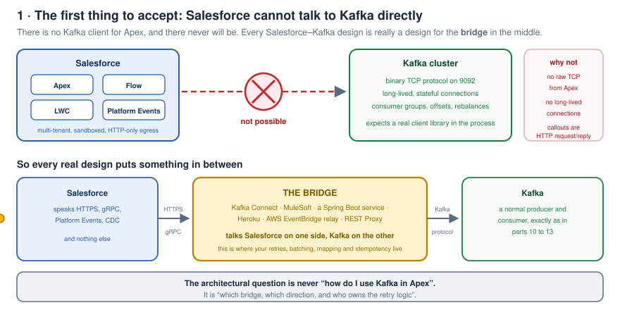
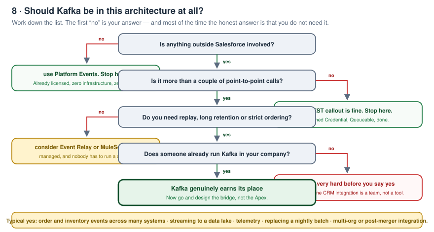
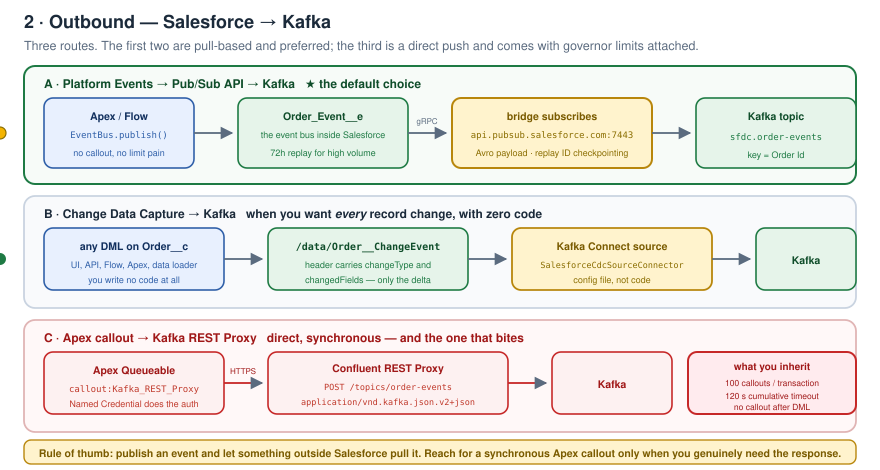
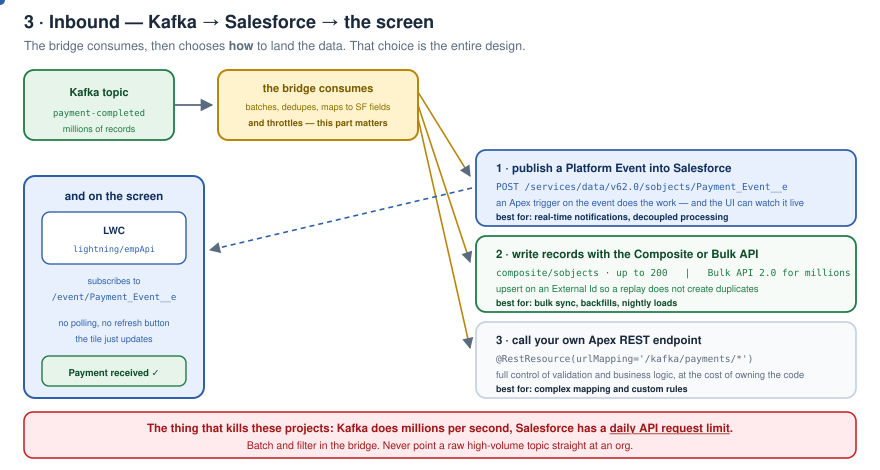
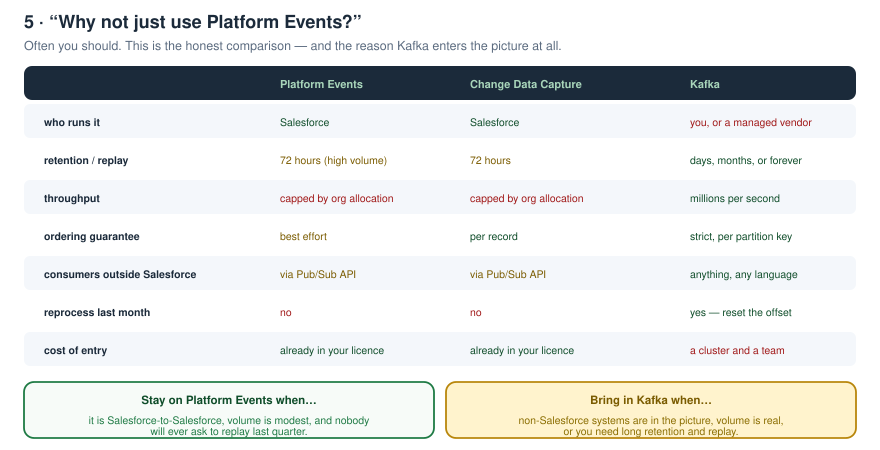
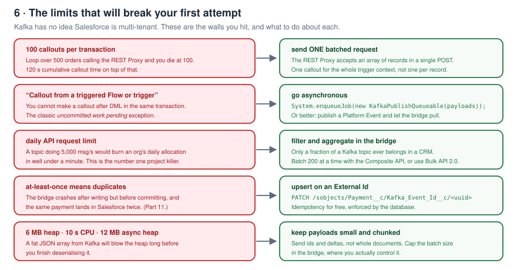

# Kafka Zero to Hero — Part 00: Kafka with Salesforce

> The Salesforce-specific companion to this series. **What** the integration actually looks like, **where** and **when** it belongs, **when it absolutely does not**, the **pros and cons**, the **setup**, and working **Apex** and **LWC** code.
>
> Read parts [01](../01-why-kafka-and-what-is-kafka/README.md)–[13](../13-kafka-cluster-setup/README.md) for Kafka itself. This part assumes you know what a topic, partition, consumer group and offset are.
>
> **Code in this folder:** [apex/](apex) · [lwc/](lwc) · [bridge/](bridge)

---

## Contents

1. [The one fact everything else follows from](#1-the-one-fact-everything-else-follows-from)
2. [Where Kafka fits in a Salesforce landscape](#2-where-kafka-fits-in-a-salesforce-landscape)
3. [When to use it — and when not to](#3-when-to-use-it--and-when-not-to)
4. [Outbound: Salesforce → Kafka](#4-outbound-salesforce--kafka)
5. [Inbound: Kafka → Salesforce](#5-inbound-kafka--salesforce)
6. [Choosing the bridge](#6-choosing-the-bridge)
7. [Platform Events vs CDC vs Kafka](#7-platform-events-vs-cdc-vs-kafka)
8. [Pros and cons, honestly](#8-pros-and-cons-honestly)
9. [Setup, end to end](#9-setup-end-to-end)
10. [Apex code](#10-apex-code)
11. [LWC code](#11-lwc-code)
12. [The bridge code](#12-the-bridge-code)
13. [Governor limits that will bite you](#13-governor-limits-that-will-bite-you)
14. [The full round trip](#14-the-full-round-trip)
15. [Anti-patterns](#15-anti-patterns)
16. [Interview answers](#16-interview-answers)

---

## 1. The one fact everything else follows from

> **Salesforce cannot speak the Kafka protocol. There is no Kafka client for Apex, and there never will be.**



Kafka is a **binary TCP protocol** with long-lived, stateful connections, consumer groups, offsets and rebalances. Apex gets **HTTP callouts** — request, response, done. No sockets, no background threads, no persistent connections.

So the real question is never *"how do I use Kafka in Apex"*. It is:

> **Which bridge, which direction, and who owns the retry logic?**

Everything below is an answer to that.

---

## 2. Where Kafka fits in a Salesforce landscape

| Scenario | Where Kafka sits |
|---|---|
| **Order orchestration** | Salesforce creates the order → Kafka → payment, inventory, shipping, fraud services each consume independently |
| **Inventory / pricing sync** | ERP or WMS publishes to Kafka → bridge lands only what the CRM needs |
| **Customer 360 / data lake** | CDC from Salesforce → Kafka → Snowflake, Databricks, S3, Data Cloud |
| **Telemetry, IoT, clickstream** | Devices → Kafka → aggregated → a summary record in Salesforce (never the raw stream) |
| **Post-merger / multi-org** | Kafka as the neutral backbone between two orgs that must not be coupled directly |
| **Replacing a nightly batch** | The 2am file drop becomes a continuous stream, and the CRM stops being a day behind |
| **Service Cloud real-time** | External events → Kafka → Platform Event → LWC updates the agent's screen live |

---

## 3. When to use it — and when not to



### Use Kafka when

- **Non-Salesforce systems are involved** and there are more than two of them
- You need **replay** — "reprocess last Tuesday" is a real requirement
- You need **retention beyond 72 hours** (the Platform Event / CDC ceiling)
- You need **strict per-key ordering** across systems
- **Volume is genuinely high** — thousands per second, not dozens per minute
- You want **new consumers added without touching Salesforce** (part 01's whole argument)

### Do **not** use Kafka when

- It's **Salesforce to Salesforce** → Platform Events already do this, free
- It's **one or two point-to-point calls** → a Named Credential and a Queueable is the right answer
- **Nobody in your company already runs Kafka** → you're proposing a platform team, not a tool
- You need **transactional consistency with the Salesforce database** → Kafka gives you eventual consistency and at-least-once
- The **volume is small** and you just want "real time" → Platform Events are real time

> The honest default: **start with Platform Events.** Add Kafka when the constraints above force it, not because it's on the architecture diagram.

---

## 4. Outbound: Salesforce → Kafka



### A · Platform Event → Pub/Sub API → Kafka ★ the default

Apex or Flow publishes a Platform Event. **No callout, so no governor limit pain.** A bridge outside Salesforce subscribes over **gRPC** at `api.pubsub.salesforce.com:7443` and produces to Kafka.

- Salesforce never waits for Kafka
- The bridge checkpoints a **replay ID**, so a restart resumes exactly where it stopped
- High-volume Platform Events are retained **72 hours** — plenty of buffer for a bridge outage

### B · Change Data Capture → Kafka

Enable CDC on the object and every insert/update/delete/undelete flows to `/data/Order__ChangeEvent` — **you write no code at all**. The header carries `changeType` and `changedFields`, so you get deltas rather than whole records.

Best when you want *everything* that happens to an object, regardless of whether it came from the UI, an API, a Flow or Data Loader.

### C · Apex callout → Kafka REST Proxy

The only route where Apex touches Kafka-ish infrastructure directly, via **Confluent REST Proxy** over HTTPS.

Use it **only when you need the response synchronously**. Otherwise you have imported every governor limit in section 13 for no benefit.

---

## 5. Inbound: Kafka → Salesforce



The bridge consumes, then picks a landing strategy:

| Option | How | Best for |
|---|---|---|
| **Publish a Platform Event** | `POST /services/data/vXX.0/sobjects/Payment_Event__e` | real-time notifications, decoupled processing, live UI |
| **Composite / Bulk API** | `composite/sobjects` (200 at a time) or Bulk API 2.0 | bulk sync, backfills, millions of rows |
| **Your own Apex REST endpoint** | `@RestResource(urlMapping='/kafka/payments/*')` | complex mapping and validation you want in Apex |

> **The number one project killer:** Kafka does millions of messages per second; a Salesforce org has a **daily API request limit**. **Filter and batch in the bridge.** Never point a raw high-volume topic at an org.

Always **upsert on an External Id**. Kafka is at-least-once (part 11) — the database is the cleanest place to enforce idempotency.

---

## 6. Choosing the bridge



| # | Option | Code | Best when |
|---|---|---|---|
| 1 | **Kafka Connect + Confluent Salesforce connectors** | config only | you already run Connect; least code by far |
| 2 | **MuleSoft** | DataWeave | your org already owns MuleSoft |
| 3 | **Your own service** (Spring Boot / Node) | all of it | full control, no licence, you own the pager |
| 4 | **Event Relay → Amazon EventBridge → MSK** | none | AWS shop, outbound only, no servers to run |
| 5 | **Heroku Kafka + Heroku Connect** | minimal | fastest proof of concept; watch the cost curve |

Connector classes worth knowing for option 1:

```
io.confluent.salesforce.SalesforcePlatformEventSourceConnector   SF  -> Kafka
io.confluent.salesforce.SalesforceCdcSourceConnector             SF  -> Kafka
io.confluent.salesforce.SalesforcePlatformEventSinkConnector     Kafka -> SF
io.confluent.salesforce.SalesforceBulkApiSinkConnector           Kafka -> SF records
```

> **Choose on operating model, not features.** Who gets paged at 2am matters more than what the tool can do.

---

## 7. Platform Events vs CDC vs Kafka



| | Platform Events | Change Data Capture | Kafka |
|---|---|---|---|
| Who runs it | Salesforce | Salesforce | you, or a vendor |
| Retention / replay | 72 h (high volume) | 72 h | days → forever |
| Throughput | org allocation | org allocation | millions/sec |
| Ordering | best effort | per record | strict per partition key |
| External consumers | via Pub/Sub API | via Pub/Sub API | anything, any language |
| Reprocess last month | ✗ | ✗ | ✓ reset the offset |
| Cost of entry | in your licence | in your licence | a cluster and a team |

---

## 8. Pros and cons, honestly

### Pros

| | |
|---|---|
| **Decoupling** | Salesforce publishes once; five systems consume. Adding a sixth needs **zero Apex changes** |
| **No cascading failure** | The order saves even if payment is down — part 01's whole argument |
| **Replay** | Reprocess after a bug fix instead of exporting CSVs (part 09) |
| **Long retention** | Days or months, not 72 hours |
| **Buffering** | Kafka absorbs a spike; Salesforce's API limits never see it |
| **Ordering** | Per-key ordering that Platform Events don't guarantee (part 05) |
| **Any consumer** | Python, Go, Java, Snowflake, Databricks — no Salesforce licence needed downstream |
| **Volume** | The only realistic option for telemetry-scale data |

### Cons

| | |
|---|---|
| **A whole new platform** | Brokers, controllers, Connect, Schema Registry, monitoring — see part 13 |
| **Always a bridge** | Extra hop to build, deploy, secure, monitor and page on |
| **Eventual consistency** | No transaction spans Salesforce and Kafka. Design for at-least-once |
| **Duplicates are the contract** | You must build idempotency yourself (part 11) |
| **Debugging spans two worlds** | "Where did the record go?" now has twice as many places to look |
| **API limits still apply** | Kafka doesn't raise your daily allocation; it can burn it faster |
| **Schema drift** | A new field in Apex breaks a downstream consumer unless a Schema Registry governs it |
| **Cost and skills** | Licences, infrastructure, and engineers who understand rebalancing |

---

## 9. Setup, end to end

### Step 1 — Salesforce side

```
1. Create the Platform Event      Setup → Platform Events → New
                                  Order_Event__e, Publish Behavior = "Publish After Commit"
                                  Fields: Event_Id__c, Order_Id__c, Account_Id__c,
                                          Status__c, Amount__c, Occurred_At__c

2. (or) Enable CDC                Setup → Change Data Capture → select Order__c

3. Integration user               a dedicated user + Permission Set granting only
                                  the objects and events the bridge needs

4. Connected App                  Setup → App Manager → New Connected App
                                  Enable OAuth, scopes: api, refresh_token
                                  Prefer the JWT bearer flow — no stored password

5. External Id field              Payment__c.Kafka_Event_Id__c, External Id + Unique
                                  this is what makes replays safe

6. Named Credential               only if you use the Apex → REST Proxy route
                                  Setup → Named Credentials → Kafka_REST_Proxy
```

### Step 2 — Kafka side

Stand up the cluster from [part 13](../13-kafka-cluster-setup/README.md), then:

```bash
kafka-topics.sh --bootstrap-server localhost:8081 \
  --topic sfdc.order-events --partitions 6 --replication-factor 3 --create

kafka-topics.sh --bootstrap-server localhost:8081 \
  --topic sfdc.order-events.dlq --partitions 3 --replication-factor 3 --create
```

Partition count sets your consumer ceiling (part 06). Key on **Order Id** so an order's events stay ordered (part 05).

### Step 3 — the bridge

Either post a connector config:

```bash
curl -X POST -H "Content-Type: application/json" \
  --data @bridge/connect-platform-event-source.json \
  http://localhost:8083/connectors
```

…or run your own service: [bridge/pubsub-bridge.js](bridge/pubsub-bridge.js)

### Step 4 — verify

```bash
# watch events arrive from Salesforce
kafka-console-consumer.sh --bootstrap-server localhost:8081 \
  --topic sfdc.order-events --from-beginning --property print.key=true

# is the bridge keeping up?
kafka-consumer-groups.sh --bootstrap-server localhost:8081 \
  --group sfdc-bridge --describe
```

---

## 10. Apex code

### Publishing a Platform Event — [apex/OrderEventPublisher.cls](apex/OrderEventPublisher.cls)

```apex
public with sharing class OrderEventPublisher {

    public static void publish(List<Order__c> orders) {
        List<Order_Event__e> events = new List<Order_Event__e>();

        for (Order__c order : orders) {
            events.add(new Order_Event__e(
                Event_Id__c    = newEventId(),      // consumers dedupe on this
                Order_Id__c    = order.Id,
                Status__c      = order.Status__c,
                Amount__c      = order.Amount__c,
                Occurred_At__c = System.now()
            ));
        }

        List<Database.SaveResult> results = EventBus.publish(events);
        // ... check isSuccess() per result
    }
}
```

Called from a trigger — [apex/OrderTrigger.trigger](apex/OrderTrigger.trigger). **Bulkified, no callout, no limits consumed.**

### Direct publish to the REST Proxy — [apex/KafkaRestProxyPublisher.cls](apex/KafkaRestProxyPublisher.cls)

```apex
public with sharing class KafkaRestProxyPublisher implements Queueable, Database.AllowsCallouts {

    public void execute(QueueableContext context) {
        HttpRequest request = new HttpRequest();
        request.setEndpoint('callout:Kafka_REST_Proxy/topics/' + topic);
        request.setMethod('POST');
        request.setHeader('Content-Type', 'application/vnd.kafka.json.v2+json');
        request.setBody(JSON.serialize(new Payload(chunk)));   // ONE call for the whole batch
        ...
    }
}
```

Three deliberate choices: **`Queueable`** (you cannot call out after DML), **one request per batch** (100 callouts per transaction), and **`key` on each record** (the partition key that preserves ordering).

### Receiving from Kafka — [apex/KafkaInboundRestResource.cls](apex/KafkaInboundRestResource.cls)

```apex
@RestResource(urlMapping='/kafka/payments/*')
global with sharing class KafkaInboundRestResource {

    @HttpPost
    global static Response post() {
        // ... deserialize the batch
        Database.upsert(payments, Payment__c.Kafka_Event_Id__c, false);   // idempotent by design
        // a non-2xx tells the bridge NOT to commit its offset, so Kafka replays
    }
}
```

---

## 11. LWC code

Kafka lands a Platform Event in Salesforce; the component subscribes and the screen updates with **no polling and no refresh button**.

[lwc/kafkaEventMonitor/kafkaEventMonitor.js](lwc/kafkaEventMonitor/kafkaEventMonitor.js)

```javascript
import { subscribe, unsubscribe, onError } from 'lightning/empApi';

const CHANNEL = '/event/Order_Event__e';

connectedCallback() {
    // -1 = new events only, -2 = replay everything still retained
    subscribe(CHANNEL, -1, (message) => this.handleEvent(message))
        .then((response) => { this.subscription = response; });

    onError((error) => console.error('empApi error', JSON.stringify(error)));
}

disconnectedCallback() {
    unsubscribe(this.subscription);   // always, or you leak subscriptions
}
```

Three things people get wrong:

- **Always `unsubscribe`** in `disconnectedCallback`
- **`-1` vs `-2`** — `-2` replays the whole retention window and will flood a fresh tab
- The payload is at **`message.data.payload`**, and field names keep their `__c` suffix

Also works for CDC — just subscribe to `/data/Order__ChangeEvent`.

---

## 12. The bridge code

| File | What it is |
|---|---|
| [bridge/connect-platform-event-source.json](bridge/connect-platform-event-source.json) | Kafka Connect: Platform Events → Kafka, with a DLQ |
| [bridge/connect-platform-event-sink.json](bridge/connect-platform-event-sink.json) | Kafka Connect: Kafka → Platform Events, with `max.poll.records` throttled |
| [bridge/pubsub-bridge.js](bridge/pubsub-bridge.js) | a hand-rolled bridge: Pub/Sub API gRPC subscriber → `kafkajs` producer |

The custom bridge shows the two decisions that matter:

```javascript
await producer.send({
    topic: TOPIC,
    messages: [{
        key: payload.Order_Id__c,                          // ordering per order
        value: JSON.stringify(payload),
        headers: { 'event-id': payload.Event_Id__c }       // idempotency downstream
    }]
});

saveReplayId(response.latestReplayId);   // checkpoint AFTER the produce succeeds
```

That last line is the exact "process first, then acknowledge" rule from [part 11](../11-java-producer-and-idempotency/README.md), applied on the Salesforce side.

---

## 13. Governor limits that will bite you



| Limit | What breaks | What to do |
|---|---|---|
| **100 callouts / transaction** | a loop over 500 orders dies at 100 | **one batched request** for the whole trigger context |
| **120 s cumulative callout** | a slow proxy kills the transaction | `setTimeout()`, and go async |
| **No callout after DML** | `uncommitted work pending` | `Queueable` / `@future(callout=true)` — or publish an event instead |
| **Daily API requests** | a busy topic burns the org's allocation in minutes | **filter and batch in the bridge** |
| **6 MB heap (12 MB async)** | a fat JSON array blows up on deserialise | small payloads, chunked batches |
| **10 s CPU (60 s async)** | heavy mapping in Apex times out | map in the bridge, not in Apex |
| **At-least-once delivery** | the same payment lands twice | **upsert on an External Id** |
| **Platform Event publish limits** | the org stops accepting events | monitor, and aggregate before publishing |

---

## 14. The full round trip



1. Rep clicks **Save**. The trigger publishes `Order_Event__e` — the transaction ends in milliseconds.
2. The bridge, subscribed over gRPC, picks it up and produces to `sfdc.order-events`, keyed by Order Id.
3. **Payment**, **Inventory** and **Shipping** each consume the same topic in their own consumer group, at their own pace.
4. Payment finishes and publishes `Payment_Event__e` back into the org via the REST API — and the LWC on the record page updates itself.

**What Salesforce gained:** no callout in the transaction, three consumers it knows nothing about, and a fourth can be added tomorrow with zero Apex changes.

**What you now own:** a bridge to deploy and monitor, replay IDs and dead-letter topics, and two systems to trace through when something goes missing.

---

## 15. Anti-patterns

| Anti-pattern | Why it hurts |
|---|---|
| A callout to Kafka **inside a trigger** | `uncommitted work pending`, and you've coupled the save to a remote system |
| **One callout per record** in a loop | dead at 100 records |
| Pointing a **high-volume topic straight at an org** | the daily API limit evaporates |
| **No External Id** on inbound records | the first replay creates duplicates |
| Using **`-2`** in `empApi` on a busy channel | the browser tab drowns |
| **No dead letter topic** | one poison message stops the consumer group forever |
| Kafka for a **single point-to-point** integration | you built a platform to avoid writing one callout |
| **No Schema Registry** | someone adds a field in Apex and a downstream consumer breaks silently |
| Storing the **password in the connector config** | use `${file:...}` or a secrets provider, and prefer JWT |

---

## 16. Interview answers

1. **Can Apex connect to Kafka directly?** No — no Kafka client for Apex, and callouts are HTTP request/response. You always need a bridge. The closest thing is an HTTPS call to a Confluent REST Proxy.
2. **How do you get events out of Salesforce?** Platform Events or CDC, consumed by a bridge over the Pub/Sub API (gRPC); or Event Relay to EventBridge; or an Apex callout to a REST Proxy.
3. **Why prefer a Platform Event over an Apex callout?** No callout in the transaction, so no governor limits, no `uncommitted work pending`, and no cascading failure if Kafka is down.
4. **How do you get data back in?** Publish a Platform Event via the REST API, use Composite/Bulk API for volume, or a custom Apex REST resource for complex mapping.
5. **How do you avoid duplicates?** Kafka is at-least-once. Carry a unique event id, and **upsert on an External Id** in Salesforce.
6. **How do you keep an order's events in order?** Key the Kafka record on the Order Id — same key, same partition, guaranteed order (part 05).
7. **Biggest risk?** The **daily API limit**. Kafka's throughput and a CRM's API allocation are orders of magnitude apart; the bridge must filter and batch.
8. **When would you NOT use Kafka here?** Salesforce-to-Salesforce, low volume, a couple of point-to-point calls, or nobody in the company runs Kafka today.
9. **Platform Events vs Kafka?** 72-hour retention and org-limited throughput vs unlimited retention, replay and millions per second — at the price of running a platform.
10. **How does the UI update in real time?** LWC + `lightning/empApi` subscribed to the Platform Event channel. The bridge publishes the event; the component re-renders.

---

<sub>Companion piece to the *Kafka Zero to Hero* series — the Salesforce architect's view. Diagrams, Apex, LWC and bridge code are mine.</sub>
