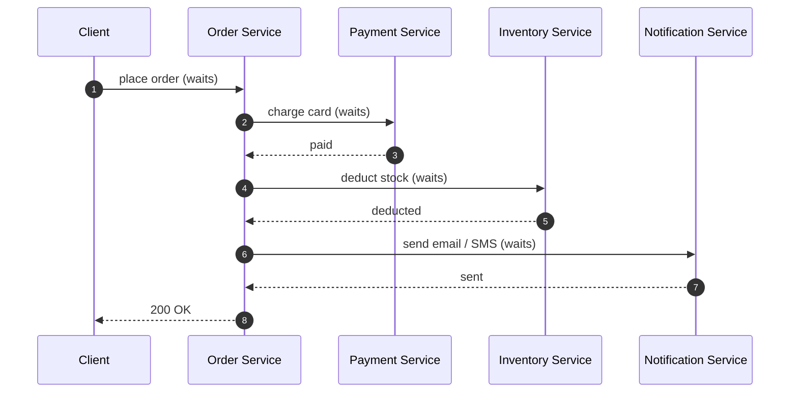
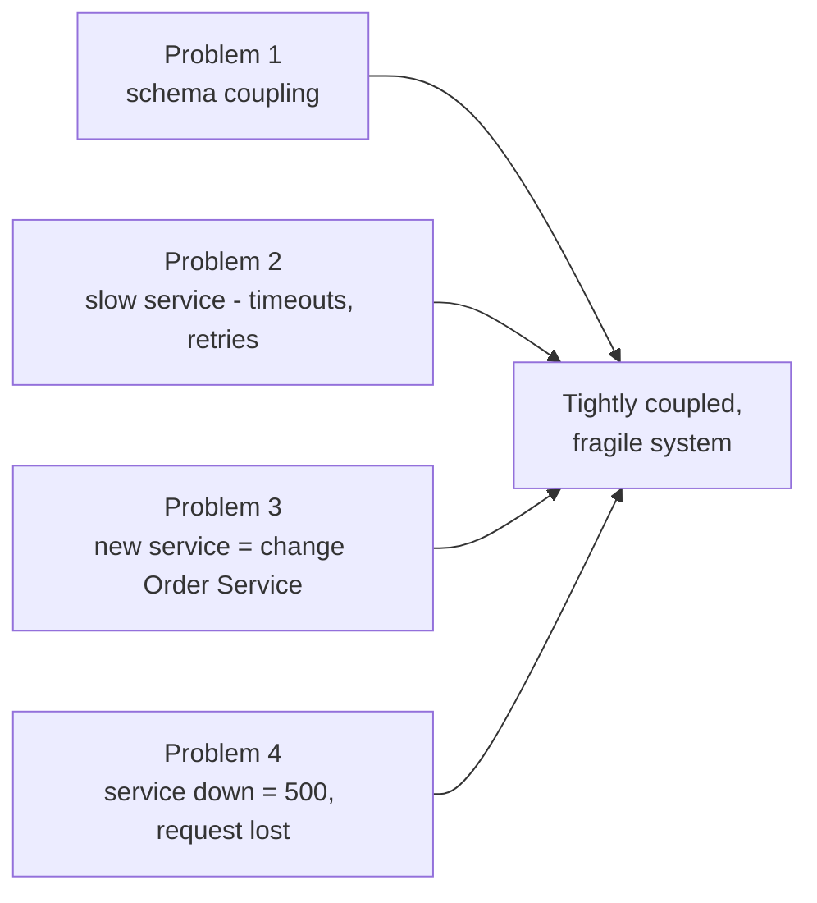
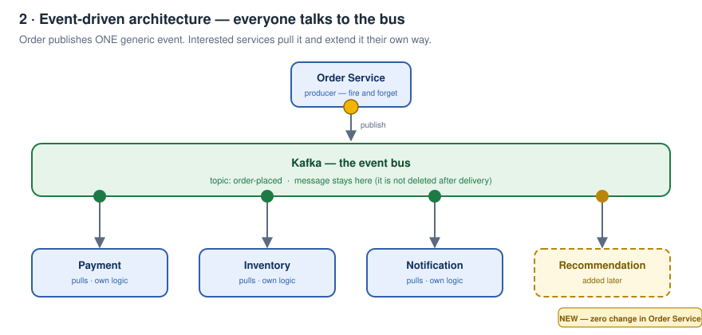
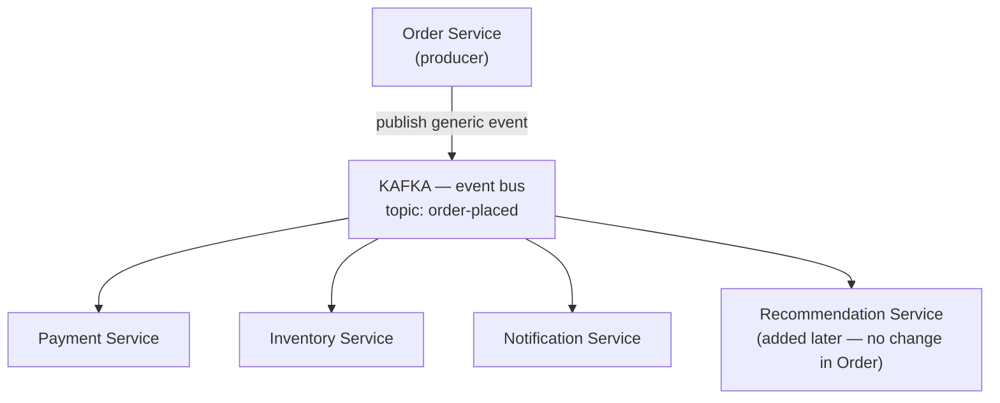
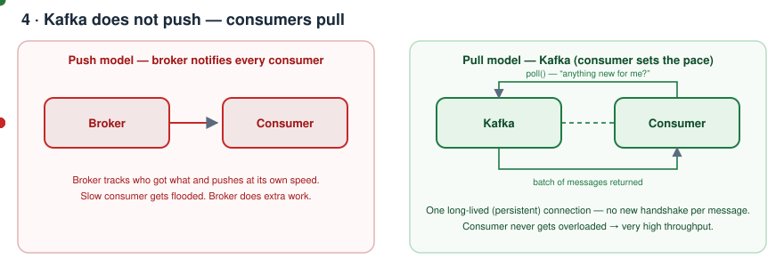
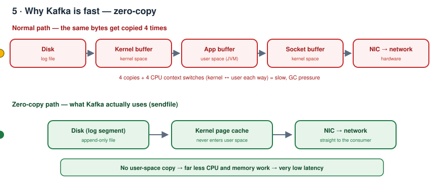
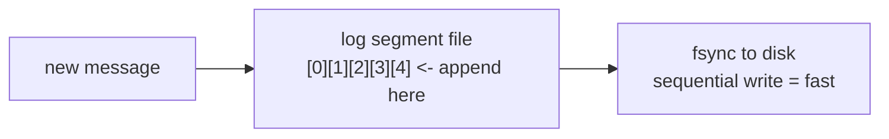
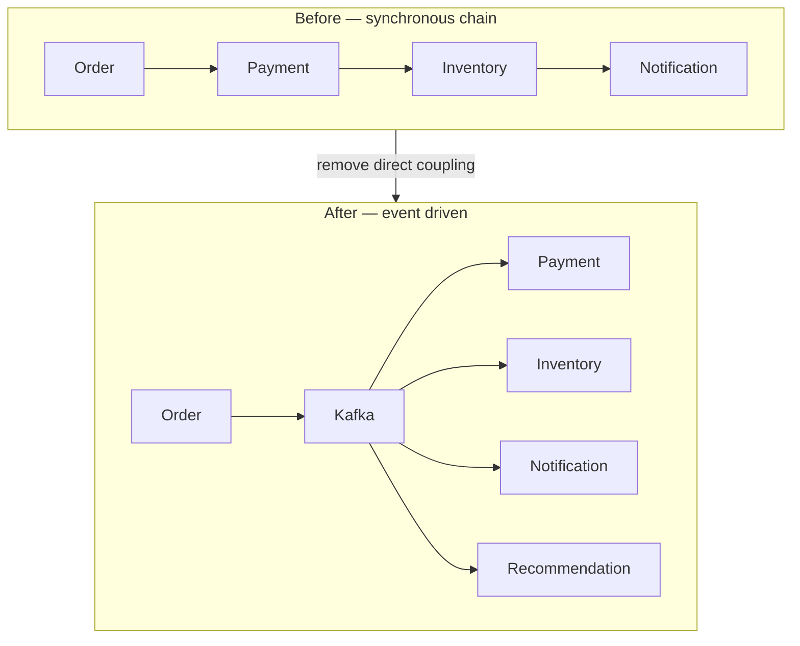

# Kafka Zero to Hero — Part 01: Why Kafka, and What Is Kafka

> My notes from the first video of the *Kafka Zero to Hero* series.
> Everything from that video is captured here — nothing skipped — plus animated diagrams so each idea is easy to see instead of just read.
>
> **All diagrams on this page are animated.** Give them a second, they loop.

---

## Contents

1. [The starting point — a normal e-commerce flow](#1-the-starting-point--a-normal-e-commerce-flow)
2. [The 4 problems with the traditional architecture](#2-the-4-problems-with-the-traditional-architecture)
3. [What is event-driven microservices architecture](#3-what-is-event-driven-microservices-architecture)
4. [How the event bus fixes all 4 problems](#4-how-the-event-bus-fixes-all-4-problems)
5. [The service-is-down case, in detail](#5-the-service-is-down-case-in-detail)
6. [So what is Kafka](#6-so-what-is-kafka)
7. [The 6 benefits of using Kafka](#7-the-6-benefits-of-using-kafka)
8. [One-page recap](#8-one-page-recap)
9. [Check yourself](#9-check-yourself)
10. [What comes next](#10-what-comes-next)

---

## 1. The starting point — a normal e-commerce flow

Think of any e-commerce application — Amazon, Flipkart, anything. You tap **Place Order**. In a classic microservices setup the chain is:

**Order Service → Payment Service → Inventory Service → Notification Service**

- **Order Service** takes the order and drives everything else.
- **Payment Service** charges the card.
- **Inventory Service** deducts the ordered quantity from stock.
- **Notification Service** finally sends the confirmation to the user over **email or SMS**.

Each call is **synchronous**: Order calls Payment and *waits*, then calls Inventory and *waits*, then calls Notification and *waits*. Only after all of it does the client get a response.

This works. It is also where all the pain comes from.

---

## 2. The 4 problems with the traditional architecture

### Problem 1 — Order Service must know everybody's data structures

Because Order Service calls Payment Service directly, it has to be **aware of the request/response data structures supported by Payment Service**.

Then the same again for Inventory. And again for Notification.

So Order Service ends up carrying knowledge of:

| Order Service must know | Why |
|---|---|
| Payment request/response schema | to build the call and parse the reply |
| Inventory request/response schema | same |
| Notification request/response schema | same |

That creates a hard **dependency on all of these services**. Order Service can no longer operate independently — it is **inflexible**. Any one of those teams changing a field can break it.

### Problem 2 — One slow service becomes Order Service's problem

If any one of the downstream services responds **very slowly**, Order Service is the one stuck holding the request.

So Order Service now has to implement, itself:

- **timeout pattern** — how long do I wait before giving up?
- **retry pattern** — how many times do I retry, with what backoff?
- and the same again, per downstream service

This is code that has nothing to do with ordering, but it now lives inside Order Service. And the slowness **cascades** upward to the client.

### Problem 3 — Adding a new service is not flexible

Later the product manager comes and says: *"add a **Recommendation Service** to this flow."*

What happens now?

1. Order Service has to learn the **request/response data structure supported by Recommendation Service**.
2. We have to make **code changes inside Order Service**.
3. Which means a **testability impact on Order Service** — a service that had nothing to do with recommendations must now be re-tested and re-deployed.

So adding a new service is **not flexible at all**. Every new consumer of the order event means touching the producer.

### Problem 4 — If a service is unavailable, the request is lost

If any one of the services is **not available**, and Order Service is not handling that properly, we end up throwing a **500 Internal Server Error** back to the client.

And then we are gone — **the request is completely lost**. Nobody replays it. The order the customer placed simply vanished.

---

## 3. What is event-driven microservices architecture

> **Event-driven microservices architecture** is an architecture pattern which focuses particularly on **loosely coupled** and **asynchronous** communication among microservices.

How does it achieve that? By putting an **event bus** in the middle — for example **Kafka** — through which services **publish events / messages**.

For now, hold this one simple idea:

> **Kafka is an event bus.**

Order Service, Payment Service, Inventory Service, Notification Service and any other service simply **connect to the event bus** instead of connecting to each other.

---

## 4. How the event bus fixes all 4 problems

Now let's walk through the exact same four problems again, with the event bus in place.

### Fix for Problem 1 — no more synchronous communication

There is **no more synchronous communication happening**.

Order Service places a **generic message** onto the event bus. That's it — its job is done.

All the other **interested services just simply consume this message**, and each one can:

- **write an extension on top of it**, or
- **build a customised message according to its own need**

And critically — **no changes are required in Order Service**. It publishes one generic event and stops caring who reads it.

### Fix for Problem 2 — a slow service no longer drags anyone down

Earlier, if one service responded slowly, Order Service also became slow — a **cascading failure effect**.

With this architecture that problem is gone. Every service is **operating independently**. They simply rely on the event bus: producers publish onto it, consumers read from it at their own pace. Payment being slow does not make Order slow.

### Fix for Problem 3 — adding a new service is trivial

Earlier, Order Service had to know Payment's request/response structures.

Now, Order Service **already has its generic message on the bus**, and Payment Service, Inventory Service, or **any other kind of service** can simply **write an extension on top of it** and happily serve their own requests.

So when the Recommendation Service is asked for, it can be **easily added**:

- subscribe to the existing topic
- read the same generic event
- **no more changes required in Order Service**

No code change, no re-test, no re-deploy of the producer.

### Fix for Problem 4 — a service being down is fine now

Assume **Notification Service is down for 10 minutes**.

That is **okay**. Order Service is operating independently and keeps accepting orders. The notification will simply be sent later, when Notification Service comes back up.

**How?** Because in Kafka **the message does not get deleted** after delivery. The message is **still there**. When Notification Service comes up, it **receives the message and sends the notification**. That simple.

### The 1:1 mapping

| # | Traditional architecture | With Kafka as the event bus |
|---|---|---|
| 1 | Order must know every downstream req/res schema | Order publishes one **generic** event; consumers extend it themselves |
| 2 | Slow service → Order codes timeout + retry, failure cascades | Services run **independently**, only rely on the bus — no cascade |
| 3 | New service → change + re-test Order Service | New consumer just **subscribes**; **zero change** in Order |
| 4 | Service down → **500**, request lost forever | Message is **retained**; consumer catches up when it returns |

---

## 5. The service-is-down case, in detail

This is the single most important intuition from the video, so here it is animated:

1. Orders keep coming in. Order Service is completely unaffected.
2. Kafka **appends** each event to its log — offset 0, 1, 2, 3, 4, 5…
3. Notification Service is down for ~10 minutes. **Nothing is lost.**
4. Notification Service comes back up, reads from where it stopped, and sends every pending email/SMS.

Nothing was dropped, and nobody had to write "retry" logic in Order Service to make that happen.

---

## 6. So what is Kafka

> **Kafka is a distributed event streaming platform.**

Read it word by word:

| Word | Meaning here |
|---|---|
| **distributed** | it runs as a **cluster of multiple servers**, not one box |
| **event** | the unit it carries is an event/message like `order-placed` |
| **streaming** | events flow continuously, and are stored as a stream you can re-read |
| **platform** | it is not just a queue — it stores, replays, scales, and stays available |

---

## 7. The 6 benefits of using Kafka

### 7.1 Highly available

Kafka is highly available. *(How exactly — replication, leaders and followers — comes in the next videos of this series.)*

### 7.2 Horizontally scalable

Kafka can be scaled easily, because **in production it is not running as a single server** — there are **multiple servers running as a cluster**. Need more capacity? Add more servers to the cluster.

### 7.3 Can ingest a large volume of data

Because of that cluster, Kafka can take in very large volumes of data without falling over.

### 7.4 Very high throughput

Two reasons for this.

**(a) It is a pull-based mechanism.**
When Order Service places an event onto Kafka, **Kafka does not notify all the consumers**. That is *not Kafka's responsibility*. Instead, all the consumers **continuously poll** the event bus and keep getting the event messages themselves.

**(b) The connections are persistent.**
The connection between Payment Service and Kafka is **persistent**. The connection between Order Service and Kafka is **persistent**. No repeated handshakes per message.

### 7.5 Very low latency

Three reasons here.

**(a) Zero-copy architecture.**
Internally Kafka uses **zero-copy**, so the bytes never get copied into user space and back.

**(b) Non-blocking I/O.**
Kafka uses non-blocking I/O — one thread can serve many connections instead of one thread sitting blocked per connection.

**(c) Append-only log files.**
Kafka works like a database's log files. Whatever message comes in, it just **appends** that message onto the particular log file — and done. Sequential append is about the fastest thing a disk can do, and there is no random-write cost.

### 7.6 Very high fault tolerance

The message is **kept on the Kafka server**. So if a service needs it, we can **replay all those messages again**.

This is the property that makes Kafka different from a plain queue: reading a message does not destroy it.

---

## 8. One-page recap

| Idea | One line |
|---|---|
| Event-driven architecture | Pattern focused on **loosely coupled** + **asynchronous** communication between microservices |
| Event bus | The middle piece services publish to and consume from — Kafka |
| Kafka | A **distributed event streaming platform** |
| Highly available | Runs as a cluster, survives node loss |
| Horizontally scalable | Add servers to the cluster |
| Large volume ingest | Cluster absorbs heavy traffic |
| High throughput | **Pull-based** (Kafka never notifies consumers) + **persistent connections** |
| Low latency | **Zero-copy** + **non-blocking I/O** + **append-only log** |
| Fault tolerant | Messages are stored and can be **replayed** |

**The whole video in one sentence:** stop making services call each other, put a durable log in the middle, and let every service publish and read at its own pace.

---

## 9. Check yourself

Try answering these without scrolling up.

1. Name the four problems in the traditional order → payment → inventory → notification chain.
2. Why does the Order Service become "inflexible" in that design?
3. When we add a Recommendation Service in the *old* design, what three things happen to Order Service?
4. What exactly is thrown to the client when a downstream service is unavailable and unhandled?
5. Define event-driven microservices architecture in one sentence.
6. Is Kafka push-based or pull-based, and why does that help throughput?
7. Name the two things that keep Kafka's connections cheap.
8. Give three reasons Kafka has low latency.
9. Why is Kafka fault tolerant — what can you do that you cannot do with a normal queue?
10. Notification Service is down for 10 minutes. Walk through what happens to the messages.

---

## 10. What comes next

Next part: [02 — Kafka Fundamentals](../02-kafka-fundamentals/README.md) — cluster, ZooKeeper vs KRaft, controller, topic, broker, replication factor, leader/follower and `bootstrap.servers`.

From the series, the topics deliberately deferred out of this first video:

- **How Kafka is highly available** — replication, leader/follower, ISR *(next videos)*
- **Zero-copy architecture** — its own dedicated video
- **Non-blocking I/O** — explained in detail in the author's NGINX video

And in this repo, the next folders will cover topics, partitions, consumer groups, offsets, delivery semantics and the schema registry.

---

Notes written up from the *Kafka Zero to Hero* series, video 1 — "Why we need Kafka and what is Kafka". Diagrams and wording are mine; the teaching order follows the video.
