# Kafka Zero to Hero — Part 02: Kafka Fundamentals

> Notes from episode 2 of the *Kafka Zero to Hero* series.
> Everything from the video is here — cluster, ZooKeeper, KRaft, controller, event/record/message, topic, broker, replication factor, leader/follower, bootstrap servers and the client library — with animated diagrams for each idea.
>
> **All diagrams animate.** Give them a second, they loop.
>
> Previous: [01 — Why Kafka, and what is Kafka](../01-why-kafka-and-what-is-kafka/README.md) · Next: [03 — Setting Kafka up locally](../03-local-setup/README.md)

---

## Contents

1. [Where part 1 left us](#1-where-part-1-left-us)
2. [ZooKeeper — the old manager](#2-zookeeper--the-old-manager)
3. [Why ZooKeeper was dropped](#3-why-zookeeper-was-dropped)
4. [Basics: what is an event](#4-basics-what-is-an-event)
5. [Topic — where events are stored](#5-topic--where-events-are-stored)
6. [Server = broker](#6-server--broker)
7. [KRaft and the controller](#7-kraft-and-the-controller)
8. [Creating a topic — the full flow](#8-creating-a-topic--the-full-flow)
9. [Replication factor — leader and followers](#9-replication-factor--leader-and-followers)
10. [Data is distributed across the cluster](#10-data-is-distributed-across-the-cluster)
11. [How do I connect to a specific broker — bootstrap.servers](#11-how-do-i-connect-to-a-specific-broker--bootstrapservers)
12. [The topic create command](#12-the-topic-create-command)
13. [How applications connect — the client library](#13-how-applications-connect--the-client-library)
14. [One-page recap](#14-one-page-recap)
15. [Check yourself](#15-check-yourself)

---

## 1. Where part 1 left us

We concluded that **Kafka is a distributed event streaming platform**.

Multiple applications connect to Kafka. And note this carefully — **the same application can be both**:

- Application 1 can act as a **producer** *and* a **consumer**
- Application 2 can act as a **producer** *and* a **consumer**

Both are simply talking to Kafka.

But in real life **we do not have a single Kafka server**. We have **multiple Kafka servers running together** — and that is what we call a **Kafka cluster**.

Now, once you have a cluster, you need **something to manage it**: which of these servers are up and running? A cluster could have **thousands** of Kafka servers. Somebody has to keep track.

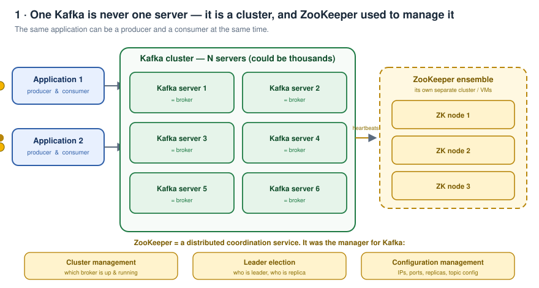

---

## 2. ZooKeeper — the old manager

Most websites/tutorials talk about **ZooKeeper**.

- With **earlier versions** of Kafka, running ZooKeeper alongside Kafka was **mandatory**.
- With the **new versions** it is **no more mandatory**.
- But **most companies are still using it**, so it is worth knowing.

> ZooKeeper was acting like a **manager for Kafka**.

Technically: **ZooKeeper is a distributed coordination service.**

### What ZooKeeper provided

| Responsibility | What it actually means |
|---|---|
| **Cluster management** | Knows **which Kafka server is up and running**, so a request/event/message is sent to a live server. Later it gets **replicated to the down servers when they come back up**. |
| **Leader election** | Same idea as **master + replicas** in databases. In the cluster some servers act as **leader** and some as **replicas** — but *who decides* which node is the leader? ZooKeeper does. |
| **Configuration management** | Stores Kafka server **IP addresses**, **port numbers**, **which replicas belong to which server**, **topic configurations**, and so on. |

In the new world, ZooKeeper has been ruled out, and instead of ZooKeeper we have **KRaft**.

---

## 3. Why ZooKeeper was dropped

You have a Kafka cluster to maintain. To manage that cluster you need ZooKeeper. And ZooKeeper itself **has to be maintained in a separate cluster**. That is where the pain starts.

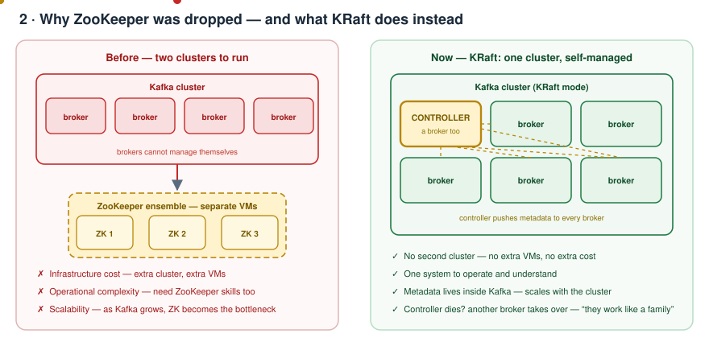

**1. Infrastructure cost went up.**
You need **separate VMs** just to run ZooKeeper. That is real money for a component that produces no business value.

**2. Operational complexity.**
You need people who have a **fair understanding of ZooKeeper** as well — a second system to learn, monitor, patch and debug.

**3. Scalability issues.**
If the Kafka cluster grows, **ZooKeeper may become the bottleneck**. Why? Because you must ensure **ZooKeeper stays highly available**. If it is not, there is **no one to manage the Kafka cluster** — nobody knows which server is up, so requests can get routed to servers that are down, and you get **timeouts and other stuff**.

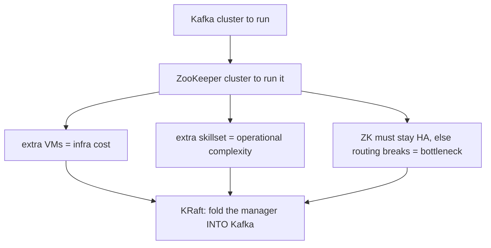

> This series (and the playground later) uses **KRaft only** — because sooner or later in your organisation you will get the task of upgrading Kafka to KRaft, ZooKeeper is going away anyway, so learning KRaft is the useful investment.

---

## 4. Basics: what is an event

Before topics and the rest, get the vocabulary straight.

> An **event is anything that happened.**

- On Facebook I **like a post** → that is a like event.
- On Amazon I **place an order** → that is an order event.

And in Kafka terminology, that event is called a **record** or a **message**.

| Everyday word | Kafka word |
|---|---|
| event / something that happened | **record** or **message** |

---

## 5. Topic — where events are stored

So we give a stream of events to the Kafka cluster. **How and where does it store them?**

Kafka has something called a **topic**, inside the server. Take one Kafka server out of the cluster — that server contains topics, and the data gets stored in them.

> A **topic** is nothing but a way of **collecting and organising the data** within a cluster.

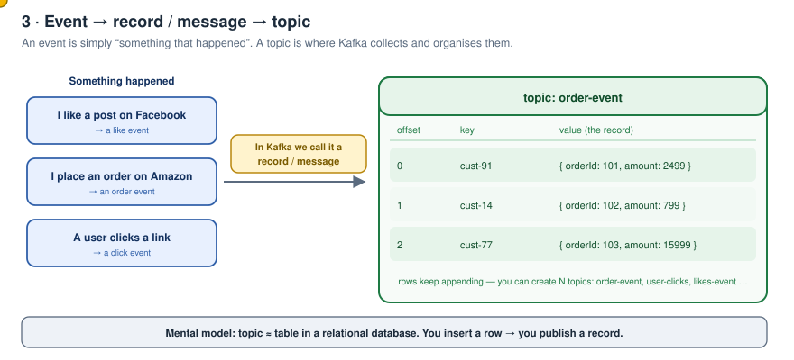

### Visualise it as a table

To make it concrete: **a topic is similar to a table in your relational database.**

| Relational database | Kafka |
|---|---|
| You insert a **row** | You publish an **event / record** |
| Data is stored in a **table** | Data is stored in a **topic** |
| You can have **N tables** | You can have **N topics** |

You can create as many topics as you want, depending on the use case and your business model — `user-clicks`, `likes-event`, `order-event`, and so on.

### The basic flow

Take e-commerce again:

1. On the e-commerce site I **place an order**.
2. That event goes to the **Kafka server**.
3. On the Kafka server it is stored **on a topic**.
4. At the other end, the **Notification Service** receives the same event from that topic.
5. Notification Service sends the email/SMS to the user.

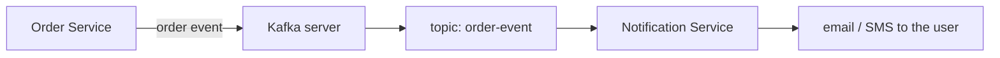

---

## 6. Server = broker

*"What happens if this Kafka server is down?"*

As already said — we will **never run a single Kafka instance**. There will be **multiple Kafka servers running in a cluster**.

And here is the terminology you will hear in every organisation:

> **Kafka server = broker.**

That is all it means. When someone says "we have six brokers", they mean six Kafka servers.

---

## 7. KRaft and the controller

With **KRaft**, there is no mandatory ZooKeeper. So how does the cluster manage itself?

Take the same scenario: Order Service, a Kafka cluster, and say **six brokers** inside it.

In KRaft, **one of those brokers acts like the manager**. That broker is called the **controller**.

- The controller **assigns responsibilities to the brokers** — for example, *"this topic belongs to this broker"*.
- In the Kafka setup/config you will literally see it: this broker is **configured as a controller**, that broker is configured as a **normal broker**.

**What if the controller dies?**
In the cluster, the brokers **work like a family** — they all know about each other. If the controller dies, **one of the other brokers becomes the controller**. That is how it works, no human intervention.

---

## 8. Creating a topic — the full flow

Just like a database: **before inserting any data you need to create a table**. Same concept here — **before publishing any event to Kafka you need to create a topic**.


Say we fire a topic-create command for `order-event`. Here is exactly what happens:

**Step 1 — the request goes to the controller.**
Why? Because a plain broker has **no idea** on which broker this topic should be created, or which broker will hold all the messages for this topic. Only the controller knows.

**Step 2 — the controller assigns the topic to one of the brokers.**
For example, it selects Broker 3.

**Step 3 — the controller records this in metadata and pushes it out.**
The controller **maintains the metadata**: *this topic is associated with this broker, that topic is associated with that broker*. It then **passes all the metadata information to all the brokers**, so **every broker also maintains the metadata**.

**Step 4 — events flow to the assigned broker.**
Now when the event gets fired, the **assigned broker receives it** and keeps it safe on its machine. Who decided that? The controller, back at topic-create time.

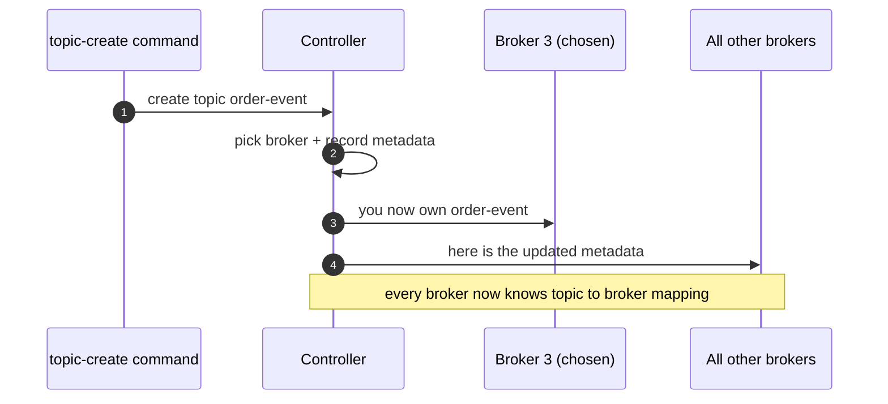

---

## 9. Replication factor — leader and followers

Next question: **what if that assigned broker dies?**

In real life the **controller identifies a couple more nodes to be backups**. How does it know how many? Because when we fire the topic-create command we also mention the **replication factor**.

Say **replication factor = 2**. Now the flow becomes:

1. The event is fired and is stored in the topic `order-event`.
2. The **assigned broker receives the event**.
3. That assigned broker **also sends the event to the replicas** — the two replicas that were decided by the replication factor.

**Who selects the replicas?** The **controller**, at the moment the topic is created. Out of, say, six nodes it decides: *this broker is the **primary** for this topic, and these two brokers are the **replicas***.

So the controller has **all the authority** to decide which broker is assigned which topic, it **maintains the metadata**, and it **pushes that metadata to all brokers**.

**And if the primary broker dies?** One of the replicas **becomes the primary**. You had a primary and two replicas — now one replica steps up.


### The terminology you will hear

| Concept | Kafka word |
|---|---|
| Primary broker for a topic | **Leader** |
| The replica brokers | **Followers** |

That is all "leader/follower" means in Kafka. Same idea as master/replica in a database.

---

## 10. Data is distributed across the cluster

One important thing to note: **one broker can have multiple topics.**

- Broker 1 can hold `order-event` **and** `notification` topic.
- Broker 2 can also hold `order-event` **and** `notification` topic.

And:

- One broker can be the **primary for `order-event`**, while a different broker is the **primary for `notification-event`**.
- Or the **same broker** can be primary for both. Both cases are possible.

The point behind all of this:

> **Data is distributed across the cluster.**

One broker ends up with two topics, another with two, another with one — across all the nodes, the data gets spread out.

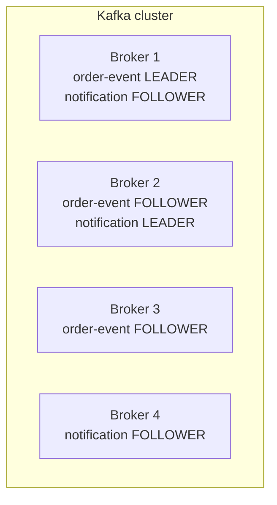

---

## 11. How do I connect to a specific broker — bootstrap.servers

Now the practical question. We have a Kafka cluster with, say, six brokers — or a thousand machines. **How do I talk to a specific broker?**

### First, how a stateless app does it

Say we have a thousand Order Service instances. Does the client know all thousand IP addresses? No.

We put a **load balancer** in front of all the instances. The client only has to know the **load balancer's IP**, and the request gets routed to any one of the instances. That works because any instance can serve any request.

### But Kafka is stateful

Kafka is a **stateful** application — a given topic lives on a **specific** broker. "Any server will do" is not good enough. So how does the client reach the right one?


**The brokers work like a family — they all know about each other.**

All the brokers have all the metadata. As and when the controller updates the metadata, it **pushes the updates to all the brokers**.

So in the end **you just need to connect to one single server**. From that one server you get **all the metadata information**: which topic is on which broker, what the replicas are for that topic — everything. It does not matter whether you have 1,000 brokers or 2,000 brokers. As soon as you connect to a single server, it knows which broker is assigned for `order-event`.

### But the application still needs one IP…

Correct — and that is why we have the **bootstrap server**.

Kafka exposes a property called **`bootstrap.servers`**. When you connect to the cluster, you have to mention this property.

**What if that single server goes down?**
You do not list just one. You identify **a few servers from the cluster** to act as bootstrap servers — for example, **10 out of a thousand**. There is practically no way all 10 go down at the same time. That is how you mitigate the case.

### Points to remember

- A Kafka cluster can have **N servers**, and **servers are brokers**.
- A **set of servers** can act as **bootstrap servers**, to provide the **initial metadata**.
- **A bootstrap server is *not* a role.** It is **not a controller**, it is **not a special kind of broker**. It is simply something for a **client to make an initial connection**.

---

## 12. The topic create command

```bash
kafka-topics.sh --create \
  --topic order-event \
  --bootstrap-server localhost:9092 \
  --replication-factor 2 \
  --partitions 3
```

Two things show up again and again:

- **`--bootstrap-server`** — **mandatory in every Kafka command**, and also present in every application that connects to Kafka, because you need *something* to make the initial connection.
- **`--topic`** — needed in most commands, because you either **send** the event to a particular topic or **read** the event from a particular topic.

---

## 13. How applications connect — the client library

Almost **every language has a Kafka client library**.

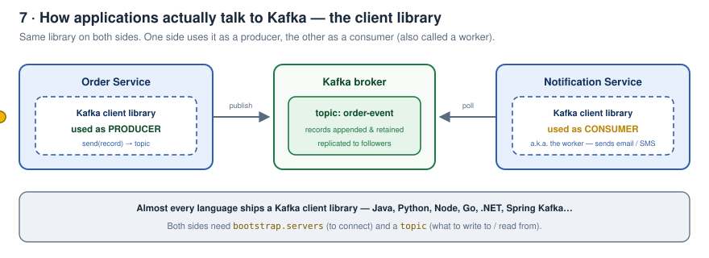

- **Order Service** includes the Kafka client library in its code base. There the library acts as a **producer** — it produces the messages / events / records to Kafka. Kafka then stores them in a topic.
- **Notification Service** also includes the Kafka client library. There it acts as a **consumer**, receiving messages from Kafka.

> A consumer is generally also called a **worker**.

Same library, two roles — the difference is only which API of it you use.

---

## 14. One-page recap

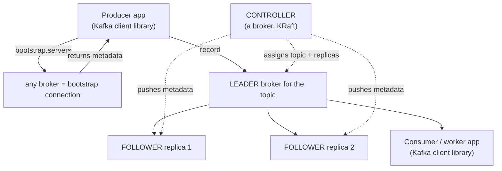

| Term | Meaning |
|---|---|
| **Kafka cluster** | Many Kafka servers running together |
| **Broker** | A Kafka server. `server = broker` |
| **ZooKeeper** | Old, separate distributed coordination service: cluster management, leader election, config management |
| **KRaft** | The replacement — no separate cluster, management lives inside Kafka |
| **Controller** | The broker acting as manager; assigns topics/replicas, owns and broadcasts metadata; re-elected if it dies |
| **Event** | Anything that happened |
| **Record / message** | What Kafka calls that event |
| **Topic** | Way of collecting and organising data in the cluster; think "table" |
| **Replication factor** | How many copies of a topic's data to keep |
| **Leader** | The primary broker for that topic's data |
| **Follower** | A replica broker |
| **bootstrap.servers** | A few broker addresses a client uses to make its **initial** connection and fetch metadata. Not a role. |
| **Producer** | Client library writing records |
| **Consumer / worker** | Client library reading records |

---

## 15. Check yourself

1. Why can't Kafka run as a single server in production?
2. Name the three things ZooKeeper did for Kafka.
3. Give the three reasons ZooKeeper is being retired.
4. What is an event, and what does Kafka call it?
5. Explain a topic using a relational-database analogy.
6. `server = ?` in Kafka terminology.
7. In KRaft, who is the controller, and what happens when it dies?
8. Walk through the four steps of a topic-create command.
9. With `--replication-factor 2`, who picks the replicas and when?
10. Primary broker = ? Replicas = ?
11. Why can't we just put a load balancer in front of a Kafka cluster?
12. Why is it enough to connect to one broker to reach any broker?
13. Why do we list several `bootstrap.servers` instead of one?
14. Is a bootstrap server a role in the cluster? Explain.
15. The same Kafka client library is used in Order Service and Notification Service — what differs?

---

<sub>Notes written up from the *Kafka Zero to Hero* series, episode 2 — "Kafka fundamentals". Diagrams and wording are mine; the teaching order follows the video.</sub>
