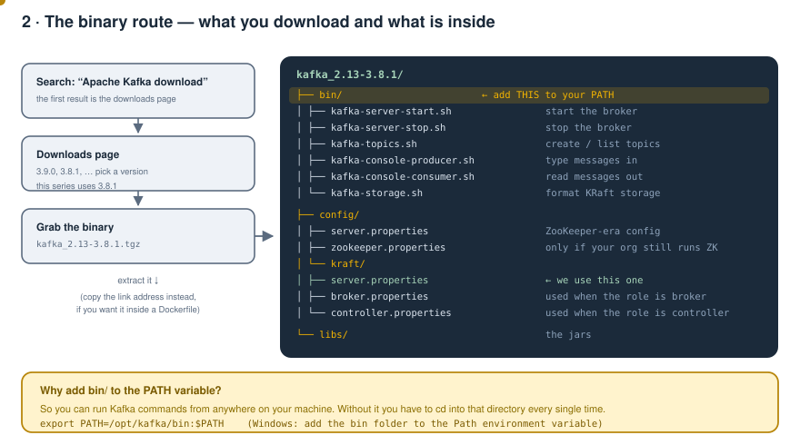
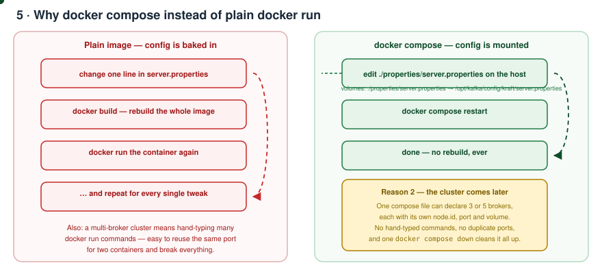
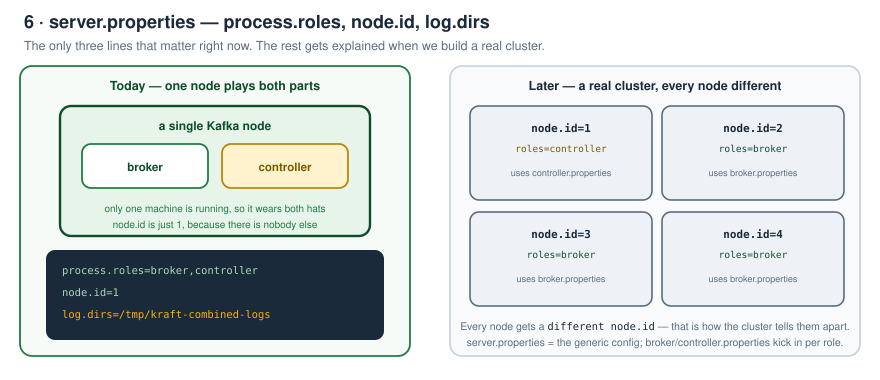
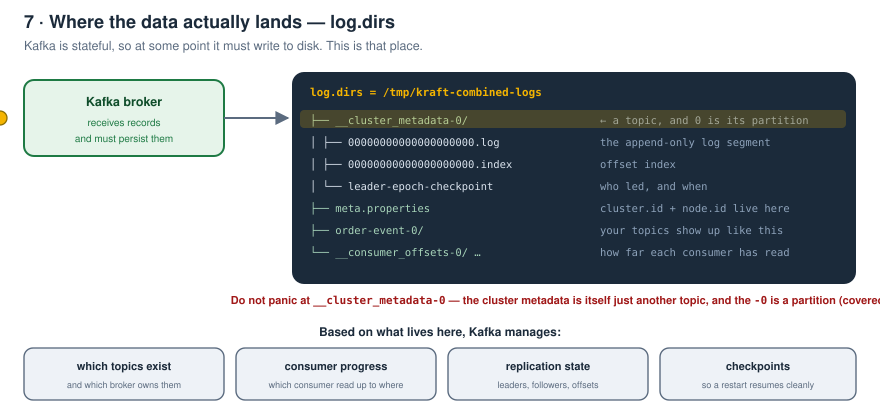

# Kafka Zero to Hero — Part 03: Setting Kafka Up Locally

> Notes from episode 3 of the *Kafka Zero to Hero* series.
> Everything from the video is here — the Java prerequisite, both install routes, the binary layout, the Dockerfile, `start.sh`, the cluster ID, why Docker Compose, `server.properties`, and what Kafka writes to disk — with animated diagrams.
>
> **This folder also contains the working setup.** `docker compose up` and you have a broker.
>
> Previous: [02 — Kafka Fundamentals](../02-kafka-fundamentals/README.md) · [01 — Why Kafka](../01-why-kafka-and-what-is-kafka/README.md)

---

## Contents

1. [Where the first two parts left us](#1-where-the-first-two-parts-left-us)
2. [The one prerequisite](#2-the-one-prerequisite)
3. [Two ways to install Kafka](#3-two-ways-to-install-kafka)
4. [Route A — the raw binary](#4-route-a--the-raw-binary)
5. [Route B — the Dockerfile](#5-route-b--the-dockerfile)
6. [start.sh — cluster ID, format, start](#6-startsh--cluster-id-format-start)
7. [Why Docker Compose and not plain docker run](#7-why-docker-compose-and-not-plain-docker-run)
8. [server.properties — the three lines that matter today](#8-serverproperties--the-three-lines-that-matter-today)
9. [Run it](#9-run-it)
10. [What Kafka wrote to disk](#10-what-kafka-wrote-to-disk)
11. [Look inside the container](#11-look-inside-the-container)
12. [Files in this folder](#12-files-in-this-folder)
13. [Troubleshooting](#13-troubleshooting)
14. [What comes next](#14-what-comes-next)
15. [Check yourself](#15-check-yourself)

---

## 1. Where the first two parts left us

Quick recap, because everything after this point is built on it:

- **Video 1** — what Kafka is, and why there is a need for Kafka at all.
- **Video 2** — the terminology: what a **broker** is, what a **controller** is, who the **leaders** and **followers** are; where the data actually gets stored inside Kafka (the **topic**); the importance of the **replication factor** and why we need one; what a **producer** and a **consumer** are; and why the Kafka people moved from **ZooKeeper to KRaft**.

If you haven't gone through those two, do that first — **the later sections of this series are completely based on that basic understanding.**

This video is entirely about one thing: **getting Kafka running on your local machine.**

---

## 2. The one prerequisite

> Kafka is built on top of **Java and Scala**.

Which means there is exactly one prerequisite: **Java must be installed on your machine.**

(If you take the Docker route, you don't even need that — the image ships a JDK.)

---

## 3. Two ways to install Kafka



**Option 1 — download the Kafka binary.** Unzip it on your machine, and give the `bin` directory path to the PATH variable. Exactly the same logic as downloading the Java JDK and putting its `bin` on the PATH.

**Option 2 — run a Kafka Docker container from a Docker image.**

**Option 2 is the one used in this series.** With Docker you don't have to worry about anything — but both are walked through below, because some people don't want to run a container for their own reasons.

---

## 4. Route A — the raw binary



**Find it.** Open a browser, type **"Apache Kafka download"** — the first link is the Kafka downloads page. There you'll see the available binaries: `3.9.0`, `3.8.1`, and so on.

> **This series uses 3.8.1.**

Click the link and the binary downloads directly. Or right-click → **copy link address** — that's exactly what goes into the Dockerfile later.

**Extract it.** Unzip and you get:

```
kafka_2.13-3.8.1/
├── bin/          <- put THIS on your PATH
├── config/
└── libs/
```

### Why the `bin` directory goes on the PATH

Same reason as the JDK: **so you can run the Kafka commands from anywhere on your machine.** Otherwise you have to `cd` into that directory every single time you want to run something. Better to just add it once.

```bash
export PATH=/opt/kafka/bin:$PATH      # macOS / Linux
# Windows: add the bin folder to the Path environment variable
```

### What's in `bin/`

| Script | What it's for |
|---|---|
| `kafka-server-start.sh` | **the command that starts the Kafka server** |
| `kafka-server-stop.sh` | stops it |
| `kafka-topics.sh` | create / list / describe topics |
| `kafka-console-producer.sh` | type messages into a topic |
| `kafka-console-consumer.sh` | read messages out of a topic |
| `kafka-storage.sh` | format the KRaft storage directory |

Note that `kafka-server-start.sh` needs a **properties file** handed to it. That's where you tweak things like **where the log directory should be created**, and **who acts as a broker vs who acts as a controller**.

### What's in `config/`

| File | When it's used |
|---|---|
| `server.properties` | the ZooKeeper-era config |
| `zookeeper.properties` | only if your organisation still runs ZooKeeper |
| `kraft/server.properties` | **the one we use** — because we're on KRaft |
| `kraft/broker.properties` | applies when the node's role is **broker** |
| `kraft/controller.properties` | applies when the node's role is **controller** |

> Why KRaft and not ZooKeeper? Because in your organisation you'll likely get handed the work of **upgrading Kafka to KRaft** — ZooKeeper is getting deprecated anyway. Learning KRaft is the useful investment.

---

## 5. Route B — the Dockerfile

The Dockerfile is nothing more than **the manual install above, written down**.



```dockerfile
FROM eclipse-temurin:17-jdk

RUN curl -fsSL "https://archive.apache.org/dist/kafka/3.8.1/kafka_2.13-3.8.1.tgz" -o kafka.tgz \
 && tar -xzf kafka.tgz \
 && mv kafka_2.13-3.8.1 kafka \
 && rm kafka.tgz

ENV PATH="/opt/kafka/bin:${PATH}"

COPY start.sh /opt/start.sh
RUN chmod +x /opt/start.sh

WORKDIR /practice

CMD ["/opt/start.sh"]
```

Line by line:

1. **A Java 17 (JDK 17) base image** — Kafka needs a JVM, so we reuse an existing JDK 17 image rather than installing Java by hand.
2. **Download the zip from the internet** — the exact link copied from the downloads page.
3. **Extract it.**
4. **Rename the extracted folder** — it comes out as `kafka_2.13-3.8.1`; rename it to just `kafka` so nothing downstream hardcodes a version.
5. **Add `kafka/bin` to the PATH** — the same PATH thing as the manual install.
6. **`WORKDIR /practice`** — a working directory created so you have somewhere clean to practise.
7. **`CMD ["/opt/start.sh"]`** — this runs when the `docker run` command starts the container.

Full file: [docker/Dockerfile](docker/Dockerfile)

---

## 6. start.sh — cluster ID, format, start



```bash
#!/usr/bin/env bash
set -euo pipefail

CONFIG=/opt/kafka/config/kraft/server.properties

kafka-storage.sh format \
  --cluster-id "${KAFKA_CLUSTER_ID}" \
  --config "${CONFIG}" \
  --ignore-formatted

exec kafka-server-start.sh "${CONFIG}"
```

### 1. The cluster ID

Right now we're running **one** Kafka server. But imagine you have to run **three** — those servers form a **cluster**. And in a large organisation there might be **multiple Kafka clusters** running side by side.

So where does the cluster ID get used? When data gets published, the broker carries metadata that effectively says **"I belong to this cluster ID."** Based on that, a Kafka server can tell **this is data coming from a different cluster** vs **this is data from my own cluster**. That's why the cluster ID matters.

### 2. `kafka-storage.sh format`

Visualise it with a database installation: **before inserting data into a database table, you need the schema and the tables to exist.** This `format` step is the same kind of thing.

Kafka is a **stateful** application, so it needs its own properties files, checkpoints and metadata laid down internally. That's why you have to give it the **cluster ID** and the same **`server.properties`** — it then creates the required files.

**If the files / metadata already exist, the step is simply ignored.** Safe to re-run.

### 3. `kafka-server-start.sh`

Finally we run the start command, and as mentioned earlier, we hand it the **`server.properties`** file. The broker comes up and you see `Kafka Server started`.

Full file: [docker/start.sh](docker/start.sh)

> **Practical note:** a Kafka cluster ID isn't free-form text — it must be a base64-encoded UUID. Generate your own with `kafka-storage.sh random-uuid` and paste it into the compose file.

---

## 7. Why Docker Compose and not plain docker run

Fair question — if we already have the image, why bother with Compose?



**Reason 1 — you can mount files from the host.**
Take `server.properties`. Without Compose, if you later want to modify some attribute, you have to **rebuild the Kafka image** and then **run the container again** — for every single tweak. With Compose you **mount** `server.properties` from the host, change any property, and just restart. No rebuild, ever.

```yaml
volumes:
  - ./properties/server.properties:/opt/kafka/config/kraft/server.properties:ro
```

**Reason 2 — the cluster is coming later in this series.**
When we set up a real multi-broker Kafka cluster, without Compose you'd have to fire **individual `docker run` commands** for each container. There are mistakes waiting there — like giving the **same port to two different containers** — and plenty of other things that get complex fast. One Compose file handles it.

Also, the **cluster ID is passed as an environment variable**, because in most organisations it gets provided at **deployment time**. We're deliberately mimicking how real setups do it — and the same `KAFKA_CLUSTER_ID` is what `start.sh` reads, so every node/broker/controller ends up in the **same cluster**.

Full file: [docker-compose.yml](docker-compose.yml)

---

## 8. server.properties — the three lines that matter today



```properties
process.roles=broker,controller
node.id=1
log.dirs=/tmp/kraft-combined-logs
```

**`process.roles`** — what kind of role does this node have: is it a **broker**, or a **controller**? Since we're running only **one node**, we assign it **both roles** — the single node acts as broker *and* controller.

**`node.id`** — when we set up a real Kafka cluster there could be four or five nodes, and **every node has a different ID**. We have a single node, so the node ID is just `1`.

**`log.dirs`** — we already know data gets stored in a Kafka topic. But Kafka is stateful, so **somewhere it still has to write that data to disk**. This is the path where Kafka writes the messages.

Everything else in the file gets explained later, when we build the actual cluster. For now those three are enough.

Full file: [properties/server.properties](properties/server.properties)

---

## 9. Run it

```bash
cd kafka/03-local-setup
docker compose up
```

You should see, in order:

1. `Formatting metadata directory ... with metadata.version 3.8-IV0` — the storage format step
2. the container starting
3. **`Kafka Server started`**

That last line is the whole goal of this episode.

Stop it with `Ctrl+C`, or:

```bash
docker compose down          # stop and remove the container
docker compose down -v       # also wipe the log volume (fresh format next time)
docker compose restart       # after editing properties/server.properties
```

---

## 10. What Kafka wrote to disk



Look inside the log directory and you'll see something like `__cluster_metadata-0`.

**Don't panic at that name.** The cluster metadata is itself just **another topic** in Kafka, and the **`0`** is the **partition** — partitions come in a later video.

This is the metadata Kafka manages, and based on it Kafka keeps track of:

- what topics exist and which broker holds them
- **which consumer has consumed messages up to what point**
- replication state and offsets
- checkpoints, so a restart resumes cleanly

Have a look yourself:

```bash
docker exec -it broker ls -l /tmp/kraft-combined-logs
docker exec -it broker cat /tmp/kraft-combined-logs/meta.properties
```

The cluster ID you'll see there is the one from the compose file — same value, carried all the way through.

---

## 11. Look inside the container

Open another terminal tab:

```bash
docker container ps -a
docker exec -it broker bash
```

You land in **`/practice`** — the work directory the Dockerfile created.

```bash
cd /opt/kafka/bin && ls
```

The **exact same files** you saw when you unzipped the binary on your own machine: `kafka-server-start.sh`, `kafka-console-producer.sh`, `kafka-console-consumer.sh`, `kafka-topics.sh`. Same setup, just inside a container.

```bash
cd /opt/kafka/config/kraft && ls
```

`broker.properties`, `controller.properties`, `server.properties`.

- **`server.properties`** is the **generic** config — the log directory path, what kind of role this node has.
- **`broker.properties`** comes into the picture if this node's role is **broker**.
- **`controller.properties`** comes into the picture if this node's role is **controller**.

---

## 12. Files in this folder

```
03-local-setup/
├── docker-compose.yml            what you actually run
├── docker/
│   ├── Dockerfile                JDK 17 + Kafka 3.8.1 + PATH + /practice
│   └── start.sh                  format storage, then start the server
├── properties/
│   └── server.properties         mounted in - edit and restart, no rebuild
└── assets/                       the animated diagrams above
```

---

## 13. Troubleshooting

| Symptom | Cause / fix |
|---|---|
| `KAFKA_CLUSTER_ID must be set` | The env var didn't reach the container — check the `environment:` block in the compose file. |
| `Cluster ID string ... does not appear to be a valid UUID` | The cluster ID must be a base64-encoded UUID. Generate one: `docker run --rm kafka-kraft:3.8.1 kafka-storage.sh random-uuid`. |
| `The Cluster ID ... doesn't match stored clusterId` | You changed the cluster ID but the old formatted volume is still there. `docker compose down -v` and start again. |
| Port 9092 already allocated | Something else is on 9092. Change the host side: `"9095:9092"`. |
| Broker starts but a client can't connect from the host | Check `advertised.listeners=PLAINTEXT://localhost:9092` in `server.properties`. |
| Config edits seem ignored | You edited the file inside the image, not the mounted one. Edit `properties/server.properties` on the host, then `docker compose restart`. |

---

## 14. What comes next

Now that the server starts, the next videos cover:

1. **Create some topics.**
2. **Produce messages** onto a topic.
3. **Consume messages** from the topic on the other side.

And why in that order? Because **before understanding consumer groups and partitions, it is very, very important to understand these things first** — otherwise you won't realise **what problem the consumer group is actually solving**. The next video deliberately shows all the problems you have *without* consumer groups.

The example continues with the same e-commerce system: **multiple Payment Service instances** will be spun up as consumers, and we'll watch what kind of messages arrive at each of them — the broader aspects of consumers.

---

## 15. Check yourself

1. What is the single prerequisite for running Kafka, and why?
2. Name the two installation approaches.
3. Why do you add the `bin` directory to the PATH variable?
4. Which config file do we use in KRaft mode, and where does it live?
5. When do `broker.properties` and `controller.properties` come into play?
6. What are the seven things the Dockerfile does?
7. What are the three steps inside `start.sh`?
8. Why does Kafka need a cluster ID at all?
9. Explain `kafka-storage.sh format` using a database analogy. What happens if you run it twice?
10. Give the two reasons for choosing Docker Compose over plain `docker run`.
11. Why is the cluster ID passed as an environment variable?
12. What do `process.roles`, `node.id` and `log.dirs` mean?
13. Why does a single node get both roles?
14. What is `__cluster_metadata-0`, and what does the `0` mean?
15. Name four things Kafka tracks in the log directory.

---

<sub>Notes written up from the *Kafka Zero to Hero* series, episode 3 — local Kafka setup. Diagrams, config and wording are mine; the teaching order follows the video.</sub>
