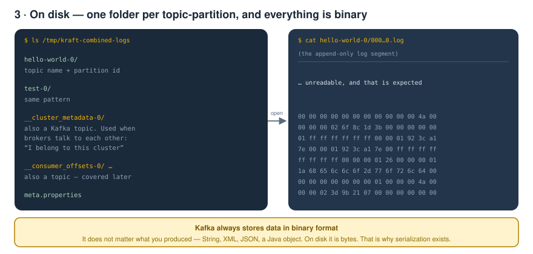
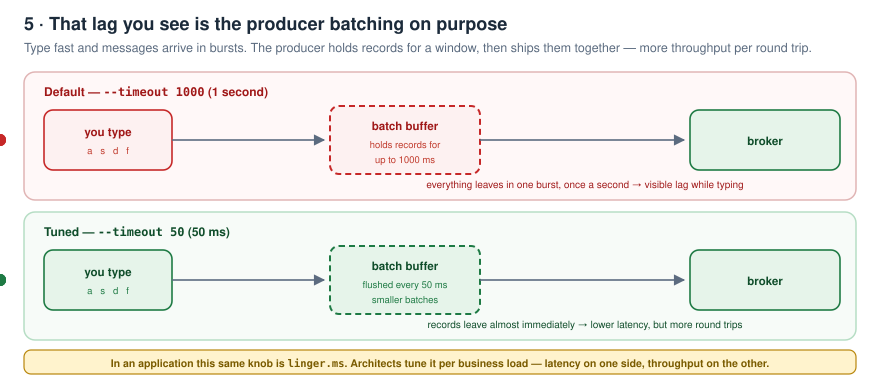
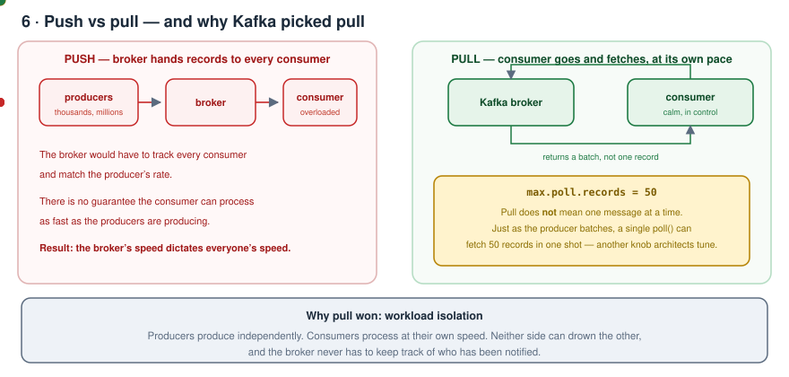
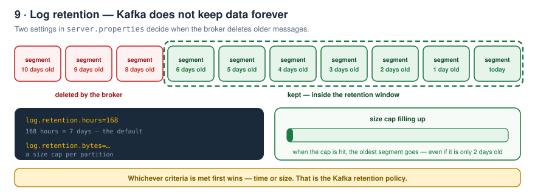
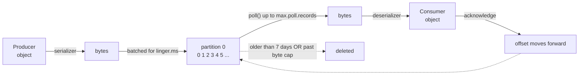

# Kafka Zero to Hero — Part 04: Topics, Producing, Consuming and Offsets

> Notes from episode 4 of the *Kafka Zero to Hero* series — the fully practical one.
> Topic commands, a real producer/consumer demo, push vs pull, the batching parameters, serialization/deserialization, log retention and offsets. Nothing skipped, with animated diagrams.
>
> All commands in one place: **[commands.md](commands.md)**
>
> Previous: [03 — Local setup](../03-local-setup/README.md) · Next: [05 — Consumer groups and partitions](../05-consumer-groups-and-partitions/README.md)

---

## Contents

1. [Where part 3 left us](#1-where-part-3-left-us)
2. [What this part covers](#2-what-this-part-covers)
3. [Get in](#3-get-in)
4. [Topic commands](#4-topic-commands)
5. [Reading --describe](#5-reading---describe)
6. [What that looks like on disk](#6-what-that-looks-like-on-disk)
7. [Produce and consume — the demo](#7-produce-and-consume--the-demo)
8. [The lag you see is deliberate — producer batching](#8-the-lag-you-see-is-deliberate--producer-batching)
9. [Push vs pull, and max.poll.records](#9-push-vs-pull-and-maxpollrecords)
10. [Serialization and deserialization](#10-serialization-and-deserialization)
11. [Log retention — Kafka does not keep data forever](#11-log-retention--kafka-does-not-keep-data-forever)
12. [Offsets](#12-offsets)
13. [One-page recap](#13-one-page-recap)
14. [What comes next](#14-what-comes-next)
15. [Check yourself](#15-check-yourself)

---

## 1. Where part 3 left us

In the last video we did the **Kafka setup**, and we saw both approaches:

- **Downloading the Kafka binaries** and running Kafka from your local machine.
- **The Kafka Docker setup** — which is the one preferred and used throughout this series.

We walked through the Dockerfile and the steps performed in it to create the Kafka image, and then used **Docker Compose** to bring Kafka up.

And why Docker Compose? Two reasons, as covered:

1. We need to **mount some files from the host machine**.
2. Later in this series we'll set up a **Kafka cluster** — at that point we need multiple Kafka brokers running together and communicating among themselves.

---

## 2. What this part covers

Today is **completely practical**. In order:

- Kafka **topic**-related commands
- **Producing** messages onto a topic
- A **consumer** on the other side consuming those messages
- The **real demo** — producer and consumer running side by side, watching data flow
- **Push vs pull** — how a consumer gets messages, and why Kafka chose the strategy it chose
- The **parameters** you can tweak to increase consumer throughput
- **Serialization / deserialization**
- **Log retention**
- **Offsets**

---

## 3. Get in

The Compose file is the same one from part 3 — same image, same setup. One step:

```bash
docker compose up
```

At the end of the output: **`Kafka Server started`**.

Check the container is up, then go inside it in **interactive mode**:

```bash
docker ps
docker exec -it kafka bash
kafka-topics.sh          # prints usage - the command works
```

---

## 4. Topic commands



Very simple. As covered earlier, we need the **bootstrap server** — that's what connects us to the Kafka cluster / broker.

**Create a topic:**

```bash
kafka-topics.sh --bootstrap-server localhost:9092 --topic hello-world --create
```

Same for a couple more — `test`, and (e-commerce style) `order-events`:

```bash
kafka-topics.sh --bootstrap-server localhost:9092 --topic test --create
kafka-topics.sh --bootstrap-server localhost:9092 --topic order-events --create
```

**Delete a topic** — very simple, just `--delete` instead of `--create`:

```bash
kafka-topics.sh --bootstrap-server localhost:9092 --topic order-events --delete
```

**List all topics** — no `--topic` needed here, because we want *all* of them:

```bash
kafka-topics.sh --bootstrap-server localhost:9092 --list
```

Since we deleted `order-events`, what's left is `hello-world` and `test`.

---

## 5. Reading `--describe`

To dig into the details of any topic:

```bash
kafka-topics.sh --bootstrap-server localhost:9092 --topic hello-world --describe
```



```
Topic: hello-world   TopicId: 5rD8j2QwR0abcXYZ12   PartitionCount: 1   ReplicationFactor: 1
    Topic: hello-world   Partition: 0   Leader: 1   Replicas: 1   Isr: 1
```

| Field | What it means |
|---|---|
| **TopicId** | The ID used internally by the Kafka cluster. |
| **PartitionCount** | Don't worry about this yet — partitions come in a later video. |
| **ReplicationFactor: 1** | **If you don't provide a replication factor, the default is 1.** |
| **Partition: 0** | Whenever you create a topic, **one partition gets created by default**. Partition numbers run **from 0** up to the number of partitions. |
| **Leader: 1** | That `1` is the **`node.id`**. Remember from the last video: every broker has its own `server.properties`, and for this broker `node.id=1`. We've only spun up one Kafka server, so **node 1 is the leader**. |
| **Replicas / Isr** | Both `1`. ISR and the rest become meaningful when we set up an actual Kafka cluster. |

---

## 6. What that looks like on disk

In the Compose file we mounted `/tmp/kraft-combined-logs` out to a data directory. Look inside it:



```
hello-world-0/
test-0/
__cluster_metadata-0/
__consumer_offsets-0/  ...
meta.properties
```

- **`hello-world-0`** and **`test-0`** — `hello-world` and `test` are the **topic names**, and the **`0`** is the **default partition ID** that was created for each.
- **`__cluster_metadata`** — this is **also a Kafka topic**. It gets used when we have a real Kafka cluster and multiple brokers communicate among themselves — at that point each one presents *"I belong to this cluster."*
- **`__consumer_offsets`** — also a topic, covered later.

Now dig into one of those topic folders and `cat` the `.log` file. You'll see garbage.

> **Kafka stores everything in binary format.** It does not matter what you provided — String, XML, JSON, a Java object. Kafka always stores the data as bytes. That's why you can't read it.

(If you want a readable dump: `kafka-dump-log.sh --files <the .log file> --print-data-log`.)

---

## 7. Produce and consume — the demo

Producing is just as simple — instead of `kafka-topics.sh`, use **`kafka-console-producer.sh`**:

```bash
kafka-console-producer.sh --bootstrap-server localhost:9092 --topic hello-world
```

You get a **shell**. Every line you type becomes a record. Type `1`, `2`, `3`.

Now the second application — the **consumer**. Open another tab, exec into the container, and:

```bash
kafka-console-consumer.sh --bootstrap-server localhost:9092 --topic hello-world
```



### And… no messages arrive

The producer already produced `1`, `2`, `3` — so why is the consumer showing nothing?

> **Because this is the default behaviour of Kafka.** The console consumer does **not** give you the old messages. It gives you **only the new ones**.

Type `a`, `s`, `d` in the producer now — all three show up instantly in the consumer.

### "But what if I want the old messages too?"

There's an option for that. There could be multiple parameters, but this is the one:

```bash
kafka-console-consumer.sh --bootstrap-server localhost:9092 --topic hello-world --from-beginning
```

Now you get **all** the messages — `1 2 3 a s d`. The old records were never deleted; the consumer simply wasn't asking for them.

---

## 8. The lag you see is deliberate — producer batching

Now produce messages quickly. You'll notice **some lag** — a message you typed doesn't appear on the consumer immediately.

Why?

> **To increase throughput, the producer batches messages.** It collects the records coming in for a particular window and then publishes them together. By default that window is **1 second**.



Type `s`, wait — it appears after ~1 second. Type `d`, same thing.

There's a parameter for it. Lower it and watch:

```bash
kafka-console-producer.sh --bootstrap-server localhost:9092 --topic hello-world --timeout 50
```

It's in **milliseconds** — now the producer only batches records for **50 ms** before shipping them. Type `y` and it arrives **much, much faster**.

These are exactly the kind of settings you tweak in production:

- how long to **batch producer records**
- how many records a **consumer** can fetch in one go

Architects tune these according to the business need and the load on the application. In an application (rather than the console tool) the same producer knob is **`linger.ms`**.

---

## 9. Push vs pull, and `max.poll.records`

Producer produces onto the Kafka server. **How does the consumer get those messages — push or pull?**

- **Push** — the Kafka broker itself hands the messages to all the consumers.
- **Pull** — the consumer goes to the Kafka server and gets the records itself.

> **Kafka chose the pull-based approach.**



**Why?** Imagine there are thousands — millions — of producers, and messages keep landing on the broker. If the broker tried to **push** to every consumer, there's **no guarantee the consumer can process at the rate the producers are producing**.

So, to **isolate the workload**: messages get produced independently on the producer side, and the consumer processes at **its own speed**. That's the reason Kafka went with pull.

### "If it's pull, does the consumer fetch one message at a time?"

No — that was never said. It's pull-based, but just like the producer batches, the consumer has a parameter:

```
max.poll.records
```

**In a single poll, how many records do you want to fetch?** For example 50. This is another crucial parameter architects tune according to business/application load.

That's how you increase throughput and match the consumer's processing speed.

---

## 10. Serialization and deserialization

We saw that data on disk is stored in **binary format**. But your application produced a Java object, or an XML, or a JSON. **No matter what format you produce in, Kafka always stores it as bytes.**

So where do serialization and deserialization come into the picture?



- **Serialization happens on the producer side.** In the producer properties you pass a **serializer**. The Kafka client library uses it to convert your object into **bytes** before publishing.
- **Deserialization happens on the consumer side.** You mention the **deserializer** class — say you have a POJO — against which the byte data should be converted. Based on that, the consumer gets a **proper response object** back.

| Side | Property | Job |
|---|---|---|
| Producer | `key.serializer` / `value.serializer` | object → bytes |
| Consumer | `key.deserializer` / `value.deserializer` | bytes → object |

---

## 11. Log retention — Kafka does not keep data forever

*"Does Kafka store the data forever, or for how long?"* There's a property for it. Look at `config/kraft/server.properties`:

```properties
log.retention.hours=168
log.retention.bytes=...
```



**168 hours = 7 days.** So by default Kafka stores the data for **7 days** — **or** until the **bytes** limit is reached.

> **Whichever comes first.** Whichever criteria gets filled first, the broker deletes the older messages accordingly.

That's the Kafka retention policy.

---

## 12. Offsets

The producer is producing continuously; the consumer is fetching records — say 50 at a time.

We saw that **by default one partition is created** if you don't mention partitions. So assume everything lands in **partition 0**, and all messages for the topic are stored in that topic-partition.

**Visualise the partition as an array-like data structure** — it also starts from index **0**.

> The **offset** is nothing but a number representing **up to which point the consumer has consumed the messages.**



Walk it through with `max.poll.records = 2`:

1. **Poll #1** — the consumer consumes 2 records (offsets 0 and 1).
2. As soon as it has consumed them, it sends an **acknowledgement** to Kafka.
3. Kafka **increases the offset number by 2**.
4. **Poll #2** — the consumer now retrieves messages starting from **index 2**.

Because the data is stored in the order the producer produced it, the offset **guarantees the consumer will get all the events/messages in the order in which they occurred**. As the consumer consumes, the offset keeps increasing.

### See the offsets yourself

Start the producer again, and start the consumer with:

```bash
kafka-console-consumer.sh --bootstrap-server localhost:9092 --topic hello-world \
  --property print.offset=true
```

Type `hello` → `Offset:41`. Type `hi` → `Offset:42`. Type `bye` → `Offset:43`. The offset just keeps climbing.

And that `__consumer_offsets` folder you saw in the data directory? That's **also a topic** — the one where this tracking lives. Discussed later.

---

## 13. One-page recap



| Thing | The one line |
|---|---|
| `--bootstrap-server` | how you connect; needed in almost every command |
| create / delete / list / describe | all the same `kafka-topics.sh`, different flag |
| topic defaults | 1 partition, replication factor 1, partition ids from 0 |
| `Leader: 1` | that's the `node.id`, not a count |
| on disk | one folder per **topic-partition**, contents always **binary** |
| console consumer default | **only new messages**; `--from-beginning` for everything |
| producer lag | batching, default **1 second** (`--timeout` / `linger.ms`) |
| push vs pull | Kafka is **pull** — workload isolation between producer and consumer |
| `max.poll.records` | pull still fetches a **batch**, not one record |
| serializer / deserializer | producer side / consumer side |
| retention | 7 days **or** byte cap, **whichever comes first** |
| offset | how far the consumer has read; guarantees ordering |

---

## 14. What comes next

The next video takes the real case:

- **Multiple consumers on the same topic** — and how that behaves.
- The **importance of consumer groups**, and why we need them at all.
- Then **partitions** — why they exist, why they matter, and why you'd want more of them.

Things go deeper from there.

---

## 15. Check yourself

1. Which flag do you need in almost every Kafka command, and why?
2. Give the create, delete, list and describe commands from memory.
3. Why doesn't `--list` need a `--topic`?
4. In the describe output, what is `Leader: 1` actually telling you?
5. What are the defaults for partitions and replication factor?
6. What are `hello-world-0` and `__cluster_metadata-0` on disk?
7. Why can't you read the `.log` file?
8. A brand new consumer starts and sees nothing. Why, and how do you fix it?
9. Why is there lag between typing in the producer and seeing it in the consumer?
10. What does `--timeout 50` change, and what is the equivalent application property?
11. Define push and pull, and say which Kafka chose.
12. Explain the workload-isolation argument for pull.
13. Does pull mean one record at a time? Which property decides?
14. Where does serialization happen, and where does deserialization happen?
15. What are the two retention settings, and which one wins?
16. Define an offset. Walk through two polls with `max.poll.records=2`.
17. What does the offset guarantee you?
18. How do you print offsets in the console consumer?

---

<sub>Notes written up from the *Kafka Zero to Hero* series, episode 4. Diagrams and wording are mine; the teaching order follows the video.</sub>
